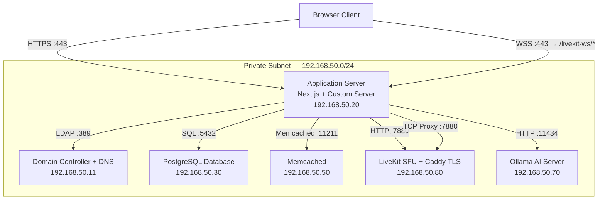
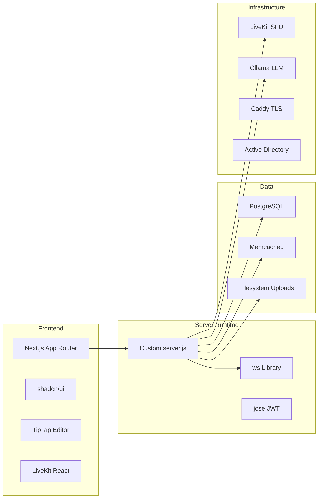
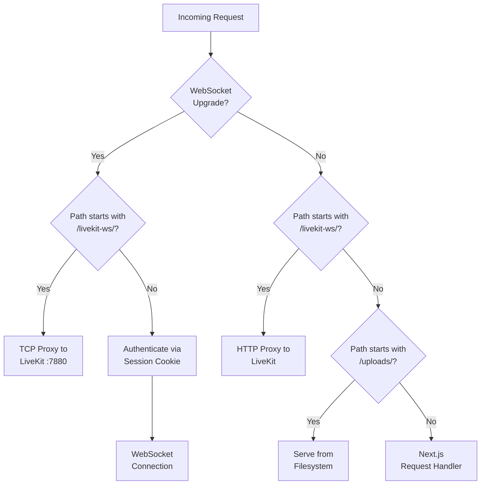

# Chapter 1: The Architecture of Sovereignty

Every enterprise collaboration tool asks the same question: *where does the data live?*

For most organizations, the answer is "someone else's servers." Your chat messages route through Slack's infrastructure in Oregon. Your project notes sit in Notion's databases, encrypted with keys Notion controls. Your video calls traverse Twilio's media servers on three continents before reaching the person sitting ten desks away. This is fine, until it isn't. Until your compliance officer asks which country a customer's medical record transited through during yesterday's screen share. Until your security team discovers that the SaaS vendor's compromised OAuth token exposed six months of internal communications. Until the vendor sunsets their free tier and your migration path is "export to CSV and start over."

Stick My Note makes a different bet. Every component -- AI inference, video conferencing, real-time messaging, authentication, file storage -- runs on servers the organization physically controls. No data leaves the network perimeter. No third-party API key gates the feature set. No vendor pricing change can remove a capability overnight. This is the architectural principle of *self-hosted sovereignty*, and it is the single decision that explains everything else in this codebase. Every technology choice, every custom server configuration, every deliberate rejection of a popular library traces back to one question: does this keep control in our hands?

By the end of this chapter, you will understand the physical topology of the system, the technology stack and what each choice was made *over*, and the custom server architecture that holds it all together. You will also walk away with five patterns you can apply to your own self-hosted projects, whether or not you ever deploy a single sticky note.

---

## The Self-Hosted Thesis

The argument for self-hosting is not ideological. It is a design constraint that simplifies compliance and eliminates an entire category of operational risk.

Consider what a SOC 2 Type II audit looks like when your collaboration platform runs on Notion and Slack. You inherit every subprocessor in their supply chain. Notion uses AWS, which uses its own subprocessors for hardware maintenance. Slack routes through Salesforce infrastructure. Your auditor asks: "Can you demonstrate that customer PII is not persisted on any system outside your control?" You cannot. You can point to your vendors' SOC 2 reports, but you cannot independently verify their claims. Your compliance posture is a chain of trust anchored in marketing documents.

Now consider the same audit when every component runs on a private subnet. The database is at a known IP address. The AI model weights sit on a specific GPU. Video media never touches a public relay. Your auditor asks the same question, and you answer with a network diagram and a packet capture. The chain of trust has one link: your own infrastructure team.

This is not hypothetical. Organizations subject to HIPAA, ITAR, CJIS, or financial regulatory frameworks face real constraints on data residency. A hospital cannot route patient discussions through a SaaS vendor's servers without a Business Associate Agreement, and even with one, the compliance burden compounds with every third-party dependency. A defense contractor under ITAR restrictions cannot use a video conferencing service that routes media through international data centers. Self-hosting reduces these constraints to a single boundary: your network.

The trade-off is honest and significant. You give up the SaaS vendor's engineering team. Nobody at Notion is going to fix your performance regression at 2 AM. You own the uptime. You own the patching. You own the capacity planning. The thesis is not that self-hosting is easier. The thesis is that for organizations where data sovereignty is non-negotiable, self-hosting is the only architecture that doesn't require you to trust strangers with your most sensitive information.

---

## Network Topology

The system runs on six servers, each with a single responsibility. This is a deliberate choice over the "one big server" approach. Separating concerns across machines means that a runaway AI inference job cannot starve the database of CPU, a video call with ten participants cannot crowd out WebSocket connections, and a PostgreSQL vacuum operation cannot spike latency on the application server.

Here is the network:



**Domain Controller (192.168.50.11)** handles DNS resolution and Active Directory authentication. When a user signs in with their corporate credentials, the application server binds to this machine over LDAP. It also resolves the custom domain name to the application server's IP, keeping DNS internal rather than relying on public resolvers for intranet traffic.

**Application Server (192.168.50.20)** runs the Next.js application behind a custom Node.js server. In production, this is HTTPS on port 443 with certificates managed on the machine itself. The custom server handles four responsibilities: HTTP requests are forwarded to Next.js, WebSocket upgrade requests are handled by the `ws` library, requests to `/uploads/*` are served from the local filesystem, and requests to `/livekit-ws/*` are proxied as raw TCP to the LiveKit server. We will examine this server in detail later in this chapter.

**PostgreSQL Database (192.168.50.30)** stores everything: user accounts, organizations, notes, sticks, pads, chat messages, audit trails, session data, and AI-generated metadata. There is no separate analytics database, no data warehouse, no read replica. One PostgreSQL instance with SSL, connecting via individual environment variables rather than a connection string. The database also serves as the cross-process message bus via `LISTEN/NOTIFY`, which is a choice we will explore in Chapter 10.

**Memcached (192.168.50.50)** provides the distributed caching layer. The server hostname contains the word "redis" -- a naming artifact from when the team planned to use Redis but deployed Memcached instead. The name stuck because renaming a production server in Active Directory is more disruptive than explaining the joke to new engineers. This is worth noting because it illustrates a pragmatic attitude toward naming that runs through the entire project: accuracy matters in code, but infrastructure names are just labels.

**LiveKit Video Server (192.168.50.80)** runs a self-hosted LiveKit SFU (Selective Forwarding Unit) for video conferencing. LiveKit itself listens on port 7880 without TLS. Caddy, a reverse proxy, sits in front on port 7443 and terminates TLS using locally managed certificates. The application server proxies browser WebSocket connections to LiveKit over the internal network, so video media never leaves the subnet. This replaced an earlier integration with Daily.co, a hosted video service, specifically because Daily.co routed media through external servers.

**Ollama AI Server (192.168.50.70)** runs large language models locally for features like tag generation, content summarization, duplicate detection, sentiment analysis, and action item extraction. The AI provider hierarchy tries Ollama first, then falls back to Azure OpenAI, then to Anthropic Claude. But the architectural intent is clear: the first choice is always the server you control. When Ollama is running, no AI request leaves the network.

### Why Six Servers, Not One?

A single powerful machine could run all of these services. The cost of six machines is higher. The operational surface area is wider. But isolation buys three things that a single machine cannot provide:

**Failure isolation.** If the Ollama server crashes during a heavy inference batch, the application server continues serving requests. If PostgreSQL needs a restart after a major version upgrade, Memcached keeps serving cached responses and the application degrades gracefully instead of going offline.

**Independent scaling.** Video conferencing is CPU-intensive in bursts. AI inference is GPU-intensive continuously. Database queries are I/O-bound. These workloads have different scaling profiles. On separate machines, you can add a GPU to the AI server without touching the database server's memory configuration.

**Security boundaries.** The database server does not need to be reachable from the browser. Only the application server communicates with it. This means a compromised application process cannot directly access Memcached or Ollama unless it can reach across the network -- and firewall rules can prevent that. On a single machine, every service shares the same network namespace.

---

## Technology Stack

Every technology choice in this system was made over a specific alternative. Understanding what was rejected, and why, matters more than understanding what was chosen.



**Next.js App Router, not Pages Router.** The App Router uses React Server Components by default, which means data fetching happens on the server without shipping database queries to the client bundle. For a multi-tenant application where every request is scoped to an organization, this matters: the org context, permission checks, and database calls stay server-side. The Pages Router could do this with `getServerSideProps`, but the App Router's model is composable -- each layout segment can fetch its own data independently without prop drilling.

**PostgreSQL, not MongoDB.** The data model is deeply relational. Organizations have members. Members have roles. Roles determine visibility of sticks, pads, and channels. A document database would require denormalization or application-side joins for every permission check. PostgreSQL also provides `LISTEN/NOTIFY` for real-time event broadcasting, full-text search with `tsvector` indexing, JSONB columns for flexible settings, and materialized views for expensive aggregations. Choosing PostgreSQL eliminated the need for a separate message broker, a separate search engine, and a separate document store.

**Custom `server.js`, not the default Next.js server.** This is the most consequential decision in the stack and gets its own section below.

**`ws` library, not Socket.io.** Socket.io adds a protocol layer, automatic reconnection, room abstractions, and fallback to HTTP long-polling. The `ws` library provides a raw WebSocket server and nothing else. The team chose `ws` because Socket.io's abstractions mask what's happening on the wire, making it harder to debug production issues. The reconnection logic, room management, and fallback polling are implemented in application code where the team can see and control them. This is more work upfront but eliminates the "why did Socket.io decide to fall back to polling?" class of production debugging.

**LiveKit, not Twilio or Daily.co.** Twilio's media servers are geographically distributed across Twilio's infrastructure. Daily.co routes through Daily's cloud. Both are excellent services, but both send video and audio data outside your network. LiveKit is an open-source SFU that runs on your own machine. The trade-off is that you lose Twilio's global edge network -- participants connecting from another continent will have higher latency. For an organization where all participants are on the same campus network, this trade-off is free.

**Ollama, not the OpenAI API.** OpenAI's models are better. This is not debatable for most tasks. But calling the OpenAI API means sending your note content, chat messages, and document text to OpenAI's servers for inference. For organizations handling sensitive data, this is often a non-starter regardless of OpenAI's privacy policy. Ollama runs open-weight models locally. The quality is lower, but the data never leaves the machine. The system maintains a fallback chain -- Ollama first, then Azure OpenAI, then Anthropic -- so organizations with less restrictive policies can opt into cloud AI by configuring the appropriate API keys.

**Memcached, not Redis.** Redis provides data structures, pub/sub, persistence, and Lua scripting. Memcached provides a distributed hash table. The application only needs a distributed hash table. Memcached is simpler to operate, uses less memory per key, and has no persistence to corrupt. The one capability that would have justified Redis -- pub/sub for cross-process WebSocket broadcasting -- is handled instead by PostgreSQL's `LISTEN/NOTIFY`. This is an unusual choice that we will revisit in Chapter 10.

---

## The Custom Server

The default Next.js server starts a Node.js HTTP server, handles requests, and does nothing else. For most applications, this is sufficient. For Stick My Note, it is not, because the application needs four capabilities that the default server cannot provide:

1. **WebSocket upgrades** that are not corrupted by Next.js internals
2. **Static file serving** for user-uploaded content that doesn't exist at build time
3. **TCP proxying** to the internal LiveKit server for video WebSocket connections
4. **Materialized view refresh** on a background timer

The WebSocket problem is the most interesting and the most instructive.

### The WebSocket Corruption Bug

When a browser opens a WebSocket connection, it sends an HTTP request with an `Upgrade: websocket` header. The server responds with HTTP 101 (Switching Protocols), and the connection transitions from HTTP to a raw bidirectional byte stream. The `ws` library handles this correctly. The problem is what Next.js does *before* `ws` gets a chance to act.

In Node.js v24, Next.js registers its own `upgrade` event listener on the HTTP server. When a WebSocket upgrade request arrives, Next.js's handler calls `handleRequestImpl`, passing the raw socket as the response object. This corrupts the socket -- `handleRequestImpl` writes HTTP response headers to what is supposed to be a WebSocket frame stream. The browser receives malformed data and closes the connection.

The fix is a single line, set before Next.js initializes:

```javascript
// Pseudocode — illustrates the pattern
const app = createNextApp({ dev, hostname, port })
app.didWebSocketSetup = true  // Prevents Next.js from adding its own upgrade handler
const requestHandler = app.getRequestHandler()
```

Setting this internal flag tells Next.js that WebSocket upgrades are already handled. Next.js skips its own upgrade listener, and the `ws` library receives clean, uncorrupted upgrade requests.

This is the kind of fix that looks trivial in hindsight but represents days of debugging in production. The symptom was intermittent -- WebSocket connections would sometimes work and sometimes fail, depending on the order in which Node.js dispatched `upgrade` events to multiple listeners. The lesson is transferable: when you take control of the HTTP server from a framework, you must prevent the framework from partially handling requests it no longer owns.

### Four Responsibilities, One Server

The custom server dispatches every incoming request through a clear priority chain:



**LiveKit WebSocket Proxy.** When a browser joins a video call, the LiveKit client SDK opens a WebSocket to `/livekit-ws/rtc/v1?token=...`. The custom server intercepts this upgrade, opens a raw TCP connection to the internal LiveKit server on port 7880, and pipes bytes bidirectionally. The browser thinks it's talking to the application server over TLS. LiveKit thinks it's receiving a local, unencrypted WebSocket. The proxy bridges the two without either side knowing about the other. This eliminates the need to expose LiveKit directly to the internet or to configure TLS on LiveKit itself.

**Upload File Serving.** Next.js in production mode only serves files from `public/` that existed at build time. User-uploaded images and documents are written to an `uploads/` directory after the build. The custom server intercepts requests to `/uploads/*`, resolves the file path (with directory traversal prevention), and streams the file with the correct MIME type. Without this handler, every uploaded image would return a 404 in production.

**Application WebSocket.** All other WebSocket upgrade requests go to the `ws` library for the application's real-time event system. The server completes the upgrade synchronously -- this is critical, because in Node.js v24, the socket can become non-writable if you await an async operation before completing the handshake. Authentication happens *after* the WebSocket is established: the server parses the session cookie, verifies the JWT, looks up organization memberships from the database, and then either confirms the connection or closes it with an unauthorized status code.

```javascript
// Pseudocode — illustrates the pattern
server.on("upgrade", (request, socket, head) => {
  if (isLiveKitPath(request.url)) {
    proxyToLiveKit(request, socket, head)
    return
  }

  // Complete upgrade SYNCHRONOUSLY — socket becomes non-writable if you await here
  wsServer.handleUpgrade(request, socket, head, (websocket) => {
    // Authenticate AFTER upgrade is complete
    verifySession(request)
      .then(auth => {
        if (!auth) { websocket.close(1008, "Unauthorized"); return }
        registerConnection(auth.userId, websocket)
      })
  })
})
```

**Materialized View Refresh.** A background timer fires every five minutes, executing a `REFRESH MATERIALIZED VIEW` query against the database. This keeps expensive aggregation queries fast without requiring the application to compute them on every request. The refresh runs on a dedicated connection pool (max 1 connection) to avoid competing with application queries.

### Why This Matters

The custom server is approximately 120 lines of code. It is the single most leveraged file in the project. Without it, WebSocket connections fail silently, uploaded files return 404, video calls cannot connect, and materialized views go stale. With it, the application has full control over every byte entering and leaving the process.

This is the sovereignty thesis applied to the runtime itself. Next.js is an excellent framework, but frameworks are opinionated about what you should need. When your needs diverge -- and they will, the moment you add WebSockets, file uploads, or proxy rules -- you either fight the framework or take control of the server. Taking control costs about 120 lines and a few hours of debugging. Fighting the framework costs ongoing confusion every time the framework's assumptions clash with your requirements.

---

## Apply This

Five patterns from this chapter that transfer to any self-hosted project:

### 1. Single-Responsibility Servers

**Problem it solves:** Resource contention between heterogeneous workloads.

**How to adapt:** Separate your compute-intensive services (AI, video encoding, media processing) from your I/O-bound services (web servers, databases) onto different machines or containers. Even if they share a physical host, separate processes with resource limits provide meaningful isolation.

**Pitfall:** Network latency between services adds up. If your application makes ten calls to a caching server per request, you are paying ten round trips that would be zero on localhost. Profile your inter-service communication patterns before splitting.

### 2. Framework Escape Hatches

**Problem it solves:** The framework handles 95% of your use case, but the remaining 5% requires control it won't give you.

**How to adapt:** Before ejecting from a framework entirely, look for internal flags, middleware hooks, or custom server options that let you intercept specific behaviors without rewriting everything. Most frameworks have an escape hatch -- Next.js has `server.js`, Express has raw middleware, Rails has Rack middleware. Use the escape hatch surgically rather than abandoning the framework.

**Pitfall:** Escape hatches depend on framework internals that can change between versions. The `didWebSocketSetup` flag is not a public API. Pin your framework version and test upgrades thoroughly.

### 3. The Synchronous Upgrade Discipline

**Problem it solves:** WebSocket connections fail intermittently when the upgrade handshake includes asynchronous operations.

**How to adapt:** Complete the HTTP-to-WebSocket upgrade synchronously. Do not `await` database lookups, token verification, or permission checks before calling `handleUpgrade`. Perform authentication after the WebSocket is established, and close the connection if auth fails. This pattern works with any WebSocket library in any language -- the principle is that the upgrade must complete before the event loop yields.

**Pitfall:** Unauthenticated WebSocket connections exist briefly between the upgrade and the auth check. Ensure your message handlers ignore messages from connections that haven't completed authentication.

### 4. Proxy as Security Boundary

**Problem it solves:** Internal services (video servers, AI endpoints) should not be directly reachable from the internet.

**How to adapt:** Run internal services on private IPs without TLS. Terminate TLS at a single edge server or reverse proxy, and forward traffic internally over the private network. The application server acts as a gateway: it is the only machine with both a public-facing port and access to the private subnet. This reduces the TLS certificate management surface to one machine and keeps internal protocols simple.

**Pitfall:** The proxy adds a single point of failure. If the application server goes down, all services behind it become unreachable. For high-availability deployments, run multiple proxy instances behind a load balancer.

### 5. Infrastructure Names Are Not Contracts

**Problem it solves:** Naming drift between intent and implementation creates confusion but is often not worth the cost of fixing.

**How to adapt:** When an infrastructure component's name no longer matches its implementation (a server called "redis" running Memcached, a table called "audit_log" that also stores analytics events), decide explicitly whether to rename or to document. Renaming a production server means updating DNS records, firewall rules, monitoring dashboards, and every configuration file that references it. Sometimes the documentation is cheaper. The key is to make the decision consciously rather than letting the drift accumulate silently.

**Pitfall:** The tolerance for naming drift varies by audience. A server named "redis" confuses new engineers but doesn't affect the software. A function named `deleteUser` that actually deactivates the user confuses the software. Apply naming rigor proportionally to the blast radius of misunderstanding.

---

## Looking Ahead

The architecture described in this chapter is a container. Six servers, a custom runtime, and a set of technology choices define *where* the code runs and *what* capabilities are available. But the most interesting decisions are in how the code uses those capabilities.

Chapter 2 explores the database layer: how a single PostgreSQL instance serves as relational store, message bus, full-text search engine, and session store simultaneously. We will examine the dual access patterns -- raw SQL for performance-critical paths, a custom query builder for everything else -- and the connection pooling strategy that keeps 80+ API endpoints from exhausting the database's connection limit.

The sovereignty thesis continues into the database. Where a SaaS platform might split these concerns across DynamoDB, ElasticSearch, SQS, and Cognito, Stick My Note puts everything in PostgreSQL. Whether this is elegant consolidation or reckless overloading depends on your perspective. Chapter 2 will help you decide.
