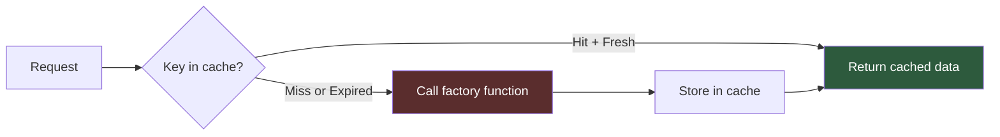
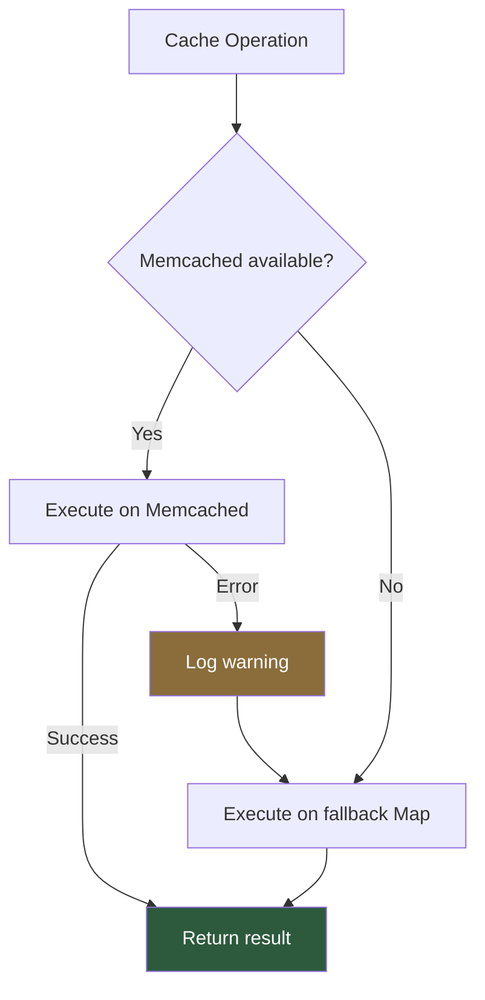
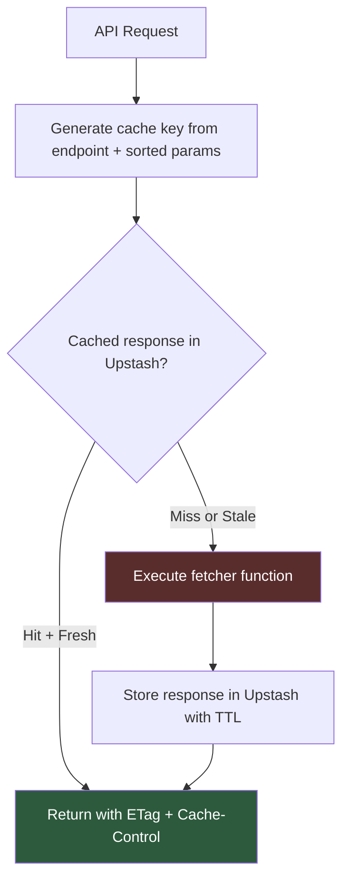
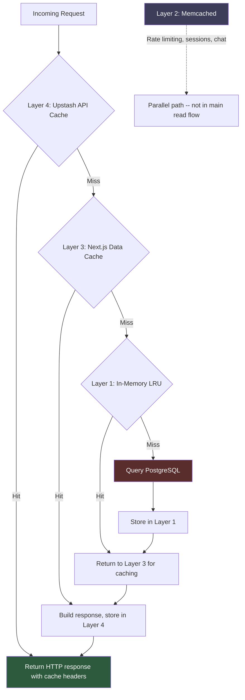

# Chapter 3: Caching in Four Layers

Chapter 2 established PostgreSQL as the single source of truth -- dual access patterns, connection pooling, a query builder that mimics PostgREST without running PostgREST. Every record lives in the database. Every transaction is ACID-compliant. The database is correct.

The database is also slow.

Not slow in the way that makes you rearchitect. Slow in the way that makes you add caching -- and then more caching, and then a third kind, and eventually a fourth because the third one turned out to be insufficient for API responses that need HTTP-level cache control.

Stick My Note runs four independent caching layers. Not a unified caching strategy. Not a coherent hierarchy. Four separate systems, each solving a different problem, each with its own TTL, its own eviction policy, and its own failure mode. They don't coordinate. They barely know each other exists.

This is unusual. Most systems pick one caching layer and commit to it. A Redis instance. A CDN edge cache. Maybe both. The four-layer approach here isn't the result of careful upfront design -- it's the sedimentary record of solving problems as they appeared:

- The process needed fast lookups without network hops. **In-memory LRU.**
- The cluster needed shared state across restarts. **Memcached.**
- The framework offered built-in server-side caching. **Next.js data cache.**
- The API responses needed HTTP semantics -- ETags, Cache-Control, stale-while-revalidate. **Upstash Redis REST.**

Each layer was added because the previous ones didn't cover a specific use case. The result is a system that's more resilient than any single-cache architecture -- any layer can fail without taking down the application -- but harder to reason about when you need to answer "is this data fresh?"

The honest answer: probably. Within five minutes, definitely.

---

## 3.1 Layer 1: In-Memory LRU

The fastest cache is the one that never leaves the process. No serialization, no network round-trip, no protocol overhead. Just a `Map` lookup.

The in-memory cache is a singleton class wrapping a JavaScript `Map` with three additions: per-item TTL, a maximum capacity of 1,000 entries, and LRU eviction when full.

```
class Cache
  store: Map<key, { data, timestamp, ttl }>
  maxSize: 1000

  get(key):
    item = store.get(key)
    if now - item.timestamp > item.ttl: delete, return null
    return item.data

  set(key, data, ttl = 5 minutes):
    if store.size >= maxSize: evictOldest()
    store.set(key, { data, timestamp: now, ttl })

  getOrSet(key, factory, ttl):
    cached = get(key)
    if cached: return cached
    data = await factory()
    set(key, data, ttl)
    return data
```

The `getOrSet` method is the cache-aside pattern distilled to its essence: check the cache, miss, call the factory, populate the cache, return the result. Callers don't need to manage cache lifecycle -- they provide a key and a function that computes the value on miss.

A background interval runs every 60 seconds, walking the entire map and deleting expired entries. This is cheaper than it sounds. Iterating 1,000 entries and comparing timestamps takes microseconds. The alternative -- lazy expiration only on access -- would let the map fill with dead entries that are never read again.



The eviction strategy is worth noting: when the cache hits 1,000 entries, it walks the map to find the oldest entry by timestamp and deletes it. This is O(n) eviction -- a proper LRU cache would use a doubly-linked list for O(1). At 1,000 entries, this doesn't matter. At 100,000 it would.

**Pattern operations** round out the API. `invalidatePattern("notes:*")` converts glob syntax to a regex and deletes every matching key. `getBatch` retrieves multiple keys in one call. `touch` resets a key's timestamp without fetching or rewriting its data -- useful for extending TTL on frequently accessed items without recomputing them.

The catch: this cache lives and dies with the Node.js process. A restart clears everything. A deployment clears everything. On a single-server deployment (which Stick My Note is), that's fine -- the cache rebuilds within a few requests. On a multi-server deployment, each process would have its own divergent copy. That's what Layer 2 is for.

---

## 3.2 Layer 2: Memcached (The "Redis" That Isn't)

This is the part of the codebase that makes you do a double-take.

There's a module at the path you'd expect for a Redis client. It exports an object called `redis`. The import path contains the word "redis." The server it connects to is named after Redis. And none of it is Redis.

The actual client library is `memjs` -- a Memcached client. The server running on the network is Memcached, listening on port 11211. The re-export file exists solely so that the rest of the codebase can `import { redis } from "@/lib/redis/local-redis"` and never think about it.

```
// The re-export that launched a thousand misunderstandings
export { cache as redis } from "@/lib/cache/memcached-client"
```

How does this happen? The same way it always happens. Someone sets up a Memcached server, names the VM "REDIS" because they plan to migrate later, writes an adapter with a Redis-compatible API surface, and never migrates because Memcached works fine for the actual use case.

And it does work fine. Stick My Note uses this layer for three things:

1. **Rate limiting counters** -- `incr` with TTL to track request counts per window
2. **Session-adjacent data** -- temporary state that should survive a process restart but not forever
3. **Pad chat caching** -- settings, moderator lists, and user info with domain-specific TTLs

The adapter wraps the Memcached protocol to present a Redis-like interface:

```
class MemcachedCache
  client: memjs.Client
  fallbackMap: Map  // in-memory backup

  get(key):       client.get(key) || fallbackMap.get(key)
  set(key, val, { ex?, px? }):  client.set(key, val, { expires: ttl })
  del(key):       client.delete(key)
  incr(key):      client.increment(key, 1, { initial: 1 })
  expire(key, s): client.touch(key, seconds)
  ping():         client.stats() -- no error means alive
```

The `set` method accepts `ex` (seconds) and `px` (milliseconds) options -- Redis conventions -- and translates them to Memcached's `expires` parameter. The `expire` command maps to Memcached's `touch`. The `incr` provides an `initial` value of 1, because Memcached's increment fails if the key doesn't exist (Redis would auto-create it).

### The Fallback That Makes It Bulletproof

Every operation follows the same pattern: try Memcached, catch failure, fall back to the in-memory `Map`. This isn't aspirational error handling. It's the actual production behavior.



The fallback map replicates TTL behavior by storing `{ value, expiresAt }` tuples. A cleanup interval runs every five minutes and sweeps expired entries -- the same pattern as Layer 1, but at a longer interval because this map is expected to stay small (it only fills when Memcached is down).

The health check doesn't just ping -- it reports whether the system is operating on Memcached or the fallback, so monitoring can distinguish "cache is working" from "cache is working but degraded."

### Why Not Actual Redis?

The pragmatic answer: Memcached was already running, and the codebase doesn't need anything Redis provides that Memcached doesn't. There's no pub/sub requirement at the cache layer -- PostgreSQL LISTEN/NOTIFY handles real-time messaging. There are no sorted sets, no streams, no Lua scripting needs. The usage is pure key-value with TTL and atomic increment.

Memcached is arguably better for this use case: simpler protocol, lower memory overhead per key, multi-threaded by default. Redis's additional data structures are powerful, but unused power is just complexity.

### The Domain-Specific Cache: Pad Chat

A second Memcached client exists specifically for pad chat data. This one doesn't go through the Redis-compatible adapter -- it uses `memjs` directly and provides domain-typed methods:

| Method | Key Pattern | TTL |
|--------|------------|-----|
| `getSettings(padId)` | `pad:settings:{id}` | 5 minutes |
| `getModerators(padId)` | `pad:mods:{id}` | 2 minutes |
| `getUser(userId)` | `user:info:{id}` | 10 minutes |
| `getUsers(userIds)` | Individual fetches | 10 minutes |

The TTL choices reflect update frequency. Pad settings change rarely -- five minutes is aggressive. Moderator lists change when admins act -- two minutes balances freshness with load. User info (name, avatar) is practically static -- ten minutes barely matters.

Batch operations (`getUsers`, `setUsers`) issue parallel individual requests. Memcached supports `getMulti`, but the `memjs` client's API for it is awkward, and the parallel-fetch approach keeps the code simple at the cost of N round-trips instead of 1. For typical batch sizes (5-20 users in a chat room), the difference is negligible.

---

## 3.3 Layer 3: Next.js Data Cache

The first two layers are infrastructure -- they don't know anything about the framework. Layer 3 is framework-native.

Next.js provides `unstable_cache`, a server-side function memoization system that integrates with the framework's rendering pipeline. You wrap a function, tag it, and Next.js handles the rest: caching the result, serving it on subsequent calls, and invalidating it when you call `revalidateTag`.

```
CACHE_TAGS:
  notes(userId)     -> "notes-{userId}"       TTL: 60s
  noteStats(userId) -> "note-stats-{userId}"   TTL: 300s
  pads(userId)      -> "pads-{userId}"         TTL: 300s
  sticks(userId)    -> "sticks-{userId}"       TTL: 60s
  pad(padId)        -> "pad-{padId}"           TTL: 300s
  stick(stickId)    -> "stick-{stickId}"       TTL: 60s
```

The pattern splits resources into two TTL tiers. Frequently mutated data (notes, sticks) gets 60-second TTLs -- a user who creates a note will see it within a minute even if the cache isn't explicitly invalidated. Aggregated or structural data (stats, pads) gets 300-second TTLs because it changes less often and costs more to recompute.

In practice, the usage looks like wrapping a database call:

```
fetchUserNotes(userId):
  return unstable_cache(
    async () => {
      db = await createDatabaseClient()
      return db.from("notes")
        .select(columns)
        .eq("user_id", userId)
        .order("updated_at", descending)
    },
    [cache-key],
    { tags: ["notes-{userId}"], revalidate: 60 }
  )()
```

The function passed to `unstable_cache` is only called on cache miss. The result is serialized and stored in the Next.js cache backend (the filesystem in production builds). The `tags` array enables targeted invalidation -- when a note is created, `revalidateTag("notes-{userId}")` clears exactly that user's cached note list without touching anyone else's.

The helper module provides convenience functions for invalidation:

- `invalidateNotesCache(userId)` -- clears both note list and note stats
- `invalidatePadsCache(userId)` -- clears pad list
- `invalidateStickCache(stickId)` -- clears individual stick

The `createCachedFunction` utility generalizes the pattern: pass any async function plus tags and TTL, get back a cached version with the same signature. This is the adapter pattern again -- same interface, different behavior underneath.

### The "Unstable" Caveat

The function is literally named `unstable_cache`. It's been "unstable" for multiple Next.js releases. The API works, the behavior is reliable, but the Next.js team reserves the right to change it. For a self-hosted deployment where you control the framework version, this is a non-issue. You pin the version, you own the behavior. For a platform deployed to Vercel where the framework version might auto-upgrade, this would be a legitimate concern.

Self-hosted sovereignty strikes again: you don't care about API stability guarantees when you control the upgrade cycle.

---

## 3.4 Layer 4: Upstash Redis REST (API Response Cache)

The fourth layer solves a different problem entirely. Layers 1-3 cache data before it becomes an HTTP response. Layer 4 caches the response itself, complete with HTTP cache semantics.

This layer uses `@upstash/redis` -- a Redis client that communicates over HTTPS REST, not the Redis wire protocol. It's a different Redis than the "Redis" in Layer 2 (which is actually Memcached). The naming confusion compounds.

The initialization is defensive:

```
url = env.UPSTASH_REDIS_REST_URL
token = env.UPSTASH_REDIS_REST_TOKEN

if url and token and url.startsWith("https://"):
  redis = new Redis({ url, token })
else:
  redis = null  // caching disabled, not broken
```

The HTTPS check is deliberate. Upstash Redis REST is a managed service accessed over the internet. Sending cache keys and values over unencrypted HTTP would be a data leak. If someone configures a plain `http://` URL (perhaps pointing at a local Redis), the layer refuses to initialize rather than silently operating without encryption.

When `redis` is `null`, every cache operation returns `null` or exits early. The application runs without this layer entirely -- requests just hit the database directly instead of serving cached API responses.

### The Cache-Aside Flow with HTTP Semantics

The `withCache` middleware wraps API route handlers:



Cache keys are deterministic: the endpoint path plus query parameters, sorted alphabetically. `api:notes:page=1&sort=date&userId=abc` always produces the same key regardless of parameter order in the original request.

Each cached entry stores three things:

| Field | Purpose |
|-------|---------|
| `data` | The serialized response payload |
| `timestamp` | When the entry was written (millisecond epoch) |
| `tags` | String array for tag-based invalidation |

The response includes three cache-related headers:

- **Cache-Control**: `public, s-maxage={ttl}, stale-while-revalidate={swr}` -- tells CDNs and proxies to cache for `ttl` seconds, then serve stale for up to `swr` seconds while revalidating in the background. Defaults: 60s max-age, 300s SWR.
- **ETag**: A truncated Base64 hash of the response body. Clients can send `If-None-Match` to get a 304 Not Modified instead of re-downloading unchanged data.
- **Last-Modified**: The current timestamp. Enables `If-Modified-Since` conditional requests.

Tag-based invalidation works by key pattern matching: `invalidate("notes")` deletes every key starting with `api:notes`. This is coarser than the per-user invalidation in Layer 3 -- it nukes all users' cached note responses, not just one. The trade-off is simplicity: the API cache doesn't need to know about user scoping because its TTLs are short enough (60 seconds) that stale data resolves itself quickly.

### Search Cache: A Specialized Variant

The search subsystem has its own Upstash Redis cache with tighter semantics. Cache keys encode the search term and page number. TTL is 300 seconds -- longer than the general API cache because search results change less often than individual resource endpoints. The same `if (!redis) return null` pattern ensures graceful degradation.

The Calstick (calendar task) subsystem adds another variant with specialized key generators for Gantt chart data, dependency graphs, and critical path calculations. Same underlying Upstash client, different TTLs tuned to the domain: 60 seconds for task lists, 120 seconds for Gantt data, 300 seconds for dependency calculations that are expensive to recompute.

---

## 3.5 The Four Layers Together

Here's what a single request looks like as it passes through the stack:



The diagram reveals something important: Layer 2 (Memcached) isn't in the main read path at all. It runs parallel, serving rate limiting, session data, and domain-specific chat caches. The vertical stack is Layers 4 -> 3 -> 1 -> PostgreSQL, with Layer 2 off to the side.

This explains why four layers don't feel like four layers in practice. A typical page load hits Layer 3 (Next.js cache) or Layer 4 (API cache). A cache miss cascades to Layer 1 (in-memory) and then to the database. Layer 2 handles its own domain. There's no request that traverses all four layers sequentially.

### The Stale Data Window

With independent TTLs and no cross-layer invalidation, the worst-case staleness is the longest TTL in the outermost layer that holds the data. In practice:

| Scenario | Worst-Case Staleness |
|----------|---------------------|
| Note created, user views note list | 60 seconds (Layer 3 TTL for notes) |
| Note created, another user searches | 300 seconds (search cache TTL) |
| Pad settings changed | 300 seconds (Memcached TTL for settings) |
| User avatar updated | 600 seconds (pad chat user info TTL) |

Explicit invalidation reduces these windows. When a note is created, the API route calls `invalidateNotesCache(userId)`, which immediately clears Layer 3. But it doesn't clear Layer 4 (the API response cache) or Layer 1 (the in-memory cache) for other users who might have the same data cached under different keys.

The system tolerates this because the data model is collaborative, not transactional. A one-minute delay between "I posted a note" and "my colleague sees it in their list" is acceptable for sticky notes. If this were a banking application, it would not be.

### The Fail-Open Philosophy

Every cache layer follows the same contract: if I fail, the request succeeds anyway.

- Layer 1 misses fall through to the database.
- Layer 2 failures fall back to an in-memory `Map`.
- Layer 3 misses re-execute the wrapped function.
- Layer 4 with a `null` Redis client skips caching entirely.

No cache failure produces a user-visible error. The worst outcome is higher database load. This is a deliberate architectural choice: availability over consistency, simplicity over coordination.

The alternative -- failing closed, where a cache error returns a 503 -- would make the caching layer a critical dependency. Every Memcached restart, every Upstash timeout, every memory pressure event would become a user-facing incident. For a collaboration platform where "slightly stale" is always better than "completely unavailable," fail-open is the right trade-off.

This philosophy extends to initialization. The Memcached client tests the connection on startup, but a failed test doesn't prevent the application from starting. The Upstash client checks for HTTPS in the URL, but a missing URL doesn't throw -- it just sets the client to `null`. The in-memory cache requires no configuration at all. The application starts regardless of which caches are healthy. It just gets progressively faster as more layers come online.

---

## 3.6 What's Missing

An honest architecture review should name the gaps.

**No cache warming.** A cold start (deployment, restart, crash recovery) means every request hits the database until the caches fill. For a single-server deployment with moderate traffic, the caches populate within seconds. For a high-traffic deployment, the thundering herd after a restart could spike database connections. A cache warming step in the deployment pipeline would prevent this.

**No distributed invalidation.** When Layer 3 invalidates a tag, it doesn't tell Layer 4 to drop matching entries. When Layer 1 evicts an item, Layer 2 doesn't know. Each layer operates on its own TTL schedule. Cross-layer invalidation would require either a shared event bus or explicit calls at every mutation point. The codebase chose TTL convergence over coordination complexity.

**No metrics.** The in-memory cache exposes `stats()` (size, key list, timestamps), and the Memcached layer has a `healthCheck()`, but there's no unified hit-rate tracking, no miss-rate alerting, no cache efficiency dashboard. You can tell if caching is working. You can't tell how well it's working.

**No compression.** Cached values are stored as plain JSON strings in Memcached and Upstash. For large payloads (Gantt chart data, search result sets), compression before caching would reduce storage and network costs. At current data volumes, this doesn't matter. It would if the deployment scaled to thousands of concurrent users.

---

## 3.7 Apply This

**1. Start with in-process, add layers when you have evidence.**
The in-memory LRU cache handles the majority of cache hits with zero infrastructure cost. Don't deploy Memcached or Redis until you can demonstrate that process-local caching is insufficient. Most applications never need more than Layer 1.

**2. The fail-open contract is non-negotiable for caches.**
A cache is an optimization, not a data store. If your application crashes when the cache is down, you've accidentally promoted an optimization to a dependency. Every cache operation should have a fallback path that produces correct results without the cache.

**3. Name things for what they do, not what they run on.**
The "redis" module that wraps Memcached works because consumers don't care about the backing store. They care about `get`, `set`, `del`, and `incr`. If you later migrate from Memcached to Redis, zero call sites change. The adapter boundary absorbs the implementation swap.

**4. Match TTL to mutation frequency, not to arbitrary round numbers.**
Notes and sticks get 60-second TTLs because they change often. Pad settings get 300 seconds because they don't. User avatars get 600 seconds because they're practically static. The right TTL is the one where "stale" doesn't mean "wrong" -- it means "slightly behind."

**5. Separate your HTTP cache semantics from your data cache.**
Layers 1-3 cache data. Layer 4 caches HTTP responses with ETags, Cache-Control, and conditional request support. These are different concerns. Data caches optimize database load. HTTP caches optimize bandwidth and enable CDN integration. Mixing them produces a system that does neither well.

---

Chapter 4 moves from "what data can you see" to "who are you, and how do we know." The authentication system offers three paths to the same session -- LDAP, OIDC, and local credentials -- each reflecting a different trust model. The caching patterns from this chapter reappear there: OIDC discovery documents are cached with TTL, failed login attempts are tracked in Memcached, and session tokens are validated without hitting the database on every request. Caching doesn't stop at data. It shapes how identity works too.
