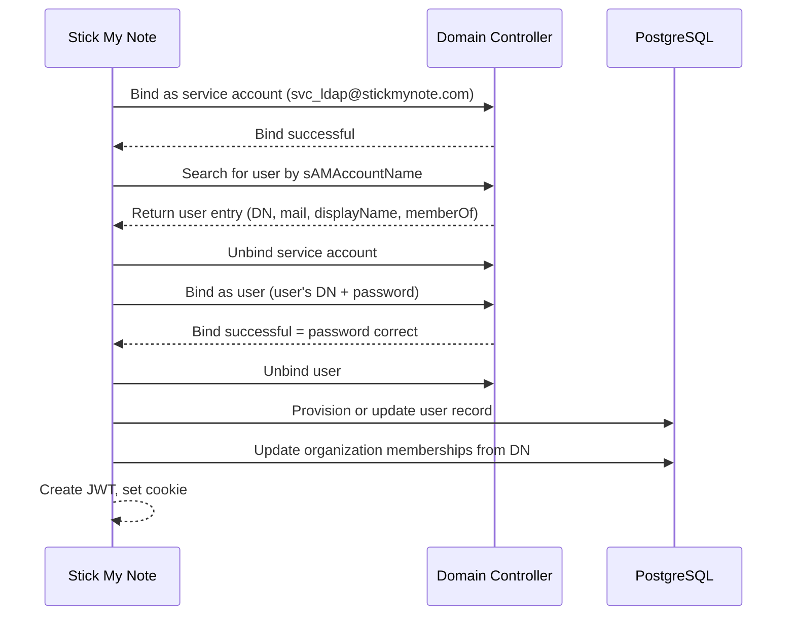
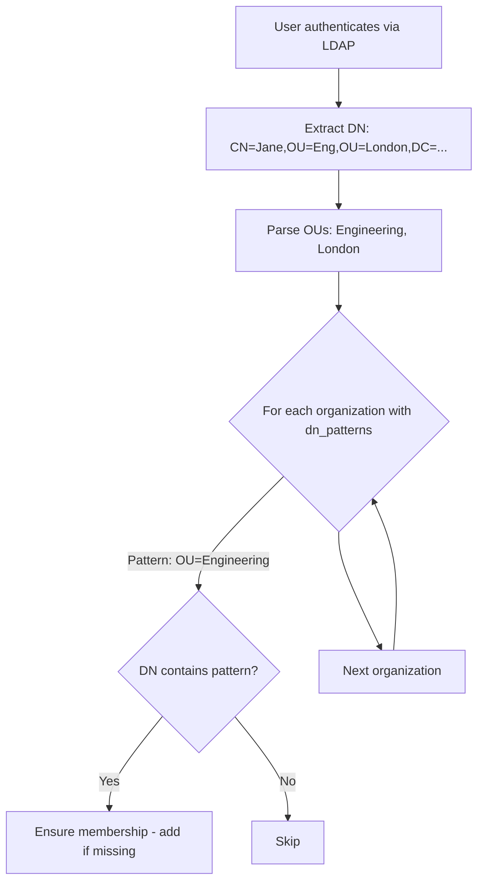
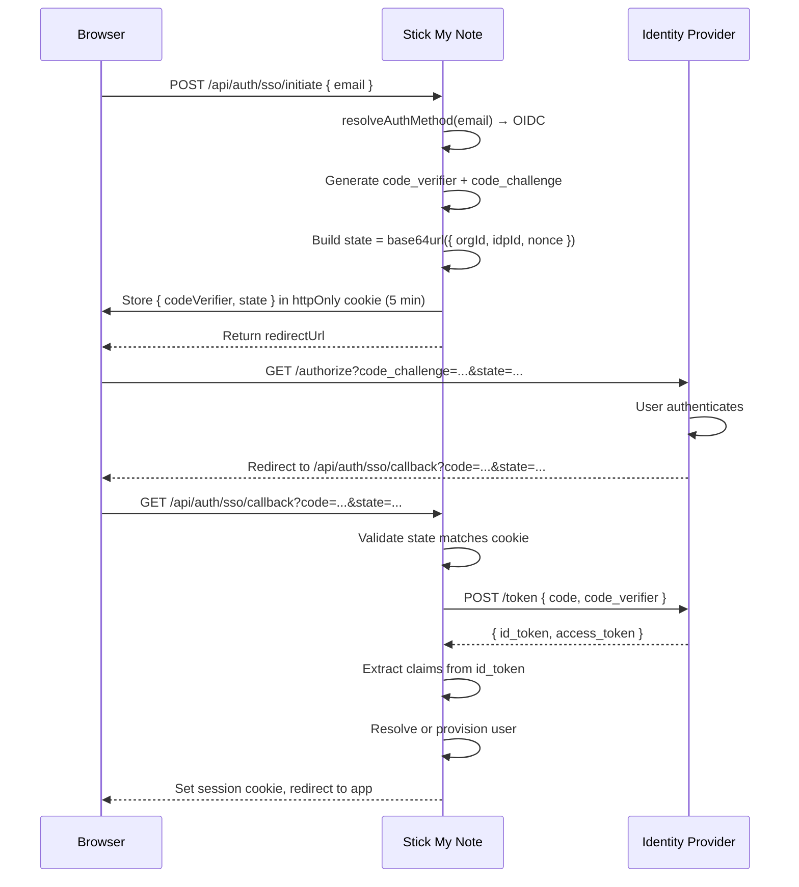
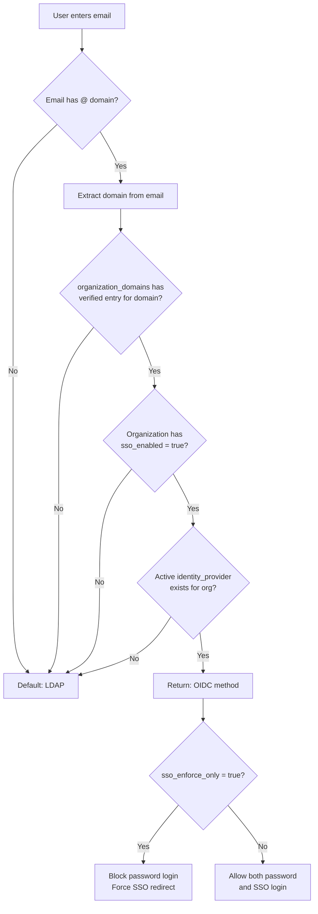
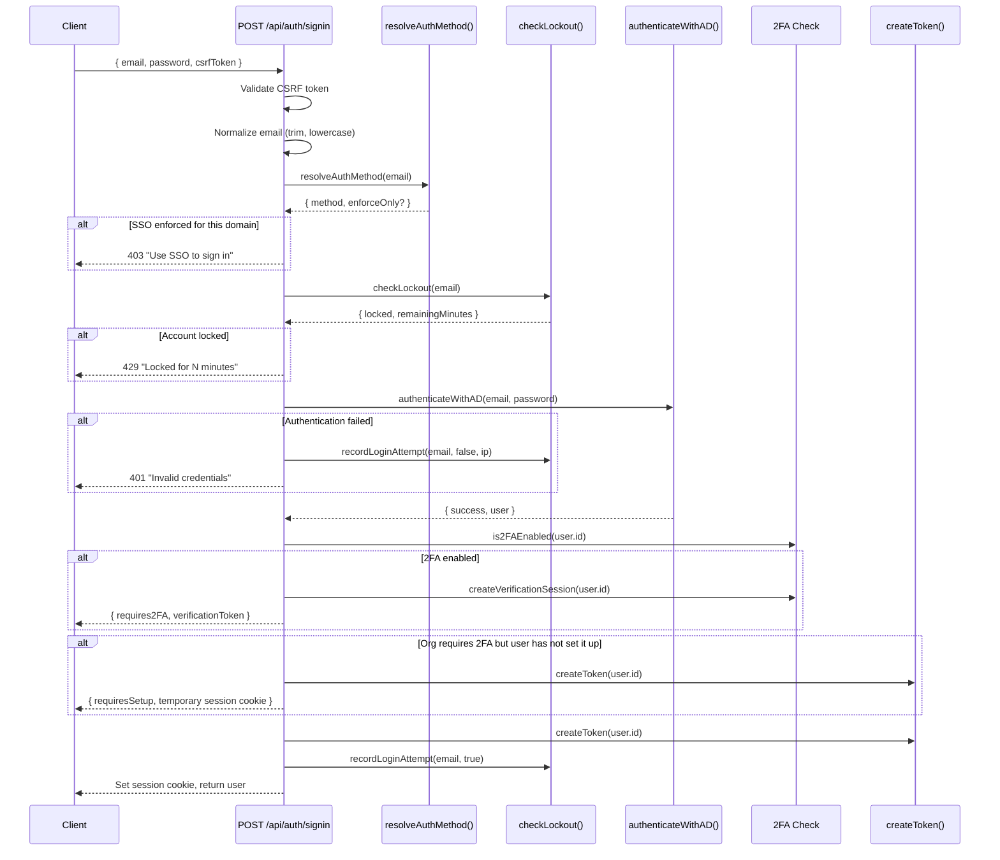

# Part II — Identity and Tenancy

*"Who you are determines what you see."*

Part I laid the foundation: six servers with single responsibilities, a PostgreSQL database accessed through dual patterns, and four caching layers that fail open. The infrastructure exists. Now we need to know who is using it.

Identity is where the self-hosted sovereignty thesis gets personal. Auth0, Okta, Clerk — they all work. They are also someone else's servers processing your users' credentials. For an enterprise collaboration platform deployed on-premise, that is a non-starter. The authentication system must run entirely within the network perimeter, talk to the company's own Active Directory, and never phone home.

Stick My Note solves this with three authentication methods that converge on a single outcome: a signed JWT in an httpOnly cookie. The method varies. The result does not.

---

# Chapter 4: Authentication — Three Roads to the Same Session

## 4.1 The Convergence Point

Every authentication path in the system ends the same way: a call to `createToken(userId)` that produces an HS256-signed JWT with a 7-day expiry, followed by setting that token as an httpOnly session cookie. Whether the user proved their identity through Active Directory, an external OIDC provider, or a local password hash, the downstream code never knows and never cares.

This convergence is deliberate. It means every protected route, every API endpoint, every server component uses the same `getSession()` call. One verification function. One token format. One cookie name. The complexity lives in how you earn the token, not in what happens after.

```
// The convergence point — identical for all three auth methods
token = signJWT({ userId }, algorithm="HS256", expiry="7d")
setCookie("session", token, {
  httpOnly: true,
  secure: true,
  sameSite: "lax",
  maxAge: 7 days
})
```

Three roads. Same destination. Let us walk each one.

## 4.2 Road One: LDAP and Active Directory

LDAP is the primary authentication method. In an enterprise Windows environment, Active Directory is where users already exist. Fighting that is foolish. The system connects to the domain controller at `ldaps://192.168.50.11:636` over TLS and treats AD as the source of truth for identity.

### The Dynamic Import Problem

The `ldapjs` library is a native Node.js module. If you import it at the top of a file, Next.js will try to bundle it during `next build`. The build will fail — ldapjs uses native bindings that do not survive webpack compilation.

The solution is a lazy singleton:

```
let ldapModule = null

async function getLdapModule() {
  if (process.env.BUILDING === "true")
    throw new Error("LDAP not available during build")
  ldapModule ??= await import("ldapjs")
  return ldapModule
}
```

The nullish coalescing assignment (`??=`) ensures the import happens exactly once. The build-time guard prevents any LDAP connection attempts during `next build`. This pattern recurs throughout the codebase for server-only dependencies — `openid-client` uses the same approach.

### The Two-Bind Authentication Flow

LDAP authentication requires two separate bind operations. This surprises developers who have only worked with database-backed auth, where you look up a user and compare hashes. LDAP does not expose password hashes. You prove a password is correct by successfully binding with it.



The first bind uses a service account with read permissions across the directory. This lets the application search for the user by `sAMAccountName` (the pre-Windows 2000 login name — the part before the `@`). The search returns the user's full distinguished name, email, display name, and group memberships.

The second bind uses the user's own distinguished name and the password they typed. If this bind succeeds, the password is correct. If it fails, it is wrong. There is no hash comparison, no timing attack surface on the application side. The domain controller handles all of that.

The two connections are separate clients. The service account client is created, used for the search, and destroyed. A fresh client is created for the user bind. This prevents any state leakage between the privileged search operation and the user authentication.

### Auto-Provisioning and the First User

When an LDAP user authenticates successfully, the system checks whether they already exist in the local `users` table. If they do, their profile is updated (display name, distinguished name). If they do not, a new user record is created with `email_verified: true` — the domain controller already verified their identity.

The first user to authenticate gets special treatment. If the `users` table is empty, the system creates a default organization derived from the email domain (`stickmynote.com` becomes `Stickmynote`) and makes that user the owner. Every subsequent user gets member-level access. This bootstrap sequence means a fresh deployment requires zero manual setup: the first person to log in through Active Directory owns the organization.

### DN Pattern Matching for Organization Membership

Active Directory organizes users into Organizational Units (OUs). A user in `CN=Jane Doe,OU=Engineering,OU=London,DC=stickmynote,DC=com` belongs to the Engineering OU within the London OU. The system extracts these OU components from the distinguished name and matches them against patterns stored on each organization.

Organizations store a `dn_patterns` JSONB array. If a user's DN contains any of the patterns (case-insensitive substring match), they are automatically added as an active member. This means an admin can configure an organization with `["OU=Engineering"]` and every engineer who logs in through AD will be a member without any invitation workflow.

The pattern matching is intentionally loose. A pattern of `OU=London` matches any user under any sub-OU of London. This aligns with how AD administrators typically think about organizational structure. Exact matching would require constant maintenance as people move between teams.



There is a graceful degradation here. The `dn_patterns` column might not exist in older deployments that have not run the migration. The code checks `information_schema.columns` before querying — if the column is missing, it silently skips organization membership updates. No crash. No error. Just a feature that is not available yet.

## 4.3 Road Two: OIDC Single Sign-On with PKCE

SSO exists for organizations that use external identity providers — Azure AD, Okta, Google Workspace. The implementation uses OpenID Connect with PKCE (Proof Key for Code Exchange), which is the current best practice for public clients.

### Discovery and Caching

OIDC providers publish their configuration at a well-known URL (typically `/.well-known/openid-configuration`). This document contains the authorization endpoint, token endpoint, supported scopes, and signing keys. The system fetches this once and caches it in memory for one hour.

```
const discoveryCache = new Map()
const CACHE_TTL = 60 * 60 * 1000  // 1 hour

async function discoverProvider(discoveryUrl, clientId, clientSecret) {
  cached = discoveryCache.get(discoveryUrl)
  if (cached && cached.expiresAt > Date.now())
    return cached.config

  config = await oidc.discovery(issuerUrl, clientId, clientSecret)
  discoveryCache.set(discoveryUrl, { config, expiresAt: Date.now() + CACHE_TTL })
  return config
}
```

The cache is a plain `Map`, not Memcached. Discovery metadata changes rarely (key rotation, endpoint updates) and a 1-hour TTL handles staleness without adding network hops. If the process restarts, the cache refills on first use.

### The PKCE Flow

PKCE prevents authorization code interception attacks. The application generates a random `code_verifier`, computes its SHA-256 hash as the `code_challenge`, and sends the challenge with the authorization request. When exchanging the code for tokens, it sends the original verifier. The IdP verifies that `SHA256(verifier) == challenge`. An attacker who intercepts the authorization code cannot use it without the verifier.



The state parameter carries structured data: the organization ID, identity provider ID, and a random nonce. It is base64url-encoded JSON, not a random opaque string. This means the callback handler knows which IdP configuration to load without any server-side state — the cookie carries the `codeVerifier` and the URL carries the `state`. The nonce inside the state prevents replay.

The `sso_state` cookie has a 5-minute TTL. If the user takes longer than that to authenticate with their IdP (a plausible scenario with MFA prompts), the flow fails gracefully: "SSO session expired. Please try again." Five minutes is generous for a login flow and tight enough to limit the window for state-based attacks.

### Federated Identity Linking

The OIDC flow produces a `sub` claim — the user's stable identifier at the identity provider. The `federated_identities` table maps this external identity to a local user:

| Column | Purpose |
|--------|---------|
| `idp_id` | Which identity provider |
| `external_id` | The `sub` claim |
| `user_id` | Local user ID |
| `external_email` | Email from IdP (may differ from local) |
| `external_display_name` | Name from IdP |
| `external_attributes` | Full raw claims as JSONB |
| `last_login_at` | Timestamp of most recent SSO login |

On first SSO login, the system checks three things in order:

1. Does a `federated_identities` record exist for this `(idp_id, external_id)` pair? If yes, this is a returning SSO user. Update `last_login_at` and optionally sync profile data.

2. Does a local user exist with this email? If yes, link the federated identity to the existing account. This handles the migration case where users already have local accounts and the organization later enables SSO.

3. Neither exists? If JIT (Just-In-Time) provisioning is enabled on the IdP configuration, create a new user with the default role from the IdP config. If JIT is disabled, reject the login: "User does not exist and JIT provisioning is disabled."

The attribute mapping is configurable per IdP. The defaults assume standard OIDC claims (`email`, `given_name`, `family_name`, `name`), but an admin can remap them for providers that use non-standard claim names. This is stored as a JSONB object on the `identity_providers` row.

### Client Secret Encryption

IdP client secrets are stored encrypted with AES-256-GCM using an organization-specific derived key. The `decryptForOrg()` function handles decryption at the point of use. Secrets are never logged, never included in API responses, and never stored in plaintext. The encryption key derivation means a database breach does not expose client secrets — the attacker would also need the application's master key.

## 4.4 Road Three: Local Authentication

Local auth is the fallback. It exists for standalone deployments without Active Directory, for development environments, and as the signup path for new users who are not part of any enterprise identity system.

### Password Hashing

Passwords are hashed with bcrypt at a cost factor of 10. This is the default from `bcryptjs`, and it is adequate. Cost 10 produces roughly 100ms of hashing time on modern hardware — fast enough that users do not notice, slow enough that brute-force attacks are impractical.

There is no argon2, no scrypt. bcrypt has been battle-tested for over two decades. The choice is boring on purpose.

### JWT Creation

The `jose` library creates HS256-signed JWTs. The payload contains exactly one claim: `userId`. No roles, no permissions, no organization ID. The token identifies who you are. What you can do is looked up fresh from the database on every request.

```
token = new SignJWT({ userId })
  .setProtectedHeader({ alg: "HS256" })
  .setIssuedAt()
  .setExpirationTime("7d")
  .sign(JWT_SECRET)
```

This is a deliberate choice against putting claims in the token. Claims go stale. A user might be promoted to admin, removed from an organization, or have their account suspended. If the token carries a `role: "member"` claim, that claim is valid for 7 days even if the user was promoted 5 minutes after login. By storing only the user ID, every permission check hits the database for current state.

The trade-off is performance: every authenticated request requires a database query. In practice, the `getSession()` function runs a single `SELECT` by primary key — sub-millisecond on PostgreSQL with the row in buffer cache. The application layer caching from Chapter 3 handles the rest.

### The No-Refresh-Token Decision

There are no refresh tokens. The 7-day JWT is the only token. When it expires, you log in again.

This is controversial. The conventional wisdom is: short-lived access tokens (15 minutes) plus long-lived refresh tokens (7-30 days). The access token is used for requests. The refresh token is used to get new access tokens without re-authentication. If an access token is stolen, the damage window is 15 minutes.

The argument for this system is sound in the abstract. But it adds real complexity:

- **Token rotation**: the refresh token must be rotated on each use, requiring server-side storage and race condition handling when multiple tabs refresh simultaneously.
- **Revocation infrastructure**: you need a token blocklist or a reference store, which means server-side state for what was supposed to be a stateless system.
- **Silent refresh**: the client needs background logic to detect expiring tokens and refresh them before API calls fail, with retry queues for requests that arrive during the refresh window.

Stick My Note skips all of this. The 7-day JWT is the session. If it is compromised, it is valid for up to 7 days. This is mitigated by three factors:

1. **httpOnly cookie**: JavaScript cannot read the token. XSS attacks cannot exfiltrate it.
2. **Secure flag**: the cookie is only sent over HTTPS. Network sniffing does not capture it.
3. **SameSite=Lax**: the cookie is not sent on cross-site POST requests. CSRF attacks cannot use it.

A compromised token requires either a man-in-the-middle attack that breaks TLS (unlikely on an internal network) or physical access to the user's browser. In both cases, refresh tokens would not help either — the attacker would just steal the refresh token instead.

The honest assessment: this is a trade-off that favors simplicity over defense-in-depth. For a self-hosted enterprise application on a private network, the risk profile is different from a public SaaS product. The threat model is insider access and session hijacking, not internet-scale credential stuffing. The 7-day window is acceptable.

### No Session Revocation

Logout clears the cookie. It does not invalidate the token. If someone copies the JWT before logout and replays it, the token is still valid until its natural expiry.

True session revocation requires server-side state: a blocklist of revoked tokens checked on every request. That is a database or Redis lookup per request, and it defeats the purpose of stateless JWTs.

The system is honest about what it provides. `clearSession()` deletes the cookie. That is all it does. The JWT is a bearer token with an expiry date. The expiry is the revocation mechanism.

For environments where immediate revocation matters — a terminated employee, a compromised account — the mitigation is at the infrastructure level: disable the AD account, which prevents new token creation. Existing tokens expire within 7 days. This is a gap, and it is a known gap.

## 4.5 The resolveAuthMethod Decision Tree

When a user submits their email on the login page, the system needs to decide which authentication path to take. The `resolveAuthMethod()` function makes this decision by querying the database.



The query is a single SQL statement that joins `organization_domains`, `organizations`, and `identity_providers`. It resolves in one round-trip. The default is LDAP — if anything is missing (no verified domain, SSO not enabled, no active IdP), the user falls back to Active Directory authentication.

The `sso_enforce_only` flag is the enforcement mechanism. When set, the signin route rejects password-based login for that domain and returns a message telling the user to use SSO. This lets organizations mandate federated authentication without removing the password login UI for other domains.

The public endpoint `GET /api/auth/resolve-method?email=user@company.com` exposes only the method (`ldap` or `sso`) and the enforcement flag. It never reveals the IdP ID, organization ID, or any internal configuration. The client uses this to show or hide the SSO button on the login form.

## 4.6 The Login Flow End-to-End

All three roads pass through the same signin route. Here is the complete sequence for a password-based login:



Several things worth noting in this sequence:

**CSRF validation comes first.** Before touching the database, before parsing the email, the CSRF token is validated. This is a stateless HMAC check (covered in Chapter 5) that rejects forged requests immediately.

**Email normalization is aggressive.** `trim().toLowerCase()` on every login. This prevents subtle bugs where `User@Company.com` and `user@company.com` create different lockout records or resolve to different auth methods.

**Lockout check happens before authentication.** The system does not even attempt an LDAP bind if the account is locked. This prevents a locked account from generating load on the domain controller.

**The 2FA intercept does not create a session.** When a user has two-factor authentication enabled, the signin route returns a `verificationToken` instead of a session cookie. This token is a random 32-byte hex string, stored as a SHA-256 hash in `twofa_verification_sessions` with a 5-minute TTL and a maximum of 5 attempts. The client redirects to a verification page where the user enters their TOTP code. Only after successful verification does the system create the real session.

**The 2FA setup redirect does create a session.** If the organization requires 2FA but the user has not set it up yet, a temporary session is created (24-hour expiry instead of 7 days) so the user can access the setup page. This is a bootstrapping problem: you cannot require 2FA on a page that requires authentication to reach without first granting some level of access.

**Failed attempts are recorded after failure, not before.** The lockout counter increments only when authentication actually fails. A locked account that receives login attempts does not accumulate additional failures — it is already locked.

**Successful login clears the lockout.** A successful authentication deletes the lockout record entirely. There is no gradual cooldown. This is intentional: if the user proved they know the password, the failed attempts were either typos or a stopped attack. Either way, the slate is clean.

### Lockout Configuration

The lockout threshold is per-organization. Each organization stores `max_failed_attempts` (default 5) and `lockout_duration_minutes` (default 15) on its row. When recording a failed attempt, the system looks up the user's organization membership to get the thresholds.

If the user is not in any organization (possible for new signups), the defaults apply. If the lockout record exists and the previous lockout has expired, the counter resets to 1 — the expired lockout does not carry forward.

## 4.7 What All Three Roads Share

Despite their different mechanisms, all three authentication paths share:

**The same user table.** LDAP users, SSO users, and local users all land in `users`. The `auth_method` column tracks provenance. The `distinguished_name` column is null for non-LDAP users. The `password_hash` column is null for non-local users.

**The same JWT format.** `{ userId }` signed with HS256. No method-specific claims.

**The same session cookie.** `session`, httpOnly, Secure, SameSite=Lax, 7-day maxAge, path `/`.

**The same 2FA enforcement.** Regardless of how you authenticated, if your organization requires 2FA and you have not set it up, you get a temporary session and a redirect to the setup page. If you have set it up, you get a verification challenge.

**The same audit trail.** Every login — successful or failed — is logged with the authentication method, IP address, user agent, and email. The audit system (Chapter 16) treats all methods identically.

This uniformity is the architectural payoff. Adding a fourth authentication method (SAML, client certificates, passkeys) requires implementing the authentication logic and calling `createToken()` at the end. Nothing downstream changes.

## 4.8 Apply This

**1. Converge on a single session format.** Multiple auth methods should produce the same token. Downstream code should not care how the user proved their identity. Put the complexity in the authentication step, not in the authorization step.

**2. Put only the user ID in the JWT.** Roles, permissions, and org memberships change. If the token caches stale claims for its entire lifetime, you get authorization bugs that are invisible in testing and intermittent in production. Look up current state on every request.

**3. Dynamic import for native modules in Next.js.** Any module with native bindings (`ldapjs`, `bcrypt`, `sharp`) must be lazily imported to survive the webpack build. The `??=` singleton pattern gives you exactly-once loading with zero configuration.

**4. Use PKCE even when your client is confidential.** PKCE adds negligible complexity and prevents authorization code interception. It is required for public clients and recommended for all clients. The code verifier stored in an httpOnly cookie keeps the flow stateless on the server.

**5. Make the no-refresh-token decision explicitly.** If your threat model does not require sub-minute token revocation, you probably do not need refresh tokens. Document the trade-off. Acknowledge the gap. Ship the simpler system. You can always add refresh tokens later — removing them after the fact is much harder.

---

*Chapter 5 picks up where authentication ends. You have a valid session. Now the system needs to defend it — CSRF protection, rate limiting, account lockout thresholds, two-factor enforcement, and the encryption layer that protects stored secrets. Defense in depth, starting from the perimeter and working inward.*
