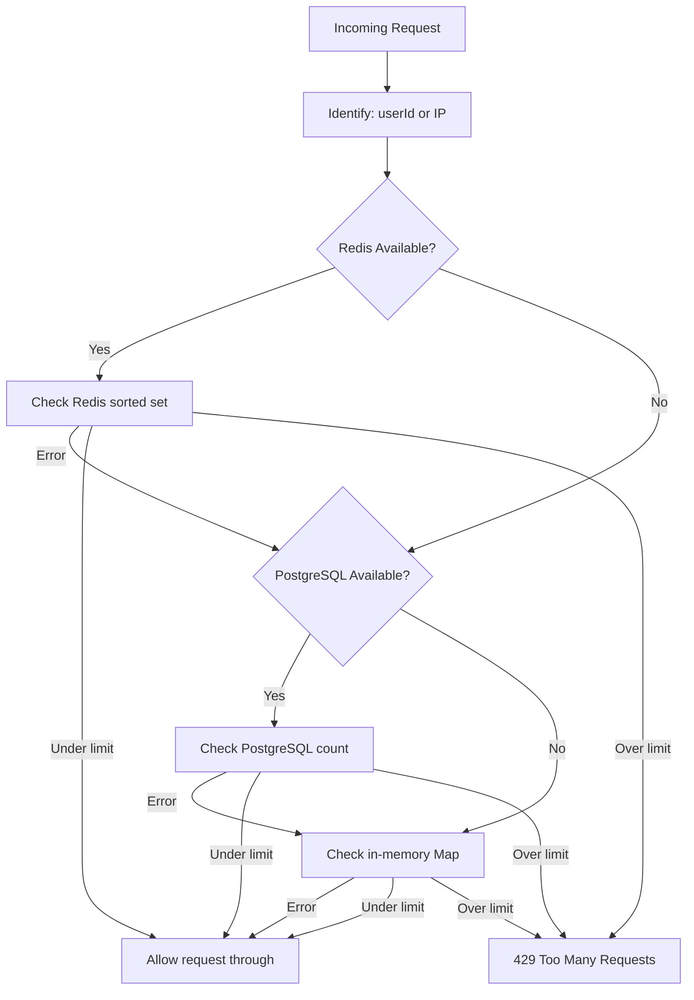
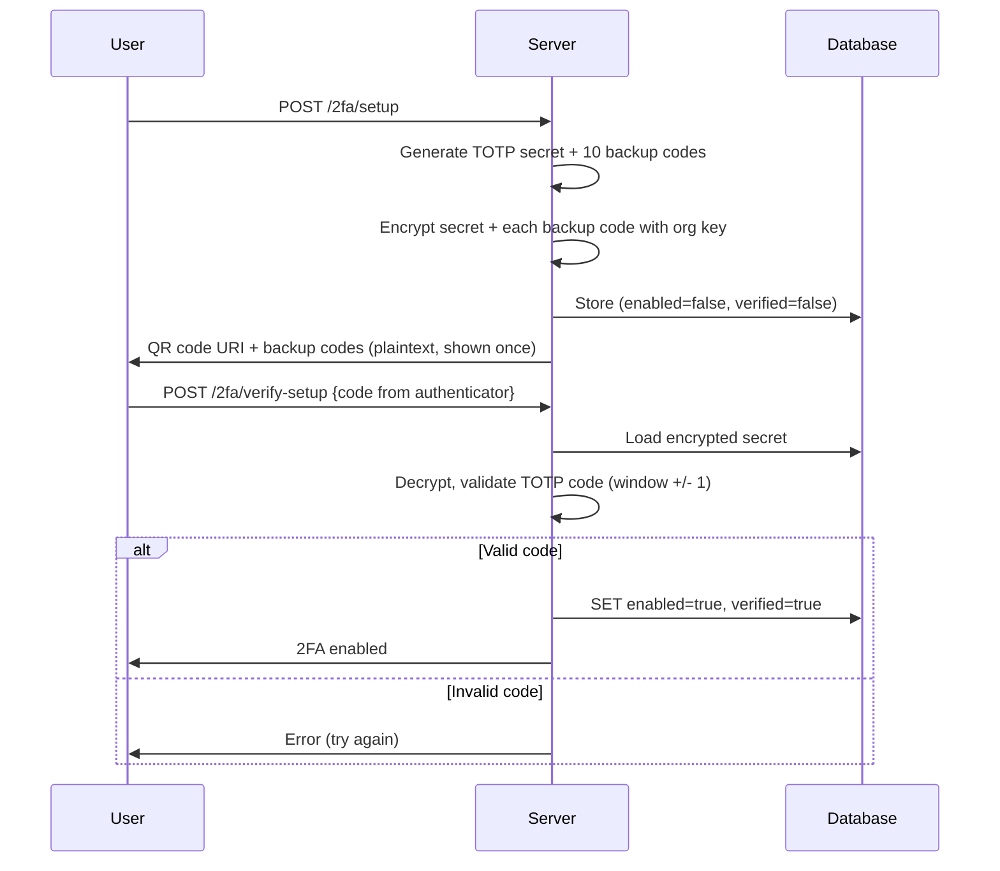
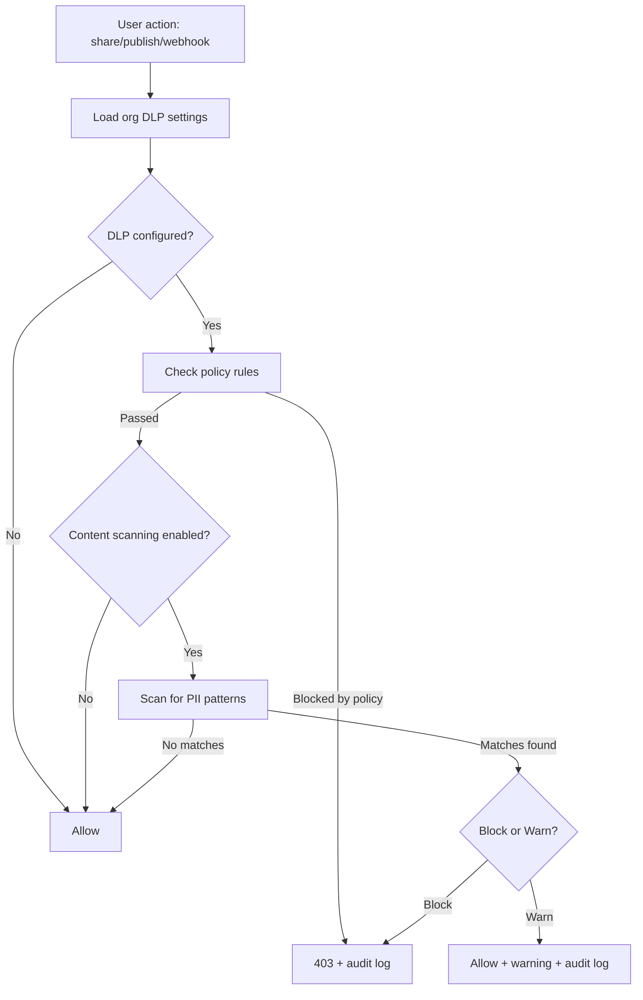

# Chapter 5: Defense in Depth

Chapter 4 answered the question "who are you?" It walked through LDAP binds, OIDC redirects, local password hashes, and JWT sessions. By the end, the system knows your identity with reasonable confidence.

This chapter answers the next two questions: *what are you allowed to do*, and *how do we stop you from doing things you shouldn't*?

The answer is not one mechanism. It is seven independent layers, each designed to function even if the others fail. A CSRF token protects against forged requests even if the session is valid. Rate limiting constrains abuse even if authentication succeeds. DLP blocks data exfiltration even if the user has legitimate access. And the audit trail records everything, even the failures, even the blocks, even when nobody is watching.

This is defense in depth for a self-hosted system where you do not get to rely on a cloud provider's WAF, DDoS protection, or managed secrets service. Every layer is yours to understand, yours to configure, and yours to break.

---

## CSRF Protection: Stateless Tokens

Cross-site request forgery is one of those attacks that feels theoretical until you realize that every form submission, every AJAX call, every state-changing operation is vulnerable if you do not explicitly prevent it. The attack is simple: a malicious page submits a request to your application using the victim's browser, which helpfully attaches their session cookie.

Most frameworks solve this with server-side token storage. Generate a random token, store it in the user's session, embed it in the form, compare on submission. It works. It also requires session state on every request, which is a problem when you are running on Edge Runtime where traditional server sessions do not exist.

The approach here is different: **stateless CSRF tokens with HMAC verification**.

A token looks like this:

```
{64-char-random-hex}.{unix-timestamp}.{hmac-sha256-signature}
```

Three parts, dot-separated. The first is 32 random bytes (hex-encoded). The second is the current timestamp. The third is an HMAC-SHA256 signature over the first two parts, keyed with a server-side secret.

```
function generateCSRFToken():
    random = 32 random bytes as hex
    timestamp = current time in milliseconds
    payload = random + "." + timestamp
    signature = HMAC-SHA256(payload, CSRF_SECRET)
    return payload + "." + signature

function validateCSRFToken(token):
    split token into [random, timestamp, signature]
    recompute = HMAC-SHA256(random + "." + timestamp, CSRF_SECRET)
    if recompute != signature: return false
    if (now - timestamp) > 24 hours: return false
    return true
```

The elegance here is that no server state is required. The token is self-validating. You can verify it on any server instance, in any Edge Runtime worker, without a database lookup or session store. The HMAC proves the token was issued by your server (only you know the secret), and the timestamp proves it is recent.

Two details matter:

**Web Crypto API, not Node.js crypto.** The implementation uses `crypto.subtle.importKey` and `crypto.subtle.sign` rather than Node's `crypto.createHmac`. This is not a style preference. Edge Runtime does not support the Node.js `crypto` module. Web Crypto API works everywhere: Edge functions, traditional Node.js servers, Cloudflare Workers.

**Safe method bypass.** GET, HEAD, and OPTIONS requests skip validation entirely. These methods should be idempotent and side-effect-free. If your GET endpoints modify state, CSRF protection will not save you from your own architectural mistake.

The client retrieves the token from a cookie and sends it back as an `X-CSRF-Token` header. The cookie is set by a dedicated endpoint; the header is attached by a client-side helper. The double-submit pattern: the attacker can trigger the browser to send the cookie, but cannot read it (due to SameSite/HttpOnly) to set the header.

There are two enforcement modes. Hard enforcement (`withCSRFProtection`) returns 403 immediately. Soft enforcement (`withCSRFWarning`) logs but allows the request through, which is useful during gradual rollout when you do not want to break existing clients.

---

## Rate Limiting: The Fail-Open Philosophy

Rate limiting is not about preventing determined attackers. A motivated adversary will rotate IPs, distribute requests, and bypass any application-level rate limiter. Rate limiting is about preventing accidental abuse, runaway scripts, and the kind of thoughtless hammering that takes down a database.

### Three Backends, One Interface

The system has two rate limiting implementations that share the same design principle: try the best available backend, and if it fails, let the request through.

The simpler implementation uses PostgreSQL directly. It stores each request as a row with an identifier, endpoint, and timestamp, counts requests within the time window, and returns an allow/deny decision. The enhanced implementation adds an Upstash Redis backend (sorted sets with sliding windows) and falls back to an in-memory `Map` when Redis is unavailable or when running in development.

The cascade looks like this:



Per-action configuration controls the window and threshold:

| Action | Window | Max Requests |
|--------|--------|--------------|
| Login | 5 minutes | 5 |
| Note creation | 1 minute | 10 |
| Search | 1 minute | 30 |
| AI summarization | 1 minute | 5 |
| General API | 1 minute | 60 |

Each response carries standard rate limit headers: `X-RateLimit-Limit`, `X-RateLimit-Remaining`, `X-RateLimit-Reset`, and `Retry-After` when the limit is exceeded.

### The Controversial Decision

Every `catch` block in the rate limiter returns `{ success: true }`. If the database is down, the request is allowed. If Redis throws, the request is allowed. If the in-memory store somehow fails, the request is allowed.

This is fail-open, and it is a deliberate choice.

The argument for fail-closed is obvious: if you cannot verify the rate limit, assume the worst. Block the request. This is the correct approach for banking, healthcare, or any system where unauthorized access has severe consequences.

The argument for fail-open in this context is practical: this is a collaboration tool. The worst thing that happens if rate limiting is briefly disabled is that someone creates too many notes or fires too many searches. The worst thing that happens if rate limiting fails closed is that a database hiccup locks every user out of their own workspace. For a self-hosted deployment where the admin is also the user, getting locked out of your own system because PostgreSQL restarted is unacceptable.

There is a real cost to this decision. A sustained infrastructure failure combined with an attack would leave the system unprotected. The mitigation is that rate limiting is one layer, not the only layer. Account lockout, CSRF protection, and authentication still function independently.

If you are adapting this pattern for a system where the threat model is different, fail-closed is probably the right call. Know your users and know your adversaries.

### Auth Caching Under Pressure

Rate limiting creates a subtle secondary problem: authentication itself can get rate-limited. When twenty API calls fire in quick succession (a dashboard loading multiple panels), each one needs to verify the session. If session verification hits a rate-limited endpoint, the user sees twenty 429 errors instead of their dashboard.

The solution is a two-tier auth cache. A fresh cache (30-second TTL) serves most requests without any backend call. A stale cache (5-minute TTL) kicks in when the fresh cache expires *and* the auth backend returns a rate limit error. The user sees their data with slightly stale authentication rather than seeing an error wall.

This is another fail-open decision. A stale auth cache means that a user who was deactivated 4 minutes ago might still have access for up to 5 minutes. For a collaboration tool, this is an acceptable tradeoff. For a system controlling physical access or financial transactions, it would not be.

---

## Account Lockout

Rate limiting constrains the velocity of requests. Account lockout constrains the consequences of failed authentication. They operate at different levels: rate limiting is per-endpoint, per-user-or-IP, and measured in requests per minute. Account lockout is per-email, per-organization, and measured in failed attempts.

The implementation is straightforward but the details matter.

Each organization configures its own thresholds: `max_failed_attempts` (default 5) and `lockout_duration_minutes` (default 15). When a login fails, the system looks up the user's organization membership to find the applicable policy, increments the failure counter, and locks the account if the threshold is reached.

```
function recordLoginAttempt(email, success, ip):
    lookup user's org -> get maxAttempts, lockoutMinutes

    if success:
        DELETE FROM account_lockouts WHERE email = ?
        return

    existing = SELECT FROM account_lockouts WHERE email = ?

    if existing AND existing.locked_until has expired:
        newAttempts = 1   // Reset counter after expired lockout
    else:
        newAttempts = existing.failed_attempts + 1

    if newAttempts >= maxAttempts:
        lockedUntil = now + lockoutMinutes

    UPSERT account_lockouts SET
        failed_attempts = newAttempts,
        locked_until = lockedUntil,
        ip_address = ip
```

Three design choices stand out:

**Counter reset after expiry.** When a lockout expires, the next failed attempt starts the counter from 1, not from where it left off. This prevents a situation where a user who was locked out, waited, and then mistyped their password once gets immediately locked out again.

**Direct database calls.** The lockout check and recording functions call the database directly via `db.query()`, not through internal HTTP fetch. Chapter 4 explained why: self-referential HTTPS fetch calls fail under Node.js v24's strict TLS. But there is a second reason that matters here: if lockout checking called the signin API, and the signin API called the lockout API, you would have a circular dependency that is invisible until production.

**No self-service unlock.** Users cannot unlock their own accounts. Only an admin can clear a lockout via a dedicated admin endpoint. This is a deliberate friction: if an attacker is brute-forcing a password, the last thing you want is an unlock mechanism that the attacker can also trigger.

---

## Two-Factor Authentication

2FA is where the system transitions from "do you know the password?" to "do you possess a specific device?" The implementation covers TOTP (time-based one-time passwords), backup codes, and organizational enforcement. No SMS. SMS-based 2FA is trivially defeated by SIM swapping, and for a self-hosted system where you control the infrastructure, TOTP is strictly superior.

### Setup Flow

When a user enables 2FA, the system generates a 160-bit secret, creates a TOTP configuration (SHA1, 6 digits, 30-second period), and produces 10 backup codes. The secret and backup codes are encrypted with the organization's derived key before storage. The user scans a QR code and enters a verification code to prove they have configured their authenticator app correctly. Only then is 2FA enabled.



### Verification During Sign-In

When a user with 2FA enabled signs in, the password check succeeds but the system does not issue a session. Instead, it creates a **verification session**: a temporary token with a 5-minute expiry and a maximum of 5 attempts. The client receives this token and must present it along with a valid TOTP code (or backup code) to complete authentication.

The verification session is stored as a SHA-256 hash of the token. The server never stores the plaintext token. If someone compromises the database, they get hashes, not tokens.

The 5-minute window is tight by design. If you cannot find your phone and open your authenticator app in 5 minutes, something is wrong. The 5-attempt limit prevents brute-forcing the 6-digit code space (1 million possibilities) through the verification endpoint.

### Backup Codes

Ten codes, each 8 hex characters formatted as `XXXX-XXXX`. Each code is individually encrypted with the organization's key and stored as an array of ciphertexts. When a backup code is used, its SHA-256 hash is appended to a `backup_codes_used` array. Verification checks the hash against all encrypted codes that have not been used.

Why hash-then-compare rather than decrypt-and-compare? Because the hash of the input can be computed once and checked against the used-codes list *before* attempting the expensive decrypt-and-hash of each stored code. If the code was already used, the function short-circuits.

### Organizational Enforcement

An organization can require 2FA for all members or only for admins. When enforcement is enabled, users who have not set up 2FA get a 24-hour grace period with a temporary session. They can access the application, but they see a persistent prompt to complete 2FA setup. After 24 hours, they are locked out until setup is complete.

The grace period exists because hard-blocking users the instant an admin flips a switch is a recipe for support tickets and frustrated employees. Twenty-four hours is enough time to download an authenticator app during a normal workday.

---

## Encryption: Organization-Specific Key Derivation

Every encryption discussion starts with key management, because the algorithm does not matter if the keys are mishandled.

The system uses a single master key stored in an environment variable. Per-organization keys are derived from this master key using PBKDF2 with 100,000 iterations and a salt of `org:{orgId}`. This means Organization A and Organization B share a master key but have completely different derived keys. Compromising one organization's data requires knowing the master key, not just the derived key for that tenant.

```
function deriveOrgKey(orgId):
    masterKey = env.ENCRYPTION_MASTER_KEY
    salt = "org:" + orgId
    return PBKDF2(masterKey, salt, iterations=100000, hash=SHA-256)
           -> AES-256-GCM key
```

Encryption is AES-256-GCM. A random 12-byte IV is generated for every encryption operation and prepended to the ciphertext. The output is base64-encoded for storage in text columns. GCM provides authenticated encryption: it detects tampering, not just decryption failure.

The system encrypts four categories of data:

| Data | Why |
|------|-----|
| TOTP secrets | Compromise of the database should not yield 2FA bypass |
| Backup codes | Same reason, individually encrypted |
| SSO client secrets | OIDC client secrets are high-value targets |
| File attachments | Optional per-org; some orgs need at-rest encryption for compliance |

File encryption is opt-in per organization. When enabled, files are encrypted through `encryptFileForOrg` before storage and decrypted on-the-fly through a proxy endpoint when served. This has a measurable performance cost (every file download requires decryption), which is why it is not enabled by default.

**What this is not.** This is not a key management service. There is no key rotation mechanism, no hardware security module, no envelope encryption. The master key is in an environment variable on the application server. If someone gains root access to that server, they have the master key. For a self-hosted deployment on your own network, behind your own firewall, this is a reasonable tradeoff. For a SaaS deployment serving multiple independent customers, you would want a proper KMS.

---

## Data Loss Prevention

DLP in an enterprise collaboration tool is about one thing: preventing well-meaning users from accidentally sharing sensitive information with people who should not have it. This is not an anti-malware system. It is a policy enforcement layer.

### Content Scanning

The scanner checks text against a set of built-in patterns:

| Pattern | What It Catches |
|---------|-----------------|
| SSN | `XXX-XX-XXXX` format |
| Credit card | Visa, Mastercard, Amex, Discover (13-19 digits) |
| Phone number | US format with optional country code |
| API key / secret | Strings prefixed with `sk_`, `pk_`, `api_`, `token_`, `secret_` followed by 20+ alphanumeric characters |
| IP address | IPv4 dotted quad |

Organizations can add custom regex patterns. The scanner returns match counts per pattern, not the matched values themselves. The system tells the admin "3 credit card numbers detected," not what those numbers are.

### Policy Enforcement

DLP policies are stored in the organization's settings JSONB and cover six enforcement points:

- Block community note sharing
- Block public pads
- Block external webhooks (with optional domain whitelist)
- Block iCal feed generation
- Block external video invitations (with optional domain whitelist)
- Require sensitivity classification before sharing

The entire DLP system is **opt-in**. If an organization has no DLP settings configured, every action is allowed. This is the right default for a collaboration tool: you do not want to ship a product where admins have to configure a policy just to let users share notes.

When content scanning is enabled, the organization chooses between two modes: **block** (hard stop, 403 response) or **warn** (log the event, allow the action, surface a warning to the user). Most organizations start with warn mode to understand what their users are actually sharing before they start blocking.



Every block and every warning generates an audit event. The DLP system is useless without visibility into what it is catching.

---

## The Audit Trail

Every security layer described in this chapter generates events. Login attempts (successful and failed), SSO redirects, lockout triggers, DLP blocks, 2FA verifications, settings changes, member additions and removals. The audit trail is where all of these events converge.

### Design: Fire and Forget

The audit logger has one absolute rule: it must never disrupt the operation it is recording. If writing an audit event to the database fails, the original request still succeeds. The entire logging function is wrapped in a try/catch that silently swallows errors.

```
async function logAuditEvent(params):
    try:
        // UUID validation: non-UUID resourceIds go to metadata JSONB
        if params.resourceId is not valid UUID:
            metadata.resourceIdString = params.resourceId
            resourceId = null

        // INET validation: empty/unknown IPs become null
        ipAddress = params.ipAddress if valid else null

        INSERT INTO audit_trail (
            user_id, action, resource_type, resource_id,
            old_values, new_values, ip_address, user_agent, metadata
        ) VALUES (...)
    catch:
        console.error("Failed to log event:", params.action)
        // Never rethrow. Never disrupt.
```

This is pragmatic but it has a real blind spot: **if audit logging fails, nobody knows**. There is no alert, no secondary log, no dead-letter queue. The `console.error` goes to stdout, which may or may not be captured by your process manager. If your PostgreSQL connection pool is exhausted and audit logging silently fails for an hour, you have a gap in your audit trail and no way to know about it until someone runs a report.

For a system that needs audit completeness for compliance (SOC 2, HIPAA), this is insufficient. You would need a write-ahead log or a message queue that guarantees delivery. For a self-hosted internal tool, the tradeoff is acceptable because the alternative (crashing the application when audit logging fails) is worse.

### Event Taxonomy

Events follow a `category.action` naming convention. The system defines over 50 event types across six categories:

| Category | Examples |
|----------|----------|
| Authentication | `user.login`, `user.login_failed`, `user.password_changed` |
| SSO | `sso.login`, `sso.login_failed`, `sso.provider_created` |
| Organization | `org.member_added`, `org.member_role_changed`, `org.settings_updated` |
| Admin | `admin.lockout_cleared`, `admin.user_searched` |
| DLP | `dlp.share_blocked`, `dlp.sensitive_data_detected`, `dlp.policy_updated` |
| Legal | `legal_hold.created`, `legal_hold.released`, `ediscovery.export` |

Each event captures the actor (user ID), the target (resource type and ID), the change (old values and new values as JSONB), the context (IP address, user agent), and arbitrary metadata.

### The UUID Problem

The `resource_id` column in the audit trail is typed as UUID. This seems reasonable until you realize that not every resource in the system has a UUID identifier. Email addresses, domain names, and session identifiers are all valid things you might want to audit, and none of them are UUIDs.

The solution is validation at the logging layer: if the resource ID matches UUID format, it goes in the `resource_id` column. If not, it goes into the `metadata` JSONB under the key `resourceIdString`. This avoids PostgreSQL cast errors while keeping the data queryable. It is not elegant, but it is the kind of practical compromise that keeps a system running without schema migrations every time you add a new auditable entity.

### Querying and Retention

Audit queries are org-scoped with filters for date range, action type, user, and free-text search across metadata. Retention is configurable per organization (default 90 days) with a cleanup job that deletes expired records.

The 90-day default is a deliberate choice. For compliance-regulated organizations, this is too short. For a small team's internal tool, 90 days of history is more than enough. The configurability exists because the right answer depends on who you are.

---

## The Stack in Full

These seven layers operate independently. No single layer provides complete protection. Together, they make the system significantly harder to abuse.

| Layer | Prevents | Fails... |
|-------|----------|----------|
| CSRF tokens | Forged cross-site requests | Closed (rejects request) |
| Rate limiting | Request flooding, brute force velocity | Open (allows request) |
| Account lockout | Password guessing | Closed (locks account) |
| 2FA | Credential theft without device | Closed (blocks login) |
| Encryption | Data exposure from database breach | Hard (throws error) |
| DLP | Accidental data exfiltration | Open (allows if unconfigured) |
| Audit trail | Invisible security incidents | Silent (swallows errors) |

The "Fails..." column is the most important one. It tells you what happens when each layer has a problem. Rate limiting and DLP fail open because blocking legitimate users is worse than briefly allowing extra traffic. CSRF and lockout fail closed because the risk of allowing forged requests or password guessing outweighs the inconvenience. Encryption fails hard because serving corrupted or unencrypted data when encryption was expected is a data breach. The audit trail fails silently because it is a record of what happened, not a gatekeeper for what is allowed to happen.

---

## Apply This

**1. Stateless tokens beat server-side session storage for CSRF.** If you are running on Edge Runtime, serverless functions, or multiple instances without shared state, HMAC-signed tokens eliminate an entire category of infrastructure complexity. The only requirement is a shared secret across instances.

**2. Fail-open is a valid strategy when availability matters more than restriction.** Not every system is a bank. If your users losing access to their own data is a worse outcome than a brief spike in unthrottled traffic, fail-open rate limiting is defensible. Document the decision and ensure other layers compensate.

**3. Encrypt per-tenant, not globally.** A single encryption key for all tenants means one compromise exposes everyone. Per-organization key derivation using PBKDF2 with the org ID as salt is cheap to implement and provides meaningful isolation. The master key is still a single point of failure, but the blast radius of a derived key compromise is limited to one tenant.

**4. DLP should be opt-in with warn-before-block.** Organizations that have never thought about data loss prevention will not configure it correctly on day one. Start with everything allowed, let admins enable scanning in warn mode to see what is happening, then switch to block mode once they understand their data flows.

**5. Audit logging that can crash the application is worse than audit logging that can silently fail.** The perfect is the enemy of the deployed. Ship fire-and-forget audit logging, then add reliability (message queues, write-ahead logs, alerting on logging failures) when compliance requirements demand it. But know the blind spot exists.

---

Chapter 6 moves from individual users to the structures that contain them. Organizations are the unit of tenancy, policy enforcement, and data isolation. Every security mechanism described in this chapter -- encryption keys, DLP policies, lockout thresholds, 2FA enforcement, audit retention -- is scoped to an organization. The next chapter explains how that scoping works.
