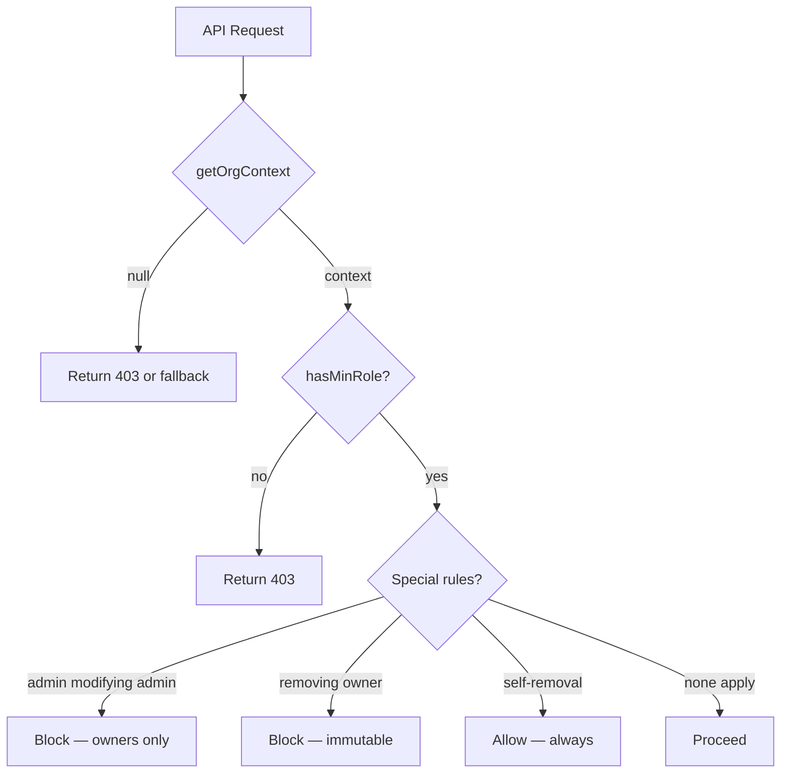
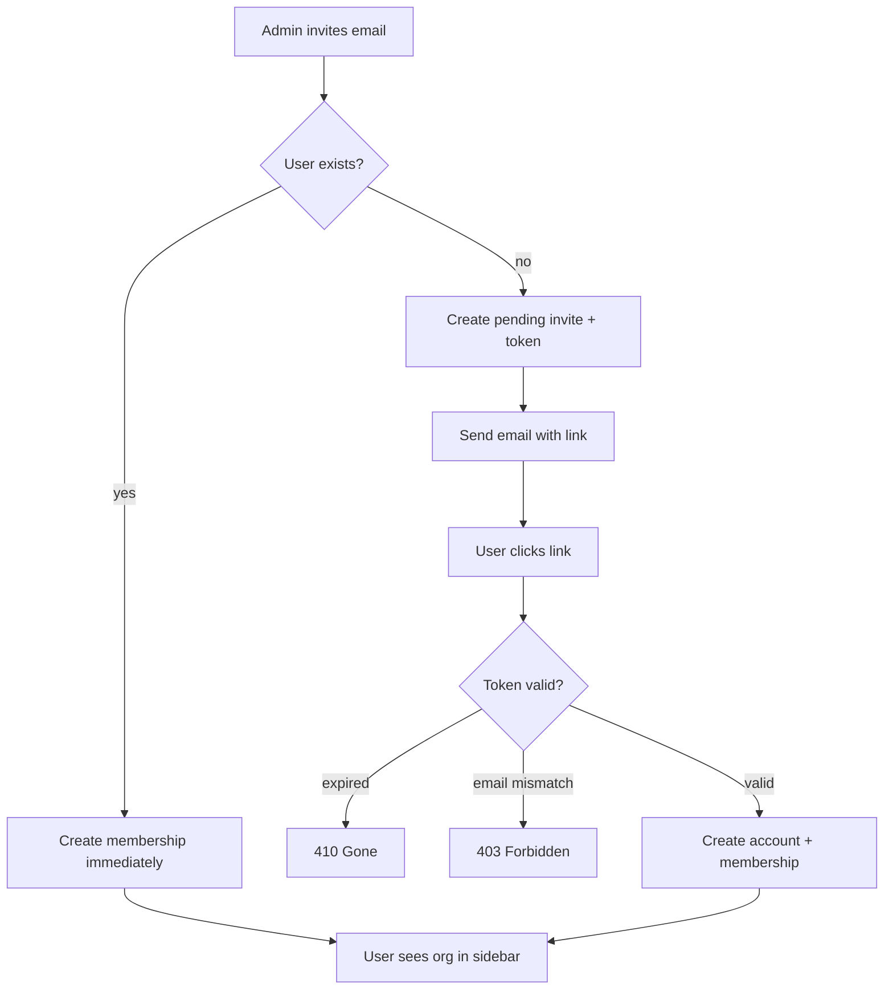
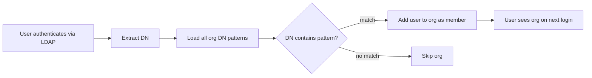

# Chapter 6: Organizations and Multi-Tenancy

---

*Part II: Identity and Access*

---

You have authenticated the user. Chapter 4 proved their identity — password, LDAP bind, OIDC redirect. Chapter 5 wrapped that identity in layers of protection — rate limiting, account lockout, CSRF tokens, audit trails. The system now knows *who* is making the request and has reasonable confidence they are who they claim to be.

But knowing who someone is answers only half the question. The other half: *what can they see?*

Every query in Stick My Note is scoped to an organization. Every note, every file, every AI session, every video call — all of it belongs to an org. The organization is not a convenience feature bolted on after launch. It is the security boundary. Get it wrong, and User A reads User B's private notes. Get it right, and you have multi-tenancy that a self-hosted team actually controls — no vendor dashboard, no support ticket, no pricing tier unlocking "workspace isolation."

This chapter covers how organizations work: the data model, the role hierarchy, the invitation system that quietly wires users into the right orgs without friction, and the Active Directory integration that lets your existing directory structure drive it all.

---

## The Organization Model

An organization in Stick My Note is one of three types: **personal**, **team**, or **enterprise**. The distinction matters more than it might seem.

Every user gets a personal organization on signup. It cannot be deleted. It cannot have other members. It exists so that a user always has *somewhere* to work, even if they have not been invited to any team. This is the zero-configuration baseline — sign up, start writing notes. No onboarding wizard asking you to "create your first workspace."

Team and enterprise organizations are created explicitly. They have members, roles, invitations, settings. The difference between team and enterprise is mostly about which settings panels appear — enterprise orgs expose compliance controls, DLP configuration, encryption policies. The database does not enforce this distinction at the schema level. It is a single `type` column, and the UI gates features based on its value.

Every organization gets a **slug** — a URL-safe identifier derived from the name. The generation is straightforward: sanitize the name, append a random suffix for uniqueness. The slug appears in URLs and API paths, so it must be stable. Once created, it rarely changes.

```
// Pseudocode — illustrates the pattern
function generateSlug(name):
    base = name.toLowerCase()
                .replace(non-alphanumeric, "-")
                .replace(multiple-dashes, "-")
                .trim("-")
    suffix = randomHex(4)          // 8 characters
    return base + "-" + suffix     // "acme-corp-a3f7b2c1"
```

The random suffix is the pragmatic choice. You could check for uniqueness and retry, but a 4-byte hex suffix gives you 4 billion combinations per base slug. Collisions are not a real problem.

### Settings as JSONB

Organization settings live in a single JSONB column. Not a settings table. Not a key-value store. One column, one JSON object, on the organization row itself.

This is a deliberate trade-off. A normalized settings table gives you better queryability — "find all orgs with AI sessions enabled" is a clean indexed lookup. JSONB gives you something more valuable in practice: **zero-migration feature addition**. When you add a new setting — say, a grace period for 2FA enforcement — you do not write a migration. You do not add a column. You read the key from the JSON, and if it is absent, you use a default.

The merge pattern matters:

```sql
-- Pseudocode — illustrates the merge pattern
UPDATE organizations
SET settings = COALESCE(settings, '{}'::jsonb)
             || jsonb_build_object('ai_session_limit', 50,
                                    'lockout_threshold', 5)
WHERE id = $1
```

`COALESCE` handles the case where `settings` is NULL (org created before the settings column existed). The `||` operator merges — it overwrites only the keys you specify, leaving everything else untouched. If an org has branding settings and you update their AI limit, the branding survives. This is not obvious if you are used to ORMs that serialize and deserialize the whole object. The merge happens in PostgreSQL, atomically, without a read-modify-write cycle.

The settings object carries a surprising amount of policy: AI session limits, account lockout thresholds, preregistration requirements, branding (colors, logos), compliance flags, DLP rules, encryption preferences. Each of these could justify its own table. Keeping them in JSONB means the settings UI can evolve faster than the schema — a trade-off that favors development velocity over query optimization.

---

## Role Hierarchy

Four roles, with numeric ranking:

| Role | Rank | Can Do |
|------|------|--------|
| viewer | 0 | Read content |
| member | 1 | Read and write content |
| admin | 2 | Manage members, configure settings |
| owner | 3 | Everything, including destroying the org |

The numeric ranking enables a simple permission check:

```
// Pseudocode — illustrates the pattern
ROLE_RANK = { viewer: 0, member: 1, admin: 2, owner: 3 }

function hasMinRole(userRole, requiredRole):
    return ROLE_RANK[userRole] >= ROLE_RANK[requiredRole]
```

This replaces a sprawl of `if role === 'admin' || role === 'owner'` checks throughout the codebase. One function, one comparison. Every API route that needs "admin or above" calls `hasMinRole(role, 'admin')`.

But numeric ranking alone does not capture the full permission model. Three rules add nuance:

1. **Admins cannot modify other admins.** Only owners can promote someone to admin or remove an existing admin. This prevents lateral privilege escalation — two admins cannot collude to lock out the owner by demoting each other and re-promoting.

2. **Owners are immutable.** An owner cannot be demoted or removed by anyone, including other owners. Ownership transfer is a separate, explicit operation. This is the "break glass" protection — there is always someone who can recover the org.

3. **Self-removal is always allowed.** Any member can leave any organization, regardless of role. The system will not trap you. If you are the last owner, the org becomes ownerless — a deliberate choice. The alternative (preventing the last owner from leaving) creates a worse problem: an owner who wants out but cannot leave.



### The getOrgContext Pattern

Every organization-scoped API route starts the same way:

```
// Pseudocode — illustrates the pattern
function getOrgContext(request):
    session   = getSession(request)
    orgSlug   = extractOrgSlug(request.url)
    
    membership = query(
        "SELECT role FROM org_members
         WHERE user_id = $1
         AND org_id = (SELECT id FROM organizations WHERE slug = $2)",
        [session.userId, orgSlug]
    )
    
    if not membership:
        return null          // not a member — caller decides response
    
    return {
        userId: session.userId,
        orgId: membership.orgId,
        role: membership.role,
        isPersonalOrg: membership.orgType === "personal"
    }
```

Returning `null` instead of throwing a 401 is a deliberate design choice. Some routes need to distinguish "not a member" from "not authenticated." A pad shared with a public link might be readable by non-members. A settings page is not. The caller decides.

This function runs on every request. It is not cached. It is not memoized across the request lifecycle. Every API route pays the cost of one membership query. The alternative — caching the role in the session token — means role changes (promotion, demotion, removal) do not take effect until the session refreshes. For a collaboration tool where an admin might revoke access and expect it to be immediate, stale role data is worse than an extra query.

---

## The Personal Org Fallback

Here is where the model gets interesting — and a little uncomfortable.

Stick My Note was not always an organization-based system. Early users existed without organizations. When the multi-tenancy model was introduced, a decision was made: do not force-migrate existing users. Instead, create a fallback.

If `getOrgContext` cannot find a real organization membership for the user, it synthesizes one. The user's own ID becomes the org ID. Their role is "owner." The org type is "personal." This pseudo-org is not in the database. It is a runtime construct.

This means the system has two kinds of users coexisting: those with real organization memberships (stored in `org_members`, queryable, auditable) and those operating in a pseudo-org (invisible to admin dashboards, not in any table). The inconsistency is tolerated because the alternative — a blocking migration that forces every legacy user to "create an organization" before they can use the app — would be worse. Users who were happily taking notes would hit a wall.

The trade-off is real. You cannot query "how many active organizations exist" and get an accurate number, because some users are working in phantom orgs. You cannot audit pseudo-org activity the same way you audit real org activity. But the system works, legacy users are not disrupted, and new users get proper orgs from day one.

This is a pattern worth naming: **the compatibility shim that becomes permanent infrastructure.** Every codebase has them. The honest thing is to document them rather than pretend they do not exist.

---

## The Invitation System

Three types of invitations, each solving a different problem.

### Organization Invites

An admin invites an email address. Two paths diverge:

**Path A — User exists.** The system finds an account with that email, creates an `org_members` row immediately, and notifies them. No token, no acceptance step. They are in.

**Path B — User does not exist.** The system creates a pending invitation record with a cryptographic token. The invitee receives an email with a link to `/invites/accept-by-token`. When they click it, the system verifies: the token is valid, the email matches (case-insensitive), the invitation has not expired. If the token has expired, the response is `410 Gone` — not `404`, not `403`. Gone. The resource existed and no longer does. HTTP semantics matter.



### Pad Invites

Pads — the collaborative documents — have their own invitation system, separate from organization invites. This is not redundant; it is necessary. Organization roles and pad roles use different vocabularies:

| Org Role | Pad Role |
|----------|----------|
| admin | admin |
| member | edit |
| viewer | view |

An org "member" can write content. A pad "member" does not exist — the equivalent is "edit." This mapping happens at the API boundary. The database stores pad-specific roles. The UI translates. It is a small inconsistency that reflects a real difference: org-level access and document-level access are genuinely different permission models that happen to use similar words.

### Global Invites

The simplest type. A platform administrator sends an email inviting someone to the platform itself — not to any specific org or pad. No tracking, no token, no pending record. Just an email. The user signs up through the normal flow. This exists for the "tell your colleague about the tool" use case.

### Auto-Processing: The Invisible Accept

This is the most interesting part of the invitation system, and it deserves scrutiny.

When a user logs in, the system calls an **invite processing endpoint**. This endpoint queries for all pending invitations matching the user's email — both org invites and pad invites — and processes them automatically. The user is added to every organization and pad that was waiting for them. No confirmation dialog. No "you have 3 pending invitations" banner. It just happens.

The result: an admin invites `alice@company.com` to the engineering org. Alice does not have an account yet. A week later, Alice signs up and logs in. She immediately sees the engineering org in her sidebar. She never clicked "accept." She may not even know she was invited.

This is elegant from a friction standpoint. Zero-click onboarding. But it is surprising from a consent standpoint. Alice might not want to be in the engineering org. She might have signed up for personal use and does not expect her employer's workspace to appear. The system assumes that an invitation implies desired membership — a reasonable assumption for an internal enterprise tool, a less reasonable one for a platform that might host both personal and professional use.

The trade-off is explicit: minimize onboarding friction at the cost of user surprise. For a self-hosted deployment where the admin controls who gets invited, this is defensible. For a public SaaS, you would want that confirmation step.

---

## Active Directory Group Integration

This is where self-hosted multi-tenancy earns its keep. In a SaaS product, organization membership is managed through the product's UI. In an enterprise deployment, it should be managed through the enterprise's existing directory.

Stick My Note bridges this gap with DN pattern matching. Each organization can store an array of Distinguished Name patterns:

```json
["OU=Engineering,DC=company,DC=com",
 "OU=DevOps,OU=Engineering,DC=company,DC=com"]
```

When a user authenticates via LDAP, the system extracts their DN and checks it against every organization's patterns. The matching is deliberately loose — a case-insensitive substring check:

```
// Pseudocode — illustrates the pattern
function matchDNToOrgs(userDN, allOrgs):
    matches = []
    for org in allOrgs:
        for pattern in org.dn_patterns:
            if userDN.toLowerCase().includes(pattern.toLowerCase()):
                matches.push(org)
                break
    return matches
```



Substring matching rather than exact matching is the pragmatic choice. Active Directory DNs have nested OUs — `CN=Alice,OU=Backend,OU=Engineering,DC=company,DC=com`. If an org's pattern is `OU=Engineering,DC=company,DC=com`, the substring check catches Alice even though she is in a sub-OU. An exact match would miss her. You could parse the DN into components and do structural matching, but substring comparison handles the real-world cases and is trivially understandable.

The implication is powerful and worth stating explicitly: **your Active Directory structure drives your Stick My Note organization membership.** Move a user from `OU=Engineering` to `OU=Marketing` in AD, and the next time they log in, they are in the Marketing org. No admin action in Stick My Note required. The directory is the source of truth.

This extends to bulk operations. A sync function can pull all users from Active Directory and process them in batch — creating accounts for new hires, updating memberships for transfers, without touching the Stick My Note admin panel. The LDAP directory becomes the control plane; Stick My Note becomes the data plane.

The risk is obvious: a misconfigured DN pattern can grant access to the wrong org. If someone sets a pattern to `DC=company,DC=com` — matching the entire domain — every user in the company joins that org. The system does not warn about overly broad patterns. This is a trust-the-admin design, appropriate for self-hosted deployments where the admin understands their own directory structure.

---

## Settings Architecture

Settings exist at two levels: organization and user. The interaction between them creates the effective policy.

### Organization-Level Settings

These are the JSONB settings on the organization row. They govern:

- **AI session limits**: maximum sessions per user per day, maximum tokens per session. The org pays for compute; the org controls the budget.
- **Account lockout**: threshold (failed attempts before lock), duration (minutes locked), reset window. These override the system defaults from Chapter 5 — an org can be stricter than the platform but not more lenient.
- **Preregistration**: whether users must be pre-approved before joining. When enabled, the signup flow checks for an existing invitation before allowing account creation.
- **Branding**: colors, logos, custom text. Stored as JSONB keys, rendered by the frontend theme system.
- **Compliance**: audit log retention period, data export policies, legal hold flags.
- **DLP (Data Loss Prevention)**: content scanning rules, blocked patterns, file type restrictions.
- **Encryption**: at-rest encryption preferences, key rotation policy.

### User-Level Settings

Stored similarly as JSONB on the user record:

- **Profile**: display name, avatar, bio — the social layer.
- **Workspace preferences**: default view, sidebar state, hub mode toggle.
- **Timezone**: used for scheduling, notification timing, audit log display.

### 2FA Policy

Two-factor authentication policy deserves special mention because it shows how org-level and user-level settings interact.

The organization sets the policy:
- `require_2fa`: boolean. When true, all members must have 2FA enabled.
- `enforce_for_admins_only`: boolean. When true, only admin and owner roles must have 2FA.
- `allowed_methods`: array of acceptable 2FA methods (TOTP, WebAuthn, etc.).
- `grace_period_days`: how long a user has to set up 2FA after the policy is enabled.

In practice, `grace_period_days` is always 0 — immediate enforcement. The field exists in the schema but the UI does not expose a grace period selector. This is another case of the JSONB pattern enabling future features without migrations. The column supports grace periods. The product does not yet surface them. When it does, no schema change is needed.

### Subscription and Notification Preferences

Notifications are scoped per-entity and per-channel. A user can subscribe to a specific pad and choose to receive notifications via in-app alerts, email, or webhook — independently. The preference matrix is:

| Entity | In-App | Email | Webhook |
|--------|--------|-------|---------|
| Pad A  | yes    | no    | no      |
| Pad B  | yes    | yes   | no      |
| Org-wide | yes  | yes   | yes     |

This granularity is stored as — you guessed it — JSONB. The pattern repeats because it works: flexible, schema-free, queryable enough for the access patterns that matter (lookup by user ID), and cheap to extend.

---

## The Multi-Tenancy Boundary in Practice

Understanding the model is one thing. Understanding how it manifests in every query is another.

Every database query that touches user content includes an organization filter. Notes, pads, files, AI sessions, video rooms — all have an `org_id` column. There is no "SELECT * FROM notes WHERE user_id = ?" without an org constraint. The `getOrgContext` function at the top of every route ensures the org ID is available before any data access occurs.

This is not enforced by the database. There is no row-level security policy preventing cross-org reads. The enforcement is in the application layer — every query includes `AND org_id = $orgId`. This is a conscious choice. Row-level security in PostgreSQL is powerful but adds complexity to query planning, makes debugging harder, and creates subtle performance issues with certain join patterns. Application-layer enforcement is more visible, more testable, and easier to reason about when something goes wrong.

The risk is that a developer forgets the org filter. A code review catches it. An audit trail exposes it. But the database itself will not stop it. For a self-hosted tool with a small team, this is an acceptable trade-off. For a multi-tenant SaaS serving competing companies, you would want the belt and suspenders of RLS.

---

## Apply This

Five patterns from this chapter that transfer to any multi-tenant system:

**1. JSONB settings with merge semantics.** Store configuration as a JSON column and update with PostgreSQL's `||` operator. You get atomic partial updates, zero-migration feature flags, and a natural default-value pattern (missing key = use default). The cost is query complexity — filtering by a nested JSON key is slower than filtering by a column. If you never need "find all orgs where X setting is Y," the cost is zero.

**2. Numeric role ranking.** Map roles to integers and reduce permission checks to `>=`. This eliminates role-name string comparisons scattered across your codebase and makes it trivial to add new roles between existing ones (rank 1.5 if you must, or re-number). The special rules (admins cannot modify admins, owners are immutable) live in a single authorization function, not in every route.

**3. The compatibility shim.** When you add multi-tenancy to an existing system, you will have users who predate the model. Synthesize a default context for them rather than forcing migration. Document the shim. Accept that it will outlive your intention to "clean it up later." Design the rest of the system to tolerate both real and synthesized contexts.

**4. Auto-processing invitations.** For internal enterprise tools, eliminate the "accept invitation" step. Process pending invitations on login. The user lands in the right place without ceremony. Reserve the confirmation step for contexts where unsolicited membership is a concern — public platforms, cross-company collaboration, regulated environments.

**5. Directory-driven membership.** If your users are in Active Directory or LDAP, let the directory be the source of truth for organization membership. Pattern matching on Distinguished Names is crude but effective. The administrator manages one system (the directory), and the application follows. This is the self-hosted advantage — you own the directory, you own the integration, no vendor needs to "support" your IdP.

---

## What Comes Next

You now have the full identity and access stack. Users authenticate (Chapter 4), the system protects itself (Chapter 5), and organizations provide the multi-tenant boundary that scopes everything users do (this chapter).

Part II is complete. You know *who* the user is, *what* they can access, and *which organization* they are operating within.

Part III turns to what they are actually doing in that organization. Chapter 7 opens with the core data model — notes, sticks, and pads — the collaborative documents that are the reason the platform exists. The organization boundary you just built is about to get its first real workout: every note belongs to an org, every pad has its own permission layer on top of the org roles, and real-time collaboration means multiple users in the same org editing the same document simultaneously. The access model you understand now is the foundation. The collaboration model is what makes it interesting.
