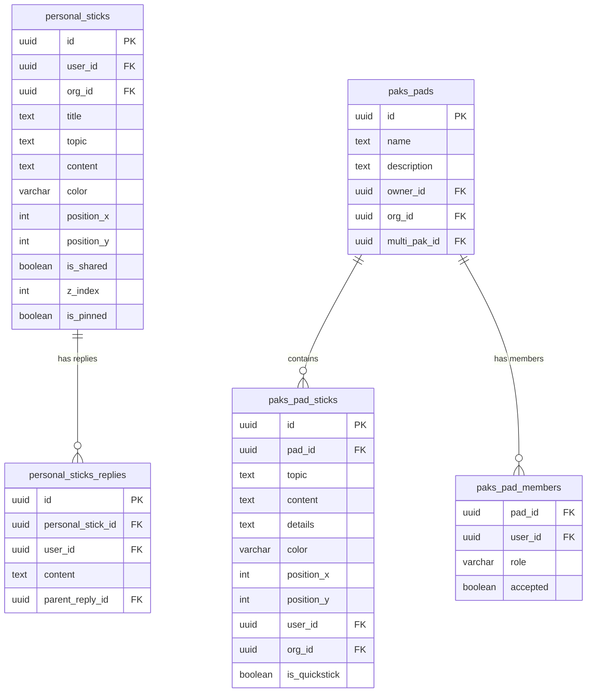
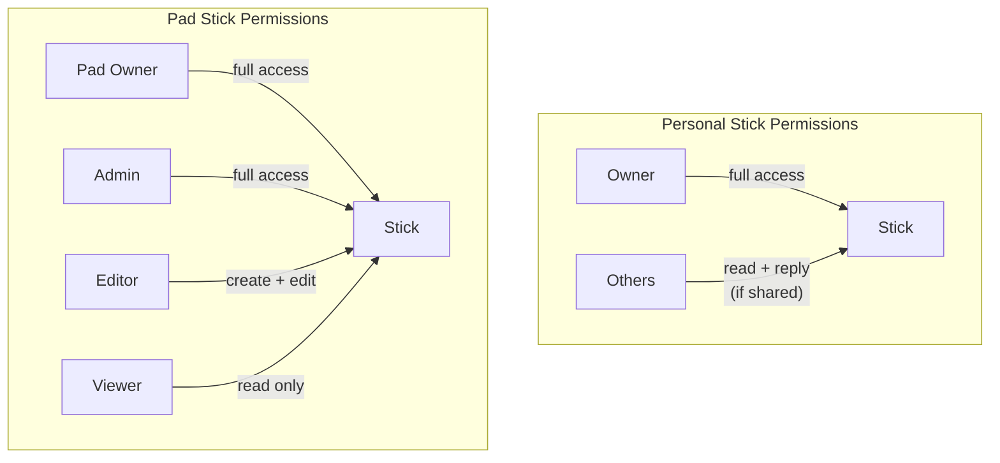
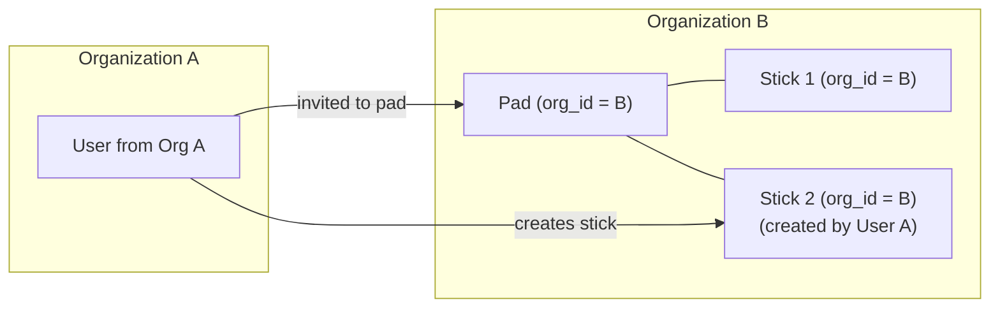
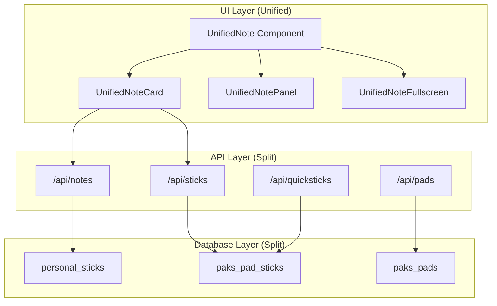
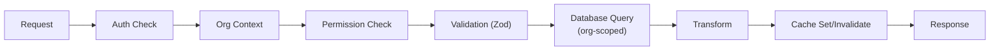

# Part III — The Domain Model

*"A note is not a stick is not a pad — and the distinction matters."*

Parts I and II built the stage: six servers, a database with dual access patterns, four caching layers, three authentication methods converging on a single session, and an organization model that scopes every query. The infrastructure knows who you are and which organization you belong to. Now we need to answer a harder question: what are you actually working with?

The answer is less tidy than you might expect. There is no unified "content" table. There is no polymorphic "document" entity with a type column. Instead, there are three distinct data structures — personal sticks, pad sticks, and pads — that evolved at different times, for different users, with different permission models. They look similar in the UI. Under the hood, they share almost nothing.

This chapter traces each entity, explains why they diverged, and confronts the cost of that divergence honestly. If you are building a multi-tenancy application with collaborative and personal content, the decision to unify or split your domain model is one you will make early and live with forever. Here is what living with the split actually looks like.

A word on terminology before we proceed. The codebase uses "note" and "stick" interchangeably for personal content. API routes use `/api/notes`; the database table is `personal_sticks`; the UI component is `UnifiedNote`; the data library exports functions like `getNotes()` that query `personal_sticks`. This naming drift reflects the product's evolution from "Stick My Note" (sticks are the metaphor) to a broader collaboration platform (notes are the general term). In this chapter, "personal stick" refers to the database entity, "pad stick" refers to collaborative content inside a pad, and "note" is used when discussing the concept without distinction.

---

# Chapter 7: Notes, Sticks, and Pads

## 7.1 Three Entities, Three Tables

The domain model has three core tables:

| Table | Purpose | Permission Model |
|-------|---------|-----------------|
| `personal_sticks` | Private notes with optional sharing | Binary: private or public |
| `paks_pad_sticks` | Collaborative sticks inside pads | Role-based: owner/admin/editor/viewer |
| `paks_pads` | Workspaces containing collaborative sticks | Owner + member roles |

The naming itself tells a story. "Personal sticks" came first — digital sticky notes, positioned on a canvas, owned by one person. "Pads" came later when the product needed team collaboration. "Pad sticks" are the sticks that live inside pads. The `paks_` prefix is a namespace artifact from when pads were part of a larger "Paks" feature module.

A fourth concept, QuickSticks, is not a separate table. It is a boolean flag (`is_quickstick`) on `paks_pad_sticks` that signals lightweight creation with minimal metadata. More on this in section 7.5.



Notice what is missing from pad sticks: there is no `is_shared` flag, no `z_index`, no `is_pinned`. And notice what is missing from personal sticks: there is no `pad_id`, no `details` field, no `is_quickstick`. These are not two views of the same data. They are two different things that happen to both have `topic`, `content`, and `color`.

The companion tables compound the split. Personal sticks have `personal_sticks_replies`, `personal_sticks_tabs`, `personal_sticks_tags`, and `personal_sticks_reactions`. Pad sticks have `paks_pad_stick_replies`, `paks_pad_stick_tabs`, and `paks_pad_stick_members`. Each set of companion tables has its own foreign key naming convention, its own query patterns, and its own transformation functions. The entity split is not just two tables — it is two table families.

## 7.2 Personal Sticks

A personal stick is a note that belongs to one person. Think of it literally: a sticky note on a wall. It has a color, a position on a two-dimensional canvas, and content. The owner can pin it, change its z-index to layer it above or below other sticks, and decide whether to share it.

### The Schema

The `personal_sticks` table carries both spatial and content data:

- **`position_x`, `position_y`**: Canvas coordinates. The UI renders sticks as draggable elements, and every drag operation writes new coordinates to the database.
- **`z_index`**: Layer ordering. When you click a stick, it moves to the front. This is a simple integer increment, not a fractional indexing system.
- **`is_pinned`**: Pinned sticks stay visible when scrolling or filtering. A UI convenience flag with no backend logic beyond storage and retrieval.
- **`is_shared`**: The sharing toggle. This single boolean is the entire permission model.
- **`title` and `topic`**: Both columns exist, both store the same value. More on this shortly.

### Binary Permissions

Personal sticks have the simplest permission model in the system: you either own it or you do not. If `is_shared` is false, only the owner can see it. If `is_shared` is true, any authenticated user in the same organization can read it and its replies.

There is no "editor" role. There is no "can comment but not edit" distinction. The owner has full control. Everyone else is either locked out entirely or has read access with the ability to reply.

```
// Permission check for personal sticks — the entire model
if (stick.user_id !== currentUser.id && !stick.is_shared) {
  return AccessDenied
}
```

This binary model works because personal sticks are personal. They are one person's thoughts. Collaboration happens through replies, not co-editing. There is no "share with specific users" option, no "share with a group" option. The choices are: keep it to yourself, or show it to everyone in the organization. This ruthless simplicity eliminates an entire class of permission bugs. You never need to ask "can this specific user see this specific note?" The answer is always derivable from two fields: `user_id` and `is_shared`.

### Replies and Threading

Replies live in `personal_sticks_replies`. Each reply has a `personal_stick_id` linking it to the parent stick and an optional `parent_reply_id` enabling threaded conversations. The threading is unbounded — there is no depth limit, though the UI typically renders two or three levels before the indentation becomes absurd.

Replies carry their own `color` field (defaulting to white, `#ffffff`), their own `user_id`, and their own `org_id`. The `org_id` on replies enables a subtle capability: when a shared stick receives replies from users in the same organization, the organization's compliance policies apply uniformly across the conversation.

### Shared Sticks as Community Notes

When `is_shared` is true, a personal stick becomes visible to all authenticated users in the organization through the community notes feed. This feed is a separate API endpoint that queries `personal_sticks` with `is_shared = true`, enriches the results with author information (display name, avatar), reply counts, and reaction data from a `personal_sticks_reactions` table.

The community feed adds social features that do not exist on private sticks: like counts, a "trending" heuristic (more than five likes or three replies), and tags pulled from a `personal_sticks_tags` table. These features layer on top of the base entity without modifying it. The `personal_sticks` table knows nothing about reactions or trending status — those are computed at query time from companion tables.

This is worth noting because it shows how the same row in `personal_sticks` serves two different contexts: as a private note in the owner's canvas view (with spatial positioning, z-index, and pinning) and as a social post in the community feed (with reactions, trending scores, and author metadata). The schema supports both because it stores the minimum — the social features live in separate tables and are only joined when the community feed is rendered.

The community feed endpoint uses a service-level database client (not the user's authenticated client) because it needs to read sticks owned by other users. The standard client scopes queries to the authenticated user; the service client has broader read access. This is the same service client pattern from Chapter 2, appearing here in its most natural context: reading across user boundaries within an organization.

The trending heuristic is intentionally simple: a stick is trending if it has more than five likes or more than three replies. There is no decay function, no time-weighting, no engagement velocity calculation. This simplicity is appropriate for an enterprise platform where "trending" means "people are discussing this," not "this is going viral." The heuristic will eventually need refinement, but the current version captures the intent without the complexity.

### The DLP Gate

When a user toggles `is_shared` from false to true, the system does not simply flip a boolean. It first runs a Data Loss Prevention check:

```
// Sharing triggers DLP before the database write
if (input.is_shared === true) {
  dlpResult = checkDLPPolicy({
    orgId:   orgContext.orgId,
    action:  "share_note",
    userId:  currentUser.id,
    content: stick.topic + " " + stick.content
  })
  if (!dlpResult.allowed) {
    return Forbidden(dlpResult.reason)
  }
}
```

The DLP checker loads the organization's `settings->'dlp'` JSONB from the `organizations` table. If the org has enabled `block_community_sharing`, all sharing is blocked. If content scanning is enabled, the checker runs regex patterns looking for PII — Social Security numbers, credit card patterns, email addresses — and either blocks or warns depending on the org's `scan_action` setting.

This is an opt-in model. Organizations with no DLP settings configured allow everything. The DLP check adds zero overhead for orgs that have not opted in, because `loadDLPSettings()` returns null immediately when no settings exist.

### The Legal Hold Gate

Deletion has its own gate. Before a personal stick can be deleted, the system checks whether the user is under legal hold:

```
// Deletion blocked if user is under active legal hold
if (await isUnderLegalHold(userId)) {
  return Forbidden("Content cannot be deleted: active legal hold")
}
```

The `legal_holds` table tracks active holds per user per organization. When a legal hold is active, the user cannot delete any content — not just the content relevant to the hold. This is a blunt instrument by design. Legal holds in enterprise contexts are rarely surgical. When legal says "preserve everything," you preserve everything.

The `isUnderLegalHold()` function wraps its query in a try/catch that returns `false` on failure. If the `legal_holds` table does not exist (the migration has not been run), deletion proceeds normally. This is the graceful-degradation pattern from Chapter 2: features that depend on optional migrations must never break when the migration is absent.

### The Dual Title/Topic Field

Both `title` and `topic` exist on `personal_sticks`. Both store the same value. When you update a stick's topic, the system writes to both:

```
if (updateData.topic !== undefined) {
  payload.topic = updateData.topic
  payload.title = updateData.topic  // Always kept in sync
}
```

This is a schema migration that was never completed. Early in development, sticks had a `title` field. Later, `topic` was introduced as a more descriptive name for what the field actually represents — the subject of the note, not a formal title. Rather than migrate all existing data and update every query, both columns were kept and synchronized on write.

The cost is small but real: every update writes two columns instead of one, every new developer asks "what is the difference between title and topic?", and the answer is always "nothing — they are the same thing." The lesson is familiar: temporary compromises in schema design have a way of becoming permanent.

## 7.3 Pad Sticks

A pad stick is a collaborative note that lives inside a pad. It shares the visual metaphor — colored card with topic, content, position — but its permission model, data shape, and lifecycle are fundamentally different.

### The Schema Differences

Pad sticks (`paks_pad_sticks`) have columns that personal sticks do not:

- **`pad_id`**: Foreign key to `paks_pads`. Every pad stick belongs to exactly one pad.
- **`details`**: A separate text field for extended content. Personal sticks use the tab system for this (covered in Chapter 8).
- **`is_quickstick`**: Boolean flag for lightweight creation.

And they lack columns that personal sticks have:

- No `is_shared` — sharing is controlled at the pad level through membership.
- No `z_index` — pad sticks do not layer; they are arranged by the pad's layout.
- No `is_pinned` — pinning is a personal-stick concept.

The asymmetry runs deeper than missing columns. Personal sticks store their rich content (tags, images, videos) in a companion `personal_sticks_tabs` table with JSONB `tab_data` blobs. Pad sticks store extended content directly in the `details` text field, with their own tab system (`paks_pad_stick_tabs`) following a parallel but separate schema. Two content extension systems, side by side, never sharing code.

### Role-Based Permissions

Where personal sticks have a binary permission model, pad sticks inherit a role hierarchy from their parent pad. The permission check for creating a stick inside a pad demonstrates this:

```
// Pad stick creation — role-based permission check
pad = findPad(input.pad_id)
if (pad.owner_id === currentUser.id) {
  canCreate = true
} else {
  membership = findPadMembership(pad.id, currentUser.id)
  canCreate = membership.role in ("admin", "editor")
}
// Viewers can read but not create
```

The roles are: **owner** (implicit, via `owner_id` on the pad), **admin** (can manage members and content), **editor** (can create and modify sticks), and **viewer** (read-only). This four-tier hierarchy maps naturally to team dynamics: the person who created the pad has full control, trusted collaborators can manage it, contributors can add content, and stakeholders can observe.



The contrast is stark. Personal sticks have two permission states. Pad sticks have four, and the check requires a join against the membership table. This difference alone justifies the schema split: embedding a four-role membership model into a table where 90% of rows need only single-owner access would be wasteful at the query level and confusing at the conceptual level.

Note also that the permission check for pad sticks intentionally omits the `org_id` filter when looking up the pad:

```
// Find pad WITHOUT org_id filter — enables cross-org access
pad = from("paks_pads")
  .select("owner_id, org_id")
  .eq("id", input.pad_id)
  .single()
```

This is deliberate. If the query filtered by the user's current `org_id`, users invited to pads from other organizations would get "Pad not found" errors. The pad lookup is unscoped; the permission check happens via membership, not org context.

### The Org Inheritance Rule

This is the most consequential design decision in the domain model, and the one most likely to cause bugs if you do not understand it.

When a user creates a stick inside a pad, **the stick uses the pad's `org_id`, not the user's current organization context.**

```
// The org_id comes from the pad, not from getOrgContext()
newStick = insert({
  pad_id:  input.pad_id,
  user_id: currentUser.id,
  org_id:  pad.org_id,       // <-- pad's org, not user's org
  topic:   input.topic,
  content: input.content,
})
```

This enables cross-organization collaboration. A user in Organization A can be invited to a pad owned by Organization B. When that user creates sticks in the pad, those sticks belong to Organization B's namespace. They are queryable by Organization B's members, subject to Organization B's DLP policies, and included in Organization B's compliance exports.

The alternative — using the creator's org — would mean a single pad could contain sticks from multiple organizations, each with different compliance requirements and visibility rules. That path leads to a query nightmare: every pad stick query would need to join against multiple org contexts, and DLP policies would conflict.



The diagram makes it clear: even though User A from Organization A created Stick 2, the stick lives in Organization B's namespace. User A's organization never sees it. Organization B's compliance team owns it.

This is correct behavior for enterprise collaboration. When you contribute to a client's project board, the work product belongs to the client's organization, not yours. The database schema encodes this by copying the pad's `org_id` at creation time.

The subtle bug surface here: if a developer writes a pad stick query that uses `getOrgContext().orgId` instead of the pad's stored `org_id`, cross-org sticks become invisible. The user creates a stick, switches back to their own organization, and the stick vanishes from their view. The data is not lost — it is scoped to the pad's org — but the query is looking in the wrong namespace. This has happened. It will happen again.

## 7.4 Pads

A pad is a workspace. It contains sticks, has members with roles, and belongs to an organization. If personal sticks are sticky notes on your own wall, a pad is a shared whiteboard in a conference room.

### The Schema

The `paks_pads` table is lean:

- **`name`**: Display name, defaults to "Untitled Pad" on creation.
- **`description`**: Optional text describing the pad's purpose.
- **`owner_id`**: The user who created the pad. Implicit admin with undeniable access.
- **`org_id`**: The organization the pad belongs to. Set from `getOrgContext()` at creation time and never changed.
- **`multi_pak_id`**: Foreign key to a higher-level grouping called a Multi-Pak. Pads can be organized into collections, and Multi-Pak owners and admins get elevated permissions over all pads in the collection.

The leanness is intentional. A pad is a container, not a content type. It has no `content` field, no `color`, no position. Its job is to own sticks and manage who can see them.

### Member Management

Pad membership is stored in `paks_pad_members` with three columns that matter: `pad_id`, `user_id`, and `role`. The `accepted` boolean tracks invitation state — members must accept an invitation before they gain access.

The invitation system supports three input formats for adding members: user IDs (for users already in the organization), email addresses (for users who may not have accounts yet), and a role assignment. The API accepts both the database role names and the UI role names, normalizing at the boundary:

The roles stored in the database are `admin`, `edit`, and `view`. But the UI and API layer present these as `admin`, `editor`, and `viewer`. A conversion function at the data layer boundary handles the translation:

```
// Role naming: database uses shorthand, UI uses full words
function mapRoleFromDatabase(dbRole) {
  if (dbRole === "edit")  return "editor"
  if (dbRole === "view")  return "viewer"
  return dbRole  // "admin" is the same in both
}

// And going the other direction for API inputs
ROLE_MAP = {
  "admin":  "admin",
  "editor": "edit",   // UI name → DB name
  "viewer": "view",   // UI name → DB name
  "edit":   "edit",   // Accept both formats
  "view":   "view",
}
```

This inconsistency exists because pad roles and organization roles were designed at different times. Organization roles use `admin`, `member`, `viewer`. Pad roles use `admin`, `edit`, `view`. The database stores the pad convention; the API returns the org convention. The mapping is bidirectional: the invite endpoint converts UI names to database names, and the fetch endpoint converts database names back to UI names. It works, but it is a source of quiet confusion. A developer writing a new feature will inevitably use `"editor"` in a database query and get zero results.

### Fetching Pads: The Two-Query Pattern

Loading a user's pads requires two separate queries: one for pads they own, one for pads they are members of. These cannot be combined into a single query because ownership is encoded as a column on `paks_pads`, while membership is encoded as rows in `paks_pad_members`. The results are merged, deduplicated by pad ID (because an owner could theoretically also appear in the members table), and each pad is annotated with the user's effective role.

This two-query-then-merge pattern recurs throughout the collaborative features. Ownership and membership are structurally different relationships in the database, so any "get everything the user can access" query must union across both. The deduplication is important: without it, a pad owner who is also listed as a member would appear twice in the results.

### Pad Deletion and the Permission Cascade

Deleting a pad requires elevated permissions. The check considers three possible sources of authority:

1. **Pad owner**: The user who created the pad.
2. **Multi-Pak owner**: The user who owns the collection containing the pad.
3. **Multi-Pak admin**: A user with the admin role on the parent collection.

If none of these conditions are met, the deletion is refused. And before the deletion proceeds, the legal hold check runs — the same `isUnderLegalHold()` function used for personal sticks, but here it receives the `orgId` parameter so the check is scoped to the pad's organization.

Pad deletion cascades to all child sticks via PostgreSQL foreign key constraints. There is no soft delete. When a pad is gone, its sticks are gone. The system does support pad restoration through a re-insertion endpoint, but only if the caller supplies the original data — there is no recycle bin or undo buffer in the database. This means restoration is only possible from an external backup or from a client that cached the pad data before deletion. The lack of soft delete is a deliberate trade-off: it keeps the data model honest (deleted means deleted) at the cost of making recovery harder.

## 7.5 QuickSticks

QuickSticks are not a separate entity. They are pad sticks with `is_quickstick = true`. The flag signals the UI to use a simplified creation flow — fewer fields, faster interaction, no template selection.

On the query side, QuickSticks have their own API endpoint that filters for the flag:

```
// QuickStick query — same table, different filter
sticks = from("paks_pad_sticks")
  .select("*")
  .eq("is_quickstick", true)
  .eq("org_id", orgContext.orgId)
  .order("updated_at", descending)
```

The endpoint adds a permission filter after the database query: each QuickStick is matched against its parent pad, and only sticks where the current user is either the stick creator or the pad owner are returned. This post-query filtering is less efficient than a joined query but simpler to maintain.

QuickSticks demonstrate a common pattern in the codebase: using a boolean flag on an existing table rather than creating a new entity. The trade-off is clean — no new migration, no new foreign keys, no new API surface for CRUD — at the cost of a table that serves two slightly different purposes.

The post-query permission check is worth examining more closely. The endpoint fetches all QuickSticks in the organization, then collects the distinct pad IDs, fetches those pads in a second query, and builds an in-memory lookup map. Each stick is then joined to its pad data and filtered: does the current user own this stick, or do they own the pad? Sticks that fail both checks are dropped from the response.

This approach queries more rows than necessary from the database and discards some in application code. A single SQL query with a join and WHERE clause could do this more efficiently. But the two-query approach is easier to read, easier to test, and easier to modify when new permission rules are added. For a feature where the total row count is measured in dozens or low hundreds, the performance difference is negligible. The simplicity is not.

## 7.6 Why They Were Not Unified

The obvious question: why not a single `content` table with a `type` column?

The honest answer is that personal sticks and pad sticks evolved at different times to solve different problems, and by the time the difference became apparent, unification would have cost more than the ongoing duplication.

Personal sticks came first. They were the original product: digital sticky notes for individuals. The schema was designed for spatial arrangement — `position_x`, `position_y`, `z_index` — and binary privacy. No collaboration. No roles. No membership tables.

Pads came later, when the product needed team workspaces. Pads required membership, role-based access, and a container model (pad contains sticks). Bolting this onto `personal_sticks` would have meant adding nullable `pad_id`, `role`, and membership references to a table designed for single-user content. The alternative — a new table with its own schema — was cleaner at the time.

The cost of the split is real and measurable:

**Duplicate transformation functions.** The `transformReply()` function in the notes API route and the `transformReplyFromRaw()` function in the notes library do the same thing — convert a database reply row to a frontend-compatible shape. They exist separately because they were written at different times for different call sites, with slightly different null-handling strategies. One trusts the database types; the other treats every field as potentially undefined, wrapping every property access in a `typeof` check with a fallback. The `transformReplyFromRaw()` variant is defensive to the point of absurdity — it checks whether `id` is a string and falls back to `"unknown-reply-id"` — but that defensiveness exists because some code paths pass loosely-typed data from multiple join operations where null sneaks through.

**Separate API routes.** Personal sticks use `/api/notes`. Pad sticks use `/api/sticks`. Each has its own CRUD implementation, its own error handling, its own cache invalidation logic. Bug fixes in one must be manually ported to the other. When the DLP check was added to the personal sticks sharing flow, the pad sticks equivalent needed a separate implementation — same concept, different code path, different call site.

**Separate caching strategies.** Personal stick caches are keyed by `notes:userId=X:orgId=Y`. QuickStick caches are keyed by `quicksticks:userId=X:orgId=Y`. Cache invalidation for one does not touch the other. This means a user who creates a pad stick will still see stale data in their personal notes cache, and vice versa. The caches are independent worlds.

**Separate search indexing.** The search engine must query both `personal_sticks` and `paks_pad_sticks` and merge results. Each table has different columns to search (`details` exists only on pad sticks; `is_pinned` exists only on personal sticks), so the search query cannot be a simple union — it requires separate queries with separate column lists, followed by a merge and re-ranking of results.

**A UI layer that pretends they are the same.** The `UnifiedNote` component — the name is aspirational — renders both personal sticks and pad sticks using a shared visual design. It accepts a `note` prop that conforms to a union type, then branches internally based on which fields are present. The component tree is impressively deep: `UnifiedNote` wraps a `NoteProvider` context, which feeds `UnifiedNoteCard`, `UnifiedNotePanel`, and `UnifiedNoteFullscreen` — three rendering modes for the same logical entity. The unification lives here, at the rendering layer, not the data layer. It works well for the user. It means the component carries dozens of optional callback props (`onAddReply`, `onEditReply`, `onDeleteReply`, `onUpdateSharing`, `onUpdateColor`, and more) to accommodate both entity types.



The diagram reveals the architecture's shape: a unified presentation layer, a split API layer, and a split data layer. The split compounds at each level. Adding a feature like "export all content" means querying both tables, transforming both result shapes, and merging them into a single output format.

Would unification have been better? Possibly. A single `content` table with a `type` discriminator, a nullable `pad_id`, and a separate `permissions` table could handle both cases. But that design has its own costs: every query needs a `type` filter, nullable `pad_id` means personal sticks carry dead weight, and the permission model becomes a generic system that must handle both binary and role-based access.

The pragmatic answer: the split works. It is not elegant. It requires discipline — changes that affect "all content" must touch two code paths. But each entity has a clean, focused schema. Personal stick queries are fast because they never join against membership tables. Pad stick permission checks are straightforward because they always have a pad context. The trade-off is maintenance overhead in exchange for query simplicity.

If you are starting a new project and facing this decision, the heuristic is: **if the permission models will be fundamentally different, split early**. You can always unify the presentation layer later (as `UnifiedNote` demonstrates). But merging two permission models into one table creates a schema that is confusing for both use cases. The cost of two code paths is linear. The cost of a wrong abstraction is exponential — it touches every query, every permission check, every compliance report.

## 7.7 The CRUD Pipeline

Despite the entity split, all three types follow the same request pipeline. This is the one place where the architecture achieves genuine consistency.



**Step 1: Authentication.** Every mutation goes through `getCachedAuthUser()` or `getSession()`. The cached variant uses the in-memory LRU from Chapter 3 to avoid re-verifying the JWT on every request within a short window.

**Step 2: Organization context.** `getOrgContext()` reads the user's active organization from their session. Every subsequent database query includes `.eq("org_id", orgContext.orgId)` to enforce tenant isolation. No query in the system omits this scope — it is the hard boundary.

**Step 3: Permission check.** For personal sticks, this is the `user_id` equality check. For pad sticks, this is the membership/role lookup. For pad deletion, this is the cascading owner/multi-pak check.

**Step 4: Input validation.** The `createSafeAction()` wrapper deserializes the request body, runs it through a Zod schema, and returns structured validation errors if the input is malformed. This wrapper also handles CSRF validation and rate limiting, collapsing five concerns into a single function call.

**Step 5: Database query with org scope.** The actual read or write, always filtered by `org_id`. For reads, this typically means a primary query for the entities, followed by parallel secondary queries for related data. The notes GET endpoint demonstrates this well: after fetching the notes themselves, it fires three parallel queries — for tabs, replies, and total count — using `Promise.all()`. The results are then grouped by note ID using an in-memory map, and each note is assembled from its parts. This fan-out pattern avoids N+1 queries (one per note) at the cost of fetching all related data in bulk and performing the join in application memory.

**Step 6: Transform.** Database rows are converted to API response shapes. This is where `transformReply()` and its variants live — mapping `personal_stick_id` to `note_id`, defaulting null colors to `#ffffff`, and ensuring every field has a non-null value. The transformation layer exists because the database schema and the API contract are deliberately different. The database uses `personal_stick_id` as a foreign key name; the API returns `note_id` because that is what the frontend expects. The database allows null on optional fields; the API guarantees defaults. This boundary is where the translation happens, and it is one of the few places where the personal stick and pad stick code paths are genuinely different in their details.

**Step 7: Cache management.** On reads, the response is cached with a 30-second TTL and a 60-second stale-while-revalidate window. On writes, the cache is invalidated by prefix: `APICache.invalidate("notes:userId=X:orgId=Y")` deletes every cached response for that user and org combination. This is a sledgehammer — updating one note invalidates the cache for all of the user's notes. The system trades cache efficiency for invalidation correctness. A fine-grained strategy would need to track which specific notes are in which cached pages, and that complexity is not worth the marginal performance gain for a dataset measured in hundreds, not millions.

The stale-while-revalidate window is worth understanding. During the 30-second TTL, cached data is returned immediately. Between 30 and 90 seconds (TTL plus SWR window), the cached data is still returned, but the server-side cache is flagged as stale. The next request within this window triggers a background refresh. After 90 seconds, the cache entry is gone and the next request hits the database. This pattern means users almost never wait for a database query on common reads — they get cached data while fresh data is being prepared.

### Pagination and Response Shape

All list endpoints follow the same response convention:

```
{
  notes: [...],       // or sticks: [...], pads: [...]
  hasMore: true,      // are there more pages?
  total: 47,          // total count across all pages
  offset: 0,          // current offset (QuickSticks only)
  limit: 20           // page size (QuickSticks only)
}
```

The `hasMore` boolean is derived from a simple heuristic: if the number of returned rows equals the requested limit, there are probably more. This avoids a second COUNT query on every paginated request for the notes endpoint, though the total count is still fetched separately for UI badge displays.

Pagination uses offset-based ranging (`.range(offset, offset + limit - 1)`), not cursor-based pagination. For personal sticks ordered by `updated_at`, this means that editing a note while on page two can cause it to jump to page one, potentially creating duplicates or gaps in the pagination window. The 30-second cache TTL masks this in practice — the user sees a consistent snapshot until the cache refreshes — but the underlying inconsistency exists. Cursor-based pagination would solve this but would require changes to every list endpoint and every client-side pagination hook. The offset approach is "good enough" for datasets where users rarely paginate beyond the first few pages.

### The In-Memory Join

The fan-out-and-reassemble pattern in Step 5 deserves a closer look, because it is the dominant query strategy throughout the domain layer.

When the notes endpoint fetches 20 notes, it then needs tabs and replies for each one. Instead of 20 individual queries (one per note), it collects all 20 note IDs into an array and fires two bulk queries: "give me all tabs where `personal_stick_id` is in this list" and "give me all replies where `personal_stick_id` is in this list." Both queries filter by `org_id` for tenant isolation.

The results are then grouped into lookup maps keyed by note ID. A simple loop over the note list assembles the final objects: for each note, look up its tabs in the tab map, look up its replies in the reply map, and call the transform function. This is an application-level hash join — the same operation a database would perform, but executed in JavaScript.

Why not let PostgreSQL do the join? The query builder API used for most routes (the database adapter from Chapter 2) does not support multi-table joins in a single call. It emulates PostgREST's chained `.from().select().eq()` syntax, which produces single-table queries. The alternative would be to drop into raw SQL via `db.query()`, which does support joins. Some endpoints do exactly this — the single-note GET endpoint uses raw SQL with explicit column lists. But the bulk endpoints favor the query builder for its type safety and composability, accepting the extra round trips.

The trade-off: two or three fast, simple queries versus one complex joined query. For datasets of 20-50 rows with 2-3 related tables, the difference is measured in single-digit milliseconds. The simplicity wins.

### The Dual Client in Practice

This chapter's code examples reveal a pattern mentioned in Chapter 2 but now visible in practice: the domain layer uses both database access patterns, sometimes in the same feature.

The notes list endpoint (`/api/notes` GET) uses the query builder exclusively — `.from("personal_sticks").select().eq().order()`. It composes queries fluently and never writes SQL.

The single-note endpoint (`/api/notes/[id]` GET) uses raw SQL exclusively — `db.query("SELECT * FROM personal_sticks WHERE id = $1 AND user_id = $2", [noteId, userId])`. It writes explicit queries with parameterized placeholders.

Both are correct. The choice depends on what the endpoint needs. The list endpoint benefits from the query builder's composability: filters, pagination, and sorting can be conditionally applied. The single-note endpoint benefits from raw SQL's precision: it can fetch the note and its tabs in exactly the queries it wants, with explicit column lists and no abstraction overhead.

The rule of thumb in this codebase: use the query builder for CRUD operations where the query shape varies based on input parameters. Use raw SQL for fixed queries where you know exactly what you need and want full control over the execution plan.

### The createSafeAction Pattern

The `createSafeAction()` factory deserves a closer look because it encapsulates the pipeline in a reusable wrapper. A typical usage:

```
createStickAction = createSafeAction({
  input:     createStickSchema,     // Zod schema
  rateLimit: "sticks_create",       // Rate limit bucket name
}, async (validatedInput, { user, db }) => {
  // By this point: CSRF validated, user authenticated,
  // rate limit checked, input parsed and validated.
  // Just write the business logic.
  pad = db.from("paks_pads").select("owner_id, org_id")
          .eq("id", validatedInput.pad_id).single()
  // ... permission check, insert, return
  return success({ stick: newStick })
})
```

The handler receives already-validated input and an authenticated context. It never needs to parse JSON, check authentication, or validate CSRF. Those concerns are handled by the wrapper. The handler's only job is domain logic: check permissions, write to the database, return a result.

Error handling follows the same pattern: return `success(data)` for the happy path, return `error("message", statusCode)` for failures. The wrapper converts these to appropriate HTTP responses. This eliminates the `try/catch + NextResponse.json()` boilerplate that would otherwise appear in every route.

## 7.8 The Color Palette

A minor but revealing detail: both personal sticks and pad sticks support a palette of eleven colors. The default is `#fef3c7`, a warm yellow reminiscent of physical Post-it notes. The full palette spans yellow, pink, blue, green, purple, orange, red, gray, white, cyan, and indigo — colors chosen to be visually distinct at sticky-note scale while remaining readable with dark text.

The palette is enforced only at the UI layer. The database stores any valid hex color string. The API does not validate against the palette — if a client sends `#ff0000`, the database accepts it. The eleven-color restriction is a design decision, not a technical constraint. This is deliberate: it keeps the API flexible for future palette changes without requiring a migration or API update.

Color serves a functional purpose beyond aesthetics. Users informally develop color-coding systems: yellow for ideas, blue for tasks, red for urgent. The system does not formalize this — there is no "color means priority" mapping — but the positional canvas plus color-coding creates an ad-hoc organizational system that mimics how people actually use physical sticky notes. The `color` column is just a string, but it carries meaning that the software never interprets and the user always understands.

## 7.9 A Note's Complete Lifecycle

To make the pipeline concrete, trace a personal stick through its full lifecycle. This walkthrough connects every concept from the chapter into one narrative.

**Creation.** A user clicks "New Note" in the personal workspace. The client sends a POST to `/api/notes` with a topic, content, and color. The `createSafeAction` wrapper validates CSRF, authenticates the user, checks the rate limit against the `notes_create` bucket, and parses the body through a Zod schema. The note is not being shared at creation, so the DLP check is skipped. The handler calls `getOrgContext()` to get the user's active organization, writes to `personal_sticks` with the user's ID and org ID, optionally creates companion rows in `personal_sticks_tabs` for tags or images, and returns the transformed note. The cache is invalidated for all of the user's notes in this organization.

**Editing.** The user drags the stick to a new position on the canvas. The client sends a PUT with updated `position_x` and `position_y`. The handler uses `buildUpdatePayload()`, which only includes fields that were provided — position changes do not touch topic or content. The update query scopes by `id`, `user_id`, and `org_id`, ensuring the user can only move their own notes in their own organization. The reply list is re-fetched to include in the response. Cache is invalidated again.

**Sharing.** The user toggles `is_shared` to true. This time, the DLP gate activates. The system loads the organization's DLP settings from the `settings->'dlp'` JSONB column. If the org blocks community sharing, the request fails with a 403. If content scanning is enabled, the topic and content are scanned for PII patterns. If the org requires sensitivity classification and the note has none, the request fails. Only after all DLP checks pass does the boolean flip in the database.

**Community visibility.** Once shared, the stick appears in the community notes feed. The feed endpoint queries all shared sticks across the organization, joins against `users` for author info, `personal_sticks_tags` for tags, `personal_sticks_replies` for reply counts, and `personal_sticks_reactions` for like counts and trending scores. The stick's owner sees it in both views: their personal canvas (positioned, draggable) and the community feed (social, interactive).

**Replies.** Another user in the organization sees the shared stick and adds a reply. The reply endpoint first checks that the note exists and is shared (if the replier is not the owner). The reply is inserted into `personal_sticks_replies` with the replier's `user_id`, the note's `personal_stick_id`, and the organization's `org_id`. If this is a threaded reply, the `parent_reply_id` links it to an existing reply.

**Deletion.** The owner decides to delete the note. The DELETE handler checks authentication, validates the UUID format of the note ID, and then hits the legal hold gate: `isUnderLegalHold(userId)`. If the user has any active legal holds, the deletion is refused with a 403. If not, the note is hard-deleted from `personal_sticks`. PostgreSQL cascades handle the companion data — replies, tabs, tags, and reactions are removed by foreign key constraints. The cache is invalidated one final time.

Six operations, four policy gates (CSRF, rate limit, DLP, legal hold), three companion tables, one cache invalidation strategy. This is the cost of a mature domain entity in an enterprise system. The individual pieces are simple. The lifecycle is complex.

A pad stick's lifecycle follows the same broad structure but with different gates at each stage. Creation checks pad membership instead of DLP. Sharing is implicit (controlled by pad membership, not a per-stick toggle). Deletion checks the pad-level permission cascade. The lifecycle shape is the same; the policy details differ at every step. This is another way the entity split manifests: two similar but non-identical lifecycle implementations that must be understood and maintained independently.

## 7.10 Apply This: Transferable Patterns

Five patterns from this chapter that apply to any multi-tenant collaboration system:

**1. Split entities when permission models differ fundamentally.** Personal content with binary visibility and collaborative content with role-based access are different things. Forcing them into one table creates a permission model that is either too simple for collaboration or too complex for personal use. The test is straightforward: if Entity A's access check is a single equality comparison and Entity B's access check requires a join against a membership table, they should not share a table. Accept the duplication cost. It is cheaper than the wrong abstraction.

**2. Inherit the container's tenant scope, not the creator's.** When a user from Organization A contributes to Organization B's workspace, the contribution belongs to Organization B. This keeps compliance boundaries clean and queries simple. The alternative — mixed-org content in a single container — is a compliance nightmare. In practice, this means your "create content" endpoint must look up the container's `org_id` and use that, not the value from `getOrgContext()`. Every developer on the team must understand this distinction, because the natural instinct is to scope everything to the current user's context.

**3. Gate destructive transitions, not just destructive operations.** Sharing a note is not a delete, but it is a transition from private to public that deserves its own policy check (DLP). Deletion deserves its own policy check (legal hold). Do not collapse all policy enforcement into a single "can this user do anything?" check. Different transitions have different risks. The DLP gate on sharing and the legal hold gate on deletion are separate code paths, checked at separate points in the request lifecycle, and they exist for separate regulatory reasons.

**4. Fail open on optional infrastructure.** The legal hold check returns false if the table does not exist. The DLP check allows everything if no settings are configured. Features that depend on optional migrations or optional configuration must degrade gracefully, never crash. This is especially important for self-hosted deployments where the operator controls the migration schedule. A customer who has not yet run the legal hold migration should not find that their users cannot delete notes.

**5. Unify at the presentation layer when you cannot unify at the data layer.** The `UnifiedNote` component proves that users do not need to know about your schema decisions. A consistent visual experience can paper over a split backend. The component accepts a union type, inspects which fields are present, and renders the appropriate UI. The cost is a large prop interface and some internal branching, but the user sees one consistent note card regardless of whether the data came from `personal_sticks` or `paks_pad_sticks`. Just be honest with your team about where the unification actually lives — and where it does not.

---

*Chapter 8 descends into the tab system: how details, images, videos, tags, and links attach to sticks through a flexible JSONB structure stored in companion tables. We will see how `personal_sticks_tabs` and its pad-side equivalent use `tab_type` discriminators and `tab_data` JSONB blobs to create an extensible content model on top of the fixed schema described here — and how a TipTap rich text editor adds yet another layer of content complexity on top of this already-split domain model. The tab system is where the cost of the entity split becomes most visible, because extending content capabilities means implementing the same feature twice.*
