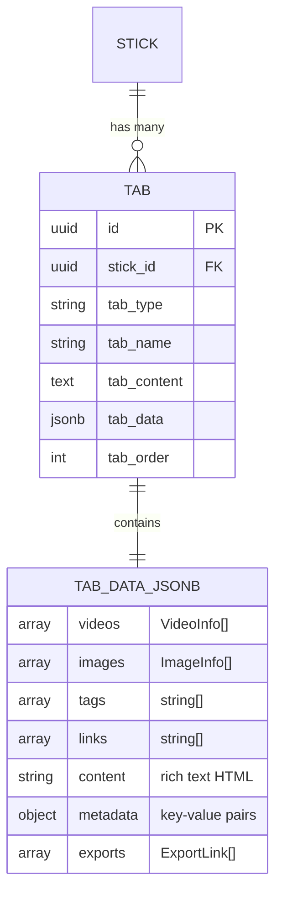
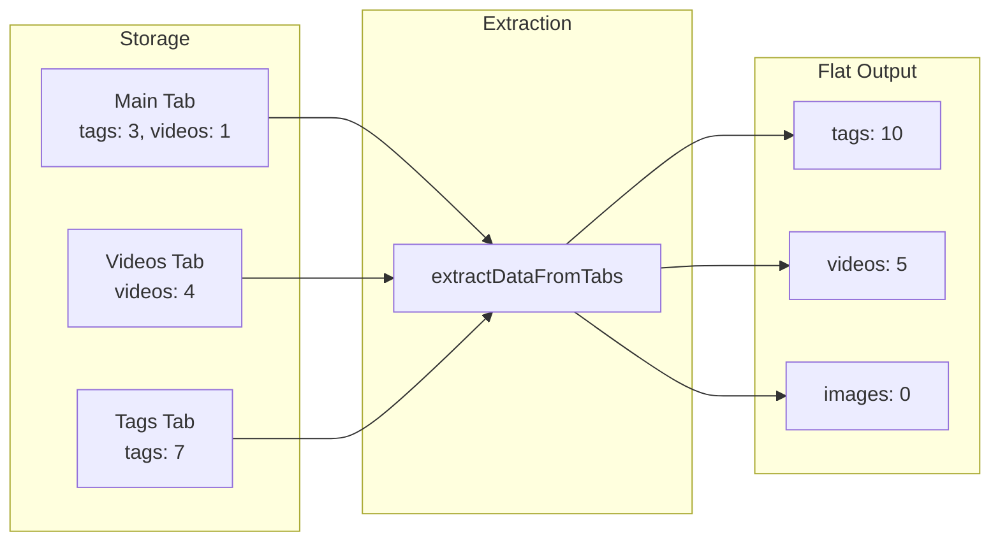
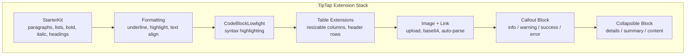
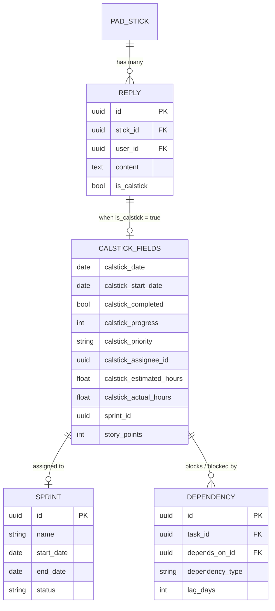

# Chapter 8: The Tab System and Rich Content

Chapter 7 established the split: personal sticks are private records with binary sharing; pad sticks are collaborative objects governed by role-based permissions. Both store a topic and a body of text. On paper, that is enough for a note-taking tool. In practice, it is not enough for anything.

A note needs images. A task needs a due date and an assignee. A research item needs tagged links and embedded videos. A project update needs formatted text with callout blocks and collapsible sections. If you bolt each of these onto the core entity with new columns, you end up with a table that is forty columns wide and sparsely populated -- most notes have no videos, most tasks have no images. The alternative is a second table that extends the first, adding typed, ordered content slots that can hold anything. That second table is the tab system.

This chapter covers how tabs turn flat text records into rich containers, how the TipTap editor brings formatted content to the Details tab, and how CalSticks hijack the reply table to add calendar-and-task semantics to what was never designed for them.

---

## Two Tables, One Pattern

Tabs exist at both levels of the domain model. Personal sticks store their tabs in `personal_sticks_tabs`. Pad sticks store theirs in `paks_pad_stick_tabs`. The schemas are nearly identical:

```
personal_sticks_tabs:
  id, personal_stick_id, user_id,
  tab_type, tab_name, tab_content, tab_data (JSONB),
  tab_order, created_at, updated_at

paks_pad_stick_tabs:
  id, stick_id, user_id, org_id,
  tab_type, tab_name, tab_content, tab_data (JSONB),
  tab_order, created_at, updated_at
```

The difference is `org_id`. Personal sticks belong to a user. Pad stick tabs belong to a user *within an organization*. That single column carries the full weight of multi-tenancy. When the API fetches tabs for a pad stick, it filters on both `stick_id` and `org_id` -- because a stick's org_id might differ from the requesting user's current org context (sticks inherit from their pad, not from the viewer).

Both tables share the same column that does the real work: `tab_data`, a JSONB field. This is the extensibility mechanism. A tab's type declares what kind of content it holds. The JSONB stores the actual content in a shape that varies by type.



Six tab types exist: `main`, `details`, `images`, `videos`, `tags`, and `links`. Each type has a default display order -- videos at 1, images at 2, tags at 3, links at 4 -- assigned by a simple lookup function:

```
function getTabOrder(tabType):
  orders = { videos: 1, images: 2, tags: 3, links: 4 }
  return orders[tabType] ?? 5
```

The `main` tab (order 0) holds the stick's primary content. The `details` tab (order 1) holds rich-text content edited through TipTap. The remaining tabs hold typed collections inside their JSONB payload. A videos tab stores an array of `VideoInfo` objects with platform detection for YouTube, Vimeo, and Rumble. An images tab stores `ImageInfo` objects with optional dimensions and captions. Tags and links are simple string arrays.

This design means a stick with three videos, twelve tags, and a long-form details section requires exactly three rows in the tabs table. Adding a new content type -- say, file attachments or code snippets -- requires no schema migration. You add a new `tab_type` value and a new shape inside the JSONB. The database never changes.

---

## Lazy Tab Creation: GET with Side Effects

Here is the most controversial pattern in the tab system. When a client requests tabs for a pad stick, the GET endpoint checks whether any tabs exist. If they do not, it creates two default tabs -- Main and Details -- and returns them.

```
GET /api/sticks/{id}/tabs:
  tabs = SELECT * FROM paks_pad_stick_tabs
         WHERE stick_id = {id} AND org_id = {orgId}
         ORDER BY tab_order ASC

  if tabs is empty:
    defaultTabs = [
      { stick_id, tab_name: "Main",    tab_type: "main",    tab_order: 0 },
      { stick_id, tab_name: "Details", tab_type: "details", tab_order: 1 },
    ]
    INSERT defaultTabs INTO paks_pad_stick_tabs
    tabs = defaultTabs

  return tabs
```

This is a GET request that writes to the database. It violates the HTTP convention that GET should be safe and idempotent. The operation *is* idempotent in the practical sense -- calling it ten times produces the same result -- but it has write side effects on first call, and that makes caches, proxies, and purists uncomfortable.

Why do it this way? Because the alternative is worse. Without lazy creation, every code path that creates a stick must also create its default tabs in the same transaction. That means the stick creation endpoint, the import endpoint, the template instantiation endpoint, and any future creation path all need to remember to create tabs. Miss one, and you get a stick with no tabs -- which the UI cannot render. Lazy creation centralizes the guarantee: *tabs always exist after the first read*. No "create before use" ceremony required.

The personal sticks side does not use this pattern. The note-tabs API returns whatever tabs exist, including an empty array. The UI handles the empty case differently -- personal notes show a simpler interface where tabs are optional rather than structural.

This split reveals a design tension. Pad sticks are collaborative objects with richer UI expectations: multiple team members open the same stick and expect a consistent tab layout. Personal sticks are private. If the owner has not added videos, there is no videos tab, and that is fine. Two different products, two different initialization strategies, hidden behind similar-looking API endpoints.

---

## The Tab Data Extraction Pipeline

Tabs store data. But the rest of the system -- search, export, AI summarization -- needs that data in flat arrays, not nested inside per-tab JSONB blobs. The extraction pipeline bridges the gap.

```
function extractDataFromTabs(tabs):
  result = { tags: [], images: [], videos: [] }
  for each tab in tabs:
    if tab.tab_data is null: continue
    data = parse(tab.tab_data)
    if data.tags is array:   result.tags.push(...data.tags)
    if data.images is array: result.images.push(...data.images)
    if data.videos is array: result.videos.push(...data.videos)
  return result
```

This function iterates every tab for a given stick, collects all tags, images, and videos into single arrays, and returns a flat structure. It does not care which tab contributed which items. A stick could store half its tags in the tags tab and half in the main tab (because older code paths wrote tags to the main tab's JSONB). The extractor normalizes both into one list.

The extraction function appears in two files with subtle differences. `lib/notes.ts` has `extractDataFromTabs()` for the server-side notes API. `lib/note-tabs.ts` has `extractTabData()` for the older client-side path. Both do the same thing. Both exist because the system evolved: the notes module was rewritten to use direct SQL queries while the note-tabs module still uses the database adapter. Neither was deleted because both have callers.

The same duplication appears in reply transformation. `transformReply()` takes a typed `DatabaseReplyRow` and maps it cleanly. `transformReplyFromRaw()` takes an untyped `any` and applies defensive fallbacks for every field -- checking types, providing defaults, handling missing timestamps. `transformDatabaseNote()` and `transformPartialNote()` follow the same split: one trusts its input, the other does not.

This is not an accident and not ideal. It is the residue of a system that migrated from the chainable query builder adapter (which returns typed results) to raw SQL queries (which return `any` until you cast). The typed functions work when the query layer guarantees the shape. The defensive functions work when it does not. Both survive because ripping out either requires auditing every caller, and the risk of a runtime crash outweighs the cost of carrying both.



### Normalization

Tab data arrives in unpredictable shapes. The JSONB might be a parsed object, a JSON string, or even a base64-encoded string (a legacy from an earlier encoding scheme). The `normalizeTabData()` function handles all three:

1. If the input is a string, attempt JSON parse. If that fails, attempt base64 decode then JSON parse. If both fail, return an empty object.
2. If any expected array field (videos, images, tags, links, exports) exists but is not actually an array, replace it with an empty array.
3. Return the cleaned object.

This is defensive programming taken to its logical conclusion. The system trusts no input, not even its own database. The cost is a few extra type checks per tab load. The benefit is zero crashes from corrupted or legacy data.

---

## TipTap: The Rich Text Engine

The Details tab is not a textarea. It is a full rich-text editor built on TipTap, which is itself built on ProseMirror. The editor supports headings (levels 1-3), bold, italic, underline, highlight (multi-color), text alignment, bullet and ordered lists, blockquotes, code blocks with syntax highlighting, tables with resizable columns, inline images, and hyperlinks.

The extension stack is configured once in a factory function:

```
function createEditorExtensions():
  return [
    StarterKit(heading: levels [1,2,3], codeBlock: false),
    Underline,
    Highlight(multicolor: true),
    TextAlign(types: ["heading", "paragraph"]),
    CodeBlockLowlight(lowlight: common languages),
    Image(inline: true, allowBase64: true),
    Link(openOnClick: false, target: "_blank"),
    Table(resizable: true),
    TableRow, TableHeader, TableCell,
  ]
```

The default `StarterKit` codeBlock is disabled and replaced with `CodeBlockLowlight`, which adds syntax highlighting using the lowlight library (a virtual DOM implementation of highlight.js). This matters for a knowledge management tool -- pasting code snippets into notes is a common use case, and unhighlighted code blocks are painful to read.

Images are configured as inline elements with base64 allowed. When a user pastes an image from the clipboard, the editor intercepts the paste event, extracts the image file, uploads it to the server via the `/api/upload-image` endpoint, and inserts the returned URL. This is a deliberate choice: base64 images bloat the HTML content stored in `tab_data.content`, while URL-referenced images keep the content lean. The clipboard paste handler catches `image/*` MIME types and prevents the default base64 insertion.

Links auto-open in new tabs with `noopener noreferrer`. Tables spawn with 3x3 dimensions and a header row, and expose contextual toolbar buttons (+Col, +Row, Delete) when the cursor is inside a table cell.

The editor enforces a character limit (configurable via `maxLength`). When the text length exceeds the limit, the editor rejects the update and restores the previous content. A counter in the footer shows current/max characters with an orange warning when 90% full.

### Custom Extensions

Two custom TipTap node extensions go beyond the standard toolkit.

**Callout Block.** A block-level node that wraps content in a styled container. Four types: `info`, `warning`, `success`, `error`. Each renders as a `<div data-callout>` with a CSS class like `callout-info` or `callout-error`. The `setCallout` command inserts a new callout with an empty paragraph inside. The type is stored as a `data-callout-type` HTML attribute, round-tripping cleanly through parse and render.

**Collapsible Block.** Three nodes working together to implement the HTML `<details>/<summary>` pattern. `Details` is the container, defining its content as exactly one `DetailsSummary` followed by one `DetailsContent`. `DetailsSummary` renders as `<summary>` and holds inline content (the clickable header). `DetailsContent` renders as a `<div data-details-content>` and holds block content (the collapsible body). The `setDetails` command inserts the full structure with a default summary text of "Toggle section" and an empty paragraph in the body. The `open` attribute defaults to `true` -- sections start expanded.



### SSR and Dynamic Loading

TipTap depends on browser APIs (DOM manipulation, selection ranges, clipboard access). It cannot run during server-side rendering. The Details tab component is loaded via `next/dynamic` with `ssr: false`, deferring the import entirely to the client. If the editor fails to initialize -- a corrupted extension, a missing dependency, a browser incompatibility -- the component renders an error state with a reload button rather than crashing the page.

Content is stored as HTML in `tab_data.content` and simultaneously in `tab_content` (the plain-text column). The HTML goes to TipTap for rich rendering. The plain text goes to full-text search indexing. This dual storage means search works even though the editor produces HTML, and the editor works even though search needs plain text.

---

## CalSticks: When Replies Become Tasks

The most aggressive act of concept overloading in the codebase is CalSticks. A CalStick is a reply -- a row in `paks_pad_stick_replies` -- with `is_calstick` set to `true` and a handful of extra columns that turn a feedback message into a scheduled task.

The reply table was not designed for this. It was designed for threaded conversation: a user posts a reply to a stick, others reply to the reply. But replies already had the right relationships: they belong to a stick (which belongs to a pad), they have a user_id, they have content, they have timestamps. Adding task management meant adding columns, not tables.

The extra columns:

- `calstick_date` -- the due date
- `calstick_start_date` -- the start date (for Gantt charting)
- `calstick_completed` -- boolean
- `calstick_completed_at` -- timestamp
- `calstick_progress` -- integer (0-100)
- `calstick_status` -- workflow state
- `calstick_priority` -- urgent, high, medium, low
- `calstick_assignee_id` -- FK to users
- `calstick_estimated_hours` -- planning estimate
- `calstick_actual_hours` -- time tracking
- `sprint_id` -- FK to sprints table
- `story_points` -- agile estimation
- `social_stick_id` -- link to a promoted social stick

That is thirteen columns added to a reply table. Every non-CalStick reply carries these columns as null values. The trade-off was explicit: the team wanted task management *fast*, and repurposing the reply table meant no migration, no new foreign keys, no new permission model. Replies already inherited access from their parent stick. CalSticks inherit the same access for free.



### Sprint Tracking and Dependencies

CalSticks grew beyond simple tasks. A `sprints` table holds sprint definitions with start/end dates and status. CalSticks reference sprints via `sprint_id`. A separate `calstick_dependencies` table tracks task-to-task relationships with a `dependency_type` field (defaulting to "FS" -- finish-to-start) and an optional `lag_days` offset. This enables Gantt chart rendering and critical path calculation.

The dependency model maps database column names to front-end names at the API boundary:

```
function mapDependency(row):
  return {
    calstick_id: row.task_id,
    depends_on_calstick_id: row.depends_on_id,
    dependency_type: row.dependency_type || "FS",
    lag_days: row.lag_days || 0
  }
```

The column mismatch (`task_id` in the database, `calstick_id` in the API) is another artifact of evolution. The dependencies table was created with generic column names. The front-end expected CalStick-specific names. The mapping function bridges the gap at every API call rather than renaming the columns.

### The Cache Layer

CalStick queries are expensive. They join replies to sticks to pads to users to assignees -- five tables for a single list view. A caching layer built on Upstash Redis (via REST API) stores query results with tiered TTLs:

- **Default:** 60 seconds for list views
- **Stale:** 300 seconds for stale-while-revalidate patterns
- **Gantt:** 120 seconds for chart data (slightly longer because Gantt rendering is expensive client-side)

Cache keys incorporate the user ID, filter state, pagination, pad ID, and org ID. The cache generates deterministic keys by sorting filter parameters alphabetically and concatenating them. Dependency data uses a hashed key derived from sorted task IDs to avoid key length issues.

The cache fails open. If Upstash is unreachable, the query runs against PostgreSQL directly. The response includes `X-Cache: HIT` or `X-Cache: MISS` headers so the client (and developers debugging performance) can see whether a response came from cache.

### The Cost of Concept Overloading

CalSticks work. They shipped fast. But they conflate two fundamentally different concepts: *feedback* (replies) and *scheduling* (tasks). The `paks_pad_stick_replies` table now serves double duty, and every query that touches replies must decide whether it cares about CalSticks.

The reply listing endpoint filters them out: regular reply queries add `is_calstick = false` to avoid mixing task cards into conversation threads. The CalStick listing endpoint filters them in: `is_calstick = true`. AI summarization of a stick's replies must handle both -- summarizing conversation while extracting task status. Export functions need to know whether to render a reply as a message or a Gantt row.

If you were designing from scratch, CalSticks would be their own table with a foreign key to sticks. The reply table would stay clean. But "designing from scratch" requires a migration that splits existing data, updates every query, and retests every feature that touches replies. The team chose to carry the conceptual debt because the operational cost of the migration exceeded the maintenance cost of the overloading. That calculus holds until it does not -- likely when a third concept tries to share the reply table.

---

## Apply This

**1. JSONB as an extension mechanism.** When content types vary across records, a typed column plus a JSONB payload column gives you schema flexibility without schema migrations. Define the `tab_type` as the discriminator. Parse the JSONB according to the type. New content types are a code change, not a database change.

**2. Lazy initialization over mandatory creation.** If every consumer of an object needs certain child records to exist, creating them on first read is simpler than ensuring every creation path remembers to create them. The trade-off -- GET with write side effects -- is real but manageable. Document it. Make it idempotent. Accept that REST purists will object.

**3. Defensive normalization for legacy data.** If your data has passed through multiple encoding schemes or storage formats, normalize aggressively at read time. Check for strings, parse JSON, decode base64, validate array types. The runtime cost is negligible. The crash prevention is not.

**4. Dual storage for dual access patterns.** Store content as rich HTML for rendering and as plain text for search indexing. The storage cost is trivial. The alternative -- parsing HTML at search time or rendering plain text in the editor -- is worse in every dimension.

**5. Concept overloading is a loan, not a gift.** Repurposing an existing table for a new concept ships faster and inherits existing permissions. But you are borrowing against future complexity. Every query must now filter on the discriminator column. Every feature must handle both concepts. Track the debt explicitly and plan the migration for when a third concept appears.

---

*Chapter 9 shifts from content storage to content creation. Templates and QuickSticks provide starter patterns that pre-populate tabs, set default configurations, and reduce the friction between "I need a new stick" and "I have a useful stick." Where tabs define what a stick can hold, templates define what a stick starts with.*
