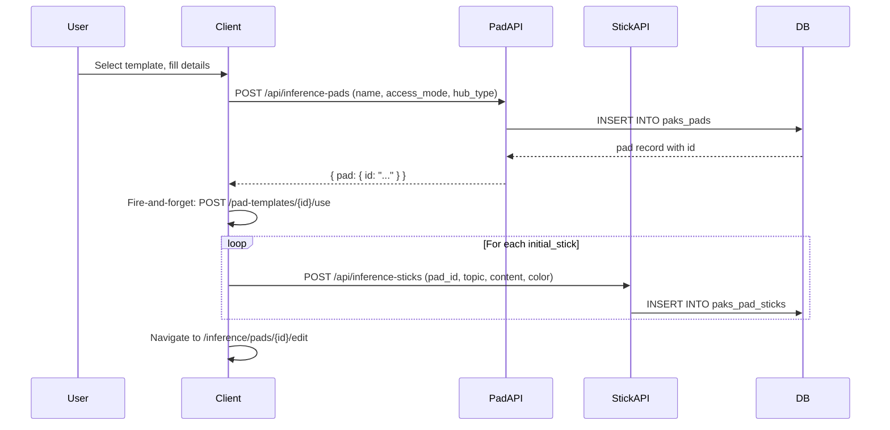
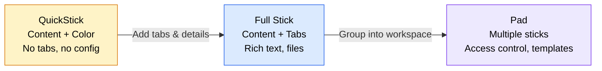

# Chapter 9: Templates and Quick Creation

Chapter 8 built three layers of complexity on top of the stick: tabs for organizing content, a rich text editor for formatting it, and CalSticks for scheduling it. The domain model is now genuinely complex. A pad contains sticks. Each stick contains tabs. Each tab contains rich text with embedded images, tables, and code blocks. A CalStick overlays a scheduling dimension on top of all of that.

This complexity is correct. Enterprise collaboration requires it. But when a user stares at a blank "Create Hub" dialog at 9 AM on Monday, they do not care about rich text sanitization levels or tab ordering algorithms. They need a starting point.

This chapter covers the two mechanisms that reduce perceived complexity without removing actual capability: **templates** that pre-populate structure, and **QuickSticks** that strip the interface to its minimum. Together they form a progressive disclosure spectrum -- the same data model, exposed at different levels of detail depending on what the user needs right now.

---

## Pad Templates: Starter Configurations

A pad template is a blueprint for an entire workspace. It encodes a name, a category, an access mode, and -- critically -- an array of initial sticks that will be created when the template is applied. The type tells the story:

```
PadTemplate:
  name: string
  category: string                        -- "Project Management", "Personal", etc.
  hub_type: "individual" | "organization"  -- scopes visibility
  access_mode: "all_sticks" | "individual_sticks"
  initial_sticks: Array<{topic, content, color}>
  use_count: number                        -- popularity ranking
  is_system: boolean                       -- platform-provided vs user-created
  is_public: boolean
```

Three design decisions deserve attention.

**Category-first browsing.** Templates are not searched. They are browsed by category. The API returns templates alongside a computed `categories` map -- a dictionary of category names to counts. The client renders this as a tab strip. Users pick "Project Management" or "Personal" and scan four to six options, rather than typing a search query and hoping the template author used the same vocabulary.

This is a deliberate trade-off. Search works when users know what they want. Categories work when users know what *kind* of thing they want. For template selection -- an inherently exploratory interaction -- categories win.

**Popularity-weighted ordering.** Within a category, templates sort by `use_count DESC`. Every time a user applies a template, a fire-and-forget POST increments the counter. The use-tracking endpoint is intentionally lenient: if the template does not exist, it returns 200 anyway. If the database write fails, it returns 200 anyway. Template usage tracking is telemetry, not business logic. It should never block or break the creation flow.

**Initial sticks as JSONB.** The `initial_sticks` column stores a JSON array of stick blueprints -- topic, content, color. Not full stick records. Not foreign keys to a sticks table. Just lightweight descriptions of what to create. This keeps the template self-contained: no cascading deletes, no orphaned references, no cross-table consistency concerns. The sticks only become real database rows when the template is applied.

### Template Application Flow

Applying a pad template is a two-phase operation. First, create the pad. Then, create the initial sticks inside it.



The client drives this orchestration, not the server. The pad creation endpoint knows nothing about templates. The stick creation endpoint knows nothing about templates. The template picker component holds the blueprint, creates the pad via the standard API, then iterates over `initial_sticks` and creates each stick via the standard API.

This is important. There is no `/api/apply-template` endpoint that creates a pad and sticks in a single transaction. The trade-off is atomicity -- if the third stick creation fails, you have a pad with two sticks instead of three. The gain is simplicity: the pad and stick APIs remain exactly the same whether a template is involved or not. No special cases. No "created from template" flag that changes behavior downstream.

The initial stick creation calls use `Promise.allSettled`, not `Promise.all`. If one stick fails, the others still complete. A partial workspace is better than no workspace.

---

## Stick Templates: Content Patterns

Stick templates are lighter weight. Where a pad template creates an entire workspace, a stick template pre-fills a single stick's content.

```
StickTemplate:
  name: string
  category: string
  topic_template: string | null    -- suggested topic text
  content_template: string         -- pre-built HTML content
  use_count: number
  is_system: boolean
  is_public: boolean
```

The pattern mirrors pad templates exactly: category-based browsing, popularity-weighted ordering, fire-and-forget usage tracking. The table is `paks_pad_stick_templates`. The API shape is identical. The only structural difference is the payload: instead of an array of initial sticks, a stick template carries a single `content_template` string and an optional `topic_template`.

There is no `initial_tabs` field. Stick templates do not configure tabs. This is intentional. Tabs are an organizational choice that depends on context -- the same meeting notes content might get a "Files" tab in a project hub and an "Action Items" tab in a personal hub. Pre-configuring tabs would couple the template to a specific usage pattern, which defeats the purpose of having templates in the first place.

The result is a clean division of responsibility: pad templates handle structure (how many sticks, what access mode), stick templates handle content (what text goes inside a stick), and the user handles organization (what tabs to add, how to arrange them).

---

## QuickSticks: Minimum Viable Creation

Templates reduce complexity by providing starting points. QuickSticks reduce it by removing options entirely.

A QuickStick is not a separate entity. It is a regular stick with a boolean flag:

```sql
ALTER TABLE paks_pad_sticks
  ADD COLUMN is_quickstick BOOLEAN DEFAULT FALSE;

CREATE INDEX idx_sticks_is_quickstick
  ON paks_pad_sticks(is_quickstick)
  WHERE is_quickstick = TRUE;
```

A partial index. Only rows where `is_quickstick = TRUE` are indexed. The vast majority of sticks are not QuickSticks, so a full index would waste space on millions of `FALSE` values that no query ever filters by.

### The QuickStick Interface

The QuickSticks page is deliberately minimal. No tab configuration. No rich text toolbar. No access mode selection. Just a grid of cards showing topic, content, color, and the parent pad name. Click a card to open a fullscreen editor. That is the entire interaction.

The API reflects this simplicity. The QuickSticks endpoint queries `paks_pad_sticks` filtered by `is_quickstick = TRUE` and scoped to the user's organization. It then fetches the parent pads in a second query to display pad names on each card. Pagination, search, and caching follow the same patterns as every other list endpoint.

### Progressive Complexity Spectrum

The three creation modes form a spectrum:



A user can toggle `is_quickstick` on any stick at any time. It is a view filter, not a type constraint. The stick's data does not change. Its tabs, its rich text content, its file attachments -- all remain intact. Toggling the flag just controls whether it appears in the QuickSticks view.

This means QuickSticks double as bookmarks. A user might create a stick through the full interface, with tabs and attachments, and then mark it as a QuickStick for fast access later. Or they might create a QuickStick during a meeting -- just a topic and a sentence -- and later "promote" it by opening the full stick editor and adding tabs, files, and detailed content.

The toggle lives in the fullscreen stick editor as a simple switch. One PATCH request: `{ is_quickstick: true }`. The stick API handles it alongside every other updatable field, with no special logic.

---

## The CRUD Pipeline, Revisited

All three creation flows -- pad from template, stick from template, QuickStick -- pass through the same pipeline. The details vary, but the shape is constant.

### The Safe Action Wrapper

The `createSafeAction` factory encapsulates the pipeline for write operations:

1. **CSRF validation.** Stateless HMAC token check. GET/HEAD/OPTIONS are exempt.
2. **Authentication.** Session lookup. Returns 401 if required and missing.
3. **Rate limiting.** Cascading check (Redis, PostgreSQL, in-memory fallback). Fail-open: if all backends are down, the request proceeds.
4. **Input validation.** Zod schema parse. Returns 400 with field-level errors on failure.
5. **Handler execution.** The actual business logic.
6. **Output validation.** Optional Zod check on the response shape.

Every step is independent. A CSRF failure does not touch the database. A rate limit rejection does not parse the body. This ordering is deliberate: reject cheaply before doing expensive work.

### HTML Sanitization

Content fields pass through `sanitizeRequestBody()`, which applies one of three DOMPurify configurations based on context:

- **STRICT**: Basic formatting only -- headings, lists, links, code blocks. No images, no tables. Used for short-form content like stick topics and template descriptions.
- **RICH_TEXT**: Adds images, tables, and the `class` attribute. Used for TipTap editor output where users expect full formatting.
- **MINIMAL**: Bold, italic, paragraphs, line breaks. Nothing else. Used for replies and comments where rich formatting is a distraction.

The key insight: sanitization runs at the API boundary, not in the database layer and not in the rendering layer. The database stores sanitized HTML. The client renders it without further processing. This means every API route that accepts HTML must explicitly declare which fields need sanitization and at which level. It is an opt-in model, not an automatic one. The cost is vigilance -- miss a field and you have a stored XSS vector. The benefit is precision -- you never accidentally strip formatting that a field legitimately needs.

### DLP on Sharing Operations

Data Loss Prevention scanning checks content for sensitive patterns -- Social Security numbers, credit card numbers, API keys, IP addresses -- before allowing sharing operations. The scanner runs a set of regular expressions against content and returns a structured result:

```
ScanResult:
  hasSensitiveData: boolean
  matches: Array<{pattern: string, label: string, count: number}>
```

DLP does not run on every write. It runs on operations that change visibility: sharing a pad, making a stick public, exporting content. Creating a private stick with your own credit card number in it is your business. Sharing that stick with the organization is the DLP scanner's business.

---

## Apply This

Five patterns from this chapter that transfer to any application with user-generated content:

**1. Progressive disclosure is a spectrum, not a toggle.** The three creation modes (QuickStick, stick, pad) expose the same data model at different levels of detail. There is no "simple mode" versus "advanced mode" switch. Instead, each interface naturally grows into the next. A QuickStick becomes a full stick by opening the editor. A collection of sticks becomes a pad by grouping them. Design for the gradient, not the binary.

**2. Templates should be self-contained.** Pad templates store initial stick blueprints as embedded JSON, not as foreign keys to real stick rows. This makes templates portable, copyable, and deletable without cascading side effects. If your template references live data, deleting that data breaks the template.

**3. Usage tracking is telemetry, not logic.** The template use-count endpoints never return errors to the client. They swallow failures silently. If your analytics code can break the user's workflow, it will -- and it will do it in production at the worst possible time.

**4. Client-driven orchestration over server-side transactions.** Template application creates a pad and then creates sticks through separate API calls. This loses atomicity but gains composability: the pad and stick APIs do not need to know about templates. When you find yourself building a "god endpoint" that does five things in a transaction, consider whether the client can orchestrate five simple calls instead.

**5. Boolean flags beat separate tables.** QuickSticks are sticks with `is_quickstick = TRUE`, not a separate entity in a separate table. A partial index keeps the query fast. The flag can be toggled without migrating data. Any time you are tempted to create a new table for what is essentially a filtered view of an existing table, reach for a boolean column and a partial index first.

---

*This closes Part III. The domain model is complete: notes, sticks, pads, tabs, rich text, CalSticks, templates, and QuickSticks. The data exists. It can be created, structured, and filtered at multiple levels of complexity.*

*Part IV turns to the question of how that data moves. Chapter 10 opens with the WebSocket server -- the mechanism that pushes changes to connected clients in real time, turning a collection of stored records into a live collaboration surface.*
