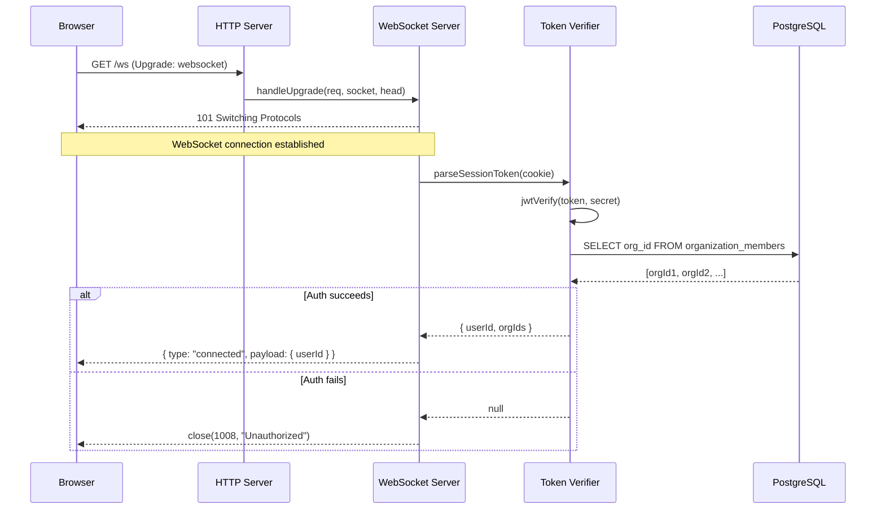
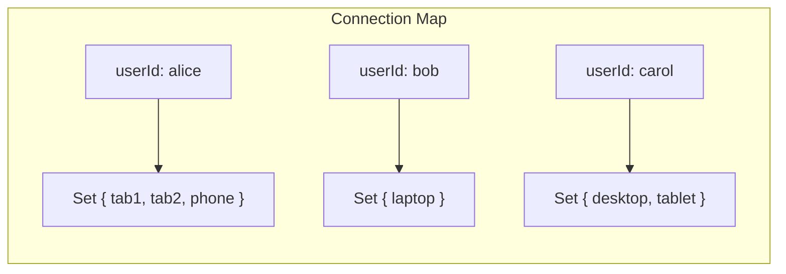
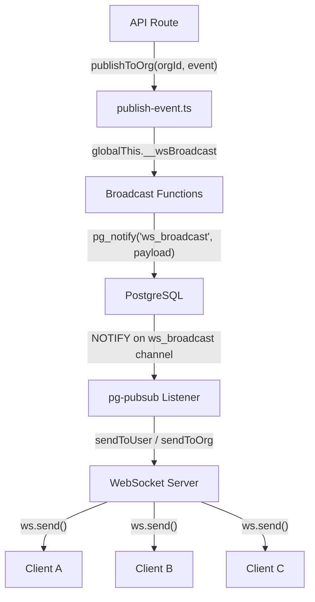
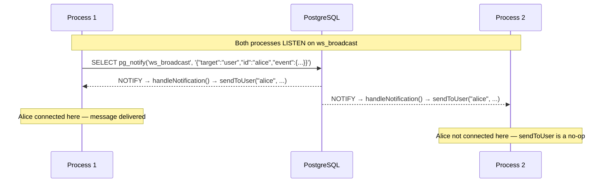
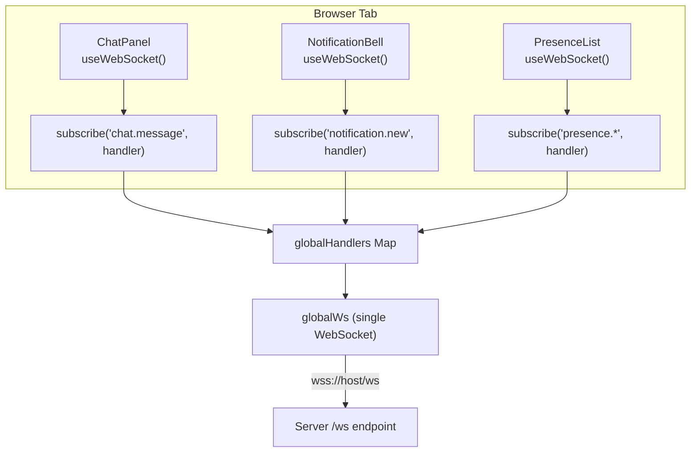

# Part IV -- Real-Time Collaboration

*"The hardest part of collaboration isn't the feature -- it's the connection."*

Part III defined the domain model: notes, sticks, pads, tabs, templates -- the nouns of the system. You now understand what data exists, how it is structured, and the permission rules that govern who can see what. But data at rest is just a database. A collaboration platform lives or dies by what happens between keystrokes -- the moment one user's action becomes visible on another user's screen.

Real-time features sound simple until you build them. A chat message is just an INSERT and a push. Presence is just a timestamp. Notifications are just a query. The complexity is never in the feature. It is in the persistent connection that makes the feature feel instantaneous. That connection must survive network interruptions, authenticate without leaking credentials, scale across multiple browser tabs, broadcast to the right users without flooding the wrong ones, and -- in Stick My Note's case -- work despite a framework that actively tries to sabotage it.

The standard approach to real-time in the Next.js ecosystem is to reach for a third-party service. Pusher, Ably, Socket.IO Cloud -- they all provide hosted WebSocket infrastructure with client libraries and dashboard monitoring. You get real-time events without managing connections. You also get a third-party service that processes every real-time message your users generate. Every chat message. Every presence heartbeat. Every notification. All flowing through someone else's servers, subject to their pricing, their uptime, and their data handling policies.

For a platform built on the premise of self-hosted sovereignty, that is not an option. A hospital deploying Stick My Note for clinical collaboration cannot route real-time messages through Pusher's infrastructure without a Business Associate Agreement and a data processing assessment. A defense contractor cannot send notification payloads through a cloud WebSocket service without evaluating the service's ITAR compliance. The WebSocket server runs on the same machine as the application, speaks to the same database, and never sends a byte outside the network perimeter. The trade-off is real and nontrivial: you manage the connections, the heartbeats, the reconnection logic, the cross-process broadcasting, the connection limits, the dead detection, the LiveKit proxy. You own the complexity. Every bug is yours to find and yours to fix. There is no vendor support tier to escalate to. But you also own the data path, end to end. Every message stays on your network. Every connection terminates on your server. Every event is visible in your logs and invisible to everyone else.

This chapter covers six things: how the WebSocket server attaches to the custom Node.js server from Chapter 1, how it defeats a framework-level bug that corrupts socket connections, how it authenticates users after the handshake instead of before, how it manages connections with per-user limits and heartbeat-based dead detection, how it uses PostgreSQL as a cross-process message bus, and how the client shares a single connection across every React component that needs real-time events.

The chapter also covers two secondary topics that share the same infrastructure: the raw TCP proxy that tunnels video signaling traffic to an internal LiveKit server, and the wildcard event subscription system that lets components listen to entire domains of events with a single pattern.

Every real-time feature in the chapters that follow -- chat, presence, notifications, video -- depends on the infrastructure built here. If the domain model from Part III is the skeleton of the application, the WebSocket server is its nervous system.

---

# Chapter 10: The WebSocket Server

## 10.1 Why Next.js Cannot Handle WebSockets

This is a war story. It deserves to be told as one.

Next.js is an excellent framework for server-rendered React applications. It handles routing, bundling, code splitting, and API routes with minimal configuration. What it does not handle well -- what it actively interferes with -- is WebSocket connections.

To understand why, you need to know how WebSockets work at the protocol level. When a browser opens a WebSocket, it starts as a normal HTTP request with an `Upgrade: websocket` header. The server must respond with a 101 status code, completing the "handshake," and then the connection switches from HTTP to a persistent bidirectional channel. This is the HTTP upgrade mechanism, defined in RFC 6455, and it has worked reliably since 2011.

The key word is "switch." After the 101 response, the connection is no longer HTTP. The raw TCP socket has been promoted to a different protocol. The HTTP server is supposed to release the socket and never touch it again. The WebSocket library takes ownership, manages its own framing, and communicates directly with the client.

Next.js does not respect this boundary.

Internally, a function called `setupWebSocketHandler()` attaches a listener to the `upgrade` event on the HTTP server. When an upgrade request arrives, Next.js intercepts it and passes the raw TCP socket to its request handler -- `handleRequestImpl` -- treating the socket as if it were an HTTP response object. This is how Next.js's development server provides hot module replacement: it uses WebSockets for its own purposes and assumes it is the only consumer of upgrade events.

It does not work for your WebSockets.

In older versions of Node.js, this interference was often invisible. Next.js would process the upgrade request, find no matching route, and the socket would continue to function. But in Node.js v24, the HTTP internals became stricter about socket state tracking. When Next.js passes an upgrade request through `handleRequestImpl`, it calls methods on the socket that mark internal flags -- specifically, flags related to write readiness. The socket transitions to a state where the Node.js runtime considers it non-writable.

The WebSocket handshake completes. The `ws` library has a reference to the socket. The client receives the 101 response and believes it is connected. But the returned socket object can no longer send data. Every `ws.send()` call silently fails. No error event fires. No close event fires. The connection looks alive in every diagnostic tool -- the client reports "connected," the server shows the socket in its connection set -- but no data flows. A ghost connection.

This bug is invisible in development because the development server uses a different code path. It only manifests in production, with `NODE_ENV=production`, using a custom server. The kind of setup that a self-hosted enterprise deployment requires. The kind of setup you cannot avoid when you need HTTPS on port 443, custom file serving for uploads, and a WebSocket proxy for video conferencing.

Debugging this was weeks of dead ends. The WebSocket library reported no errors. Browser DevTools showed the connection as open. Network captures showed the 101 handshake completing successfully. The symptoms -- events not arriving, presence not updating, chat messages delayed until page refresh -- pointed at a dozen possible causes. Was it a serialization bug? A broadcasting logic error? A client-side handler registration issue? A cookie not being sent on the upgrade request?

Each hypothesis was tested and eliminated. The server could log events being broadcast. The client could log events being received. But no events arrived. Adding `console.log` before every `ws.send()` showed the calls were being made -- the server was sending data into the socket. But the data never arrived at the client. The socket was open but the pipe was plugged.

The breakthrough came from adding a raw `socket.on('data')` listener to the underlying TCP socket, before the `ws` library processed it. Data was arriving from the client (the browser's ping frames). But data written by the server was not appearing on the wire. The socket was readable but not writable. That narrowed the search to something corrupting the socket's write state -- and tracing the Node.js internal flags led to Next.js's `handleRequestImpl`, which was being called on upgrade requests despite the custom server handling them.

The fix was found by reading Next.js source code, tracing the `upgrade` event registration, and discovering the `didWebSocketSetup` flag.

The fix is one line of code, and it is the most important line in the entire server:

```
app = next({ dev: false, hostname, port })
app.didWebSocketSetup = true
```

That boolean property tells Next.js: "Someone else is handling WebSocket upgrades. Do not register your own upgrade listener." Next.js checks this flag before attaching `setupWebSocketHandler()`. When it is `true`, Next.js steps aside, and the `upgrade` event on the HTTP server is available for the application's own WebSocket library to claim.

This is not a documented API. It is not in any changelog. It does not appear in the Next.js docs, guides, or examples. It is an internal implementation detail discovered by reading framework source code and understanding why the upgrade listener exists in the first place. It works because the framework checks a simple boolean before registering its handler. It could break in any future Next.js version without notice. There is no migration path if it does -- you would have to find the new mechanism and override that instead.

The self-hosted sovereignty thesis meets its starkest expression here: when the framework fights you, you override the framework. There is no support ticket to file, no SaaS vendor to call. You read the source, find the flag, set it, and move on. And you leave a comment in the code explaining why, because the next person who touches that line will not have the context you do.

### The Broader Lesson

The `didWebSocketSetup` story is worth dwelling on because it illustrates a pattern that repeats throughout self-hosted architectures. Frameworks are designed for the common case. The common case for Next.js is a Vercel deployment where WebSockets are handled by the platform, not the application. Custom servers with WebSocket support are a minority use case. The framework authors are not hostile to your needs -- they simply optimized for a different deployment model.

When you choose self-hosting, you are choosing to live in the margins of your framework's design. You will encounter assumptions that do not match your environment. You will find code paths that were tested against cloud infrastructure but not against bare-metal servers. The skill that matters is not avoiding these collisions -- they are inevitable -- but diagnosing them quickly and patching them minimally. One boolean property. One line of code. One comment explaining the context. That is the ideal fix: small, reversible, and well-documented.

The alternative -- switching frameworks, rewriting the server, or abandoning WebSockets in favor of polling -- would be a disproportionate response to a single boolean flag. The fix is smaller than the bug. That is how it should be.

One final note on this topic: the `didWebSocketSetup` flag is checked during `app.prepare()`, which runs asynchronously after the Next.js application is initialized. This means the flag must be set *before* calling `app.prepare()`. Setting it afterward has no effect -- the upgrade listener has already been registered. The ordering in the server code is therefore load-bearing:

```
app = next({ dev, hostname, port })
app.didWebSocketSetup = true    // Must be BEFORE prepare()
handle = app.getRequestHandler()
app.prepare().then(() => { ... })
```

Swapping the second and fourth lines -- setting the flag after `prepare()` -- would silently reintroduce the bug. There would be no error, no warning, no indication that anything changed. Just ghost connections again. This is the kind of ordering dependency that deserves a code comment and, ideally, a test that opens a WebSocket connection and verifies data can be sent in both directions.

## 10.2 The Upgrade Sequence

With Next.js neutralized, the custom server attaches its own WebSocket infrastructure. The architecture uses the `ws` library -- the most widely deployed WebSocket implementation for Node.js -- in `noServer` mode. This is an important configuration choice. By default, `ws` can create its own HTTP server or attach to an existing one by passing the server instance to the constructor. In `noServer` mode, it does neither. It creates a WebSocket server with no HTTP binding at all. Instead, it exposes a `handleUpgrade()` method that the application calls manually when an upgrade request arrives on the main server.

This gives the application full control over which upgrade requests become WebSocket connections and which are rejected or routed elsewhere. The application is the router; `ws` is just the protocol handler.

The alternative -- passing the HTTP server to the `WebSocketServer` constructor -- would give `ws` ownership of upgrade handling. The library would accept every upgrade request on every path and emit `connection` events for all of them. The application would then need to inspect the URL inside the `connection` handler and reject unwanted connections after the handshake. With `noServer` mode, the rejection happens before the handshake, which is both more efficient (no wasted 101 responses) and more secure (no briefly-open connections on unintended paths).

The server listens for `upgrade` events on the main HTTP server. When one arrives, it checks the request URL:

- If the path starts with `/livekit-ws/`, the request is proxied to the internal LiveKit video server (covered in Section 10.8).
- If the path is `/ws`, the request is handled by the application's WebSocket server.
- All other paths are rejected: the socket is destroyed immediately.

This routing happens at the TCP level, before any WebSocket handshake completes. A request to `/ws` triggers the handshake. A request to `/livekit-ws/` triggers a raw TCP proxy. A request to any other path -- `/favicon.ico`, `/api/something`, a probing bot hitting random URLs -- gets the socket destroyed immediately. No 404 response. No error message. Just a dead connection. This is defensive by design: the upgrade event exposes a raw TCP socket, and leaving it open for an unrecognized path is an invitation for resource leaks.

The three-way routing is the only branching logic in the upgrade handler. Once the path is determined, control passes entirely to either the `ws` library (for `/ws`), the TCP proxy function (for `/livekit-ws/`), or the kernel (via `socket.destroy()` for everything else). The upgrade handler itself does no authentication, no logging, and no business logic. It is a router and nothing more.

This design also means the HTTP request handler and the WebSocket handler never interfere with each other. The HTTP request handler in `server.js` starts with a guard: `if (req.headers.upgrade) return`. Any request with an `Upgrade` header is ignored by the HTTP handler because it will be processed by the `upgrade` event listener instead. There is no risk of a WebSocket upgrade being accidentally processed as an HTTP request, which would produce confusing 404 or 500 responses instead of a protocol switch.

This guard is necessary because Node.js's HTTP server emits both `request` and `upgrade` events for upgrade requests. Without the guard, a WebSocket connection attempt to `/ws` would trigger the HTTP handler, which would pass the request to Next.js, which would return a 404 (there is no page route at `/ws`). Meanwhile, the `upgrade` handler would also fire and try to process the same request. The race between the two handlers would produce unpredictable behavior -- sometimes a successful upgrade, sometimes a 404 response on the same socket. The guard eliminates the race by ensuring that upgrade requests are handled exclusively by the `upgrade` event.



The critical detail is the ordering. The WebSocket handshake completes *before* authentication begins. This is unusual. Most WebSocket implementations authenticate the HTTP request before upgrading the protocol -- checking cookies or tokens during the initial request phase and rejecting unauthorized connections with a 401 before the handshake completes. Stick My Note deliberately inverts this, and the reason is rooted in the same Node.js v24 behavior that necessitated the `didWebSocketSetup` flag.

## 10.3 Post-Upgrade Authentication

Authentication requires asynchronous operations: parsing a cookie string, verifying a JWT signature using the `jose` library, and querying the database for organization memberships. These operations take time -- typically 10-50 milliseconds. If the upgrade handler awaits these operations before calling `handleUpgrade()`, the Node.js event loop continues processing during the wait. Other event handlers -- including framework-internal ones -- can fire during that window and interact with the pending socket. Even with `didWebSocketSetup = true` preventing the primary interference, the longer a raw socket sits in the upgrade pipeline without being claimed by the `ws` library, the more opportunities exist for something to go wrong.

The defensive solution is to minimize the time between receiving the upgrade request and completing the WebSocket handshake. Complete the handshake immediately -- synchronously, within the upgrade event handler, with no `await` between receiving the request and calling `handleUpgrade()`. Then authenticate afterward, on the established WebSocket connection, where the socket is fully under the `ws` library's protection.

This is the post-upgrade authentication pattern:

```
server.on("upgrade", (req, socket, head) => {
  if (req.url !== "/ws") { socket.destroy(); return }

  wss.handleUpgrade(req, socket, head, (ws) => {
    // Handshake complete. Socket is ours.
    token = parseSessionCookie(req.headers.cookie)
    if (!token) { ws.close(1008); return }

    auth = await verifyToken(token)
    if (!auth) { ws.close(1008); return }

    ws.userId = auth.userId
    ws.orgIds = auth.orgIds
    ws.send({ type: "connected", payload: { userId } })
  })
})
```

The `handleUpgrade` callback fires after the 101 response has been sent and the WebSocket protocol is active. At this point, the socket is fully under the `ws` library's control. No framework code can interfere. The asynchronous authentication runs safely inside the callback.

There is a security trade-off here worth naming explicitly. Between the moment the WebSocket handshake completes and the moment authentication finishes, an unauthenticated WebSocket connection exists. During that window -- 10 to 50 milliseconds -- an attacker who can reach the server could have an open WebSocket. What can they do with it? Nothing useful. The server does not add the socket to the connection map until authentication succeeds. No broadcast events are delivered to it. The only message the server sends to an unauthenticated socket is the close frame that rejects it. The window is real, but the attack surface within that window is empty.

If authentication fails -- no session cookie, invalid JWT, expired token -- the server closes the connection with WebSocket close code 1008 (Policy Violation). The RFC defines 1008 as "a policy violation" -- the server understood the request but refuses to fulfill it because the client lacks authorization. The client receives a clean close frame and can react accordingly: redirect to login, show an error, or attempt reconnection. A separate close code, 1011 (Internal Error), is used when authentication encounters an unexpected exception -- a database timeout, a malformed JWT that crashes the parser. This distinction lets the client differentiate between "you are not logged in" and "something went wrong on the server."

If authentication succeeds, three things happen. The user's ID is attached to the socket object as a property. The user's organization memberships are fetched from the database and attached as an array of org IDs. And a confirmation message is sent to the client: `{ type: "connected", payload: { userId } }`. The client uses this message to transition from "connecting" to "connected" state in the UI.

The token verification uses the `jose` library's `jwtVerify` function with the same HS256 secret used to sign session tokens in Chapter 4. This is the same JWT, the same secret, the same verification -- the WebSocket authentication is not a separate system. It piggybacks on the existing session infrastructure. A user who is logged in has a valid `session` cookie, and that cookie authenticates the WebSocket.

Why `jose` instead of the `jsonwebtoken` library more commonly seen in Node.js applications? The `jose` library uses the Web Crypto API under the hood, which is available in both Node.js and edge runtimes. It is also the library already used by the authentication layer in Chapter 4. Using a different JWT library for WebSocket authentication would create a subtle risk: if the libraries disagreed on clock skew tolerance, algorithm validation, or claim verification, a token could be valid for HTTP authentication but invalid for WebSocket authentication (or vice versa). Same library, same behavior, no surprises.

The cookie parsing is deliberately simple. The server splits the `Cookie` header on semicolons, trims whitespace, splits each pair on the first `=` sign, and looks for one named `session`. No cookie parsing library. No URL decoding. The session token is a base64-encoded JWT -- it contains no characters that require URL encoding. A full cookie parser would add a dependency to handle edge cases (quoted values, domain attributes, path attributes) that never appear in a `Cookie` request header. The minimal parser handles the only case that matters: extracting a known cookie name from a well-formed browser request.

One detail worth noting: the split on `=` uses `rest.join("=")` to reassemble the value. A JWT contains dots but no equals signs in the token itself -- however, base64 padding can produce trailing `=` characters. Splitting on the first `=` only and rejoining the rest ensures the full token is preserved even if it contains `=` in the value. This is a defensive measure against a real-world encoding edge case.

The org membership lookup deserves attention. The server queries the `organization_members` table for all organizations where the user has active membership. The resulting array of org IDs is attached to the socket and used for the lifetime of that connection to determine which org-scoped events the user should receive. This query runs against a small, dedicated connection pool (maximum 3 connections) separate from the main application pool, so WebSocket authentication cannot starve API routes of database connections.

The org membership lookup happens once, at connection time. If a user is added to or removed from an organization while connected, the socket's `orgIds` array will be stale until the next reconnection. This is an acceptable trade-off for a system where org membership changes are infrequent -- typically admin actions, not real-time events. The worst case: a user is added to an organization and does not see real-time events for that org until they refresh their browser. Given that org membership changes are followed by a UI notification that typically prompts a page navigation anyway, the staleness window is academic.

The opposite case -- a user removed from an organization while connected -- is worth examining. The user's socket still has the old org's ID in its `orgIds` array. They will continue to receive real-time events for that organization until reconnection. This is a brief information leak. The mitigation is that API routes enforce permission checks independently of WebSocket state: even if the user receives a "new message in org X" event via WebSocket, fetching the actual message content via the API will fail with a 403 because their membership has been revoked. The event tells them something happened. The API prevents them from seeing what.

## 10.4 Connection Management

With authentication complete, the socket needs to be tracked. This is where the connection map comes in.

Each authenticated WebSocket is stored in a `Map<string, Set<WebSocket>>` keyed by user ID. The value is a `Set` of sockets, because a single user may be connected from multiple devices or browser tabs simultaneously. The `Map` provides O(1) lookup by user ID. The `Set` provides O(1) insertion, deletion, and duplicate prevention for sockets belonging to the same user.

Each socket in the set is an extended WebSocket object with three additional properties: `userId` (string), `orgIds` (string array), and `isAlive` (boolean). These are set during authentication and read during broadcasting and heartbeat. The `ws` library allows arbitrary property assignment on socket objects -- there is no need for a wrapper class or a separate metadata map. The properties live directly on the socket, which keeps the lookup path short: when broadcasting to a user, the server retrieves the user's socket set from the map and calls `ws.send()` on each. When broadcasting to an org, it iterates all sockets and checks `ws.orgIds.includes(orgId)`.



The per-user limit is five simultaneous connections. When a sixth connection arrives, the oldest socket in the set is evicted with close code 4000 (a custom application code indicating "connection limit exceeded"). The eviction is FIFO: the `Set` iterator returns elements in insertion order, so the first element is the oldest. The newly connected socket is never evicted -- only existing connections are candidates.

Five connections accommodates the common multi-device scenario: a desktop browser, a phone, a tablet, and a couple of extra tabs. It is generous enough that users never hit the limit under normal usage, and strict enough that a runaway reconnection loop from a buggy client cannot exhaust server memory by opening hundreds of sockets.

Why five and not ten? Memory and CPU. Each WebSocket connection consumes a small but non-trivial amount of memory: the socket itself, kernel-level send and receive buffers, the `ws` library's internal framing state, and the application's extended properties (userId, orgIds, isAlive). Each connection also receives every heartbeat ping and every broadcast event targeted at its user or organization. At 50 concurrent users with 5 connections each, that is 250 sockets, 250 pings every 30 seconds, and up to 250 `ws.send()` calls per broadcast event. At 500 users, 2,500 sockets. The limit keeps the worst-case resource footprint predictable.

The limit is also a safety valve against a specific failure mode: a client caught in a rapid reconnect loop. If the reconnection logic has a bug -- reconnecting immediately instead of backing off, or reconnecting without closing the previous socket -- the user could accumulate dozens of connections in seconds. Without the per-user limit, this would continue until the server runs out of file descriptors or memory. With the limit, the runaway client's oldest connections are evicted as new ones arrive, capping the damage at five sockets regardless of how fast the client reconnects.

### Cleanup on Disconnect

When a socket closes -- whether from a clean client disconnect, a heartbeat timeout, or a connection limit eviction -- the `close` event handler removes it from the connection map. If the user's socket set becomes empty (no remaining connections), the user is removed from the map entirely. This ensures the connection map never accumulates entries for users who are no longer online.

The cleanup is synchronous and runs in the close event handler itself. There is no deferred cleanup, no garbage collection sweep, no periodic audit of the connection map. The map is always accurate: if a user ID is in the map, that user has at least one live socket.

Error handling on individual sockets follows the same cleanup pattern. When a socket emits an `error` event -- a write failure, a protocol violation, a network error -- the handler logs the error and the user ID associated with the socket. The error event is always followed by a close event, so the actual cleanup happens in the close handler. The error handler exists solely for logging and diagnostics. This is a common pattern with Node.js streams and sockets: `error` tells you what happened, `close` tells you it is over. Handle cleanup in `close`, handle diagnostics in `error`. Attempting cleanup in both leads to double-removal bugs where the close handler tries to delete a socket that the error handler already removed.

It is also critical to always register an `error` handler. In Node.js, an `EventEmitter` that emits an `error` event with no registered handler will throw the error as an uncaught exception, crashing the process. A WebSocket server without error handlers on individual sockets is a server that crashes on the first network hiccup. The handler can be as simple as a `console.error` call -- its presence prevents the crash, and its content aids debugging.

### Heartbeat and Dead Detection

TCP connections can die silently. A user's laptop goes to sleep. A network cable is unplugged. A corporate firewall drops an idle connection without sending a RST packet. The server has no way to know that the other end has vanished -- the socket looks open, reads return nothing (which is normal for a connection with no pending data), and the connection map still lists the user as online.

The solution is active probing. The server runs a heartbeat interval every 30 seconds. On each tick, it iterates over all connected sockets. For each socket, the logic is a two-phase check:

1. If `isAlive` is `false`, the socket has not responded to the previous ping. It has had 30 seconds to reply and did not. Terminate it immediately with `ws.terminate()` -- not `ws.close()`, which sends a close frame and waits for acknowledgment. `terminate()` destroys the socket instantly.
2. Set `isAlive` to `false`.
3. Send a WebSocket ping frame via `ws.ping()`.

When the client's browser responds with a pong frame (handled automatically by the browser's WebSocket implementation -- no application code needed), the server's `pong` event handler sets `isAlive` back to `true`.

This means a dead connection is detected within 30 to 60 seconds: one interval to send the unanswered ping, one more to check that no pong arrived. The terminated socket fires the `close` event, which removes it from the connection map. Thirty to sixty seconds of stale presence data is acceptable for a collaboration platform. Users do not expect sub-second accuracy on "who is online" -- they expect it to be roughly correct. Compare this to Slack, which shows presence updates with similar latency. Or Microsoft Teams, which can take over a minute to reflect a user going offline. The 30-second heartbeat is well within user expectations for presence accuracy.

The heartbeat interval is a constant, not a configuration option. Thirty seconds balances three competing concerns: fast detection of dead connections (lower is better), low overhead from ping traffic (higher is better), and accurate presence state (lower is better). At 30 seconds, the server sends one 2-byte ping frame per connection per interval. For 250 connections, that is 500 bytes per interval -- negligible bandwidth, even on constrained networks.

The client also handles its own side of the heartbeat. When the server sends a WebSocket-level ping, the browser responds automatically. But the client additionally handles application-level ping/pong messages: if the server sends `{ type: "ping" }`, the client responds with `{ type: "pong" }`. This dual-layer heartbeat ensures both the transport layer and the application layer are functional.

### Metrics

The server exposes a metrics object on `globalThis` for consumption by an admin health endpoint. The metrics include: total active connections, count of unique connected users, connections grouped by organization, server uptime in milliseconds, total events broadcast since startup, and the status of the PostgreSQL pub/sub connection.

These metrics are computed on demand, not accumulated in a time series. There is no metrics database, no Prometheus endpoint, no Grafana dashboard. An admin hits the health API, gets a snapshot of the current state, and uses that to assess whether the WebSocket layer is healthy. The metrics are exposed through a second `globalThis` registration -- `globalThis.__wsMetrics` -- following the same cross-module pattern as the broadcast functions.

For a single-server deployment with dozens of concurrent users, snapshot metrics are sufficient. You do not need a time-series database to answer "are the WebSockets healthy?" You need a single GET request that returns a JSON object.

The metrics also expose the PostgreSQL pub/sub connection status (`pgPubSubConnected`) and the count of events published through NOTIFY (`pgPubSubEventsPublished`). These are the most important operational indicators. If `pgPubSubConnected` is `false`, cross-process broadcasting is degraded and local-only fallback is active. If `pgPubSubEventsPublished` has not increased since the last check, either no events are being published (quiet system) or the publish path is broken. Combined with the `eventsBroadcast` counter (which increments regardless of whether NOTIFY or local delivery was used), an operator can distinguish between "no events are happening" and "events are happening but NOTIFY is down."

For a deployment with thousands of users, you would want proper time-series metrics -- connection counts over time, event throughput rates, latency percentiles. But that deployment would also require a different broadcasting architecture entirely.

### Graceful Shutdown

When the WebSocket server closes (server restart, process termination), two cleanup actions fire. The heartbeat interval is cleared, stopping the ping sweep. The PostgreSQL LISTEN connection is closed, unsubscribing from the notification channel. Connected clients receive a close event and begin their reconnection backoff cycle. There is no "drain" phase -- the server does not wait for pending messages to be delivered or for clients to acknowledge the shutdown. Connections are terminated, and clients are expected to handle the interruption. This is acceptable because the client-side reconnection logic (Section 10.7) is designed precisely for this scenario.

## 10.5 Broadcasting: Three Scopes

The WebSocket server exists to push events from the server to the client. It supports three targeting scopes:

**`sendToUser(userId, event)`** delivers an event to every socket belonging to a specific user. The function performs a `Map.get()` on the connection map, retrieves the user's socket set, and iterates over it, calling `ws.send()` on each socket whose `readyState` is `OPEN` (value 1). Sockets in any other state -- connecting, closing, closed -- are silently skipped. If the user has three tabs open, all three receive the message. If the user has no active connections, the function returns without doing anything. This is used for personal notifications, direct messages, and session-specific events like "your password was changed."

**`sendToOrg(orgId, event)`** delivers an event to every socket belonging to every user who is a member of a specific organization. This is used for chat messages in organization channels, presence updates, and collaborative editing events. The implementation iterates the *entire* connection map, checks each socket's `orgIds` array for membership, and sends to any socket whose user belongs to the target organization. This is O(n) in the total number of connections, not in the number of org members. For a deployment with hundreds of connections across dozens of organizations, this linear scan is fast enough -- the work per connection is a single array `.includes()` check and a conditional `ws.send()`.

For a deployment with tens of thousands of connections, you would want an inverted index: a `Map<orgId, Set<WebSocket>>` maintained alongside the per-user map. The current codebase does not build this index because the deployment does not need it. The linear scan is a conscious simplicity trade-off.

**`sendToUsers(userIds[], event)`** delivers an event to a specific list of users. This is used for group conversations, targeted notifications, and any scenario where the audience is neither one person nor an entire organization. Internally, it loops over the user ID array and calls the per-user delivery function for each. This is the most precise targeting scope -- no extra recipients, no org-wide fan-out.



The broadcast functions are registered on `globalThis.__wsBroadcast` during server startup. This `globalThis` pattern deserves explanation, because it looks wrong at first glance. Why put functions on a global object instead of exporting them from a module?

The answer is the boundary between CommonJS and ES modules, between server startup code and Next.js API routes. The WebSocket server is a CommonJS module loaded by `server.js` at startup. API routes are TypeScript files compiled by Next.js and executed in the same Node.js process but imported through a different module system. A direct `require()` or `import` of the WebSocket server module from an API route would either fail (different module resolution context) or create a second instance (defeating the singleton pattern). `globalThis` is the one namespace guaranteed to be shared across all modules in a single Node.js process, regardless of how they were loaded.

The typed TypeScript wrapper -- `publishToUser()`, `publishToOrg()`, `publishToUsers()` -- bridges the gap. It declares the shape of `globalThis.__wsBroadcast` using TypeScript's global augmentation, checks whether the broadcast functions exist, and swallows errors silently if they do not. API routes import the wrapper, call its functions, and never interact with `globalThis` directly. The wrapper is the seam between the WebSocket server's runtime world and the API route's typed world.

This means the WebSocket layer is optional. If the broadcast functions are not registered (because the server started without WebSocket support, or during unit tests, or in a serverless environment), event publishing becomes a no-op. No feature crashes because the WebSocket server is down. The user just does not see real-time updates until they refresh the page.

This is the same fail-open philosophy from Chapter 3's caching layers, applied to real-time events. The WebSocket layer is an enhancement, not a dependency. Every feature that uses real-time events also has a fallback path -- polling, manual refresh, or simply not showing the update until the next page navigation. The real-time layer makes the experience better. Its absence does not make the experience broken.

The `globalThis` pattern also makes testing straightforward. In unit tests, API routes run without a WebSocket server. `globalThis.__wsBroadcast` is undefined. The publish functions detect this, skip broadcasting, and return silently. The API route's behavior is identical -- minus the real-time notification -- without any mocking or test configuration. In integration tests that need to verify event delivery, a test harness can set `globalThis.__wsBroadcast` to a mock object that records calls:

```
// In a test setup
globalThis.__wsBroadcast = {
  sendToUser: (userId, event) => { recorded.push({ userId, event }) },
  sendToOrg: (orgId, event) => { recorded.push({ orgId, event }) },
  sendToUsers: (userIds, event) => { recorded.push({ userIds, event }) },
}
```

After the API route under test completes, the test asserts against `recorded` to verify that the correct events were published to the correct targets. The pattern's simplicity makes it easy to intercept without bringing in a mocking library.

### The Event Shape

Every event flowing through the broadcast layer follows the same structure: a `type` string, a `payload` object, and a `timestamp` number. The type follows a domain-dot-action convention: `chat.message`, `notification.new`, `presence.update`, `stick.created`. The payload varies by event type. The timestamp is milliseconds since epoch, set by the publisher.

This uniform shape is what enables the client-side wildcard subscriptions described in Section 10.8. Because every event has a dotted type string, components can subscribe to entire domains of events with a single pattern.

The typed wrapper enforces this shape at the TypeScript level. The `WsEvent` interface requires all three fields. API routes that forget the timestamp or misspell the type field get a compilation error. This is compile-time prevention of a runtime problem: a malformed event that passes through the broadcast layer, arrives at the client, fails to match any handler, and silently does nothing. The interface is three fields. The discipline it imposes is worth far more than three fields suggest.

The `publishToUser`, `publishToOrg`, and `publishToUsers` functions are all async but return void promises. They do not wait for delivery confirmation -- there is no such thing in this architecture. They fire and forget. The `async` signature exists solely so that callers can `await` them in contexts where they want exceptions (if any) to propagate to an error boundary, but in practice every call site ignores the return value. The functions wrap their internals in try/catch and log errors to the console. No broadcast failure propagates to the API route's response. The user who triggered the action gets a successful HTTP response whether or not the real-time event was delivered.

## 10.6 PostgreSQL LISTEN/NOTIFY as Cross-Process Bus

The broadcast functions described above solve the single-process case: one Node.js process, one in-memory connection map, direct function calls. But what happens when you run multiple server processes -- behind a load balancer, or simply because Node.js clustering is enabled?

Process A holds Alice's WebSocket connection. Process B handles the API request that creates a new chat message for Alice. Process B calls `sendToUser("alice", event)`. But Alice's socket is in Process A's memory. Process B's connection map has no entry for Alice -- she connected to Process A. The event is dispatched to nobody. Alice never sees the message. She refreshes the page, sees it in the chat history, and files a bug report: "real-time chat is broken."

This is the classic multi-process WebSocket problem, and it bites every team that scales beyond a single server process.

Most systems solve this with Redis Pub/Sub. A dedicated Redis instance, a `SUBSCRIBE` on a channel, and `PUBLISH` from any process. It works well. It is also another server to manage, another connection to maintain, another service that can fail.

Stick My Note does not have Redis. The server that the codebase calls "redis" is actually Memcached (Chapter 3), and Memcached does not support pub/sub. There is no Redis instance in the network topology. Adding one solely for WebSocket event distribution would violate the project's principle of minimizing infrastructure dependencies.

What the system does have is PostgreSQL, which offers a built-in pub/sub mechanism through the `LISTEN` and `NOTIFY` commands. These commands are rarely discussed in application architecture because they are not a messaging system in the way Redis Pub/Sub or RabbitMQ are. They are a lightweight notification mechanism built into the database -- originally designed for signaling cache invalidation or waking up background workers. NOTIFY has no persistence: if no one is listening, the notification is lost. It has no acknowledgment: the sender does not know if any receiver processed it. It has no replay: a newly connected listener cannot retrieve past notifications. These are significant limitations for a general-purpose messaging system.

But for the specific use case of "tell all processes that an event happened, right now, and it is fine if nobody was listening," they are sufficient. And they come free with the PostgreSQL deployment that the application already requires.

The implementation uses a dedicated `pg.Client` instance -- not from the connection pool -- that maintains a persistent connection and listens on a single channel called `ws_broadcast`. This distinction between `Client` and `Pool` is critical. A `Pool` manages multiple connections, returning them to a shared pool after each query. If you call `LISTEN` on a pooled connection, the subscription lives on that specific connection. When the pool returns the connection and hands it to a different query, the subscription vanishes. The next NOTIFY on that channel goes nowhere.

A dedicated `Client` holds one connection open for the lifetime of the process. It connects once, issues `LISTEN ws_broadcast`, and then sits idle, waiting for notifications. It does nothing else -- no queries, no transactions. It exists solely to receive NOTIFY events.

This dedicated connection does count against PostgreSQL's maximum connection limit. For a single-process deployment, that is one extra connection. For a multi-process deployment with four workers, that is four extra connections. The main application pool is configured for 20 connections, and the WebSocket authentication pool adds 3 more. With the LISTEN connection, a single-process deployment uses a maximum of 24 PostgreSQL connections. This is well within PostgreSQL's default limit of 100, but it is worth tracking if you add more processes or increase pool sizes.

Publishing an event uses `SELECT pg_notify($1, $2)` rather than the bare `NOTIFY` SQL command. The function form allows parameterized queries, which means the payload does not need to be escaped or quoted in the SQL string. The channel name and payload are passed as parameters, and the PostgreSQL client library handles escaping. This is safer and simpler than building a `NOTIFY "ws_broadcast", 'escaped payload'` string manually -- especially because JSON payloads contain single quotes, double quotes, and backslashes that would all need escaping in a raw SQL string.

The `pg_notify` call runs on the same dedicated client that holds the LISTEN subscription. This is intentional: the LISTEN client is always connected (or reconnecting), so it is always available for publishing. Using a pooled connection for NOTIFY would work but would require checking out a connection from the pool for each event, adding latency and pool contention. The dedicated client serves double duty: listener and publisher, on one persistent connection.



When a broadcast function is called, it first tries to publish through PostgreSQL NOTIFY using `SELECT pg_notify('ws_broadcast', $payload)`. The payload is a JSON object containing the target type (`user`, `org`, or `users`), the target identifier, and the event data. PostgreSQL broadcasts this notification to every client that has issued `LISTEN ws_broadcast` on any connection, in any process, on any server connected to the same database. Each process receives the notification, parses the payload, and calls the local `sendToUser` or `sendToOrg` with the deserialized event. If the target user happens to be connected to that process, the event is delivered. If not, the local call is a no-op.

The notification handler is a switch on the `target` field. A `"user"` target looks up the user ID and calls `sendToUser`. An `"org"` target calls `sendToOrg`. A `"users"` target iterates over the array of user IDs and calls `sendToUser` for each.

The handler wraps all of this in a try/catch. This is essential and easy to overlook. A malformed JSON payload -- perhaps from a future code change that accidentally sends invalid JSON -- would throw a `SyntaxError` in `JSON.parse`. Without the try/catch, that exception would bubble up through the `pg` library's event emitter, potentially crashing the LISTEN connection or the entire process. With the try/catch, the malformed notification is logged and discarded. The LISTEN connection stays active. Future notifications continue to arrive. One bad event does not poison the channel.

The handler also checks for an unknown `target` type and logs a warning. This is defensive coding against forward compatibility: if a new target type is added to the broadcast layer but the notification handler has not been updated, the event is logged rather than silently dropped. The log provides a clue that the handler needs a new case.

If PostgreSQL NOTIFY fails -- because the dedicated client has disconnected, or because the database is unreachable -- the broadcast function falls back to local-only delivery. The event reaches users connected to the current process but not users on other processes. This is degraded but functional: better to deliver the event to some users immediately than to deliver it to no users. The caller does not need to know which path was taken. The broadcast function's interface is the same regardless of whether the event traveled through PostgreSQL or was delivered directly.

### The 7,900-Byte Cliff

PostgreSQL NOTIFY has a hard payload limit of approximately 8,000 bytes. The implementation enforces a slightly conservative threshold of 7,900 bytes. When a serialized event exceeds this size, it is silently dropped with a warning logged to the console.

Read that again: silently dropped. No error is thrown. No fallback delivery mechanism engages. No partial payload is sent. The caller receives no indication that the event was not broadcast. It simply vanishes.

This is a deliberate design decision, and it deserves scrutiny.

The alternative -- splitting large payloads across multiple NOTIFY messages and reassembling them on the receiving end -- adds significant complexity. You need sequence numbers, reassembly buffers, timeout handling for incomplete sequences, and duplicate detection. For a single feature (large events), you would be building a reliable message delivery protocol on top of a mechanism that was never designed for it.

The pragmatic question is: what events exceed 7,900 bytes? In practice, almost none. A chat message event is a few hundred bytes. A notification event is under a kilobyte. A presence update is fifty bytes. The only events that approach the limit are those carrying rich content -- a stick with a full TipTap document embedded in the payload, or a `sendToUsers` call with a list of 200 user IDs in the targeting metadata.

For rich content events, the correct design pattern is event-plus-fetch: send a lightweight notification ("stick X was updated in pad Y") and let the client fetch the full content via an API call. The WebSocket event triggers the fetch. The fetch delivers the content. This pattern keeps events small, eliminates the payload limit as a concern, and has the additional benefit of ensuring the client always gets the latest state -- not a snapshot from the moment the event was broadcast, which could already be stale if multiple rapid updates occurred.

The 7,900-byte limit is not a bug. It is a forcing function that keeps events small and pushes content delivery to the request-response layer where it belongs. But it is also a trap for the unaware developer who adds a new event type with a generous payload and never notices that it stops propagating across processes. The event works perfectly in development (single process, local broadcast, no NOTIFY involved). It works in production with one server process. It silently fails the day you add a second process. This is the kind of bug that lives in production for months before anyone notices the asymmetry.

A mitigation that the current implementation does not include, but could: a startup check that serializes a sample event and warns if it exceeds 75% of the limit. This would catch oversized events at deployment time rather than at runtime. A stricter alternative: make the `publish` function throw instead of silently dropping. This would surface the problem immediately -- an API route would return a 500 error when trying to broadcast an oversized event. The current design chose silence because a broadcast failure should never affect the API response. The event is a side effect, not the primary action. But the silence makes the failure harder to detect.

### Reconnection

The dedicated PostgreSQL client handles connection loss through two event listeners: `error` and `end`. Both trigger the same reconnection logic. The current client reference is set to null (preventing any queries on a dead connection), and a reconnection timer is scheduled.

The reconnection uses exponential backoff: 1 second for the first attempt, 2 seconds for the second, 4, 8, 16, and capping at 30 seconds. The formula is `min(1000 * 2^attempts, 30000)`. When reconnection succeeds -- meaning the new client connects and issues `LISTEN ws_broadcast` -- the attempt counter resets to zero. The next failure starts the backoff from 1 second again.

During the reconnection window, all broadcast calls fall back to local-only delivery. The caller does not block. The caller does not even know that NOTIFY is unavailable -- the broadcast function catches the failure and delivers locally. When the LISTEN connection re-establishes, cross-process delivery resumes automatically. No manual intervention. No restart required.

There is no jitter in the backoff -- reconnection attempts from multiple processes will cluster at the same intervals. For the typical deployment (one or two processes), this is irrelevant. For a hypothetical cluster of dozens of processes, the thundering herd on the database after a PostgreSQL restart would be noticeable. Adding jitter (`delay * (0.5 + Math.random())`) is a known improvement that has not been needed.

The reconnection logic also interacts with the fallback behavior in the broadcast functions. When the LISTEN connection is down and reconnecting, every broadcast call takes the catch path: local-only delivery. When the connection re-establishes, the next broadcast call routes through NOTIFY again. There is no explicit "reconnected" signal that flushes a queue of missed events. Events that were published during the outage were delivered locally and are not replayed through NOTIFY. This means a brief PostgreSQL outage (seconds) results in events that reach local users but not users on other processes. When the connection recovers, new events flow through NOTIFY normally. The gap is not backfilled.

## 10.7 Client-Side: The Singleton Hook

The server side manages connections, authentication, and broadcasting. The client side has a mirror-image problem: multiple React components need real-time events, but the browser should maintain only one WebSocket connection.

Consider a typical page in the application. The header renders a notification bell. The sidebar renders a presence list showing who is online. The main content area renders a chat panel. Each of these components needs WebSocket events. The notification bell subscribes to `notification.new` and `chat_request.*`. The presence list subscribes to `presence.update`. The chat panel subscribes to `chat.message` and `chat.typing`.

If each component created its own WebSocket, this single page would open three connections to the server. Each connection goes through the upgrade handshake, the authentication flow, and the org membership lookup. Each consumes a slot in the per-user connection limit. Each receives its own heartbeat pings. Three connections doing the work of one, consuming three times the server resources and three times the client resources for no benefit -- every component receives the same events, just filtered differently.

The solution is a singleton pattern that lives outside React's component lifecycle entirely. This is worth emphasizing because it goes against the grain of modern React conventions, where state lives in hooks, context, or state management libraries -- always inside the React tree, always subject to React's lifecycle rules.

The WebSocket connection does not belong in the React tree. It needs to survive route navigations (component unmounts and remounts). It needs to be shared across components that have no common ancestor in the component hierarchy. It needs reconnection state that persists even when no component is mounted. These requirements are incompatible with React's component lifecycle model. A `useRef` loses its value when the component unmounts. A `useContext` requires a common provider ancestor. A state management library (Redux, Zustand) would work but adds a dependency for a single WebSocket connection -- an engineering decision that should raise an eyebrow.

The solution is simpler than any framework: module-level variables. The WebSocket connection, the reconnection timer, the reconnection attempt counter, the event handler registry, and the state change listener set are all declared at the top of the module, outside any function or component. They are initialized when the module is first imported (which happens once, when the JavaScript bundle loads) and persist for the lifetime of the browser tab. No React. No framework. Just JavaScript variables in a module scope.

The `useWebSocket()` hook is then a thin adapter that bridges this module-level state into React's reactivity system. It registers a state-change listener on mount, removes it on unmount, and exposes a `subscribe` function that delegates to the global handler map. The hook contains no WebSocket logic. All the connection management, reconnection scheduling, and event dispatching lives in the module-level functions. The hook just connects React components to that machinery.

This separation has a practical benefit during development: you can test the WebSocket connection logic independently of React. Open a browser console, call `connect()`, subscribe to events, and verify delivery -- all without rendering a single component. The module-level functions are accessible to any JavaScript context, not locked behind a React hook's rules of hooks.

```
// Module-level state — shared across all hook instances
let globalWs: WebSocket | null = null
let globalConnected = false
let globalHandlers = new Map<eventType, Set<handler>>()
let globalListeners = new Set<stateChangeCallback>()

function useWebSocket():
  onMount:
    globalListeners.add(myStateCallback)
    if globalWs is null: connect()
  onUnmount:
    globalListeners.delete(myStateCallback)
    if globalListeners.size === 0: disconnect()

  subscribe(eventType, handler):
    globalHandlers.get(eventType).add(handler)
    return unsubscribe function
```

The `useWebSocket()` hook returns two things: a `connected` boolean reflecting the current WebSocket state, and a `subscribe` function for registering event handlers. Multiple component instances share the same underlying connection.

The `connected` boolean is reactive -- when the connection state changes, all mounted components using the hook re-render with the updated value. This is achieved through the `globalListeners` set: each hook instance registers a callback that calls `setConnected(globalConnected)` when the global state changes. The `notifyListeners()` function iterates the set and invokes every callback. This is a manual implementation of the observer pattern -- simpler than a state management library, and appropriate for a single boolean value that changes infrequently (connect/disconnect events, not per-message updates).

Components use the `connected` boolean to show connection status indicators -- a small dot in the header that turns green when connected, a "Reconnecting..." banner that appears during extended outages. These UI elements are driven entirely by the hook's reactive boolean, with no additional WebSocket logic in the component.

The `connected` state also serves as a guard for features that depend on real-time delivery. A "send message" button can be visually flagged when `connected` is false, signaling that real-time delivery is temporarily degraded. Messages still send successfully via the API -- they are persisted to the database regardless of WebSocket state -- but they may not appear instantly on other users' screens. The `connected` boolean lets the UI communicate this distinction rather than leaving the user to wonder why their message did not "send."



### Lifecycle

The first component that mounts with `useWebSocket()` triggers the connection. It adds itself to the `globalListeners` set, sees that `globalWs` is null, and calls `connect()`. The connection opens, the `onopen` handler sets `globalConnected = true`, and all listeners are notified of the state change.

Subsequent components that mount add themselves to `globalListeners` and sync with the current connection state. They do not trigger a new connection -- the `connect()` function checks whether a connection already exists and returns immediately if one does.

When components unmount, they remove themselves from `globalListeners`. If the set becomes empty -- meaning no component on the page needs real-time events -- the connection is closed cleanly with close code 1000 (Normal Closure). The reconnection timer is cleared and the attempt counter is reset. This prevents zombie connections from tabs that have navigated away from real-time features.

In practice, the connection rarely fully disconnects during normal usage. Most pages in the application have at least one component using `useWebSocket()` -- the notification bell in the header, if nothing else. The full disconnect only happens when the user navigates to a page with no real-time components (rare) or closes the tab entirely (handled by the browser's WebSocket cleanup).

The `subscribe()` function returned by the hook is memoized with `useCallback` and has no dependencies, so it is stable across re-renders. Components can safely pass it to child components or include it in dependency arrays without triggering unnecessary re-subscriptions. The returned unsubscribe function is similarly stable -- calling it removes the handler from the global handler map and cleans up the event type entry if no other handlers remain.

### Reconnection

If the connection drops unexpectedly (close code other than 1000), the client schedules a reconnection with exponential backoff: 1 second, then 2 seconds, then 4, then 8, up to a maximum of 30 seconds. The backoff formula mirrors the server-side PostgreSQL reconnection exactly: `min(1000 * 2^attempts, 30000)`. This symmetry is not accidental -- the same engineer wrote both, and the same trade-offs apply.

There is no jitter. For a deployment with a handful of users, the reconnection storm after a server restart is trivial. For a deployment with hundreds of users, all clients will attempt to reconnect at roughly the same intervals, creating a spike pattern. The first attempt comes at 1 second after disconnect -- if 200 users are connected and the server restarts, 200 WebSocket upgrade requests arrive within a narrow window around the 1-second mark. The server's upgrade handler is lightweight enough that this burst is handled without issue at current scale.

For a deployment with thousands of users, adding jitter would be essential: `delay * (0.5 + Math.random() * 0.5)` spreads the reconnection attempts across the backoff window instead of clustering them at the start. This is a known improvement documented in the code as a future enhancement.

The reconnection timer is a single `setTimeout` guarded by a null check -- if a timer is already scheduled, `scheduleReconnect()` returns immediately. This prevents duplicate timers from the `onerror` and `onclose` events, which fire in sequence when a connection fails. Without this guard, each failure would schedule two reconnection attempts, and the duplicate timers would compound on subsequent failures.

The reconnection only fires if the close was abnormal (code other than 1000). A clean close -- triggered by `disconnect()` when the last listener unmounts -- does not schedule a reconnection. This prevents the pathological case where a user navigates away from real-time features, the hook disconnects cleanly, and then a reconnection timer fires and reopens the connection to a page that no longer wants it.

When the connection reopens after a reconnection, all existing event handlers in the `globalHandlers` map are automatically active. The handlers were never removed -- they are attached to the global map, not to the socket. Only the transport layer (the socket itself) was lost and recreated. The application layer (the handler subscriptions) persisted across the disconnect. This means a chat panel that was visible during the disconnect will immediately start receiving events again when the connection recovers, without any re-subscription logic.

The URL is resolved dynamically from the current page: `wss://` if the page was loaded over HTTPS, `ws://` if over HTTP. This means development (HTTP on port 80) and production (HTTPS on port 443) use the same hook code with no configuration. There is no WebSocket URL environment variable, no separate endpoint to configure, no CORS to manage. The WebSocket connects to the same host that served the page, on the same port, with the same TLS certificate. The custom server routes the `/ws` path to the WebSocket handler, and the browser resolves the connection URL from `window.location`.

## 10.8 Wildcard Event Subscriptions

The `subscribe()` function supports a pattern that is not reflected in the TypeScript types but is used throughout the codebase: wildcard subscriptions.

Subscribing to `"chat_request.*"` matches any event whose type starts with `chat_request.` -- including `chat_request.new`, `chat_request.updated`, `chat_request.accepted`, and `chat_request.cancelled`. The matching logic is straightforward: if the subscription pattern ends with `.*`, extract the prefix (everything before the `.*`), and match any incoming event whose type starts with that prefix followed by a dot.

This is not a full glob or regex engine. It supports exactly one pattern: trailing `.*`. You cannot subscribe to `"chat.*.new"` or `"*.message"` or `"chat_request.{new,updated}"`. The simplicity is intentional. One wildcard form covers the dominant use case (subscribe to a domain of events) without introducing the complexity and performance cost of a full pattern matching engine.

This enables a component to subscribe once to an entire domain of events rather than registering separate handlers for each variant. A chat request panel subscribes to `"chat_request.*"` and receives all lifecycle events for chat requests. A stick editor subscribes to `"stick.*"` and receives creation, update, and deletion events. The event's type string tells the handler which specific event occurred -- the handler switches on the full type, while the subscription uses the wildcard to avoid registering five separate handlers for five lifecycle events.

The implementation iterates over all registered handlers for every incoming message, checking both exact matches and wildcard patterns. First it checks exact matches via a direct `Map.get()` lookup -- O(1). Then it scans the handler map for wildcard entries, checking each pattern against the incoming event type. This is O(n) in the number of registered wildcard patterns, which is negligible for the typical count (a handful of wildcard subscriptions out of a few dozen total handlers).

If an application had thousands of active subscriptions, a trie or prefix tree would be more appropriate. At current scale, the linear scan is simpler and fast enough. The important observation is that exact matches -- which make up the majority of subscriptions -- are resolved in constant time. The wildcard scan only runs for the subset of handlers that end with `.*`.

One subtlety: the wildcard match explicitly excludes exact matches. If a handler is registered for `"chat_request.*"` and an event arrives with type `"chat_request.*"` (unlikely but possible), the wildcard handler does not fire for itself -- it only fires for events that start with the prefix and contain an additional segment after the dot. This prevents double-dispatch when both an exact handler and a wildcard handler are registered for overlapping patterns.

The wildcard feature is not documented in the TypeScript types. The `subscribe` function accepts a `string` event type, with no compile-time indication that `"chat_request.*"` has special meaning. This is a pattern discovered by reading the `handleMessage` implementation, not by reading the type signature. A TypeScript template literal type (such as a union of `string` and a wildcard pattern type) would make the pattern discoverable through IDE autocompletion. As it stands, new developers learn about wildcards from existing usage in the codebase or from this chapter.

## 10.9 The LiveKit WebSocket Proxy

The WebSocket server handles one additional responsibility that has nothing to do with application events: proxying WebSocket connections to the internal LiveKit video server.

LiveKit, the self-hosted video conferencing SFU, runs on a separate machine on the internal network. The browser cannot connect to it directly -- the browser only knows the main application domain. When a user joins a video call, the LiveKit client library in the browser needs a WebSocket connection to the LiveKit server for media signaling.

The solution is a raw TCP proxy on the main server. Any upgrade request to a URL starting with `/livekit-ws/` is intercepted before it reaches the application's WebSocket server. Instead of completing a WebSocket handshake with the `ws` library, the server uses Node.js's `net` module to open a raw TCP connection to the internal LiveKit server. It then constructs a new HTTP upgrade request -- rewriting the URL path to strip the `/livekit-ws` prefix (`/livekit-ws/rtc/v1?token=X` becomes `/rtc/v1?token=X`), forwarding all original headers except `Host` (which is rewritten to point at the internal server), and sending this request verbatim to LiveKit.

The proxy buffers the upstream server's HTTP 101 response, forwards it to the client, and then pipes the two sockets bidirectionally. From that point on, the main server is a transparent relay: every byte from the client is forwarded to LiveKit, and every byte from LiveKit is forwarded to the client. The main server does not parse WebSocket frames, does not inspect message content, and does not participate in the LiveKit protocol.

This is not a WebSocket proxy in the traditional sense. It is a TCP pipe that happens to carry WebSocket traffic. The distinction matters because it means the proxy has no awareness of WebSocket semantics -- no ping/pong forwarding, no close frame inspection, no message fragmentation handling. It relies entirely on the endpoints (browser and LiveKit server) to manage the WebSocket protocol correctly. This simplicity is an asset: there is nothing in the proxy that can corrupt WebSocket frames.

The proxy also handles the HTTP 101 response with care. It buffers data from the upstream LiveKit server until it sees the complete HTTP headers (terminated by `\r\n\r\n`). Only after the full 101 response has been received and forwarded to the client does the proxy switch to bidirectional piping. This ensures the client receives a well-formed HTTP upgrade response and not a partial header followed by WebSocket frame data.

Error handling is symmetrical: if either side of the pipe errors or closes, the other side is destroyed immediately. There are four error/close handlers total -- `error` and `close` on both the client socket and the upstream socket -- and each one calls `destroy()` on the opposite socket. This guarantees that a failure on either end tears down the entire pipe. No half-open connections. No dangling sockets consuming file descriptors.

There is no reconnection in the proxy layer, no buffering of in-flight data, no retry logic. The LiveKit client library handles reconnection at the application level. When it detects a disconnect, it re-establishes the WebSocket to `/livekit-ws/...`, which triggers a new proxy connection to the internal LiveKit server. The proxy is stateless -- each connection is independent, and no state from a previous connection carries over.

This proxy is also the reason that video calls in Stick My Note work without exposing the internal LiveKit server to the internet. The browser connects to the main application domain on the standard HTTPS port. It never learns that video signaling is actually handled by a different machine. From the browser's perspective, the main server provides everything: the web application, the WebSocket events, and the video infrastructure. The proxy makes the multi-server topology invisible to the client.

Note that the LiveKit proxy is not a WebSocket proxy in the way that the application WebSocket is a WebSocket server. The application WebSocket uses the `ws` library, speaks the WebSocket protocol, and manages frames and messages. The LiveKit proxy uses the `net` module, speaks raw TCP, and forwards bytes. These are two fundamentally different approaches sharing the same `upgrade` event listener, differentiated by nothing more than the URL path. This duality -- high-level protocol handling for `/ws`, raw byte forwarding for `/livekit-ws/` -- is a pragmatic response to two different requirements. The application WebSocket needs authentication, connection management, and message routing. The LiveKit proxy just needs to get out of the way.

The proxy does not authenticate the client. LiveKit handles its own authentication through JWT tokens embedded in the WebSocket URL's query parameters. The two-step flow works like this: first, the browser makes a regular HTTPS API call to the application server, which verifies the user's session, checks room permissions, and mints a LiveKit-specific JWT with appropriate grants (join, publish audio, publish video). The browser then opens a WebSocket to `/livekit-ws/rtc/v1?token=<that JWT>`. The proxy forwards the entire URL, token included, to LiveKit. LiveKit verifies the token using the shared API key and secret. If valid, the connection proceeds. If not, LiveKit sends a rejection and the proxy forwards it to the browser.

The proxy is oblivious to this entire authentication exchange. It does not parse query parameters, inspect JWTs, or validate permissions. It pipes bytes. This separation of concerns keeps the proxy minimal and the authentication logic centralized in two places: the application server (which decides who can join) and the LiveKit server (which enforces the decision). The proxy sits between them, adding nothing and taking nothing away.

Chapter 12 covers the token generation, room management, and the LiveKit integration in detail.

## 10.10 The Architecture in Full

Stepping back, the WebSocket infrastructure has four distinct layers:

1. **The upgrade interceptor** on the HTTP server, which routes upgrade requests to the right handler based on URL path.
2. **The WebSocket server**, which manages authenticated connections, heartbeats, and connection limits.
3. **The broadcast layer**, which routes events through PostgreSQL NOTIFY for cross-process delivery and falls back to in-process delivery when the database connection is unavailable.
4. **The client singleton**, which multiplexes all real-time subscriptions over a single browser connection with automatic reconnection.

Each layer can fail independently. The upgrade interceptor is the thinnest -- it cannot fail in a way that is recoverable. The WebSocket server degrades gracefully when connections are lost (heartbeat detection removes dead sockets). The broadcast layer degrades from cross-process to local-only. The client degrades from real-time to manual refresh.

Consider the lifecycle of a single event -- a new chat message in an organization channel:

1. An API route handler inserts the message into the database.
2. The handler calls `publishToOrg(orgId, { type: "chat.message", payload: { ... }, timestamp: Date.now() })`.
3. The publish function checks `globalThis.__wsBroadcast` -- it exists, so the WebSocket layer is active.
4. The broadcast function serializes the event and calls `pg_notify('ws_broadcast', payload)`.
5. PostgreSQL delivers the notification to every listening process.
6. Each process's pg-pubsub handler parses the notification, identifies it as an org-targeted event, and calls `sendToOrg(orgId, message)`.
7. `sendToOrg` iterates the connection map, finds every socket whose `orgIds` array includes the target org, and calls `ws.send(message)` on each.
8. The browser's WebSocket receives the message. The `onmessage` handler parses it and dispatches to exact and wildcard handlers.
9. The ChatPanel component's event handler receives the payload and updates its local state, adding the new message to the UI.

Nine steps. The user sees a message appear. The entire flow takes single-digit milliseconds on a local network -- the database NOTIFY is sub-millisecond, the `ws.send()` is a memory copy, and the browser's `onmessage` event fires in the next microtask. No polling interval to wait for. No page refresh. No visible delay. The message appears on every team member's screen within the time it takes to blink.

If step 4 fails (PostgreSQL NOTIFY unavailable), step 7 still runs for locally connected users. If step 7 encounters a dead socket, the heartbeat will clean it up on the next interval. If the browser's connection dropped between steps 7 and 8, the client will reconnect and the chat polling fallback (Chapter 11) will fetch the missed message. No single point of failure kills the feature. Each layer absorbs its own failures and passes whatever it can to the next layer.

This is important enough to state plainly: the WebSocket server has no hard dependencies. The application starts and serves pages without it. API routes execute without it. Data is persisted to the database without it. The WebSocket server is a performance optimization and a user experience enhancement -- it makes updates feel instant instead of requiring a manual refresh. But remove it entirely, and every feature still works. Just slower. Just with more polling. Just with the user pressing F5 more often.

This is not an accident. It is the result of building real-time as a layer on top of a request-response system, rather than building the request-response system on top of real-time. The database is the source of truth. The API routes are the access layer. The WebSocket is the notification layer. The layers are ordered by importance, and no lower layer depends on a higher one.

This ordering also determines the deployment flexibility. You can deploy Stick My Note without a WebSocket server at all -- set the custom server to skip the `createWebSocketServer()` call, and the application runs as a pure request-response system. Every feature works through polling and page refreshes. Add the WebSocket server, and real-time events overlay the existing behavior. Add PostgreSQL LISTEN/NOTIFY, and cross-process broadcasting overlays the single-process behavior. Each layer is additive. None is subtractive. This is the architectural pattern that makes the system resilient: real-time is a bonus, not a requirement. If you can build your features so that they work without WebSockets and work *better* with WebSockets, you have a system that degrades gracefully instead of failing catastrophically.

This layered degradation is the same philosophy that governs the caching architecture from Chapter 3: no single failure in the real-time stack produces a user-visible error. The worst outcome is that updates arrive late. The user refreshes, sees the current state, and continues working. For a collaboration platform, "slightly delayed" is always better than "broken."

---

## 10.11 What's Missing

**No delivery guarantees.** If an event is broadcast while a user is between reconnections -- disconnected for three seconds during a network blip -- the event is lost. There is no message queue, no sequence numbering, no gap detection. The client has no way to know that it missed an event. A message queue (even a simple per-user buffer that stores the last N events and replays them on reconnection) would close this gap. The implementation chose simplicity over durability. For chat messages, this is mitigated by polling fallback (covered in Chapter 11). For presence updates, the staleness is self-correcting -- the next heartbeat will correct the state. For other event types, the user sees the update on next page load.

**No backpressure.** If a client's network is slow and the send buffer fills, `ws.send()` calls will eventually fail with an error. The server catches and logs these errors but does not slow down event production. A client on a congested mobile network or a VPN with high latency will accumulate unsent data in the socket's write buffer. Eventually the buffer exceeds the OS limit, the write fails, and the connection is effectively dead until the heartbeat detects it. A more sophisticated implementation would monitor `ws.bufferedAmount` and pause sending when the buffer grows too large -- queueing events in memory and draining them as the buffer clears. In practice, WebSocket events are small (sub-1KB) and infrequent enough that buffer saturation does not occur under normal usage.

**No authentication refresh.** The org membership array is fixed at connection time. A more sophisticated implementation would periodically re-verify the session token and refresh the org membership list -- say, every 15 minutes -- catching expired sessions and permission changes without requiring a reconnection. This would also enable the server to proactively close connections for users whose sessions have been revoked (e.g., by an admin disabling the account). The current implementation relies on the 7-day JWT expiry and the natural reconnection cycle (browser refreshes, tab closures, network changes) to keep authentication state reasonably current. For most scenarios this is sufficient, but a user whose account is disabled will remain connected and receiving events until their next reconnection.

**No connection-level encryption beyond TLS.** The WebSocket connection inherits the HTTPS encryption of the main server -- all traffic is encrypted in transit. But there is no application-level encryption of event payloads. Any code with access to the WebSocket server's memory can read all events for all users. For a self-hosted deployment where the server is physically controlled, this is acceptable. For a zero-trust architecture, you would want end-to-end encryption with per-user keys.

**No per-org isolation on the server.** All organizations share the same WebSocket server, the same connection map, and the same NOTIFY channel. A bug in org-scoped broadcasting could theoretically deliver events to the wrong organization. The `orgIds` array check in `sendToOrg` is the only boundary. A dedicated channel per organization (`ws_broadcast_orgId`) would provide stronger isolation at the cost of one LISTEN connection per active org -- expensive if there are hundreds of organizations, reasonable if there are a dozen.

**No rate limiting on incoming messages.** The server accepts WebSocket messages from clients, parses them as JSON, and responds to `ping` messages with `pong`. A malicious or buggy client could flood the server with messages. The parsing cost is negligible (JSON.parse is fast for small payloads), and the only action taken on incoming messages is the ping/pong response. But a client sending thousands of messages per second would consume CPU cycles on JSON parsing that should be available for broadcasting. A simple rate limiter -- drop messages if more than N arrive per second from the same socket -- would mitigate this without adding meaningful complexity.

**No message ordering guarantee across scopes.** If an API route publishes an event to a user and then immediately publishes an event to the user's organization, the user might receive the org event before the user event, depending on which NOTIFY arrives first and how the connection map iteration orders deliveries. In practice, events from different scopes are typically unrelated (a direct notification and a channel message), so ordering does not matter. But if two events were causally related and published to different scopes, the client could see them out of order.

---

## 10.12 Apply This

**1. Override the framework when the framework is wrong.**
Every framework has assumptions. Next.js assumes it owns WebSocket upgrades. When that assumption breaks your feature, the correct response is not to work around the framework at the application level -- it is to disable the framework's behavior at the source. Find the flag, set it, and document why. The override should be minimal: one boolean, not a fork of the framework. Future maintainers will thank you for the comment more than for the workaround. And pin your framework version until you have verified that the override still works after an upgrade.

**2. Authenticate after the handshake, not before.**
Post-upgrade authentication adds a brief window where an unauthenticated WebSocket exists. That window is milliseconds long. The benefit -- eliminating an entire class of socket corruption bugs -- far outweighs the theoretical risk of an unauthenticated connection that exists for the duration of a database query. If you are building WebSockets on a custom Node.js server with any framework that intercepts upgrade events, consider this pattern. The key insight: the handshake must be synchronous, but authentication is inherently asynchronous. Forcing async work into a sync path creates bugs. Let the sync part complete, then do the async work.

**3. Use your database as a message bus before adding a message broker.**
PostgreSQL LISTEN/NOTIFY is not Redis Pub/Sub. It has no persistence, no consumer groups, no delivery guarantees, and an 8KB payload limit. But it also has no additional infrastructure, no additional operational burden, and no additional failure mode. If your deployment is a handful of processes and your events are small, the database you already have is a perfectly adequate message bus. Add Redis when you outgrow it, not before. The moment you need persistent message history, consumer groups, or payloads larger than 8KB as a regular pattern -- that is when LISTEN/NOTIFY stops being sufficient and a dedicated message broker earns its operational cost.

**4. Keep events small; let clients fetch content.**
The 7,900-byte limit on NOTIFY payloads is a constraint that produces better architecture. An event should say "something happened" -- not carry the entire something. `{ type: "stick.updated", payload: { stickId, orgId } }` is a good event. `{ type: "stick.updated", payload: { ...entireStickObject } }` is a payload that will eventually exceed the limit and silently disappear. Push notifications, pull content. This pattern also ensures consistency: the data the client fetches after receiving the event is the latest version, not a potentially stale snapshot captured at event publish time.

**5. Singletons outside React for cross-component shared state.**
Not everything belongs in React's state management. A WebSocket connection that must survive component mount/unmount cycles, be shared across unrelated components, and maintain state across navigations belongs in module-level variables. The React hook becomes a thin interface that subscribes to changes and triggers re-renders -- the connection logic lives outside the render cycle entirely. This pattern applies equally to other cross-cutting concerns: audio players, analytics trackers, performance monitors, or any stateful resource that should have exactly one instance per browser tab regardless of how many components reference it.

---

Chapter 11 puts this infrastructure to work. Chat messages flow through the broadcast layer in three distinct systems: thread messages, chat requests with their invitation state machine, and stick-level conversations. Presence heartbeats keep the connection map populated with accurate online/offline state. Notifications arrive as events on the same WebSocket that carries chat, merged into a unified bell icon that combines alerts with pending chat requests. And because the WebSocket layer was designed to degrade gracefully, every feature in Chapter 11 includes a polling fallback -- the real-time layer makes the experience fast, but its absence never makes the experience broken.

The WebSocket server is infrastructure in the truest sense: invisible when it works, catastrophic when it does not. Users never think about persistent connections, heartbeat intervals, or LISTEN/NOTIFY channels. They think about whether the message appeared. Whether the green dot is next to their colleague's name. Whether the notification badge incremented without a page refresh.

That invisibility is the highest compliment a real-time system can receive. It means the pipe is working. This chapter was about building that pipe -- the framework override, the post-upgrade authentication, the connection limits, the heartbeat, the PostgreSQL message bus, the client singleton, the wildcard subscriptions, the raw TCP proxy -- and about the surprising number of things that can go wrong between "open a WebSocket" and "deliver a message."
