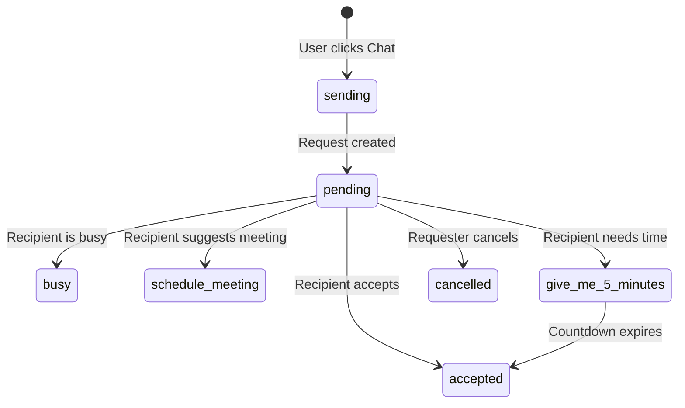
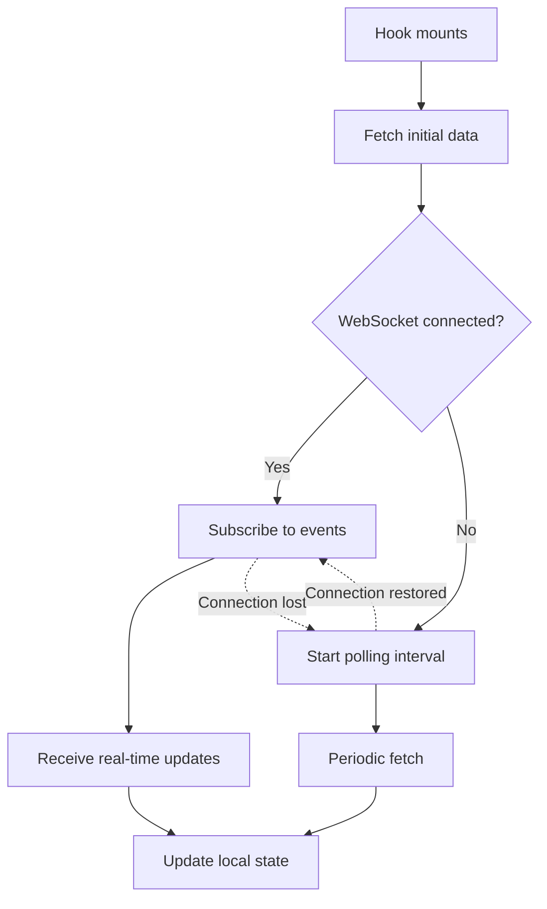
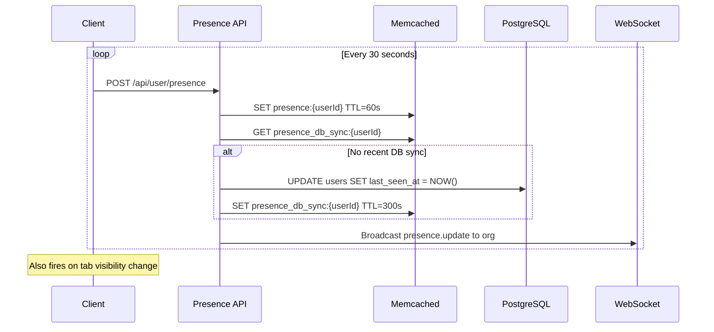
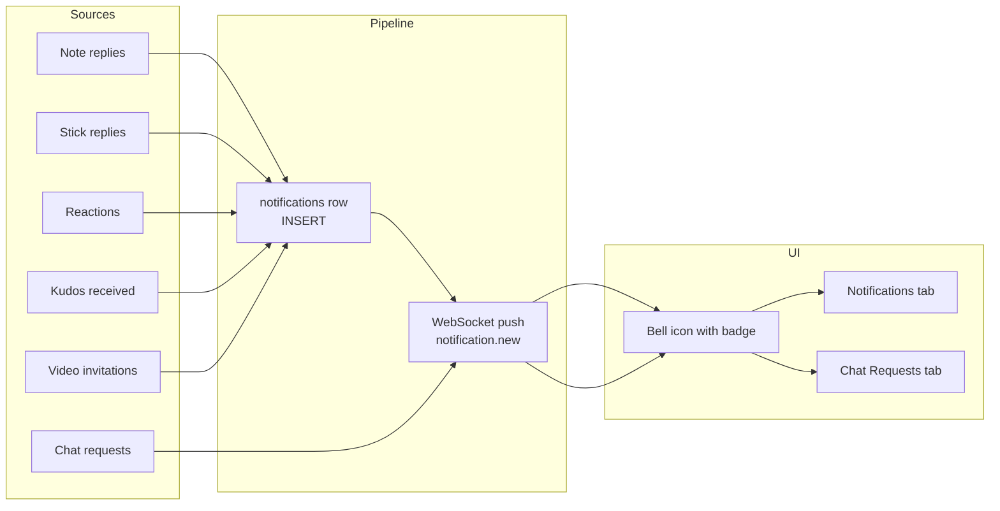

# Chapter 11: Chat, Presence, and Notifications

Chapter 10 built the pipe. The WebSocket server, the upgrade handshake, the JWT verification, the singleton client with exponential backoff, the in-process broadcasting via `globalThis.__wsBroadcast`. All plumbing.

This chapter covers what flows through it.

Stick My Note has three distinct chat systems, a presence tracker, and a notification pipeline. Each solves a different collaboration problem. Each makes a different reliability trade-off. And each exists because it was built when the previous system was not enough -- not because anyone sat down and designed three chat systems on a whiteboard.

That is the honest version. The planned-architecture version would have one unified messaging layer with different views. The real version has three systems that evolved from three different needs, and unifying them would mean rethinking the data model across a codebase that is already in production. Sometimes the pragmatic answer is to let each system do what it does well and document why there are three.

---

## Three Chat Systems

### Thread Messages: The Original

Thread messages came first. A user replies to a note. Another user replies to the reply. At some point the thread gets deep enough that the UI stops nesting and opens a chat modal instead. Messages are linked to a `parent_reply_id` -- a single parent reply anchors the entire conversation.

The transport is polling. Five-second intervals. Not WebSocket.

This was a deliberate choice, not a limitation. Thread messages are an extension of the note reply system, which is fundamentally a CRUD operation against the database. The user opens a modal, sees the conversation, types a message. The modal polls every five seconds for new messages. When they close the modal, polling stops. The data model is simple: a `chat_messages` table keyed on `parent_reply_id`, ordered by `created_at`.

```
// Thread message polling (simplified)
on modal open:
    fetch GET /chat/{parentReplyId}/messages
    start polling every 5 seconds
    
on send:
    POST /chat/{parentReplyId}/messages { content }
    append to local messages

on modal close:
    stop polling
```

No membership model. No read receipts. No typing indicators. If you can see the reply, you can open the chat. The simplicity is the feature.

### Chat Requests: The Invitation Protocol

Chat requests solve a different problem: "I want to talk to this person right now, but I need their permission first."

A user sees a reply and clicks "Chat." Instead of opening a conversation immediately, the system sends an invitation. The recipient gets a real-time push notification via WebSocket (`chat_request.new`). They can accept, decline, defer, or propose an alternative.

This is a state machine:



The "give me 5 minutes" response is worth pausing on. When the recipient selects this, the server computes a `wait_until` ISO timestamp five minutes in the future. The client receives this timestamp and runs a local countdown timer. When the countdown hits zero, the requester can proceed to chat.

```
// Server-side: setting the wait_until timestamp
on PATCH /chat-requests/{id} with status "give_me_5_minutes":
    wait_until = now + 5 minutes
    update record with { status, wait_until }
    push "chat_request.updated" to requester via WebSocket
```

The countdown is entirely client-side after that. No server polling during the countdown. The client just does arithmetic: `remaining = max(0, ceil((waitUntil - now) / 1000))` and decrements every second with `setInterval`.

### Stick Chats: The Persistent Channel

Stick chats are what most people think of when they think "chat." Persistent rooms. Membership lists. Group conversations. Direct messages. The full data model: `stick_chats` for rooms, `stick_chat_members` for membership, `stick_chat_messages` for content.

The transport is fully real-time. When a member sends a message, the server broadcasts a `chat.message` event to all other members via WebSocket. Message edits push `chat.message_edited`. The client subscribes on mount and updates the message list in-place.

```
// Stick chat real-time message flow (simplified)
on send message:
    POST /stick-chats/{chatId}/messages { content }
    server inserts to DB
    server fetches member user IDs
    server publishes "chat.message" to all other members
    
on receive WebSocket "chat.message":
    if payload.chatId matches current chat:
        append payload.message to local state
```

The broadcast targets only chat members, not the entire organization. The server calls `getChatMemberUserIds(chatId)`, filters out the sender, and uses `publishToUsers` to send the event to each remaining member's WebSocket connection. This is a targeted fan-out, not a broadcast flood.

Stick chats also have the richest feature set: message reactions, pinned messages, voice messages, message threading within the chat, typing indicators, and chat expiration with a cron cleanup job. Each of these features has its own API endpoint under `/stick-chats/{chatId}/`.

### Why Three Systems

It would be cleaner to have one. But the requirements are genuinely different.

Thread messages need no membership model -- anyone who can see the reply can chat. Chat requests need an invitation workflow -- you cannot just open a conversation with someone. Stick chats need persistent membership and real-time delivery.

Unifying them would mean either adding unnecessary complexity to the simple case (thread messages do not need membership checks) or removing necessary features from the complex case (stick chats need reactions and threading). The three systems share the same WebSocket transport (where applicable) and the same auth layer, but their data models and interaction patterns are different enough that forcing them together would create a worse abstraction than keeping them separate.

---

## Dual-Mode Reliability: WebSocket + Polling Fallback

Every real-time feature in this application follows the same pattern: prefer WebSocket, fall back to polling. The implementation is consistent enough to be called a pattern.



The hooks all follow the same structure. Here is the skeleton, visible in chat requests, notifications, presence, and user status:

```
function useFeature():
    state = initial empty state
    ws = useWebSocket()
    
    fetch = async () => GET /api/feature
    
    // Real-time: subscribe when connected
    if ws.connected:
        ws.subscribe("feature.update", handler)
    
    // Fallback: poll when disconnected
    if not ws.connected:
        setInterval(fetch, POLL_INTERVAL)
    
    return state
```

The critical detail is that polling only activates when the WebSocket is disconnected. The `wsConnected` boolean drives a `useEffect` that creates or clears the polling interval. When the WebSocket reconnects, the polling interval is cleaned up. When it disconnects again, polling restarts. The two modes never run simultaneously.

The polling intervals vary by feature priority:

| Feature | Polling interval | Rationale |
|---------|-----------------|-----------|
| Chat request status | 3 seconds | User is actively waiting for a response |
| Thread messages | 5 seconds | User has the chat modal open |
| Notifications | 30 seconds | Background awareness, not urgent |
| Presence | 30 seconds | Decorative indicator, not critical |
| User status | 30 seconds | Decorative indicator, not critical |

This is two-tier reliability. The first tier is WebSocket: sub-second delivery, minimal server load per event. The second tier is polling: guaranteed eventual consistency with a latency ceiling equal to the polling interval. The user gets the best experience when WebSocket is connected, and a degraded-but-functional experience when it is not.

---

## Presence Tracking

Presence answers one question: is this person online right now?

The architecture is a heartbeat loop. The client sends a POST to `/api/user/presence` every 30 seconds. The server writes to Memcached with a 60-second TTL. If the heartbeat stops, the key expires, and the user is offline.



Three design decisions stand out.

**Memcached as the source of truth for online status.** PostgreSQL stores `last_seen_at` for historical purposes, but the real-time "is this person online?" check reads from Memcached. The auto-expiring TTL means the system self-heals: if a client crashes without sending a final "offline" event, the key simply expires 60 seconds later. No stale state cleanup needed.

**Database writes are throttled.** The heartbeat fires every 30 seconds per user. Syncing to PostgreSQL on every heartbeat would mean one UPDATE per user per 30 seconds. Instead, a `presence_db_sync` cache key with a 300-second TTL gates the writes. The first heartbeat after 5 minutes syncs to the database; all others skip it. This reduces database write volume by roughly 10x.

**Silent failure.** The heartbeat client catches all errors and logs them at debug level. Presence is non-critical. If the API returns 500, or the network is down, or Memcached is unreachable, the heartbeat silently fails and tries again in 30 seconds. No error toasts, no retry queues, no user-visible impact.

The consumer side uses the same dual-mode pattern. The `useUserPresence` hook takes an array of user IDs, fetches their status from the GET endpoint, subscribes to `presence.update` WebSocket events, and falls back to 30-second polling when WebSocket is down. The chat room view uses this to render green/gray indicators on member avatars and display an online count in the header.

The visibility change handler is a small but meaningful optimization. When a user switches to another tab, heartbeats continue (the interval keeps running). When they switch back, an immediate heartbeat fires without waiting for the next interval. This means presence recovers instantly when a user returns to the application, rather than lagging up to 30 seconds.

---

## The Notification System

Notifications unify events from across the application into a single bell icon. The bell shows a combined count: unread notifications plus pending chat requests. Two tabs behind the popover separate them.



The data model is a single `notifications` table. Rows have a `type` column drawn from a small taxonomy (`reply`, `mention`, `pad_invite`, `pad_update`, `reaction`, `tag`, `kudos_received`, `video_call_invite`), a free-form `title` and `message`, and three pointer columns (`related_id`, `related_type`, `action_url`) that link the notification to whatever it is about. The `action_url` is what the bell navigates to on click -- for video invites, that is the room join URL; for replies, the reply anchor; for kudos, the recognition page.

Writers are scattered across the codebase by design. Kudos inserts directly from `lib/recognition/kudos.ts`. Task reminders insert from the automation scheduler. Video invites insert from the invite handler in `lib/livekit/participants.ts`. Each feature that wants to put something in the bell writes to the same table with its own `type`. There is no central "create notification" service that feature code has to route through. The table is the contract.

Readers are simpler. `GET /api/notifications` returns rows scoped to the current user and organization, ordered by `created_at DESC`. The SQL aliases `is_read AS read` and left-joins `users` to produce a `created_by_user` payload so the response matches the client's `NotificationWithUser` type exactly. No client-side transformation runs between "fetched row" and "rendered notification item." This was not always the case -- an earlier version of the hook mapped activity records from a different table through an `action_type` translation layer, and that mapper rotted out of sync with what the API actually returned. Deleting the translation was the repair. The lesson is that "flexible server, strict client" is cheap to design and expensive to maintain; aligning the API response shape with the UI type directly is the cheaper position over time.

The `notification-item` component dispatches icons and styles by `type`. New notification types require two lines: add the literal to the `NotificationType` union, add a case to the icon switch. Click navigation reuses `action_url` -- no per-type dispatch needed. The system grows by adding rows, not by adding code.

The bell count formula is straightforward:

```
totalCount = unreadNotificationCount + pendingChatRequestCount
```

Two separate hooks (`useNotifications` and `useChatRequests`) provide the two halves. The bell component combines them. Both hooks follow the dual-mode pattern: WebSocket when connected, polling when not.

### Focus Mode

Focus mode is a user-level setting that suppresses notification badges. When enabled, the bell icon changes from a filled bell to a muted bell-off icon with a red banner explaining that focus mode is active. The badge disappears entirely. The notifications are still there -- they are still fetched and displayed when the user opens the popover -- but the persistent visual indicator is gone.

This is intentionally simple. Focus mode does not filter notifications, delay them, or batch them. It hides the badge. The mental model is "I know there might be notifications, but I do not want to be pulled out of what I am doing." The implementation checks `effective.focus_mode_enabled` and renders a different icon component. One boolean drives the entire behavior.

Focus mode supports optional expiration. A user can set focus mode for 30 minutes, 1 hour, or indefinitely. The expiration is stored as an ISO timestamp on the user status record. A polling cycle detects when the expiration passes and automatically disables focus mode.

### Mark-All-Read

Bulk operations matter for notification systems. When a user returns after being away, they may have dozens of unread notifications. Clicking through each one individually is tedious.

The mark-all-read endpoint (`POST /api/notifications/mark-all-read`) updates all unread notifications for the user in a single database operation. The client optimistically updates the local state -- setting `read: true` on every notification and `unreadCount` to zero -- without waiting for the server response. If the server call fails, the next polling cycle or WebSocket event will correct the state.

---

## The Escalation Heuristic

The AI chat responder on inference pads needs to know when to stop being helpful and start involving a human. The solution — a trio of string-based heuristics that detect frustration through caps ratio, keyword matching, and exclamation density — is covered in detail in Chapter 13's discussion of the AIService. The short version: no ML model, no NLP pipeline, just arithmetic that ships today and works tonight. If the AI service is unavailable, the system defaults to escalation. It is biased toward involving humans when in doubt — the correct default for a customer-facing chat interface.

---

## Apply This

Five patterns from this chapter that transfer to any real-time application:

**1. Dual-mode delivery is a pattern, not a compromise.** WebSocket for speed, polling for reliability. The key insight is that they should not run simultaneously. Use a boolean to gate between them. When WebSocket reconnects, kill the polling interval. This prevents duplicate event processing and unnecessary server load.

**2. Let chat systems evolve independently.** Share the transport layer and auth, but let data models diverge. A thread message that requires a membership check is worse than two separate systems.

**3. Use auto-expiring cache keys for ephemeral state.** Presence, typing indicators, "currently viewing" markers — the TTL is your cleanup mechanism. No cron jobs, no garbage collection. Match write frequency to query frequency, not to event frequency.

**5. Simple heuristics beat absent heuristics.** The caps-ratio escalation detector is not sophisticated. It does not need to be. It catches the 80% case with zero infrastructure cost. You can always add ML-based sentiment analysis later; in the meantime, `capsCount / messageLength > 0.7` ships today and works tonight.

---

*The next chapter moves from text to video. Chapter 12 covers the self-hosted LiveKit integration: how the SFU runs on a dedicated server, how Caddy terminates TLS on a non-standard port, how room tokens are minted server-side, and why all media stays on the local network. The WebSocket infrastructure from Chapter 10 carries signaling; LiveKit carries the streams.*
