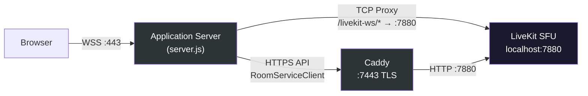
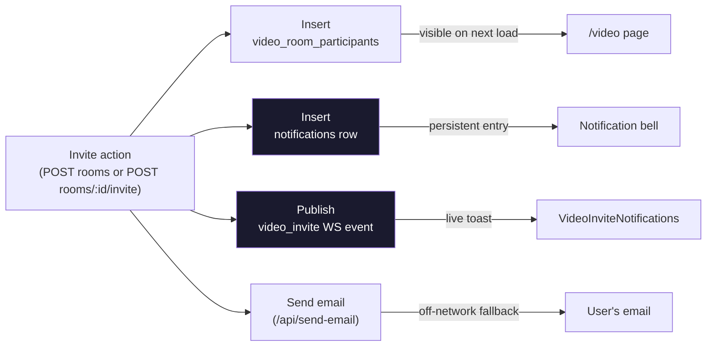
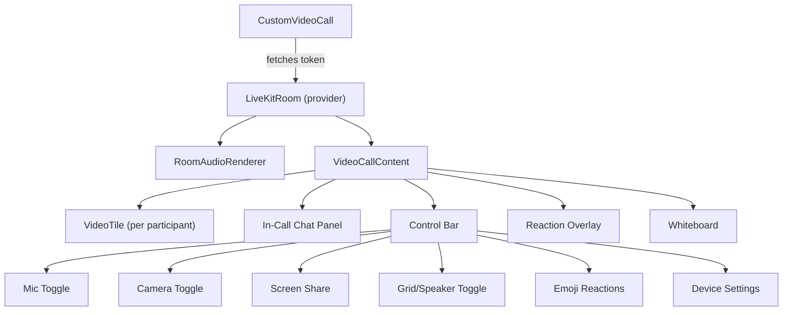

# Chapter 12: Video with LiveKit

Chapter 11 built the text layer of real-time collaboration: chat messages, presence heartbeats, notification bells. Users can type to each other in milliseconds. But text is not enough. When a radiologist needs to walk a surgeon through an MRI scan, when an engineer needs to point at a specific line of code during a design review, when a lawyer needs to read a witness's face during deposition prep -- they need video. And video is the ultimate sovereignty test.

Text messages are small. A chat message is a few hundred bytes. You can encrypt it, store it, audit it, and delete it with straightforward tooling. Video is different. A single participant's camera feed generates megabits per second of raw media. A screen share doubles it. A five-person call with screen sharing can saturate a 50 Mbps link. This volume of data cannot be casually routed through external servers and still claim sovereignty. If a single video frame of a patient's medical record transits through a cloud provider's media relay in Virginia, your HIPAA compliance argument has a hole in it.

Stick My Note originally used Daily.co for video conferencing. Daily.co is a fine service. It handles the hard parts -- TURN servers, codec negotiation, bandwidth estimation, echo cancellation. But it routes media through its own infrastructure. The frames leave your network, traverse Daily.co's servers, and come back. For organizations where data residency is a checkbox on an audit form, this is a non-starter.

The replacement is LiveKit, an open-source Selective Forwarding Unit that runs on your own hardware. Every video frame, every audio sample, every screen share pixel stays on the private subnet. The browser connects to the application server, the application server proxies to the LiveKit server, and media never crosses the network boundary. This chapter explains how that works, from the infrastructure layer up through the custom UI.

---

## Infrastructure: A Dedicated Video Server

LiveKit runs on its own machine, separate from the application server. This is not over-engineering. Video conferencing is CPU-intensive in bursts: encoding, decoding, and forwarding media streams for multiple participants generates load patterns that would interfere with the application server's ability to handle HTTP requests and WebSocket connections. Isolation means a ten-person video call cannot starve the chat system of CPU time.

The architecture has three layers:



LiveKit listens on port 7880 with no TLS. This is not a limitation we chose -- it is a limitation of the version deployed. The SFU binary does not handle certificate management natively. Rather than patching LiveKit or waiting for upstream TLS support, we put Caddy in front of it.

Caddy is a reverse proxy that does one thing exceptionally well: TLS termination with zero configuration. Point it at a certificate and key pair, tell it where to forward traffic, and it handles the rest. On the video server, Caddy listens on port 7443 with TLS and forwards to LiveKit on localhost:7880 over plain HTTP. The server-side SDK (used for room management and token generation) talks to Caddy's HTTPS endpoint. Browser WebSocket connections take a different path, which we will cover in the proxy section.

Why Caddy instead of nginx? Caddy's configuration for this use case is approximately four lines. Nginx would work, but it would require a configuration file ten times longer for the same result. When your only job is TLS termination for a single upstream, Caddy is the right tool.

---

## Token Generation: Server-Side Only

No client should ever hold the LiveKit API secret. Tokens are generated server-side, scoped to a specific room and participant, and returned to the browser as short-lived JWTs.

The token endpoint authenticates the user, looks up their display name, and mints a token:

```
GET /api/video/token?roomName=<livekit-room-name>

1. Authenticate request via session cookie
2. Query user profile for display name
3. Create AccessToken with:
   - identity: user ID (unique per participant)
   - name: display name (shown in UI)
   - ttl: 6 hours
   - grants: roomJoin, canPublish, canSubscribe, canPublishData
4. Return signed JWT
```

The grants deserve attention. `roomJoin` allows entering the room. `canPublish` allows sending audio and video. `canSubscribe` allows receiving other participants' streams. `canPublishData` enables the data channel, which is used for screen sharing signaling and emoji reactions. All four are granted to every authenticated user. A more restrictive system might withhold `canPublish` for observer-only participants, but the current design treats every participant as a full peer.

The six-hour TTL is generous. Most video calls last under an hour. But the token must outlive the call because LiveKit uses it for reconnection. If a participant's network drops and they rejoin thirty minutes later, the original token must still be valid. Six hours provides that buffer without creating tokens that linger indefinitely.

The `livekit-server-sdk` package that mints these tokens is heavy and server-only. It has native Node.js dependencies that cannot be bundled by Next.js's webpack build. The solution is to externalize it in both the Next.js configuration and the webpack config -- declaring it in `serverExternalPackages` and pushing it onto the webpack `externals` array. Without both declarations, the build either fails with missing native modules or silently bundles a broken version.

---

## Room Management

Rooms are created through the LiveKit server API and tracked in the database:

```
createVideoRoom(name, userId):
  1. Generate unique room name (timestamp + random suffix)
  2. Call LiveKit RoomServiceClient.createRoom:
     - emptyTimeout: 300 seconds (auto-delete 5 min after last participant leaves)
     - maxParticipants: 10
  3. On LiveKit API failure: log error, continue (non-fatal)
  4. INSERT into video_rooms table with livekit_room_name
  5. Set room_url to /video/join/<database-id>
  6. Return { id, room_url, livekit_room_name }
```

Step 3 is the interesting design choice. If the LiveKit server is temporarily unreachable -- a network blip, a restart, a misconfigured firewall rule -- the room creation still succeeds at the database level. LiveKit auto-creates rooms when the first participant joins with a valid token, so the room will exist on the SFU by the time anyone tries to connect. The explicit `createRoom` call is a preference, not a requirement. It lets us set `emptyTimeout` and `maxParticipants` proactively, but the system degrades gracefully without it.

The five-minute empty timeout is a cleanup mechanism. Without it, phantom rooms accumulate on the LiveKit server. When the last participant leaves a room, LiveKit waits five minutes and then destroys it. This handles the common case where someone accidentally disconnects and immediately rejoins -- the room is still there. But it also means abandoned rooms do not persist indefinitely.

Room URLs use the internal format `/video/join/<database-id>`. This replaced the old Daily.co pattern where URLs pointed to an external domain. The migration script added a `livekit_room_name` column to the existing `video_rooms` table and back-filled it by extracting the room identifier from legacy Daily.co URLs. Existing room records survived the transition; only the video provider changed underneath.

---

## Invitations and Participants

The original video model was creator-only. A user created a room, got a URL, and emailed that URL to whoever they wanted to join. The invitees never appeared in the creator's "Your Video Rooms" list on the sending side, and more critically, the invited users did not see the room anywhere in their own UI. They had to find the email, click the link, and hope the room still existed. Invitations left no trace in the application.

The fix required a participants table.

```sql
CREATE TABLE video_room_participants (
    id UUID PRIMARY KEY,
    room_id UUID NOT NULL REFERENCES video_rooms(id) ON DELETE CASCADE,
    user_id UUID REFERENCES users(id) ON DELETE CASCADE,
    email TEXT,
    invited_by UUID REFERENCES users(id) ON DELETE SET NULL,
    status TEXT NOT NULL DEFAULT 'invited',  -- invited | joined | declined | left
    created_at TIMESTAMPTZ DEFAULT NOW(),
    updated_at TIMESTAMPTZ DEFAULT NOW(),
    CHECK (user_id IS NOT NULL OR email IS NOT NULL)
);
```

Two fields are nullable for a reason. `user_id` is null when the invitee is an LDAP-only user who has never signed in — the application knows their email from Active Directory but has no row for them in the `users` table yet. `email` is null when the invitee was picked from a search result that only had a user ID. The `CHECK` constraint ensures at least one identifier is present. Uniqueness is enforced by two partial indexes: one on `(room_id, user_id)` where `user_id IS NOT NULL`, another on `(room_id, LOWER(email))` where `email IS NOT NULL AND user_id IS NULL`. This prevents duplicate invites without forcing NULL into a single unique constraint, which PostgreSQL would happily accept multiple copies of.

With the table in place, `GET /api/video/rooms` changed from "rooms I created" to a UNION:

```sql
SELECT vr.*, 'owner'::text AS role
  FROM video_rooms vr
 WHERE vr.created_by = $1
UNION ALL
SELECT vr.*, 'invitee'::text AS role
  FROM video_rooms vr
  JOIN video_room_participants vrp ON vrp.room_id = vr.id
 WHERE vrp.user_id = $1 AND vr.created_by <> $1
   AND vrp.status IN ('invited', 'joined')
 ORDER BY created_at DESC
```

The `role` column lets the client render different controls per row. Owners see "Invite More People" and "Delete Room." Invitees see only "Copy Link" and "Join Room" -- they cannot delete a room they did not create, and the API enforces that with a `created_by = user.id` check on the DELETE endpoint.

Four endpoints handle the invite lifecycle:

| Endpoint | Purpose |
| -------- | ------- |
| `POST /api/video/rooms` | Create room, accept initial invitees in the body |
| `POST /api/video/rooms/:id/invite` | Add more invitees to an existing room (creator-only) |
| `PATCH /api/video/rooms/:id/participants` | Self-update status (`joined` / `declined` / `left`) |
| `GET /api/video/invites/pending` | Count and list of unfinished invitations for the current user |

The RSVP endpoint is a single-row UPDATE scoped by `room_id` and `user_id = auth.user.id`. There is no admin override, no "mark someone else as joined" operation. If you need to know whether a specific user accepted, you read the row they wrote. This keeps the permission model trivial.

Status transitions happen at natural UI inflection points. Visiting `/video/join/<roomId>` as an invitee automatically PATCHes to `joined`. Dismissing the invite toast sends `declined`. The "Leave" button in the call could mark `left`, but currently doesn't -- a minor gap that does not affect functionality, since the LiveKit SFU knows who is actually connected.

---

## Invitation Notifications

An invite that only surfaces next time the user opens `/video` is not really an invitation. It is a database row. A real invitation reaches the user wherever they are in the application and gives them a one-click path to the room.

This is why the invite pipeline fans out to three destinations:



The four destinations are deliberately redundant. Each one handles a user state the others miss. A user who is in the app right now sees the live toast (WS). A user who stepped away for coffee sees the bell entry when they return (notifications row). A user who was offline for the day sees the room in "Your Video Rooms" when they next open `/video` (participants row). A user who left for the weekend and does not open the app gets the email. Remove any one layer and some cohort of users silently misses invitations.

All four happen fire-and-forget. If the WebSocket push fails, it gets logged but does not block the HTTP response. If the email service is down, the notification row is still inserted. The only failure that cascades is the participants insert itself -- and that is transactional with the HTTP response.

The `video_invite` WebSocket event carries just enough payload to render a toast without another round trip:

```json
{
  "type": "video_invite",
  "payload": {
    "roomId": "...",
    "roomName": "...",
    "roomUrl": "https://stickmynote.com/video/join/...",
    "invitedBy": { "id": "...", "name": "..." }
  },
  "timestamp": 1745000000000
}
```

The client's `VideoInviteNotifications` component is mounted in the root layout, so it listens on every page. When an invite arrives, it renders a toast with Join and Dismiss buttons. Join sends `{status: "joined"}` to the RSVP endpoint and opens the room URL in a new tab. Dismiss sends `{status: "declined"}` and hides the toast. The toast auto-dismisses after 20 seconds without declining -- the user might be looking at something else, and auto-declining on a missed toast would be user-hostile.

The notifications row uses `type: 'video_call_invite'` with the room URL in `action_url` and the room ID in `related_id`. When the user clicks the bell entry, the generic notification-item handler navigates to `action_url`. The video chapter needs no special client code for the bell -- the notification-item icon switch renders a Video icon for the `video_call_invite` type and the existing click handler does the rest.

---

## The WebSocket Proxy

LiveKit's browser SDK needs a WebSocket connection to the LiveKit server, but the browser can only connect to the application server's domain. The LiveKit server sits on a different machine on the internal network, unreachable from the browser.

The solution — a transparent TCP proxy at `/livekit-ws/*` in `server.js` — is covered in detail in Chapter 10's discussion of the WebSocket server architecture. The short version: strip the path prefix, pipe raw bytes bidirectionally between client and LiveKit, close both sides on error. No inspection, no buffering, no modification. The same proxy handles both WebSocket upgrades and plain HTTP requests that LiveKit's SDK occasionally makes.

This proxy pattern is reusable for any internal service that needs browser access but cannot be exposed directly. A few dozen lines of Node.js socket piping, inside the server you already run, handles it cleanly.

---

## The Video Call UI

The client-side implementation wraps LiveKit's React SDK with a custom interface. The component hierarchy looks like this:



`CustomVideoCall` is the entry point. It takes a LiveKit room name, fetches a token from the API, and renders the `LiveKitRoom` provider once the token arrives. Everything inside the provider has access to LiveKit's hooks: `useParticipants`, `useLocalParticipant`, `useSpeakingParticipants`, `useChat`, `useDataChannel`.

**Speaker detection** drives the UI. `useSpeakingParticipants` returns a list of participants whose audio levels exceed a threshold. In speaker layout mode, the active speaker gets the large tile while everyone else appears in a sidebar strip. In grid layout, the active speaker's tile gets a green ring border. This is cosmetic but matters -- in a five-person call, knowing who is talking without checking every tile reduces cognitive load.

**Video tiles** handle their own track attachment. Each tile receives a participant object, attaches the camera and microphone tracks to native `<video>` and `<audio>` elements, and detaches on cleanup. Local video is mirrored (CSS `scaleX(-1)`) because people expect to see themselves as in a mirror. Remote video is not mirrored. Connection quality indicators (excellent, poor, lost) appear in the corner of each tile based on LiveKit's quality reporting.

**Emoji reactions** use LiveKit's data channel, not the WebSocket server from Chapter 10. When a user clicks a reaction emoji, the component encodes it as JSON and broadcasts it via `useDataChannel("reaction")`. Every participant receives the payload, decodes the emoji, and renders it as a floating animation that rises from the bottom of the screen and disappears after two seconds. This is deliberately fire-and-forget: if a reaction is lost to a network blip, nobody notices. It is not worth the complexity of guaranteed delivery for a thumbs-up emoji.

**In-call chat** uses LiveKit's built-in `useChat` hook. Messages are sent through the LiveKit data channel, not through the application's chat system from Chapter 11. This means in-call messages do not persist after the call ends. This is intentional -- the in-call chat is ephemeral, for quick coordination during the meeting. Persistent discussion belongs in the stick chat system.

**Background effects** use LiveKit's track processor API. The component can apply background blur (Gaussian blur behind the participant) or virtual backgrounds (replacing the background with a preset image). The processor attaches to the local video track and runs in the browser -- no server-side processing needed. Switching effects stops the current processor and attaches a new one, which occasionally causes a brief flicker as the video pipeline reconfigures.

**Device selection** wraps `useMediaDeviceSelect` from the LiveKit SDK, providing dropdowns for camera, microphone, and speakers. When a user switches devices mid-call, the SDK handles the track replacement transparently.

The quick call modal provides fast room creation for spontaneous conversations. It creates a room via the API, receives the LiveKit room name in the response, and immediately opens a video room modal. The modal can also be opened from a shared room URL (`/video/join/<room-id>`), which resolves the database room ID to a LiveKit room name before connecting.

---

## The Migration from Daily.co

The migration from a cloud-hosted video provider to a self-hosted one was not a rewrite. It was a provider swap behind stable interfaces.

The `video_rooms` database table already existed. It had a `room_url` column that pointed to Daily.co URLs like `https://stickmynote.daily.co/abc123`. The migration added a `livekit_room_name` column and back-filled it by extracting the room identifier from the old Daily.co URLs. Existing rooms kept their database IDs and metadata. Only the video transport changed.

On the client side, the `VideoRoomModal` component previously embedded a Daily.co iframe. It now renders a `LiveKitRoom` provider with native controls. The component's public interface -- `roomUrl`, `onClose` -- did not change. Callers that opened video rooms did not need modification.

The token endpoint was new. Daily.co handled its own authentication; LiveKit requires the application to mint tokens. This was the primary new server-side code.

Recording and transcription were deferred. Daily.co offered cloud-based recording out of the box. LiveKit supports recording through its Egress API, which can export to a file or stream to an RTMP endpoint. The planned approach is to pipe Egress output through Whisper (running on the Ollama server) for transcription. This is a follow-up project, not a launch requirement. The sovereignty argument is actually stronger here: recorded meetings stored on your own disk, transcribed by your own AI, searchable in your own knowledge base. No third-party processing of sensitive meeting content.

---

## Apply This

**1. TLS termination as a separate concern.** When a service does not support native TLS, do not patch the service. Put a lightweight reverse proxy in front of it. Caddy and similar tools handle certificate management with minimal configuration. This pattern works for any internal service that needs encrypted transport: databases, message queues, monitoring dashboards.

**2. Transparent proxying for internal services.** If the browser can only reach your main server but needs to talk to an internal service, proxy at the TCP level. Do not try to interpret or transform the traffic. Strip the path prefix, pipe bytes in both directions, close gracefully on error. This works for WebSocket connections, Server-Sent Events, or any long-lived HTTP connection.

**3. Graceful degradation on service creation.** When creating a resource on an external service (LiveKit room, email via SMTP, webhook registration), catch the failure and continue with the local record. If the external service auto-creates on first use, the explicit creation is an optimization, not a requirement. Your database should be the source of truth, not the external service.

**4. Ephemeral data channels for non-critical communication.** Not everything needs guaranteed delivery. Emoji reactions, typing indicators, cursor positions -- these are transient signals where loss is invisible. Use fire-and-forget channels (LiveKit data channels, WebSocket broadcasts without acknowledgment) for data where missing one update has no consequence.

**5. Provider swaps behind stable interfaces.** When you know a dependency might change (and cloud-to-self-hosted migrations are increasingly common), keep the component interface stable. The callers that open a video modal should not know or care whether the video comes from Daily.co, LiveKit, or Jitsi. The `roomUrl` and `onClose` props survived the migration unchanged. Design for the interface, not the provider.

---

*Part IV is complete. The real-time stack -- WebSocket for text, LiveKit for media -- keeps collaboration alive without leaving the network. But collaboration generates questions, and questions need answers. Part V explores the intelligence layer: how Stick My Note uses locally-hosted AI models to extract tags, summarize content, detect duplicates, and build a knowledge base -- all without a single API call crossing the network boundary. Chapter 13 begins with the Ollama-first provider hierarchy and why the system tries the local model before reaching for the cloud.*
