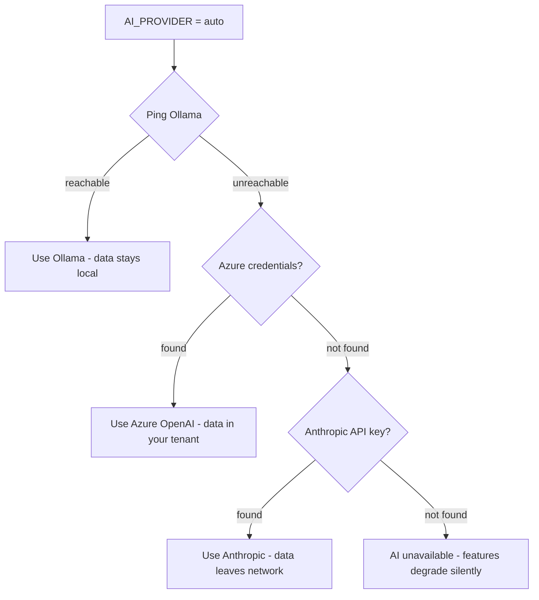
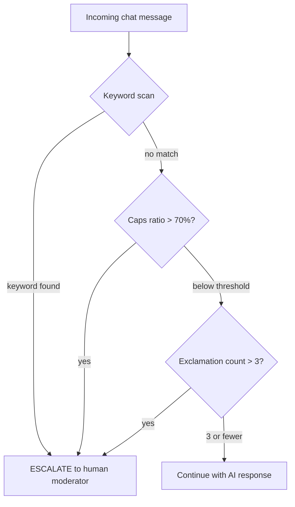

# Chapter 13: The Ollama-First AI Architecture

*Part V: Intelligence*

> *"AI that never phones home."*

---

Part IV closed with real-time collaboration — WebSockets pushing sticky updates, LiveKit routing video frames, every byte staying on the private network. That infrastructure was built with a specific promise: your data never leaves. Now we test that promise with the hardest case. Artificial intelligence wants to see everything. It wants your text, your discussions, your uploaded documents. It wants to send all of it to a GPU cluster in Virginia or Dublin and return a neat summary. We are going to refuse.

When a doctor pastes patient notes into an AI assistant, those notes cannot leave the hospital network. When an engineer asks AI to summarize a proprietary design discussion, that discussion cannot reach a cloud API. When a teacher uses AI to generate follow-up questions from student work, those questions — and the student work that informed them — must stay on premises. These are not hypothetical concerns. They are the reason this chapter exists.

Stick My Note solves this by making Ollama — a self-hosted AI inference engine — the default and preferred provider. The AI runs on the same private network as the database, the video server, and the application itself. A dedicated machine on the LAN pulls open-weight models and serves inference over a plain HTTP API. No API keys leave the building. No prompts cross the firewall. The architecture treats cloud AI the way a hospital treats an outside consultant: available if you explicitly invite them, but never assumed, and never given unsupervised access.

This chapter traces how that architecture works in practice — from the provider fallback chain that tries local inference first, to the pragmatic decision to call Ollama's HTTP API directly before reaching for an SDK, to the twelve static methods that give every feature in the application access to intelligence without coupling any of them to a specific model or vendor.

---

## The Provider Hierarchy: Privacy as Default

Most AI integrations start with a cloud API key. You sign up for OpenAI or Anthropic, paste a key into your environment, and start making requests. The local option, if it exists at all, is an afterthought — a development convenience documented in a footnote.

Stick My Note inverts this. The provider hierarchy is explicit and ordered:

1. **Ollama** — local inference on the private network. No data leaves.
2. **Azure OpenAI** — private endpoint deployment. Data stays within your Azure tenant.
3. **Anthropic Claude** — public cloud API. Data leaves your network.

A single environment variable controls the selection: `AI_PROVIDER` accepts `"ollama"`, `"azure"`, `"anthropic"`, or `"auto"`. The default is `"ollama"`. The `"auto"` mode tries feature detection — it pings Ollama first, checks for Azure credentials second, and falls back to Anthropic third. In practice, most deployments set `"ollama"` and never change it.



The bottom of that diagram matters. When no provider is available, AI features degrade rather than fail. A sticky note that would have received auto-generated tags simply gets no tags. A chat message that would have triggered a suggested reply shows no suggestions. The application remains fully functional. AI is an enhancement layer, not a dependency.

This is a deliberate architectural choice. If AI were wired into the critical path — if creating a sticky note *required* a summarization call — then an Ollama server reboot would take down the entire application. By keeping AI optional at every integration point, the system tolerates infrastructure failures gracefully. The AI server can be offline for maintenance, overloaded with a long-running inference, or simply not yet deployed. The application does not care.

### Why This Order

The ordering is not alphabetical or arbitrary. It encodes a policy: **prefer the option that keeps data closest to home.**

Ollama runs on a dedicated machine on the LAN. The request travels across a switch, not a router. There is no TLS termination to a cloud endpoint, no API key rotation, no usage-based billing, no terms of service that grant the provider rights to your prompts for model improvement. The data stays in the same building as the user who created it.

Azure OpenAI occupies the middle ground. If your organization has an Azure tenant with a private endpoint deployment, inference requests stay within your cloud boundary. The data technically leaves your physical premises but remains within your contractual and compliance boundary. For organizations that already run workloads in Azure, this is an acceptable compromise.

Anthropic Claude is the escape hatch. It is a public cloud API. Your prompts cross the internet. You are subject to Anthropic's data retention and usage policies. For many organizations, this is perfectly acceptable. For the doctor with patient notes, it is not. The architecture respects both positions by making the cloud option available but never default.

---

## Direct API Before SDK: The Surprising Decision

The Vercel AI SDK provides a clean abstraction over multiple AI providers. You call `generateText()`, pass a model identifier, and the SDK handles the rest — streaming, retries, token counting. It even ships with an Ollama adapter. The obvious architecture is to use the SDK everywhere and swap providers via configuration.

Stick My Note does not do this. Or rather, it does this *second*.

The code tries Ollama's raw HTTP API first — a direct `fetch()` call to the `/api/generate` endpoint — and only falls back to the SDK if the direct call fails. This looks like a mistake. It is not.

```typescript
// Pseudocode — illustrates the dual-attempt pattern
async function callOllama(prompt, model) {
  // Attempt 1: Direct HTTP API
  try {
    const response = await fetch('http://ollama-host:11434/api/generate', {
      method: 'POST',
      headers: { 'Content-Type': 'application/json' },
      body: JSON.stringify({
        model: model,
        prompt: prompt,
        stream: false
      }),
      signal: AbortSignal.timeout(60_000)
    })
    if (response.ok) {
      const data = await response.json()
      return data.response
    }
  } catch (directError) {
    // Log but don't throw — fall through to SDK
  }

  // Attempt 2: Vercel AI SDK with Ollama adapter
  const result = await generateText({
    model: ollamaProvider(model),
    prompt: prompt
  })
  return result.text
}
```

Three reasons justify this ordering.

**Reliability across Ollama versions.** Ollama's HTTP API has remained stable across major versions. The SDK adapter, by contrast, must track both the SDK's interface changes and Ollama's API changes. In practice, certain Ollama versions introduced response format changes that the SDK adapter had not yet accommodated. The direct API call, being a simple HTTP POST with a JSON body, is immune to adapter version mismatches.

**Better error diagnostics.** When the direct API fails, you get an HTTP status code and a plain-text error message from Ollama itself. When the SDK fails, you get an error that has been caught, wrapped, and re-thrown through multiple abstraction layers. The direct API error says "model 'llama3:8b' not found." The SDK error says "An error occurred while processing your request." One of these is actionable.

**The 60-second timeout.** Local models on modest hardware are slow. An 8-billion parameter model running on a server without a dedicated GPU might take 30-45 seconds to generate a summary. The direct API call sets an explicit 60-second timeout via `AbortSignal.timeout()`. This is a deliberate accommodation: the system would rather wait a full minute for a local, private response than fail fast and escalate to a cloud provider. The timeout is a policy statement disguised as a technical parameter.

The SDK fallback is not wasted code. It provides streaming support for features that benefit from it (like the chat responder) and handles the Azure and Anthropic providers where a direct API would mean writing and maintaining HTTP clients for each vendor's authentication scheme. The architecture uses each tool where it is strongest: raw HTTP for the simple, stable, local case; the SDK for the complex, multi-vendor, streaming case.

---

## The Twelve Methods of AIService

Every AI capability in Stick My Note flows through a single service class. The class is entirely static — no constructor, no instance state, no dependency injection. You call `AIService.generateTags(content)` and you get tags back. You do not instantiate an AI service, configure it, or manage its lifecycle. The provider selection, model choice, timeout handling, and error recovery are all internal.

This is a deliberate design. AI capabilities are utility functions, not stateful services. They take input, produce output, and maintain no memory between calls. Making them static methods on a single class provides discoverability (your IDE's autocomplete shows all twelve methods) without the ceremony of instantiation or the confusion of shared state.

The twelve methods partition into four functional groups.

### Content Intelligence

**`generateTags(content)`** extracts three to five relevant tags from a sticky note's content. The prompt is specific: it asks for single-word or short-phrase tags, separated by commas, with no explanation. The result is split on commas and trimmed. If the model returns a paragraph of explanation followed by the tags (a common failure mode with instruction-following models), the parser looks for the comma-separated portion and discards the rest.

**`summarizeContent(content)`** condenses text to a maximum of 150 characters. This powers the preview text shown on sticky note cards in grid view. The constraint is hard: any response longer than 150 characters is truncated at the last word boundary. The model is instructed to be concise, but the truncation is a safety net for models that ignore length instructions.

**`categorizeStick(content, categories)`** assigns a sticky note to one of the available categories. The prompt includes the full category list, and the model must respond with exactly one category name. If the response does not match any known category, the note goes uncategorized. There is no fuzzy matching — the model either gets it right or the feature silently declines to act.

### Duplicate Detection

**`checkDuplicate(content, existingSticks)`** compares new content against existing sticky notes and reports whether a probable duplicate exists. The response uses a structured delimiter format:

```
DUPLICATE: yes
SIMILAR_TO_ID: abc-123-def
SIMILARITY: 85
REASON: Both notes describe the same server migration timeline
```

The parser reads each line, splits on the first colon, and builds a result object. If `SIMILARITY` parses to a number above 80, the duplicate flag is raised. If it does not parse — if the model writes "SIMILARITY: quite high" — the parser defaults to 0 and the duplicate check returns negative. This is the correct failure mode: a missed duplicate is a minor inconvenience; a false positive that prevents note creation is a workflow interruption.

### Discussion Intelligence

This group powers the real-time collaboration features introduced in Part IV.

**`suggestReplies(thread)`** generates three contextual reply suggestions for a discussion thread. The suggestions appear as quick-reply buttons below the latest message. The prompt includes the last several messages in the thread and asks for three brief, relevant responses. Users can click a suggestion or ignore them entirely.

**`analyzeSentiment(content)`** classifies text as positive, neutral, or negative. This feeds the discussion health indicator — a subtle color-coded dot on active threads. It is intentionally coarse. Three categories are enough to flag a thread that is going sideways. Fine-grained sentiment (on a 1-10 scale, or with emotion labels) would imply a precision that local models cannot reliably deliver.

**`generateLiveSummary(messages)`** produces a running summary of a discussion thread. As threads grow beyond ten or fifteen messages, the summary helps late joiners catch up without reading the entire history. The summary is regenerated when new messages arrive, not on every render — a distinction that matters when the inference takes thirty seconds.

**`extractActionItems(messages)`** parses a discussion for tasks, commitments, and follow-ups. The response format uses delimiters again:

```
ACTION: Deploy updated configuration to staging
ASSIGNEE: implied from context
STATUS: pending
---
ACTION: Review database migration script
ASSIGNEE: Chris
STATUS: completed
```

The triple-dash separator between items is more robust than asking the model to produce a JSON array. If the model omits a field, the parser fills a default. If it adds an unexpected field, the parser ignores it. The format degrades gracefully under model imperfection.

**`generateNextQuestions(content)`** suggests follow-up questions based on a discussion's content. This is the "what should we talk about next" feature — useful for meetings that have stalled or brainstorming sessions that need a nudge.

### Q&A and Summarization

**`answerPadQuestion(question, sticks)`** is the most ambitious method. Given a question and the full set of sticky notes on a pad, it generates an answer with citations. The response references specific sticks by their content, allowing the UI to highlight the source material. This transforms a pad from a collection of notes into a queryable knowledge base.

**The URL summarizer** fetches a web article, extracts its text content, and passes it through the summarization pipeline. It is the one method that reaches outside the local network — to fetch the article itself — but the summarization still runs locally. The fetched content is not sent to a cloud AI provider.

**The chat AI responder** generates real-time responses in chat channels where AI participation is enabled. This method uses the streaming capability of the SDK fallback path, pushing tokens to the client as they are generated rather than waiting for the full response. It also integrates the escalation detection system described in the next section.

---

## Structured Prompts and Delimiter Parsing

A recurring theme across all twelve methods is the avoidance of JSON in model responses. This deserves explanation because JSON is the obvious choice. Every AI SDK tutorial shows JSON mode. OpenAI and Anthropic both offer structured output features that guarantee valid JSON. Why use delimiters?

Because Ollama running `llama3:8b` on a server without a GPU does not reliably produce valid JSON.

The failure modes are instructive. A model asked to produce `{"duplicate": true, "similarity": 85}` might return:

- `{"duplicate": true, "similarity": 85}` — correct, works fine
- `{"duplicate": True, "similarity": 85}` — Python boolean, invalid JSON
- `Here's my analysis:\n{"duplicate": true, "similarity": 85}` — preamble before JSON
- `{"duplicate": true, "similarity": 85, }` — trailing comma
- `{duplicate: true, similarity: 85}` — unquoted keys

Each failure mode requires a different workaround. You can strip preambles, fix trailing commas, quote keys, normalize booleans — but you are now writing a fault-tolerant JSON parser that handles the specific ways your specific model fails. And those failure modes change when you swap models.

The delimiter format sidesteps the entire problem:

```
DUPLICATE: yes
SIMILAR_TO_ID: abc-123-def
SIMILARITY: 85
```

Line-based parsing is trivial: split on newlines, split each line on the first colon, trim whitespace. If a line is malformed, skip it. If a value does not parse as the expected type, use a default. The label is always present even when the value is garbage, so you know *which* field failed. A response of "SIMILARITY: roughly eighty percent" tells you the model understood the question but answered in natural language. You can log it, default to zero, and move on. The equivalent JSON failure — a syntax error somewhere in a nested object — tells you nothing about which field caused the problem.

This is not an argument against JSON in general. Cloud models with structured output guarantees produce valid JSON reliably. But an architecture that claims to be Ollama-first must work well with Ollama's models, including the smaller and less instruction-tuned variants. Delimiter parsing is the pragmatic choice for that reality.

---

## Escalation Detection: Heuristics That Work

The chat AI responder includes an escalation detection system. When a user's message suggests frustration, urgency, or a desire to speak with a human, the system flags the conversation for human attention. The implementation is delightfully unsophisticated.

```typescript
// Pseudocode — illustrates the escalation heuristic
function detectEscalation(message) {
  // Check 1: Keyword matching
  const keywords = [
    'speak to human', 'talk to someone', 'real person',
    'angry', 'furious', 'unacceptable',
    'complaint', 'formal complaint',
    'legal', 'lawyer', 'sue'
  ]
  if (keywords.some(kw => message.toLowerCase().includes(kw))) {
    return { escalate: true, reason: 'keyword_match' }
  }

  // Check 2: Caps ratio (ALL CAPS = frustrated)
  const letters = message.replace(/[^a-zA-Z]/g, '')
  const capsRatio = letters.length > 0
    ? (letters.replace(/[^A-Z]/g, '').length / letters.length)
    : 0
  if (capsRatio > 0.7 && message.length > 10) {
    return { escalate: true, reason: 'caps_ratio' }
  }

  // Check 3: Exclamation density
  const exclamations = (message.match(/!/g) || []).length
  if (exclamations > 3) {
    return { escalate: true, reason: 'exclamation_density' }
  }

  return { escalate: false }
}
```

Three checks. No machine learning. No sentiment model. No NLP pipeline.

**Keyword matching** catches explicit requests ("speak to a human") and emotional language ("unacceptable", "furious"). The keyword list is deliberately conservative — it catches obvious cases rather than trying to infer frustration from subtle cues. A false negative (missing an upset user) is addressed when they escalate more forcefully. A false positive (flagging a calm message that mentions "legal" in a neutral context) wastes a moderator's time.

**Caps ratio** exploits a universal convention of digital communication: ALL CAPS MEANS SHOUTING. If more than 70% of alphabetic characters are uppercase and the message is longer than ten characters (to exclude abbreviations like "OK" or "ASAP"), the system treats it as frustrated. The length threshold is important — without it, every short acronym triggers escalation.

**Exclamation density** catches the accumulation of emphasis. One exclamation mark is normal. Two is emphatic. Four is a user who needs human attention. The threshold of three is a judgment call, but it errs toward intervention.



The sophistication here is in what was *not* built. A sentiment analysis model would need training data, would introduce latency, would require a GPU for inference, and would still get edge cases wrong. The heuristic approach works in milliseconds, requires no model, and its failure modes are transparent and fixable. If a new keyword pattern emerges ("I want to cancel"), you add it to the list. If the caps threshold is too aggressive, you raise it. Every parameter is legible to a developer who reads the code for the first time.

This is a pattern worth internalizing: not every AI feature requires AI. Escalation detection is a classification problem, but it does not need a classifier. Sometimes string matching and arithmetic are the right tools.

---

## Rate Limiting and Session Management

AI inference is computationally expensive. A single summarization request might occupy the Ollama server for thirty seconds. Without rate limiting, a single enthusiastic user could monopolize the inference server and degrade the experience for everyone else.

The rate limiting system works at the organization level. Each organization has a configurable daily limit for AI sessions, settable from 0 (AI disabled) to 100 per user per day. The `ai_answer_sessions` table tracks usage:

```
// Pseudocode — illustrates session tracking schema
ai_answer_sessions
  id            (primary key)
  user_id       (who made the request)
  org_id        (which org context)
  session_type  ('answer' | 'summary' | 'tags' | ...)
  created_at    (timestamp for daily bucketing)
  token_count   (approximate, for monitoring)
```

Summarization gets a separate, lower limit. This is not arbitrary — summarization prompts include the full text of every message in a thread, making them the most token-intensive operation. A thread with fifty messages might produce a prompt of several thousand tokens, and the model must process all of them before generating a response. Giving summarization its own budget prevents it from consuming the allocation that lighter operations (tag generation, sentiment analysis) need.

The daily reset is midnight UTC, not midnight in the user's timezone. This is a simplification that occasionally produces a confusing experience for users near the date boundary, but it avoids the complexity of per-user timezone tracking for a rate limiting system that most users never notice.

### The Grok Alias

A footnote in the codebase that is worth recording: the service was originally called `GrokService`. An earlier iteration of the platform used that name for its AI features. When the service was renamed to `AIService`, a type alias was preserved for backward compatibility:

```typescript
// Pseudocode — illustrates backward compatibility alias
const GrokService = AIService  // Deprecated alias
```

This is a common pattern in evolving codebases and it is entirely pragmatic. Renaming every reference across every file in a single commit risks introducing bugs. The alias costs nothing at runtime and allows references to be updated incrementally. It is mentioned here because readers examining the codebase will encounter it and wonder.

---

## The Privacy Guarantee in Practice

The architecture described in this chapter makes a strong claim: AI features work without data leaving the network. Let us trace that claim through a concrete scenario.

A user opens a pad containing fifteen sticky notes and asks: "What are the main action items from this discussion?"

1. The client sends a POST request to the Q&A API endpoint. The request contains the question and the pad ID.
2. The API route loads the pad's sticky notes from the PostgreSQL database on the LAN.
3. The route calls `AIService.answerPadQuestion(question, sticks)`.
4. Inside the method, the provider hierarchy selects Ollama. The method constructs a prompt containing the question and the content of each sticky note.
5. A direct HTTP POST sends the prompt to the Ollama server on the LAN.
6. Ollama runs inference using a locally-stored model. The model weights were downloaded once during setup; they do not phone home during inference.
7. The response travels back across the LAN to the application server.
8. The API route returns the answer — with citations referencing specific sticks — to the client.

At no point did any data leave the network. The question, the sticky note contents, and the AI-generated answer all traveled between three machines on the same subnet: the application server, the database server, and the Ollama server. The only external network activity in the entire AI subsystem is the one-time model download during initial setup — and even that can be done via an air-gapped transfer if the deployment environment requires it.

This is what data sovereignty means for AI in practice. Not a policy. Not a promise. An architectural constraint enforced by network topology.

---

## Apply This: Five Transferable Patterns

### 1. Privacy as a Default, Not a Feature Flag

Do not add a "privacy mode" toggle. Make the private option the default and require explicit action to use a less private alternative. Users who need cloud AI can set `AI_PROVIDER=anthropic`. Users who do not change anything get local inference. The secure path should be the path of least resistance.

### 2. Try the Simple Thing First

The direct-API-before-SDK pattern applies broadly. Before adding an abstraction layer, ask whether a raw HTTP call would be more reliable, more debuggable, and more maintainable. Abstractions earn their keep when they handle genuine complexity (multi-provider streaming, authentication schemes). They do not earn their keep when they wrap a single POST request in three layers of indirection.

### 3. Design for Model Imperfection

If your parsing breaks when the model produces slightly wrong output, your parsing is too brittle. Delimiter-based formats, default values, and graceful degradation are not workarounds — they are the correct engineering response to a system component (the language model) that is inherently probabilistic. Design your output parsing the way you design network code: assume the other end might send you garbage.

### 4. Not Every AI Feature Needs AI

The escalation detector uses string matching and arithmetic. It runs in microseconds, has no dependencies, and its behavior is fully deterministic. Before reaching for a model, ask whether the problem has structure that simpler tools can exploit. Save the model for tasks that genuinely require language understanding — summarization, question answering, content generation — and use conventional code for everything else.

### 5. Make AI Optional at Every Integration Point

If an AI call fails, the feature that uses it should degrade, not crash. Tag generation returns an empty array. Summarization returns null. Duplicate detection returns "no duplicate found." This requires discipline at every integration point — every caller must handle the absence of AI gracefully — but it makes the system robust to infrastructure failures and allows AI capabilities to be rolled out incrementally.

---

## What Comes Next

This chapter described an AI architecture that prioritizes self-hosted inference, tolerates model imperfection, and degrades gracefully when AI is unavailable. The provider hierarchy encodes a privacy policy in code. The direct-API-before-SDK pattern prioritizes reliability over abstraction. The twelve static methods provide a clean surface area for AI capabilities without coupling any feature to a specific model or vendor. And the escalation detector reminds us that not every intelligent feature requires artificial intelligence.

Chapter 14 moves from individual AI calls to collaborative intelligence. The Inference Hub is not a chat with AI — it is a system where teams discuss topics, AI surfaces insights from those discussions, and the collective understanding becomes searchable organizational knowledge. It is where the AI architecture meets the collaboration architecture, and where the sovereignty thesis faces its most interesting test: can a self-hosted system deliver the kind of AI-augmented collaboration that cloud-native tools promise?
