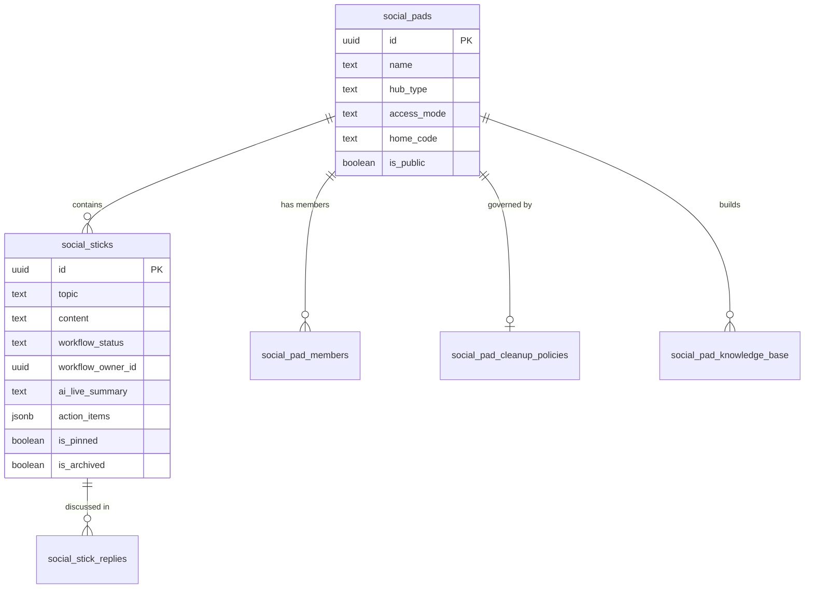
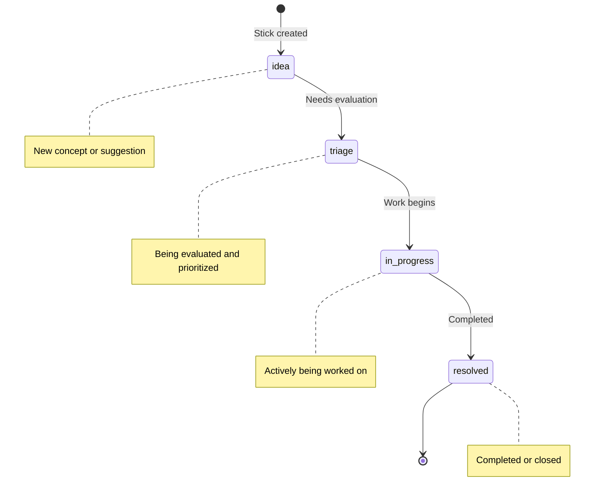
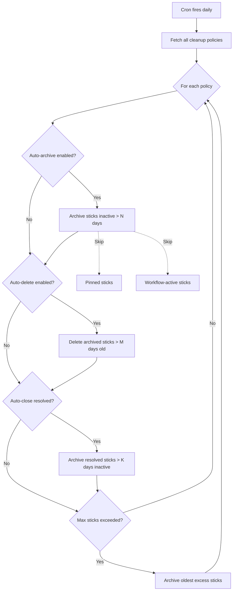
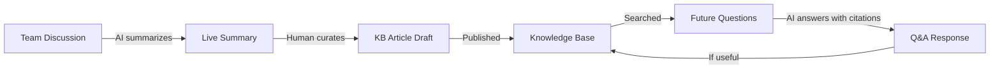

# Chapter 14: The Inference Hub — Collaborative Knowledge

Chapter 13 covered how Stick My Note talks to machines. The Ollama-first provider hierarchy, the AIService abstraction, the escalation detection that routes conversations through local inference, Azure, and OpenAI depending on complexity. All of that is plumbing for a single question: what do you do with AI once you have it?

This chapter answers that question. And the answer is not what you expect.

"Inference" in Stick My Note does not mean AI prediction. It does not mean "run a model and return a result." It means the inference of shared knowledge through collaborative discussion — a system where teams discuss problems, AI surfaces insights from those discussions, and the collective understanding crystallizes into permanent organizational knowledge. The word was chosen deliberately. A team discussing a production outage is performing inference: they are reasoning from evidence to conclusion. The AI accelerates that process, but the humans are doing the inferring.

This is a separate product tier from personal notes. Separate tables. Separate permission model. Separate API surface. Over eighty endpoints. It is, architecturally, a second application living inside the first.

---

## The Parallel Universe of Social Data

Chapter 7 covered the personal note system: `paks_pads` for notebooks, `paks_pad_sticks` for notes, `paks_pad_stick_replies` for responses. That system is personal-first. Your pads, your sticks, your replies. Sharing is bolted on through membership tables.

The Inference Hub flips the model. It is team-first. The tables are:

- **`social_pads`** — collaborative discussion spaces (not `paks_pads`)
- **`social_sticks`** — discussion topics within pads (not `paks_pad_sticks`)
- **`social_stick_replies`** — threaded responses to topics
- **`social_pad_members`** — who can participate, and at what level
- **`social_pad_knowledge_base`** — permanent articles distilled from discussions
- **`social_pad_cleanup_policies`** — automated hygiene rules per pad

The naming is intentional. The `social_` prefix signals that these are not the same entity as personal notes, even though the UI metaphor — pads containing sticks containing replies — is identical. Same shapes, different physics.

Why not reuse the personal notes tables with a `type` column? Three reasons:

**Different collaboration model.** Personal pads have an owner who shares selectively. Social pads have contributors, moderators, and owners operating simultaneously. The membership table carries `role` and `admin_level` fields that do not exist in the personal system.

**Different AI integration.** Personal notes have no AI summary, no action item extraction, no Q&A. Social sticks carry `ai_live_summary`, `ai_tags`, `action_items`, `suggested_questions`, and `last_summarized_at` columns. Bolting these onto the personal notes table would mean dozens of nullable columns that are always null for 90% of rows.

**Different lifecycle.** Personal notes live forever unless deleted. Social sticks have workflow states, cleanup policies, promotion to project management tasks, and 90-day retention windows on activity feeds. The data lifecycle is fundamentally different.



The `social_pads` table carries fields that `paks_pads` does not: `hub_type`, `access_mode`, `hub_email`, `home_code`. These are the hub configuration fields, and they define how the pad behaves as a collaborative space.

---

## Hub Types and Access Modes

A social pad can be configured as a hub — a structured collaboration space with specific access rules. Two hub types exist:

**Individual hubs** are single-person intake spaces. Think of a professor's office hours or a team lead's suggestion box. One person owns it, many people submit to it. The owner sees everything. Contributors see only their own submissions.

**Organization hubs** are team-wide collaboration spaces. Everyone in the group sees everything. Moderators can triage and manage workflow. This is the default mode for team discussions.

The access mode controls visibility within the hub:

- **`all_sticks`** — moderators and members see every stick. This is the standard team discussion mode.
- **`individual_sticks`** — members see only their own sticks. The moderator sees all. This is the intake/suggestion-box mode.

The `home_code` field is an optional access code. Set it, and anyone with the code can join the hub without an invitation. Leave it null, and membership requires explicit invitation or admin assignment.

Hub administration uses a two-tier model. A hardcoded global admin list (stored as a constant in the route handler) provides system-wide override. Below that, the `social_hub_admins` table allows per-hub admin role assignment through a dedicated endpoint. Global admins can assign and revoke hub-level roles; hub admins can manage members within their scope.

This is deliberately simpler than the organization role hierarchy from Chapter 5. The Inference Hub does not need the full RBAC system because its permission model is pad-scoped, not organization-scoped. A user's role in one pad has no bearing on their role in another. The complexity lives in membership, not in a role hierarchy.

---

## The Workflow State Machine

Every social stick carries a workflow status. Four states, one direction of progression:



The states are defined as a TypeScript union type: `"idea" | "triage" | "in_progress" | "resolved"`. Each carries display metadata — label, colors, description — in a configuration object that the UI consumes directly. The workflow status lives on the stick itself, not in a separate workflow table. This is a pragmatic choice: it means one fewer join on every query, at the cost of not having a full workflow history. For a team discussion tool, current state matters more than state history.

Three fields track workflow assignment:

- `workflow_status` — the current state
- `workflow_owner_id` — who is responsible (nullable; unassigned sticks are a metric)
- `workflow_due_date` — when it should be resolved (nullable)

The PATCH endpoint accepts any combination of these three fields. Update the status alone, assign an owner alone, or change everything at once. The server stamps `workflow_updated_at` on every mutation.

### Promotion to CalStick

The most interesting workflow transition is not between states — it is out of the state machine entirely. A social stick can be "promoted" to a CalStick, which is the project management task entity from the personal notes system. When a discussion topic crystallizes into an actionable task, a user clicks Promote and the system:

1. Creates a new CalStick record (in `paks_pad_stick_replies` with `is_calstick = true`)
2. Links the social stick to the CalStick via `calstick_id`
3. Sets `workflow_status` to `in_progress`
4. Stamps `promoted_at` and `promoted_by`

```
// Promote social stick to CalStick (simplified)
on promote(stickId, priority, dueDate, assigneeId):
    stick = fetch social_stick by id
    if stick.calstick_id exists: return "already promoted"
    
    calstick = insert into paks_pad_stick_replies {
        content: "[Promoted from Inference Hub] " + stick.topic
        is_calstick: true
        calstick_status: "in-progress"
        calstick_priority: priority or "medium"
        social_stick_id: stickId
    }
    
    update social_stick set
        calstick_id = calstick.id
        workflow_status = "in_progress"
        promoted_at = now()
        promoted_by = currentUser.id
```

The bidirectional link is maintained through status synchronization. When the workflow status changes on the social stick, the system maps it to the CalStick status vocabulary:

| Inference Status | CalStick Status |
|-----------------|-----------------|
| idea | todo |
| triage | todo |
| in_progress | in-progress |
| resolved | done |

This mapping function is the only place where the two systems touch. The Inference Hub does not know about CalStick internals. It knows the mapping table and the column names. That is enough.

---

## Cleanup Policies: Automated Data Hygiene

Social pads accumulate sticks. Without intervention, a busy hub becomes a graveyard of resolved discussions. Cleanup policies automate the lifecycle.

Each pad can have one cleanup policy (stored in `social_pad_cleanup_policies`) with these controls:

- **Auto-archive**: archive sticks with no activity after N days
- **Auto-delete**: permanently delete archived sticks after N more days
- **Auto-close resolved**: archive resolved sticks after N days of inactivity
- **Max sticks per pad**: archive oldest sticks when the cap is exceeded
- **Exemptions**: pinned sticks and workflow-active sticks survive all cleanup

A cron job runs daily, fetches all policies, and applies them sequentially:



The exemption logic is worth noting. Pinned sticks are excluded by adding `.eq("is_pinned", false)` to the archive query. Workflow-active sticks are excluded with an OR filter: `workflow_status.is.null,workflow_status.eq.closed,workflow_status.eq.resolved`. In other words, a stick that is in `idea`, `triage`, or `in_progress` state will never be auto-archived. Only null-status sticks (never entered the workflow) and terminal-status sticks can be cleaned up.

The default policy — returned when no custom policy exists — is conservative: everything disabled, 90-day archive window, 180-day delete window, exemptions on. The system will not delete anything unless a pad admin explicitly configures it to.

---

## Knowledge Base: Where Discussions Become Permanent

Discussions are ephemeral. Knowledge should not be. The per-pad knowledge base is where AI-generated insights and human-curated answers become permanent organizational assets.

Each knowledge base article lives in `social_pad_knowledge_base` with:

- `title`, `content` — the article itself
- `category` — organizational grouping (defaults to "general")
- `tags` — array of classification labels
- `author_id` — who wrote or generated it
- `is_pinned`, `pin_order` — for curating the most important articles
- `helpful_count` — crowd-sourced quality signal

The helpfulness system uses a separate `social_kb_helpful_votes` table with a unique constraint on `(kb_article_id, user_id)`. One vote per user per article. The constraint means the server does not need to check for duplicates — the database enforces it, and the API returns a specific error on conflict (PostgreSQL error code `23505`).

The knowledge base is the destination of the AI pipeline. When a team discusses a problem and the AI generates a summary, action items, and suggested follow-ups, any of those can be saved as a knowledge base article. The flow is:



The search endpoint supports filtering by text match across titles and content. The knowledge base is pad-scoped — articles from one pad are not visible in another, even within the same organization. This is intentional: the knowledge is contextual to the discussion space that produced it.

---

## AI-Enhanced Collaboration

Chapter 13 built the AI service layer. The Inference Hub is its primary consumer. Four AI features operate on social sticks:

### Live Summary

When triggered (manually, via the Summarize button), the system fetches the stick's topic, content, and all replies. It formats each reply with author name and timestamp, then calls `AIService.generateLiveSummary()`. The result is stored in the `live_summary` column on the stick itself.

The summary endpoint also extracts action items and generates suggested follow-up questions in parallel:

```
// Summarize stick (simplified)
on summarize(stickId):
    stick = fetch social_stick with all replies
    replies = format each reply as { content, author, created_at }
    
    summary = AIService.generateLiveSummary(stick.topic, stick.content, replies)
    actionItems = AIService.extractActionItems(stick.topic, stick.content, replies)
    nextQuestions = AIService.generateNextQuestions(stick.topic, summary)
    
    update social_stick set
        live_summary = summary
        action_items = actionItems
        suggested_questions = nextQuestions
        last_summarized_at = now()
        summary_reply_count = replies.length
```

The `summary_reply_count` field is a staleness indicator. If the stick has 15 replies but `summary_reply_count` is 8, the summary is stale. The UI uses this to show a "Summary outdated" badge.

### Question Answering

The Q&A system is the knowledge base's active counterpart. A user asks a question about a pad, and the AI answers using the pad's sticks as context.

The endpoint fetches the 20 most recent sticks and their replies (capped at 100 replies total). It resolves user names for attribution and fetches CalStick details for any replies that have been promoted to tasks. This last detail matters: the AI can distinguish between a discussion reply and a tracked task, and it reports task status in its answers.

The context sent to the AI includes:

- Stick topics and content
- Reply content with author names
- Whether a reply is a CalStick (task)
- CalStick status and completion state

This means a question like "What tasks are still open from last week's discussion?" gets an accurate answer, because the AI has the CalStick metadata alongside the discussion content.

Every Q&A interaction is logged to `social_qa_history` with the question, answer, citations, and asking user. This creates an audit trail and enables the Q&A history view — users can see what questions others have asked about a pad.

### Action Items and Suggested Questions

Action item extraction returns structured data: items with content, owner hints, status, and due date suggestions. These are stored as JSONB in the `action_items` column.

Suggested questions are follow-up prompts generated from the discussion context. The AI reads the topic, content, current summary, and sentiment, then proposes questions that might push the discussion forward. These appear in the UI as clickable prompts below the summary.

Both features are generated during the summarize flow, not independently. This is a cost optimization: one summarize action triggers three AI calls (summary, action items, questions), and the results are stored together. There is no separate "extract action items" button.

---

## The Eighty-Endpoint Landscape

The Inference Hub API surface is large. Not because each endpoint is complex, but because collaborative software has many verbs. Here is the taxonomy:

**Pad management** (`/api/inference-pads/`):
- CRUD on pads (public, private, admin views)
- Member management (invite, remove, bulk operations, AD group sync)
- Pending invitations and processing
- Chat: messages, typing indicators, moderator designations, settings
- Knowledge base: articles, search, helpfulness voting
- Cleanup policies
- Analytics per pad
- Q&A: ask questions, view history, provide feedback on answers

**Stick management** (`/api/inference-sticks/`):
- CRUD on sticks
- Workflow status transitions
- Promotion to CalStick
- Summarization (AI-powered)
- Replies and reply reactions
- Media attachments
- Citations
- Pinning
- Tab organization
- Member assignment (per-stick)

**Cross-cutting concerns:**
- `/api/inference-accounts/` — team member personas with bulk operations
- `/api/inference-notifications/` — activity notifications with mark-read
- `/api/inference-analytics/` — engagement metrics and workflow analytics
- `/api/inference-activity-feed/` — chronological feed with 90-day retention
- `/api/inference-hub-admins/` — global and hub-level admin management
- `/api/inference-pad-categories/` — organizational taxonomy
- `/api/inference-search/` — full-text search across all accessible content

The search endpoint deserves a mention. It queries `social_sticks` using `ILIKE` pattern matching across topic and content fields, scoped to pads the user can access (owned, member, or public). It supports date range filters, author filters, pad filters, visibility filters, and sorting by creation date, update date, or reply count. Reply-count sorting requires fetching all results and sorting in JavaScript, because the count is derived from a separate table — an honest trade-off documented in the code.

The search also optionally includes replies, performing a second query against `social_stick_replies` with the same text filter, then checking that each reply belongs to an accessible pad. Results are cached for 60 seconds per unique query signature.

---

## Activity Feed and Retention

The activity feed is a unified stream of what happened in pads you care about. It merges two data sources: new sticks created by other people in your pads, and new replies to sticks in your pads. Your own activity is excluded — you do not need to be told what you just did.

The 90-day retention window is enforced at query time, not by data deletion:

```
// Activity feed query window
retentionDate = now - 90 days

stickActivities = fetch social_sticks
    where social_pad_id in userPadIds
    and org_id = currentOrgId
    and user_id != currentUserId
    and created_at >= retentionDate
    order by created_at desc

replyActivities = fetch social_stick_replies
    where org_id = currentOrgId
    and user_id != currentUserId
    and created_at >= retentionDate
    order by created_at desc
    // then filter to user's pads in application code
```

Replies are deduplicated per stick — if a stick received five replies today, the feed shows only the most recent one. This prevents a busy discussion from flooding the feed.

The merge happens in application code: both arrays are combined, sorted by `created_at` descending, and paginated with limit/offset. This is not the most efficient approach at scale, but the 90-day window and the per-pad scoping keep the result sets manageable. If a user is a member of 50 pads with moderate activity, the feed query touches perhaps a few thousand rows across both tables. PostgreSQL handles this without complaint.

The retention window is intentional data hygiene. Activity older than 90 days is not deleted — the underlying sticks and replies still exist and are searchable. The feed simply stops showing it. This creates a natural boundary between "what is happening now" and "what happened historically," pushing users toward the search and knowledge base for older information.

---

## Real-Time Integration

When a new stick is created, two WebSocket events fire to the organization:

- `social_activity.new` — tells the activity feed to refresh
- `inference_notification.new` — tells the notification badge to increment

These use the same `publishToOrg` broadcast from Chapter 10's WebSocket infrastructure. The events carry the stick ID, user ID, and activity type, but not the content itself. The client receives the event, then fetches the updated data through the normal API. This is the same "notify then fetch" pattern used throughout the application — it avoids duplicating authorization logic in the WebSocket layer.

The cache invalidation is aggressive on write. Creating a stick invalidates both the user-specific cache key and the public sticks cache. The cache layer uses short TTLs (30 seconds) with stale-while-revalidate (60 seconds), so even without WebSocket the data is at most 90 seconds stale. With WebSocket, the client fetches immediately on notification.

---

## Apply This

Five patterns from the Inference Hub that transfer to any collaborative application:

**1. Separate tables for separate collaboration models.** The temptation to unify personal and team data into one table with a `type` discriminator is strong. Resist it. Different collaboration models have different column requirements, different permission semantics, and different lifecycle rules. The join cost of separate tables is nothing compared to the complexity cost of a god table with 40 nullable columns.

**2. Workflow states on the entity, not in a workflow table.** For simple state machines (under 10 states, linear progression, no branching), storing the state directly on the entity eliminates joins and simplifies queries. You lose transition history, but you gain query simplicity. If you need history, add an audit log — do not complicate every read query to support an occasional audit need.

**3. Promote across system boundaries with bidirectional links.** The social stick to CalStick promotion creates a link in both directions: the social stick stores the CalStick ID, and the CalStick stores the social stick ID. Status changes synchronize through a mapping function. This keeps the two systems decoupled — each knows only the other's ID and status vocabulary — while maintaining consistency.

**4. Cleanup policies as data, not code.** The cleanup cron job does not contain business rules. It reads policies from the database and applies them. This means pad admins can configure cleanup without code changes, and the cron job handles any number of pads with any combination of rules. The exemption logic (pinned, workflow-active) is the only hardcoded behavior, and it is hardcoded because it is a safety invariant, not a business preference.

**5. Retention windows at query time, not deletion time.** The 90-day activity feed window does not delete data. It filters at query time. This means the window can be changed without data loss, and the underlying data remains available through other access paths (search, direct navigation). Delete data when you must (GDPR, storage costs). Filter data when you can.

---

The Inference Hub is where Stick My Note stops being a note-taking application and becomes a knowledge management platform. The personal notes system stores what individuals think. The Inference Hub captures what teams conclude. The AI layer accelerates the path from discussion to conclusion. And the knowledge base makes those conclusions permanent and searchable.

Chapter 15 picks up the search thread. The Inference Hub's `ILIKE`-based search works, but it does not scale, and it does not understand intent. Full-text search, ranking, and the path toward semantic search — that is what comes next in Part VI.
