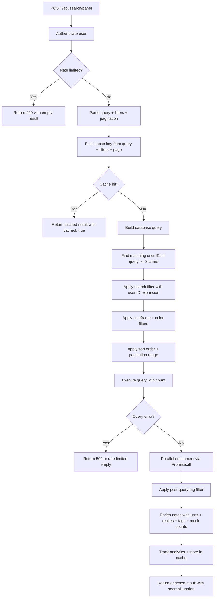
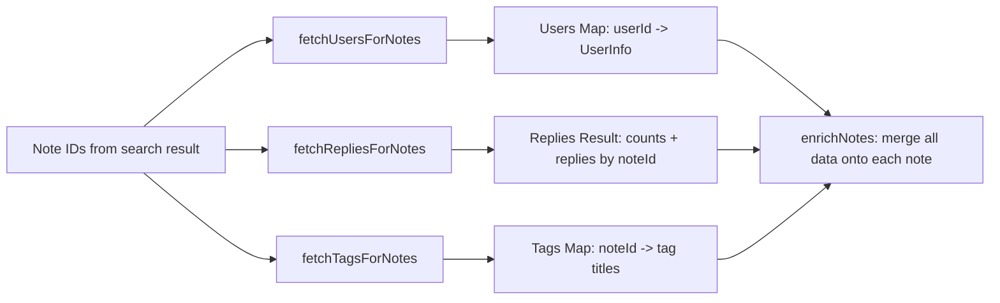
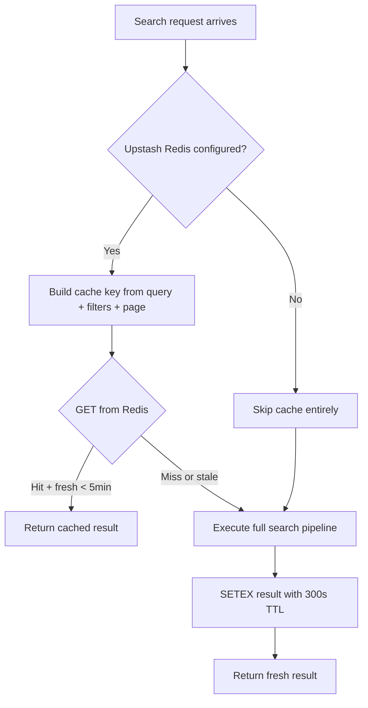

# Part VI: Discovery and Observability

*"You can't manage what you can't find or measure."*

Part V covered intelligence -- the Ollama-first AI architecture and the Inference Hub that turns collaborative discussion into permanent organizational knowledge. Eighty-plus endpoints. Workflow state machines. Knowledge bases with helpfulness voting. All of it generating content at a rate that makes a manual browse-through-folders approach untenable within weeks.

That is the problem this part addresses. Discovery (finding what already exists) and observability (knowing what the system is doing) are the two faces of operational maturity. This chapter handles the first face. Chapter 16 handles the second.

---

# Chapter 15: Search Across Everything

Most enterprise platforms, when they reach the "we need search" milestone, reach for Elasticsearch. Or Solr. Or Algolia. Or Typesense. Another service to deploy, monitor, feed data into, keep synchronized with the source of truth, and troubleshoot at 2am when the cluster goes yellow.

Stick My Note does not do this. Search runs on PostgreSQL -- the same database that already stores the data. No separate indexing pipeline. No synchronization lag. No additional failure mode. The search results are always consistent with the source of truth because they are the source of truth.

This is a direct consequence of the sovereignty thesis. Every additional service in the stack is a service you must operate, secure, back up, and understand when it breaks. PostgreSQL already has full-text search. It already has `ILIKE` for substring matching. It already has trigram indexes for fuzzy matching. The question is not "can PostgreSQL handle our search workload?" -- it is "how much operational complexity are we willing to add for marginal search quality improvements?" For a team collaboration tool with thousands of notes, not millions, the answer is: none.

---

## Dual-Mode Search: Full-Text and Fuzzy

The panel search endpoint -- the primary search surface in the application -- uses a dual-mode strategy. Both modes query PostgreSQL directly, but they serve different user expectations.

**ILIKE mode** is the workhorse. It performs case-insensitive substring matching across the `topic` and `content` columns. A search for "deploy" matches "deployment," "pre-deploy," and "we should deploy on Friday." No stemming, no ranking, no linguistic intelligence. It finds what you typed, wherever it appears. This is what users actually want most of the time.

**Full-text search mode** uses PostgreSQL's built-in text search with English stemming and ranking. A search for "deploying" also matches "deploy," "deployed," and "deployment" through linguistic normalization. Results can be ranked by relevance rather than just recency.

The V1 panel search endpoint defaults to ILIKE-only, building OR filters across topic and content:

```
searchFilter = "topic.ilike.%{term}%,content.ilike.%{term}%"

if matchingUserIds exist:
  searchFilter += ",user_id.in.({userIds})"

query = query.or(searchFilter)
```

That third line is worth noting. When the search term is at least three characters long, the system also searches the `users` table for matching usernames and full names, then includes notes authored by those users in the results. Searching for "chris" returns notes containing the word "chris" and notes written by anyone named Chris. This cross-entity expansion happens transparently -- the user does not need to specify "search by author."

The V2 panel search takes a more direct approach with raw SQL, using `LOWER()` and `LIKE` instead of the query builder's `.ilike()`:

```
conditions = ["is_shared = true"]

if query exists:
  searchTerm = "%{query.lowercase}%"
  conditions.push("LOWER(topic) LIKE $N OR LOWER(content) LIKE $N")

if timeframe specified:
  conditions.push("created_at >= NOW() - INTERVAL '{days} days'")

if colors specified:
  conditions.push("color = ANY($N)")

WHERE = conditions.join(" AND ")
```

Both approaches produce the same results for ILIKE-style searches. The V2 version adds an inline subquery for reply counts directly in the SQL, avoiding a separate enrichment step for that particular metric. Different ergonomics, same data.

The Inference Hub search adds a third variation: it searches across `social_sticks` with access control baked into the query. Before any text matching happens, it resolves which pads the current user can access (public pads, owned pads, pads where they are a member) and restricts all search results to sticks within those pads. The text matching itself is identical -- `.ilike()` across topic and content -- but the permission boundary is enforced in SQL, not in application code.

---

## The Panel Search Pipeline

The V1 panel search endpoint is the most feature-complete search surface. It handles caching, parallel enrichment, tag filtering, analytics tracking, and suggestion generation. Here is the full pipeline:



Two things stand out in this pipeline.

First, **tag filtering happens after the database query, not in it.** Tags live in a separate `personal_sticks_tags` table. Rather than adding a JOIN that would complicate the main query and potentially degrade pagination accuracy, the system fetches all tags for the returned notes and filters in application code. For a page of twenty results, this means some results might be discarded after tag filtering, making the "20 results per page" contract slightly inaccurate. The total count also reflects pre-tag-filter numbers. This is a known trade-off: simpler queries at the cost of slightly imprecise pagination when tag filters are active.

Second, **the cache key is built from the query, all filters, and the page number.** The same query with different sort orders or timeframes produces different cache keys. This is correct but means the cache hit rate is lower than you might expect -- the combinatorial explosion of filter options means most searches are cache misses. The five-minute TTL on Upstash Redis is still valuable for the common case of a user paginating through results or re-running a recent search.

---

## Parallel Enrichment

The parallel enrichment step is the most important performance optimization in the search pipeline. After the main query returns a page of notes (typically twenty), three separate data fetches run simultaneously:



```
noteIds = notes.map(n => n.id)

[usersMap, repliesResult, tagsMap] = await Promise.all([
  fetchUsersForNotes(db, notes),       -- unique user IDs -> user records
  fetchRepliesForNotes(db, noteIds),   -- all replies for all notes
  fetchTagsForNotes(db, noteIds),      -- all tags for all notes
])
```

This is the classic "parallel batch fetch" pattern, and it is worth understanding why it exists instead of the two obvious alternatives.

**Alternative 1: JOIN everything in the main query.** A single SQL query could join `personal_sticks` with `users`, `personal_sticks_replies`, and `personal_sticks_tags`. The problem is fan-out. A note with five replies and three tags would produce fifteen rows. PostgreSQL handles this fine, but the application-side deduplication becomes messy, and pagination counts become unreliable when the row count per logical result varies.

**Alternative 2: N+1 queries.** For each of the twenty notes, fetch its user, its replies, and its tags. That is sixty sequential queries. Even with connection pooling, the latency stacks up.

The parallel batch approach hits a middle ground: three queries, all using `IN` clauses with the note IDs from the current page, all running concurrently. Each query returns a flat result set that gets assembled into a lookup map. The `enrichNotes` function then walks the original notes array once, pulling from each map in O(1) per note.

The replies fetch is slightly more complex because it also resolves user data for reply authors. It collects unique user IDs from all replies, fetches those users in a single query, then attaches user objects to each reply before building the final map. This is a nested batch fetch -- still two queries total (replies, then reply authors), not N+1.

For a twenty-note page where each note has an average of three replies, this produces: one query for twenty user records, one query for sixty replies plus one query for reply authors, and one query for tags. Four database round-trips total, all but the nested pair running in parallel. Compare this to the naive approach of 20 * 3 = 60 individual queries, and the performance difference is obvious.

---

## The View Count That Does Not Exist

Deep in the `enrichNotes` function, two lines of code deserve their own section:

```
view_count: Math.floor(Math.random() * 100) + 10
like_count: Math.floor(Math.random() * 50)
```

These are not real metrics. They are not persisted anywhere. They produce a different value on every request, for every note, regardless of actual usage. A note created thirty seconds ago might claim 87 views. A note from last year might show 14.

This is mock data, and it exists because the UI was designed with view and like counts as part of the search result card layout. The frontend expects these fields. The backend has not implemented actual view tracking or a like system. Rather than block the search feature on the completion of two unrelated features, the team shipped random numbers.

The V2 panel search handles this differently: it returns `view_count: 0` and `like_count: 0`. Zeros instead of fiction. Both approaches are honest in different ways -- the V2 version is honest about the absence of data, the V1 version is honest about the absence of the feature (the random numbers are so obviously fake that no one mistakes them for real metrics).

This is technical debt, and it is the pragmatic kind. The mock data is visible in the source code, clearly labeled by its randomness. It does not corrupt any database. It does not mislead analytics. It is a placeholder that says "this feature is not built yet" in a way that keeps the UI functional. When actual view tracking lands, the fix is a single-line change in one function.

The lesson is not "use mock data." The lesson is that shipping a complete search feature with two fake fields is better than not shipping search until view tracking exists. The fields are cosmetic. The search pipeline is structural. Prioritize accordingly.

---

## The Cache Layer

Search caching uses Upstash Redis via their REST API -- an HTTP-based interface that does not require a persistent connection. This matters in a serverless-adjacent environment where Next.js API routes may spin up and down.



The cache initialization is defensive. If the Upstash URL is missing, or if it is not an HTTPS REST endpoint (a common misconfiguration when someone provides a Redis protocol URL instead), caching silently disables itself. No error, no warning in production, no degraded behavior. Search works without caching -- it is just slower.

Cache invalidation is pattern-based. When content changes, you can invalidate all cache entries matching a prefix. But in practice, the five-minute TTL is the primary invalidation mechanism. New content becomes searchable within five minutes of creation, which is acceptable for a collaboration tool that is not doing real-time search indexing.

The Inference Hub search uses a different cache -- the in-memory LRU cache from Chapter 3. Results are cached for sixty seconds with a key that includes the organization ID, user ID, and the full query parameters. This is a shorter TTL because inference searches are more likely to return rapidly-changing content (active discussions with new replies appearing frequently).

Two different search endpoints, two different cache backends, two different TTLs. This is not inconsistency -- it is appropriate tuning for different access patterns. The panel search is browsing shared notes that change infrequently. The inference search is querying active collaborative discussions. Different data volatility, different cache strategy.

---

## Search Analytics

Every search that an authenticated user performs is recorded. Not for surveillance -- for improving the search experience itself.

The `SearchAnalytics` class provides four operations:

**`trackSearch()`** records the query, the filters used, and the result count into the `search_history` table. This happens after the search results are returned to the user, in a fire-and-forget pattern. If the analytics insert fails, the error is caught and swallowed. Search results are never delayed or lost because of analytics failures.

**`trackClick()`** records which result a user clicked and its position in the result list. When a user clicks the third result for the query "deployment guide," the system finds the most recent `search_history` entry for that user and query, then updates its `clicked_note_id` field. This creates a link between what was searched and what was actually useful.

**`getTrendingSearches()`** aggregates the last seven days of search history by query frequency. It fetches the hundred most recent searches, counts occurrences of each unique query, and returns the top results sorted by frequency. This is a brute-force approach -- no materialized view, no pre-aggregated counters. For a hundred rows, the in-memory frequency count is instantaneous. For a million searches a week, you would need a different approach. But this is an on-premise collaboration tool, not a consumer search engine.

**`getPopularNotes()`** does the same aggregation but on `clicked_note_id` instead of query text. The result is a ranked list of notes that people actually found useful through search, which feeds into recommendation surfaces elsewhere in the application.

The analytics data also powers the suggestions endpoint. When a user focuses the search input, the system returns three types of suggestions in parallel: their recent searches (deduplicated, most recent first), trending tags from a materialized view, and the full tag vocabulary from shared notes. The materialized view for trending tags is refreshed by a cron job -- Chapter 16 covers that mechanism.

---

## Saved Searches and Suggestions

Users can save search configurations for repeated use. A saved search captures not just the query text but the full filter state: which pads, which tags, what date range, what sort order. This is managed through a `SearchFilterManager` class that provides CRUD operations against a `/api/search-filters` endpoint.

The suggestion pipeline is more interesting than the saved search CRUD. When the search panel opens, it issues a GET request that returns three parallel data streams:

**Recent searches** come from the `search_history` table, filtered to the current user, deduplicated, limited to five entries. The V2 endpoint uses a `DISTINCT` with `MAX(created_at)` to handle deduplication in SQL rather than in application code -- a small optimization that matters when the search history table grows.

**Trending tags** come from a `trending_tags` materialized view. This view aggregates tag usage across all shared content and is periodically refreshed. The advantage of a materialized view over a live query is that tag aggregation across thousands of notes is expensive, and the results do not change frequently enough to justify computing them on every search panel open.

**Available tags** come from a direct query against `personal_sticks_tags`, deduplicated and sorted alphabetically. This gives the autocomplete dropdown a complete vocabulary to filter against. The V1 suggestions endpoint takes a more thorough approach -- it fetches shared note IDs, then queries `personal_sticks_tabs` for tags stored in tab JSONB data, handling string arrays, JSON arrays, and JSONB object formats. This defensive parsing reflects the reality that tag storage evolved over time and multiple formats coexist in production data.

The suggestions system has no client-side fuzzy matching against the suggestion list. The dropdown shows all recent, trending, and tag suggestions, and the user picks one or types their own query. This is intentionally simple. Implementing a client-side trie or Levenshtein-distance filter against the suggestion list would add complexity for marginal benefit -- the suggestion lists are small enough (five recent, twenty trending, fifty tags) that visual scanning is faster than typing to filter.

The codebase does include a standalone `FuzzySearch` class with Levenshtein distance calculation and configurable similarity thresholds. It scores results on a 0-to-1 scale: exact match at 1.0, substring containment at 0.8+, and fuzzy similarity down to a 0.6 cutoff. This class exists for client-side in-memory search scenarios -- filtering a local list of items that are already loaded -- not for the database-backed search pipeline. It is a utility, not part of the search architecture.

---

## V1 vs. V2: Two Generations Coexisting

The search API exists in two generations, and understanding why both survive explains something about how production systems evolve.

**V1** (`/api/search/panel`) uses the database adapter -- the chainable query builder from Chapter 2. It chains `.from()`, `.select()`, `.eq()`, `.ilike()`, `.or()`, `.order()`, and `.range()` to build queries. It includes full caching via Upstash Redis, analytics tracking, and the parallel enrichment pipeline. Authentication uses the standard `getCachedAuthUser()` pattern.

**V2** (`/api/v2/search/panel`) uses raw SQL via `db.query()`. It builds WHERE clauses as string arrays, pushes parameterized values, and executes the query directly. It includes inline reply count subqueries. It does not use search caching or analytics tracking. Authentication also uses `getCachedAuthUser()`.

The broader V2 search endpoint (`/api/v2/search`) goes further. It requires an Active Directory session via `requireADSession()`, supports multi-entity search (notes, pads, and sticks in a single request), and uses raw SQL throughout. This is the endpoint for organizations that authenticate exclusively through AD -- it enforces a stricter session requirement that the V1 endpoints do not.

Why do both exist? V2 was not built to replace V1. It was built to serve a different authentication path. Organizations using AD-only authentication need endpoints that enforce AD sessions. Organizations using local auth or OIDC use the V1 endpoints. The search logic is similar, but the auth boundary is different, and coupling them into a single endpoint with conditional auth would be more fragile than maintaining two clean implementations.

The practical result is that the V1 panel search has more features (caching, analytics, user-ID expansion in search) while the V2 panel search is leaner and faster (raw SQL, inline subqueries, no cache overhead). Neither is deprecated. Both are actively used. The V2 multi-entity search adds capabilities that V1 lacks entirely -- searching across notes, pads, and sticks in a single round-trip.

This is not ideal. In a greenfield rewrite, you would have one search pipeline with pluggable auth. But in a production system that evolved over months, having two well-tested search endpoints with different auth requirements is better than having one fragile endpoint with complex conditional logic. The duplication is the cost of stability.

---

## The Multi-Entity Search Problem

The V2 search endpoint reveals an architectural tension. Stick My Note has multiple searchable entity types: personal sticks (notes), paks pad sticks (collaborative notes), social sticks (inference discussions), pads, and knowledge base articles. Each lives in its own table with its own schema.

The V2 approach is straightforward: run separate queries against each entity table, with the same ILIKE filter, and return the results grouped by entity type. Notes, pads, and sticks each get their own result array and total count. The client renders them in separate tabs or sections.

```
if entity is "notes" or "all":
  notes = SELECT * FROM notes WHERE org_id = $1
          AND (title ILIKE $2 OR content ILIKE $2)
          ORDER BY updated_at DESC LIMIT $3 OFFSET $4

if entity is "pads" or "all":
  pads = SELECT * FROM pads WHERE org_id = $1
         AND (name ILIKE $2 OR description ILIKE $2)
         ORDER BY updated_at DESC LIMIT $3 OFFSET $4

if entity is "sticks" or "all":
  sticks = SELECT * FROM sticks WHERE org_id = $1
           AND (topic ILIKE $2 OR content ILIKE $2)
           ORDER BY updated_at DESC LIMIT $3 OFFSET $4
```

This is three separate queries, not a UNION. Each entity type has its own columns, its own sort order, and its own pagination. A unified ranking across entity types -- "show me the five most relevant results regardless of type" -- is not supported. That would require either a UNION with a shared relevance score or a separate search index that normalizes all entities into a common schema.

For a self-hosted collaboration tool, the per-entity approach is the right trade-off. Users know whether they are looking for a note, a pad, or a discussion topic. Forcing them into a single blended result set would actually reduce usability. The entity-specific tabs let users narrow their search immediately.

---

## Apply This

**1. Start with your existing database.** PostgreSQL ILIKE handles substring search for datasets under a million rows with no additional infrastructure. Full-text search with `tsvector` handles linguistic matching. You do not need Elasticsearch until you actually need Elasticsearch -- and you probably do not.

**2. Batch-fetch in parallel, not N+1.** When enriching a page of results with related data, collect all IDs first, fetch each related entity type in a single `IN` query, build lookup maps, and assemble. Three parallel queries beat sixty sequential ones every time.

**3. Use mock data honestly.** If the UI needs a field the backend has not built yet, return obviously fake data rather than blocking the feature. Random integers are clearly not real metrics. Zeros are clearly not real metrics. Both are better than delaying a working search pipeline.

**4. Cache at the appropriate layer with appropriate TTLs.** Browsing-style search benefits from a five-minute external cache. Active-discussion search benefits from a sixty-second in-memory cache. One size does not fit all, and two cache strategies for two access patterns is not inconsistency -- it is tuning.

**5. Let V1 and V2 coexist.** When a new API version serves a different auth boundary rather than replacing functionality, maintaining both is cheaper than merging them. Duplication is a cost, but conditional auth logic in a single endpoint is a bigger cost. Delete the old version only when its auth path is truly dead.

---

*Chapter 16 moves from finding content to finding problems. The analytics, audit, and health monitoring layers turn the same PostgreSQL database into an observability platform -- tracking user streaks, recording fifty-plus audit event types, and running health checks across every service in the network.*
