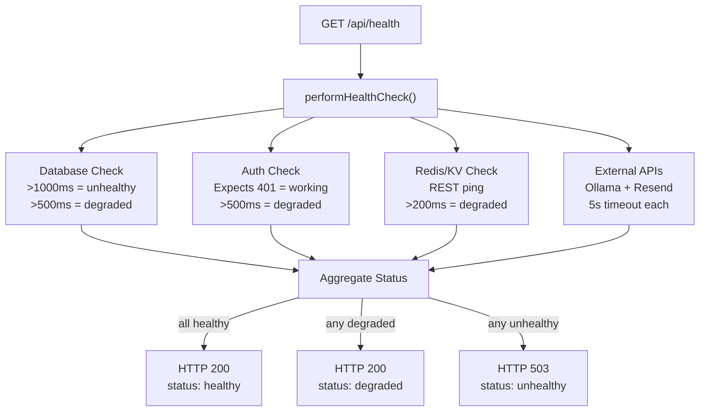
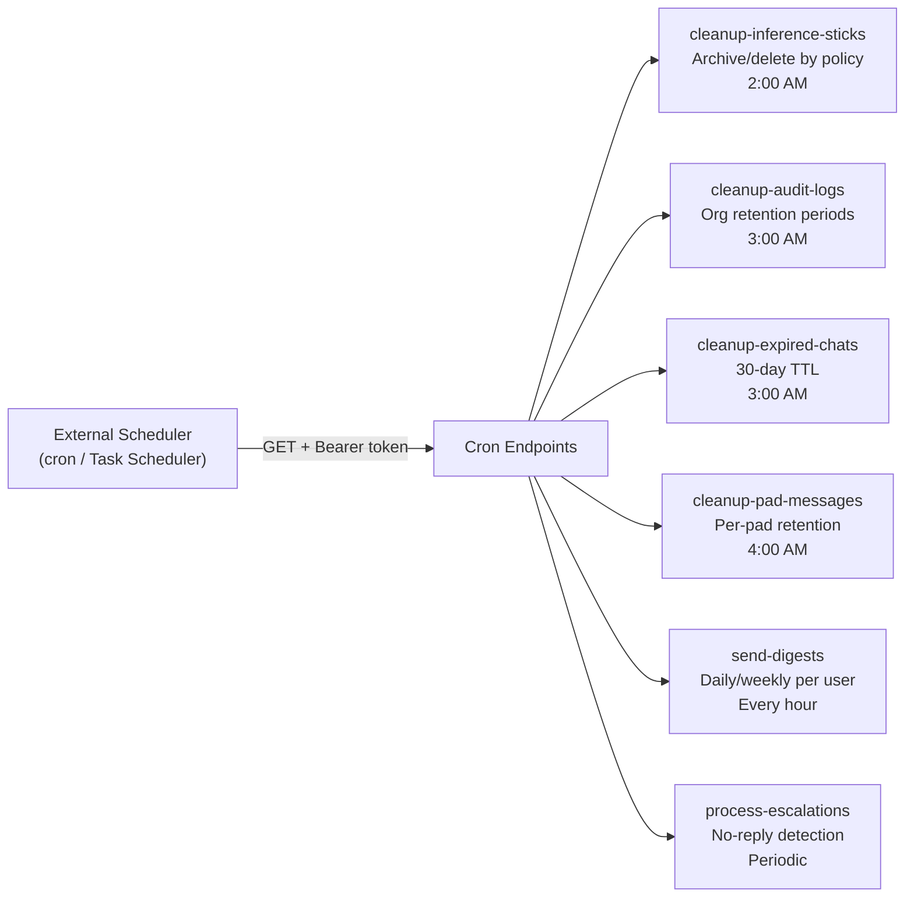

# Chapter 16: Analytics, Audit, and Health

Chapter 15 built the discovery layer: full-text search, fuzzy fallback, parallel enrichment, and the polite fiction of view counts. Users can now find content across every corner of the system. But there is a different kind of discovery that matters just as much -- the system finding problems with itself.

Three overlapping observability layers handle this. User-facing analytics answer "how am I using this?" Admin-facing audit trails answer "who did what, when?" Ops-facing health monitoring answers "is everything working?" They sound like separate concerns, and they are implemented separately, but they share a philosophical root: self-hosted sovereignty means you monitor your own infrastructure. No Datadog agent phones home. No Sentry SDK streams errors to a third-party ingest endpoint. The telemetry stays on your network, in your database, queryable by your team. That is the deal.

This chapter walks through all three layers, then examines the cron jobs that keep them honest and the file-based logger that catches what falls through the cracks.

---

## User Analytics: Computed, Not Materialized

The analytics endpoint is the simplest observability surface in the system. A single GET request returns everything a user might want to know about their own activity: total notes, shared versus private, notes this week and this month, total replies, total likes, most active day, current streak, and longest streak.

None of these values are materialized. Every metric is computed on every request. The endpoint fetches the user's full note history, their reply count, and their like count, then runs all the calculations in memory.

```
GET /api/analytics

1. Authenticate user
2. Fetch ALL notes for user (id, created_at, is_shared), ordered desc
3. Fetch ALL replies for user (count only)
4. Fetch like count across all note IDs
5. Compute: totals, weekly/monthly counts, most active day,
   average notes per day, current streak, longest streak
6. Return JSON with twelve metrics
```

The streak calculation is the most interesting piece. It extracts unique dates from the note history, sorts them in descending order, and walks backward looking for consecutive days. If today or yesterday has activity, the current streak starts counting. The longest streak does the same walk but tracks the maximum run seen across the entire history.

```
calculateCurrentStreak(sortedDates):
  if first date is not today or yesterday → return 0
  streak = 1
  for each pair of adjacent dates:
    if difference is exactly 1 day → streak++
    else → break
  return streak

calculateLongestStreak(sortedDates):
  longest = 1, current = 1
  for each pair of adjacent dates:
    if difference is exactly 1 day → current++
    else → longest = max(longest, current); current = 1
  return max(longest, current)
```

This is O(n) where n is the number of unique dates with notes. For a typical user with a few hundred notes spanning a year, that is maybe 200 date comparisons -- trivial. But for a power user with five years of daily activity, every analytics page load fetches thousands of rows, converts them to date strings, deduplicates them, sorts them, and walks the list twice. The cost is paid every single request because nothing is cached.

This is a deliberate trade-off, not an oversight. Materializing streak data would require invalidating and recomputing whenever a note is created or deleted. For a personal analytics dashboard that is viewed occasionally, the simpler approach wins. If the analytics page ever becomes a high-traffic endpoint -- unlikely for a dashboard only visible to the note's author -- a materialized view or a cache layer could be bolted on without changing the API contract.

The "most active day" calculation groups notes by day-of-week, counts per group, and returns the winner. The "average notes per day" divides total notes by the span between the first note and now. Both are straightforward, both are uncached, both are fine for the access pattern they serve.

One metric deserves a footnote: `totalViews` is hardcoded to zero. Chapter 15 covered the mock view counts in search results. The analytics endpoint is more honest -- it simply admits it does not track views.

There is also a subtlety in how "this week" and "this month" are defined. The endpoint uses fixed windows: 7 days and 30 days from the current moment, not calendar-aligned weeks or months. A request on Wednesday counts back to the previous Wednesday, not to the preceding Monday. This is simpler to implement and avoids timezone-dependent week boundaries, but it means "notes this week" does not match what a user might intuitively expect if they think in terms of Monday-to-Friday work weeks. For a personal analytics dashboard, this imprecision is unlikely to matter. For a reporting feature that feeds into HR metrics or compliance reports, it would need to be calendar-aligned.

The likes count query deserves attention for what it reveals about the data model. Likes are stored in a separate `personal_sticks_reactions` table with a `reaction_type` column. The query filters for `reaction_type = 'like'`, which implies the table supports other reaction types even though only likes appear in the analytics response. The schema is ready for emoji reactions or other engagement signals; the analytics endpoint simply has not caught up.

---

## The Audit Trail

User analytics answer questions about individual productivity. The audit trail answers questions about organizational accountability. When a compliance officer asks "who accessed this document last Tuesday?" or a security team investigates a suspicious login, they need the audit trail.

The system logs over thirty distinct event types, all following a `category.action` naming convention:

```mermaid
graph TD
    subgraph "Authentication Events"
        A1["user.login"]
        A2["user.login_failed"]
        A3["user.password_changed"]
        A4["user.2fa_enabled / disabled"]
    end

    subgraph "SSO Events"
        B1["sso.login / login_failed"]
        B2["sso.provider_created / updated / deleted"]
        B3["sso.activated / deactivated"]
    end

    subgraph "Organization Events"
        C1["org.settings_updated"]
        C2["org.member_added / removed"]
        C3["org.member_role_changed"]
        C4["org.invite_sent / accepted"]
    end

    subgraph "Compliance Events"
        D1["dlp.share_blocked"]
        D2["dlp.sensitive_data_detected"]
        D3["legal_hold.created / released"]
        D4["ediscovery.export"]
    end

    A1 & B1 & C1 & D1 --> DB[(audit_trail table)]
```



The categories are not arbitrary. They map to real compliance requirements. Authentication events support SOC 2 access logging. SSO events track federated identity changes for identity governance. Organization events create a membership timeline for role-based access audits. DLP events document data loss prevention enforcement. Legal hold and eDiscovery events exist specifically for litigation readiness -- when a court orders preservation of electronic records, you need to prove that the hold was applied and that exports were conducted by authorized personnel.

Each event carries a standard payload: user ID, action string, resource type, resource ID, optional before/after value snapshots, IP address, user agent, and a metadata JSONB column for anything that does not fit the fixed schema. The `old_values` and `new_values` columns enable diff-style audit reporting -- when an admin changes a user's role, both the previous role and the new role are recorded, not just the fact that a change occurred.

The logging function itself is the most interesting design decision in the entire audit system. It is fire-and-forget: every call is wrapped in a try/catch that swallows errors silently.

```
logAuditEvent(params):
  try:
    // UUID validation: resource_id column is UUID type
    if resourceId fails UUID regex:
      move resourceId to metadata.resourceIdString instead
    
    // INET validation: skip empty or "unknown" IP addresses
    ipAddress = valid IP string or null
    
    INSERT INTO audit_trail (
      user_id, action, resource_type, resource_id,
      old_values, new_values, ip_address, user_agent, metadata
    )
  catch:
    console.error("[Audit] Failed to log event:", action, error)
    // Never rethrow. The main operation must not fail
    // because logging failed.
```

This is pragmatic and dangerous in equal measure. Pragmatic because the alternative -- letting audit failures propagate -- would mean a PostgreSQL hiccup during logging could prevent a user from signing in. The audit trail is a secondary concern; the primary operation must complete. Dangerous because **if audit logging fails, nobody knows**. The error goes to console.error, which in production means the file logger (covered later in this chapter) might catch it. But there is no monitoring on audit logging failures. No alert fires. No counter increments. A persistent database connectivity issue could silently create gaps in the audit trail, and the compliance team would not discover the gap until they search for events that were never recorded.

This is the audit trail's blind spot. A monitoring system that checks for suspiciously low audit event volumes -- comparing this hour's event count against the trailing average -- would close it. The codebase does not have one.

### UUID Validation: A PostgreSQL Defense

The `resource_id` column in the audit trail table is typed as UUID. This seems reasonable until you encounter events where the resource identifier is not a UUID -- an email address for a login event, an SSO provider name, a DLP policy identifier. Inserting a non-UUID string into a UUID column throws a PostgreSQL cast error.

The solution is a regex check before insertion. If the resource ID matches the UUID pattern, it goes in the `resource_id` column. If it does not, it gets moved to the `metadata` JSONB column under the key `resourceIdString`. This preserves the data without corrupting the column type constraint.

The same defensive approach applies to IP addresses. The `ip_address` column is typed as INET, and PostgreSQL will reject malformed values. Empty strings and the literal "unknown" (which some proxy headers produce) are converted to null before insertion.

### Querying the Trail

The audit log query endpoint supports organization-scoped access with six filter dimensions: date range (from/to), action type, user ID, resource type, and free-text search. The free-text search uses ILIKE across four fields: action, resource type, user email, and user name. This is not full-text search -- it is pattern matching, adequate for an admin filtering through a few thousand audit events.

Pagination defaults to 25 rows per page with a maximum of 100. The total count is fetched in a separate query, which means every paginated request hits the database twice -- once for the count, once for the rows. For audit logs that rarely exceed tens of thousands of entries per organization, this is acceptable.

Access control is strict. Only organization owners and admins can view audit logs. The endpoint verifies membership and role before executing any query -- a raw SQL check against the `organization_members` table, not a middleware-level guard. This means the authorization logic is colocated with the data access, which is verbose but explicit. There is no risk of a middleware misconfiguration silently granting access.

The org-scoping itself is worth examining. Audit events do not have an explicit `org_id` column. Instead, the query scopes by membership: it selects events where the user_id belongs to the organization's member list, OR where the metadata JSONB contains the organization's ID. This dual-path scoping handles both user-initiated events (scoped by membership) and system events that reference an organization (scoped by metadata). The OR clause means the query cannot use a simple index on `org_id` -- it relies on the user_id index and a JSONB containment check. For the relatively modest volume of audit events per organization, this performs adequately.

Export functionality supports both CSV and JSON formats, uses the same authorization checks, and caps output at 10,000 rows. The CSV export handles value escaping correctly -- fields containing commas, quotes, or newlines are wrapped in quotes with internal quotes doubled. The export caps at 10,000 rows without pagination support, which means organizations with more than 10,000 audit events in the requested date range get a truncated export. The cap exists to prevent memory exhaustion on the server (all rows are assembled in memory before streaming the response), but a streaming CSV writer could lift this limitation.

### Retention: Configurable Expiration

Audit log retention is configurable per organization through the settings JSONB column on the organizations table. The default is 90 days. Allowed values are constrained to a fixed set: 30, 60, 90, 180, or 365 days. Only organization owners can change the retention period.

The retention setting is read by the cleanup cron job (covered in the cron jobs section), which deletes entries older than the configured threshold. The JSONB merge pattern -- `COALESCE(settings, '{}'::jsonb) || jsonb_build_object(...)` -- ensures updating retention does not clobber other organization settings.

---

## Health Monitoring

The health system exists at two levels, reflecting two different audiences with different questions.

The first level is a system health endpoint that an administrator hits manually to check whether the application is functioning. It verifies database connectivity by running a count query, checks the auth system by testing session resolution, validates that required environment variables are present, and confirms email service configuration. This endpoint returns success/warning/error per check, with the overall status derived from the worst individual result. It is a diagnostic tool -- you hit it when something seems wrong and you want to narrow down which subsystem is failing.

The second level is a production health module designed for automated monitoring. It is what an external health checker (a load balancer, an uptime monitor, or a scheduled task) would poll continuously. This module checks four services in parallel with response-time thresholds that distinguish between "working" and "working slowly."



The database health check is the most critical. It calls the system health endpoint, which issues a lightweight count query against the users table. The response time determines status: under 500ms is healthy, 500-1000ms is degraded, over 1000ms is unhealthy. A failed connection is unhealthy.

The authentication check is clever. It calls the user endpoint expecting a 401 response. A 401 means the auth system is operational -- it successfully parsed the request, checked for a session, and correctly rejected the unauthenticated caller. A 500 or network error means something is broken. This is a standard pattern for health-checking auth services: the absence of a valid session is not a failure; the inability to determine session state is.

The Redis check pings the Upstash REST endpoint if configured. If Upstash is not configured, the check reports healthy with a fallback note of "memory" -- the system is using in-process caching instead of distributed caching, which is a valid configuration, not an error.

External API checks (Ollama for AI, Resend for email) use five-second timeouts and are treated as optional. If Ollama is down, the system is degraded, not unhealthy. Users can still create notes and collaborate -- they just cannot generate AI summaries. This distinction matters for alerting: an unhealthy status should wake someone up; a degraded status can wait until morning.

All four checks run in parallel via `Promise.all`. The overall status is the worst of the individual statuses: any unhealthy makes the whole system unhealthy, any degraded makes it degraded, otherwise healthy. The response includes per-check details, response times, process uptime, and environment metadata.

The HTTP status code follows a convention that load balancers understand: 200 for healthy or degraded, 503 for unhealthy. This means a degraded system stays in the load balancer's rotation -- users still get served, just potentially with higher latency or reduced functionality. An unhealthy system gets pulled from rotation entirely. This is the right behavior: degraded service is better than no service, and the load balancer should not remove a node just because its Ollama instance is slow.

The response body includes a summary block that counts checks by status, which makes it trivial to build a dashboard from the health endpoint. A monitoring tool can poll the endpoint every 30 seconds, parse the JSON, and graph healthy/degraded/unhealthy counts over time. The system does not include such a dashboard itself -- it provides the data and leaves visualization to external tools. This is consistent with the sovereignty thesis: you choose your own monitoring stack.

---

## Web Vitals: Client-Side Performance Tracking

Server-side health monitoring tells you whether the infrastructure is working. Client-side performance monitoring tells you whether the user experience is acceptable. The performance module tracks Core Web Vitals using the browser's PerformanceObserver API.

Three metrics are collected:

**LCP (Largest Contentful Paint)** measures how long it takes for the main content to appear. The observer watches for `largest-contentful-paint` entries and records the last one's start time, along with the element tag name and URL if available.

**FID (First Input Delay)** measures the gap between a user's first interaction and the browser's response. The observer watches `first-input` entries and computes `processingStart - startTime` -- the time the event spent waiting in the queue.

**CLS (Cumulative Layout Shift)** measures visual instability. The observer watches `layout-shift` entries but filters out shifts that occurred during user input (`hadRecentInput`). A user clicking a button that causes layout to reflow is expected; an ad loading that shoves content downward is not. Only the latter counts.

All metrics flow into a singleton `PerformanceMonitor` class that stores them in an array capped at 100 entries. When the array exceeds 100, it slices to keep only the most recent entries. This is a circular buffer by truncation -- not a ring buffer in the traditional sense, but it achieves the same goal of bounded memory.

The module also exposes helper functions for custom performance tracking: `measureAsync` wraps an async function and records its duration, `measureSync` does the same for synchronous code, `trackDatabaseQuery` records query durations with truncated SQL, `trackApiRequest` records endpoint response times, and `trackComponentRender` records React render durations. All of these call the same `recordMetric` method and land in the same capped buffer.

The entire module is guarded by `typeof window !== "undefined"`. On the server, the constructor skips Web Vitals initialization. The PerformanceObserver API does not exist in Node.js, and attempting to use it would throw.

The custom tracking helpers are particularly useful for diagnosing performance issues in development. The `measureAsync` wrapper accepts any async function and records its duration, including whether it threw an error. The `trackDatabaseQuery` function records query durations with the SQL truncated to 100 characters -- enough to identify the query type without storing full query strings that might contain sensitive data in parameter values. The `trackApiRequest` function records endpoint, method, duration, and HTTP status, with any 4xx or 5xx response flagged as an error.

These metrics are currently collected but not reported anywhere. They sit in the browser's memory, accessible via `performanceMonitor.getMetrics()` and `performanceMonitor.getAverageMetric("LCP")` for debugging, but no endpoint ingests them and no dashboard displays them. In development mode, each metric is logged to the console as it is recorded, which provides live visibility during local testing. In production, the metrics accumulate silently.

This is instrumentation waiting for a purpose -- the hooks are in place for a future reporting pipeline that sends vitals to the server for aggregation. The `destroy` method disconnects all PerformanceObserver instances and clears the metrics array, which is important for single-page application lifecycle management. Without cleanup, observers from unmounted components would continue accumulating stale entries.

---

## Cron Jobs: The Background Workers

The system runs six scheduled jobs that handle cleanup, notifications, and data maintenance. All follow the same architectural pattern: they are Next.js API route handlers exposed as GET endpoints with `export const dynamic = "force-dynamic"` to prevent static generation.



Why GET and not POST? Convention says POST for operations with side effects. But cron schedulers -- both traditional Unix cron via curl and cloud-based schedulers -- default to GET. Making these endpoints respond to GET means the simplest possible cron configuration works: `curl https://stickmynote.com/api/cron/cleanup-audit-logs -H "Authorization: Bearer $SECRET"`. Several jobs also expose POST handlers that delegate to the GET implementation, accepting either method for flexibility.

Authentication follows a consistent pattern. If a `CRON_SECRET` environment variable is configured, the job requires a matching Bearer token in the Authorization header. If the secret is not configured, the job runs without authentication. Development mode bypasses auth entirely in some jobs. This is a reasonable posture for an internal network -- the jobs are not exposed to the internet, and adding mandatory auth would complicate local development. In production, the CRON_SECRET should always be set.

Every job returns a JSON response with a `success` boolean, a timestamp, and job-specific metrics (deleted count, duration, errors). This structured response is important for monitoring: the external scheduler can parse the response, check the success flag, and alert on failure. The duration field enables performance tracking over time -- a cleanup job that usually takes 200ms but suddenly takes 30 seconds probably has a missing index or a table lock contention issue.

### Audit Log Cleanup

The audit log cleanup job runs daily and respects per-organization retention settings. It iterates over all organizations, reads each organization's `audit_retention_days` from the settings JSONB (defaulting to 90), computes a cutoff date, and deletes audit entries older than that cutoff. The deletion scope is the union of entries by the organization's members and entries with the organization's ID in metadata.

After processing all organizations, the job runs a second pass to clean up orphaned entries -- audit events from users who are not members of any organization. These use the default 90-day retention.

The job logs its progress per-organization and returns a summary with total deleted count, organizations processed, and execution duration. If an organization has 365-day retention while another has 30-day retention, both are honored in the same run.

### Inference Stick Cleanup

The most sophisticated cleanup job. It reads cleanup policies from the `social_pad_cleanup_policies` table, where each pad can configure four independent rules: auto-archive after N days of inactivity, auto-delete archived items after N additional days, auto-close resolved workflow items after N days, and a maximum sticks-per-pad cap. Each rule can be enabled or disabled independently, and two exemption flags -- `exempt_pinned_sticks` and `exempt_workflow_active` -- protect important content from automated cleanup.

The job processes each policy in sequence, applying all four rules in a fixed order: archive, then delete, then close, then enforce cap. The ordering matters. Archiving first means items that become archived in this run are eligible for deletion in the next run (after the delete-archived retention period), but not in the same run. This prevents a single job execution from both archiving and deleting an item.

The maximum sticks-per-pad rule is interesting. It counts active (non-archived) sticks, determines the excess over the configured cap, queries the oldest excess items, and archives them. If pinned sticks are exempt, they are excluded from the excess query, meaning a pad could exceed its cap if enough sticks are pinned. This is by design: the cap exists to prevent unbounded growth, but explicit human curation (pinning) overrides automated cleanup.

### Digest Emails

The digest job runs hourly and matches users to their preferred delivery time. Each user configures their preferences in the `notification_preferences` table: daily or weekly frequency, preferred delivery hour, and (for weekly) preferred day of week. The job checks whether the current UTC hour and day match each user's settings, which means users in different timezones receive their digests at different actual times. A user who sets "9 AM" gets the digest at 9 AM UTC, not 9 AM in their local timezone. Timezone-aware scheduling would require storing each user's timezone and converting, which adds complexity the current implementation avoids.

The notification grouping logic categorizes notifications by type (new sticks, status changes, unresolved blockers, mentions, replies) and groups them by pad. The resulting email shows per-pad summaries with counts per category, giving the recipient a scannable overview of activity across all their workspaces. The email subject line adapts to the frequency and count: "Your Daily Digest - 12 updates" or "Your Weekly Digest - 47 updates." Both HTML and plain-text versions are generated, ensuring compatibility with email clients that strip HTML.

This is the only cron job that produces user-visible output -- the others are pure maintenance.

### Expired Chat Cleanup

The simplest job. It calls a single database function that deletes chats past their expiration date (30-day TTL from creation). The function lives in the database query layer, not in the cron handler, keeping the job handler minimal.

### Pad Message Cleanup

Similar to audit log cleanup but scoped to chat messages. Each pad can configure message retention independently. The job reads pads with retention enabled, computes per-pad cutoff dates, and deletes messages older than the threshold. Pinned messages are exempt -- they survive regardless of retention policy.

### Escalation Processing

The escalation job checks for sticks that have gone too long without a reply. It reads active escalation rules, evaluates their trigger conditions (currently only "no reply" with a configurable hours threshold), checks cooldown periods to avoid duplicate escalations, and inserts pending escalation records. This job feeds into the notification system -- pending escalations are picked up by the notification pipeline and delivered to the appropriate users.

---

## File-Based Logging

The logger is a singleton class that writes to both console and disk. Console output is always active. File output is production-only.

The format is plain text, not structured JSON:

```
[2026-04-02T14:30:00.000Z] [ERROR] Database connection timeout | Context: {"host":"192.168.50.30","port":5432} | Error: Connection timed out
```

Four log levels route to separate files: `info.log`, `warn.log`, `error.log`, and `debug.log` (debug is development-only). Errors are written to the error log file directly. The log directory defaults to `./logs` relative to the project root but can be overridden with a `LOG_DIR` environment variable.

The logger creates its directory on construction if it does not exist. Writes use `appendFileSync` -- synchronous I/O that blocks the event loop briefly on each write. For a production system with moderate log volume, this is acceptable. For a high-throughput service logging hundreds of events per second, asynchronous writes with a flush buffer would be necessary. The current system is nowhere near that volume.

There is no log rotation. Files grow unbounded until something external (logrotate, a scheduled task, manual intervention) manages them. There is no maximum file size. There is no compression. This is the minimum viable logging implementation: it gets messages out of memory and onto disk where they survive process restarts, and it does nothing more.

The decision to use plain text over structured JSON (newline-delimited JSON, the format tools like Loki and Elasticsearch prefer) is a conscious simplicity trade-off. The logs are designed to be read with `grep` and `tail -f`, not ingested into a log aggregation pipeline. If the system ever outgrows grep, the format is easy to change -- but grep has not been outgrown yet.

---

## The Observability Gap

Taken together, these systems cover a lot of ground. User analytics track engagement. Audit logs track accountability. Health checks track availability. Web Vitals track experience. Cron jobs enforce retention. File logs capture errors.

But there are seams between the layers that nothing monitors:

**Audit logging failures are silent.** If the database is briefly unreachable and three login events fail to log, no alert fires. The fire-and-forget pattern guarantees the primary operation succeeds, but it trades observability for reliability.

**Web Vitals are collected but not reported.** The browser accumulates LCP, FID, and CLS measurements in memory, but no pipeline sends them to the server. Performance degradation is invisible until a user complains.

**Cron job failures depend on the external scheduler.** If the scheduled task that triggers cleanup stops running, stale data accumulates silently. The jobs themselves report success or failure in their response body, but nothing monitors whether the jobs were invoked at all.

**There is no distributed tracing.** A request that touches the database, the cache layer, the auth system, and the AI service generates log lines in each layer, but no correlation ID ties them together. Debugging a slow request means manually correlating timestamps across log files.

These are not bugs. They are the natural boundary of a system that prioritizes shipping features over building a complete observability platform. Each gap has a straightforward fix -- an audit volume monitor, a vitals reporting endpoint, a cron heartbeat check, a request ID propagated in headers -- and each fix will be implemented when the gap causes real pain. The existing instrumentation provides the hooks. The reporting pipelines will follow.

---

## Apply This

Five patterns from this chapter that transfer to any self-hosted system:

**1. Compute metrics on read, not on write, until you have a reason not to.** The analytics endpoint recalculates everything per request. This is simpler than maintaining materialized counters, avoids write-path complexity, and works fine until traffic or data volume makes it expensive. Start with the simple version. You can always add caching later.

**2. Fire-and-forget is a valid pattern for non-critical paths -- but monitor the fire.** Audit logging should never block the primary operation. But "never throws" should not mean "never noticed." Add a counter or a volume check so you know when the fire-and-forget path is silently failing.

**3. Health checks should test behavior, not configuration.** The auth health check does not verify that environment variables are set. It calls the auth endpoint and expects a 401. This tests the entire auth pipeline end-to-end: middleware, session parsing, JWT validation. A config check would miss a corrupted JWT secret; a behavioral check catches it.

**4. Cron jobs are API routes with a schedule.** Making background workers into standard HTTP endpoints means they can be tested with curl, triggered manually during debugging, and monitored with the same tools as any other endpoint. The only difference is who calls them: a scheduler instead of a user.

**5. Start with grep-friendly logs.** Structured logging is better for machines. Plain text logging is better for humans. If your team is small enough that a single person debugs production issues by SSH-ing into the server and tailing log files, structured logging is premature optimization. When you need a log aggregation pipeline, you will know -- and migrating from plain text to JSON lines is a one-function change.

---

This concludes Part VI: Discovery and Observability. The system can now be searched, measured, audited, and monitored. Part VII turns to the frontend -- the 57 primitives and hundreds of composite components that render all of this infrastructure into something a user actually sees and touches. Chapter 17 starts with the component architecture: three tiers of React components, Context API instead of Redux, and the organizational context that threads through every page.
