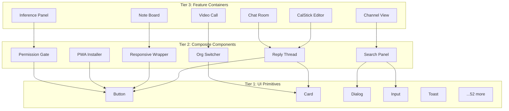
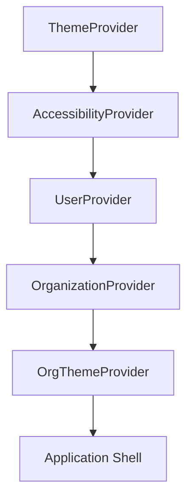
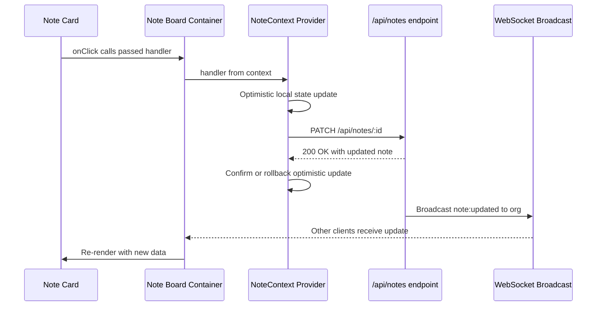

# Chapter 17: Component Architecture and State

*Part VII — The Frontend*

> *"1,458 files rendered through 57 primitives."*

---

The backend is done. Parts I through VI built the entire server-side stack: a PostgreSQL persistence layer with row-level security, an authentication system that handles passwords, LDAP, and SSO without a single third-party auth service, a WebSocket layer for real-time collaboration, a self-hosted AI engine running inference on-network, and 99 API routes that stitch it all together through four caching tiers. Every byte of data stays on hardware you control.

Now we render it.

The frontend has to consume all of that — every API route, every WebSocket event, every AI inference result — and present it as a coherent application. You might expect the client architecture to match the backend's complexity. It does not. The most interesting architectural decision in the frontend is what was *not* adopted.

No Redux. No Zustand. No Jotai. No MobX. No state management library at all.

The entire application runs on React's built-in Context API, four providers deep, with 92 custom hooks handling everything from pull-to-refresh gestures to real-time presence tracking. The state management story is not a story about choosing the right library. It is a story about recognizing when you do not need one.

---

## The Three-Tier Component Hierarchy

Every component in the application belongs to one of three tiers. The rule is simple: each tier may use the tier below it, never the tier above. This is enforced by convention, not by tooling — no lint rule prevents a UI primitive from importing a feature container. The team simply does not do it.



**Tier 1: UI Primitives.** Fifty-seven components in the `ui/` directory, almost all from shadcn/ui. Button, Card, Dialog, DropdownMenu, Input, Select, Sidebar, Toast, Tooltip — the standard set. These components know nothing about the domain. A Button does not know whether it submits a note or deletes a channel. It accepts a variant, a size, an onClick handler, and it renders.

The exceptions are a handful of AI-specific primitives: a generate-tags button, a summarize-links button, an AI inference status indicator. These live alongside the generic primitives because they are reused across multiple features, but they carry domain knowledge — they know what "generate tags" means. They sit at the boundary between Tier 1 and Tier 2, and their placement is a pragmatic concession, not an architectural statement.

**Tier 2: Composite Components.** Domain-aware assemblies that combine primitives into reusable patterns. A reply thread component renders a card containing an avatar, a timestamp, a content block, and action buttons. A search panel combines an input, a dialog, and a list of results with keyboard navigation. A responsive wrapper detects viewport dimensions and swaps between a sidebar layout and a slide-over overlay. A permission gate checks the current user's role before rendering its children.

These components know the domain vocabulary — they understand what a "reply" is, what an "organization" is — but they do not own data. They receive everything through props or context. They never make API calls directly.

**Tier 3: Feature Containers.** The top of the hierarchy. These are full-screen or near-full-screen components that own a feature: the note board, a channel conversation, the CalStick calendar editor, a video call room, the AI inference panel. Feature containers make API calls, manage local state, subscribe to WebSocket events, and orchestrate the composites and primitives below them.

The note board container, for example, fetches notes from the API, subscribes to real-time updates via WebSocket, passes individual notes to card composites, handles drag-and-drop reordering, and manages the color picker dialog. It is the only component that knows the full lifecycle of a note on screen.

The discipline required is that Tier 3 never imports Tier 3. The note board does not import the channel view. If two feature containers need to coordinate, they do so through context or custom events — never through direct import. This keeps the dependency graph a tree, not a web.

---

## State Management Without Libraries

Four React contexts provide all global state for the entire application. Four. For a platform with notes, channels, chat, video, AI inference, organization management, and accessibility preferences, four contexts cover everything that needs to be shared beyond a single component tree.

### UserContext

The simplest context. Three properties:

- `user` — the authenticated user object, or null
- `loading` — boolean, true during the initial session check
- `error` — any authentication error

Every protected component checks `user` before rendering. The loading state prevents the flash of unauthenticated content. The error state triggers the sign-in redirect. That is the entire surface area. User data does not change during a session except on explicit profile updates, so there is no complex synchronization to manage.

### OrganizationContext

Nineteen properties. This is where things get interesting.

The organization context manages the current organization selection, the list of organizations the user belongs to, membership details, and a set of computed permissions. It is the single source of truth for "what organization am I looking at, and what can I do in it?"

The properties break down into three categories. Data: `currentOrg`, `organizations`, `memberships`, `currentOrgRole`. Computed permissions: `isPersonalOrg`, `isOwner`, `canManage`, `canInvite`, `canCreate`. Operations: `setCurrentOrg`, `refreshOrganizations`, `createOrganization`.

Two details matter architecturally. First, the selected organization persists to *both* localStorage and a cookie. localStorage provides fast client-side access. The cookie — `stick_my_note_current_org` — makes the selection available during server-side rendering, so the initial page load can render the correct organization without a flash of wrong content. Dual persistence is a pattern you rarely see discussed, but it solves a real SSR hydration problem.

Second, organization changes broadcast through the DOM event system:

```typescript
// Pseudocode — illustrates the cross-component broadcast pattern
window.dispatchEvent(
  new CustomEvent("organizationChanged", {
    detail: { orgId: selected.id }
  })
)

// Any component — even outside the React tree — can listen
window.addEventListener("organizationChanged", (event) => {
  refreshDataForOrg(event.detail.orgId)
})
```

This is deliberately non-React. Custom events let components that are not in the same context tree — embedded iframes, third-party widget integrations, even browser extensions — respond to organization switches. It is an escape hatch from React's top-down data flow, used sparingly but used well.

### NoteContext

The heavyweight. Over forty event handlers passed through context to every note-related component in the tree. Content editing, color changes, sharing, deletion, pinning, archiving, AI tag generation, AI summarization, reply management, attachment handling, drag-and-drop reordering, state tracking for optimistic updates.

This is where someone would normally reach for Redux. Forty handlers is a lot to thread through context. The counter-argument, and the one this codebase embodies, is that explicitness has value. Every handler is a function you can trace from the button click in the UI, through the context, to the API call in the provider. There is no middleware. There is no action creator. There is no reducer composition. There is a function that calls `fetch`, updates local state on success, and shows a toast on failure.

The verbosity is real. The NoteContext provider file is large. But when something breaks — when a note fails to save, when a color change does not persist — the debugging path is a straight line from component to context to API. No action types to grep for. No saga to step through. No devtools extension required.

The trade-off is explicit: more lines of code in the provider, fewer layers of indirection when debugging. For a team that maintains its own infrastructure, that trade-off makes sense. You are already debugging your own PostgreSQL queries and your own WebSocket server. You do not want to also debug a state management framework's reconciliation logic.

### AccessibilityContext

Six preferences: font size, high contrast mode, reduced motion, enhanced focus indicators, underlined links, and large line height. Persisted to localStorage. Applied as CSS classes on `document.documentElement` — not through React's style system, but through direct DOM class manipulation.

This is intentional. Accessibility preferences need to take effect before React hydrates. By storing them in localStorage and applying them in a blocking script or at the earliest lifecycle point, the page renders with the correct accessibility settings from the first paint. No flash of default styles, no layout shift when preferences load.

```typescript
// Pseudocode — illustrates immediate preference application
const prefs = JSON.parse(localStorage.getItem("a11y-prefs"))

if (prefs.highContrast)
  document.documentElement.classList.add("high-contrast")
if (prefs.reduceMotion)
  document.documentElement.classList.add("reduce-motion")
if (prefs.largeLineHeight)
  document.documentElement.classList.add("large-line-height")
```

The CSS does the rest. Each class triggers a cascade of variable overrides in the global stylesheet. The React context exists only so components can render toggle switches that update these preferences — the actual visual effect is pure CSS.

---

## Provider Nesting Order

The order in which context providers wrap the application is not arbitrary. Each layer depends on the one outside it.



ThemeProvider sits outermost because everything needs to know light versus dark. AccessibilityProvider comes next because high contrast mode modifies the theme's color tokens. UserProvider follows — it needs theme context to render the sign-in page correctly, and accessibility context to respect reduced motion during the loading animation. OrganizationProvider requires the authenticated user to fetch organizations. OrgThemeProvider sits innermost because it overrides theme variables with organization-specific branding, which requires knowing which organization is selected.

Reversing any adjacent pair breaks something. Put UserProvider outside ThemeProvider and the sign-in page renders in the wrong color mode. Put OrgThemeProvider outside OrganizationProvider and there is no organization to brand. The nesting order is a dependency graph expressed as JSX indentation.

---

## The Toast Pattern: State Without Context

Every global state system in this application uses React Context. Except one.

The toast notification system uses module-level closure state. No context provider. No hook required to dispatch. A plain function, callable from anywhere — React components, utility functions, error handlers, even the WebSocket message processor.

```typescript
// Pseudocode — illustrates module-level toast state
const TOAST_LIMIT = 5
let memoryState = { toasts: [] }
let listeners = []
const toastTimeouts = new Map()

function dispatch(action) {
  memoryState = reducer(memoryState, action)
  listeners.forEach((listener) => listener(memoryState))
}

// Exported — callable from anywhere, no hook needed
export function toast({ title, description, variant }) {
  const id = generateId()
  dispatch({ type: "ADD_TOAST", toast: { id, title, description, variant } })
  return id
}
```

The `useToast` hook exists for components that need to *render* the toast list. It subscribes to the module-level state through `listeners`, triggering re-renders when toasts change. But the dispatch side — the `toast()` function — requires no hook, no component context, no React tree access at all.

This matters practically. When a WebSocket connection drops, the reconnection handler — which runs in a plain JavaScript callback, not inside a React component — can call `toast({ title: "Connection lost", variant: "destructive" })` directly. When an API utility function catches a network error, it can toast the user without passing a callback through six layers of props.

The toast system also manages its own timeouts through a Map keyed by toast ID. When a toast is created, a timeout is scheduled to dismiss it. If the toast is manually dismissed before the timeout fires, the timeout is cleared from the Map. This prevents the stale-closure bug where a timeout fires against a toast that no longer exists.

Five concurrent toasts maximum. The sixth pushes the oldest out. Simple queue discipline, implemented in the reducer.

This is the exception that proves the rule. Context works well for domain state — the user, the organization, the notes, the accessibility preferences. These are states that components need to *read* and *render*. Toast notifications are infrastructure state — fire-and-forget signals that need to be *dispatched* from code that has no business knowing about React's component tree. Different access patterns call for different mechanisms. The codebase recognizes this distinction rather than forcing everything through a single paradigm.

---

## The Theme System: Two Layers

The application supports both system-level theming (light, dark, auto) and organization-level branding. These operate as two independent layers that compose through CSS custom properties.

**Layer 1: System Theme.** Handled by next-themes, which manages a `class` attribute on the `<html>` element. When the class is `dark`, a block of CSS variables in the global stylesheet activates — background becomes dark, foreground becomes light, every semantic color token inverts. This is the standard shadcn/ui approach: HSL-based color tokens, fifty-plus variables, all toggled by a single class change.

**Layer 2: Organization Branding.** The `useOrgTheme` hook reads the current organization's branding settings — primary color, secondary color, accent color, favicon URL, display name — and applies them as CSS custom property overrides at runtime. These properties are set directly on `document.documentElement.style`, which means they override the theme layer's defaults without modifying the theme layer's stylesheet.

The favicon replacement is particularly telling:

```typescript
// Pseudocode — illustrates runtime branding
let link = document.querySelector("link[rel='icon']")
if (!link) {
  link = document.createElement("link")
  link.rel = "icon"
  document.head.appendChild(link)
}
link.href = branding.favicon_url
document.title = branding.display_name + " | Stick My Note"
```

No state update. No re-render. The favicon and title are changed through direct DOM access because they live outside React's rendering jurisdiction — they are `<head>` elements that React does not manage. This is not a hack. It is an acknowledgment that the browser's DOM API is the right tool for browser chrome manipulation.

The two-layer system enables white-label multi-tenancy. An organization can have its own colors and favicon while the user retains their light/dark preference. Switch organizations and the brand colors change; toggle dark mode and the theme inverts; both operations compose cleanly because they operate on different CSS variable namespaces.

---

## Zero-Render Components

Three components in the application return `null`. They render nothing. They exist purely for side effects.

**PresenceTracker** manages online/offline presence. It listens to `visibilitychange` and `beforeunload` events, pings the server periodically, and updates the user's last-seen timestamp. It has no visual representation.

**ServiceWorkerRegister** handles PWA service worker registration and update prompts. It registers the service worker on mount, listens for update events, and coordinates the "new version available" notification. Again, no DOM output.

**KeyboardDetector** solves a specific CSS problem. Focus outlines should be visible when navigating with the keyboard but hidden when clicking with the mouse. The component listens for Tab key presses and mouse clicks on the document:

On Tab press, it adds a `using-keyboard` class to `<body>`. On mouse click, it removes it. CSS rules then key off this class:

```css
/* Focus ring visible only during keyboard navigation */
body:not(.using-keyboard) *:focus {
  outline: none;
}
body.using-keyboard *:focus-visible {
  outline: 2px solid var(--ring);
  outline-offset: 2px;
}
```

These components are mounted once at the application root. They never unmount. They have no props, no children, and no visual output. They are pure runtime behaviors packaged as components for one reason: React's lifecycle management. Mounting the component starts the behavior; unmounting stops it. Event listeners are added in `useEffect` and cleaned up in the effect's return function. This is simpler and less error-prone than managing global listeners imperatively.

The pattern is worth naming: *lifecycle-managed side effects*. A component that exists not to render DOM but to tie a side effect's lifetime to React's component lifecycle. It is the functional equivalent of a service in an Angular application, but without the dependency injection framework — just a component that returns null.

---

## Ninety-Two Custom Hooks

The `/hooks/` directory contains 92 files. Each encapsulates a single behavior, and most are under fifty lines. They fall into four categories.

**State management hooks** wrap Context access with convenience methods. `useCurrentUser` reads UserContext and throws if used outside the provider. `useOrganization` reads OrganizationContext and returns computed values like `canManage` alongside raw data. These are thin wrappers — their value is in providing a stable API surface even if the underlying context shape changes.

**Data fetching hooks** encapsulate the fetch-cache-error cycle for specific endpoints. `useNotes`, `useChannels`, `useMembers` — each handles loading state, error state, and cache invalidation for its domain. These are not backed by a data fetching library like React Query or SWR. They use `useState` and `useEffect` directly. This is another deliberate non-adoption: the team decided that the overhead of a fetching library was not justified when each hook's fetching logic is straightforward and the caching requirements are met by the server's own cache headers plus the browser's HTTP cache.

**Gesture and interaction hooks** handle physical input. `usePullToRefresh` implements the mobile pull-to-refresh gesture with a resistance formula — the further you pull, the harder it gets, following a `distance * 0.5` decay. `useGridLayout` computes responsive grid column counts from the viewport width and the minimum item width, recalculating on resize. `useLongPress` differentiates between a tap and a long press on touch devices. These hooks abstract the messiness of pointer events, touch events, and resize observers behind clean return values.

**Specialized UI hooks** manage browser APIs. `useFullscreen` wraps the Fullscreen API with its vendor-prefixed variations. `useBrowserNotifications` handles the permission request flow — prompt, granted, denied — and provides a `notify` function that is a no-op if permission was not granted. `useClipboard` wraps the Clipboard API with a fallback to `document.execCommand` for older browsers.

The common thread across all 92 hooks is single-responsibility. No hook does two things. This is not a principle stated in a style guide; it is a pattern that emerged from practical development. When a hook tried to do two things, it was split. When two hooks were always used together, a third hook was created to compose them. The result is a library of small, composable behaviors that feature containers mix and match as needed.

---

## Event Handler Flow: From Click to API

The NoteContext's forty-plus handlers follow a consistent pattern. Understanding one is understanding all of them.



A note card renders a color picker button. The button's click handler was passed down from the note board container, which received it from the NoteContext provider. The handler performs an optimistic update — setting the new color in local state before the API responds — then sends the PATCH request. On success, the optimistic state is confirmed. On failure, it rolls back to the previous color and fires a toast.

Meanwhile, the API route broadcasts the change through WebSocket. Other users viewing the same note board receive the update and re-render. The handler that originated from a single click propagates through context, API, and WebSocket to every connected client.

Every one of the forty-plus handlers follows this shape: optimistic update, API call, confirm or rollback, toast on error. The consistency is the architecture. There is no framework enforcing it — no base class, no abstract handler, no middleware pipeline. It is a pattern maintained by discipline and code review. The advantage is that when you read any handler, you already know its structure. The disadvantage is that the pattern is repeated forty times with minor variations, and there is nothing preventing a new contributor from deviating.

This is the fundamental trade-off of this frontend's architecture: convention over mechanism. The patterns are consistent because the team keeps them consistent, not because a tool enforces them. For a small team maintaining its own infrastructure, this works. For a large team with high turnover, it might not. The codebase knows what it is.

---

## Apply This

Five patterns from this chapter that transfer to any React application of similar scale:

**1. Tier your components explicitly.** Even without tooling to enforce it, naming conventions and directory structure create a mental model. When a developer sees a component in `ui/`, they know it should not import from `features/`. When they see a component in `features/`, they know it owns data fetching. The taxonomy is the documentation.

**2. Context is sufficient more often than you think.** The threshold for adopting a state management library is not "I have global state." It is "I have global state with complex update patterns that are difficult to trace through Context." Forty handlers in a single context is verbose. It is also debuggable with `console.log`. Measure the cost of verbosity against the cost of indirection before reaching for a library.

**3. Not everything belongs in Context.** The toast system's module-level closure state is a better fit for fire-and-forget infrastructure concerns than a Context provider would be. If you need to dispatch from outside the React tree — from a WebSocket handler, from an error boundary, from a service worker callback — a plain function is more accessible than a hook.

**4. Zero-render components are a legitimate pattern.** A component that returns null but manages event listeners through useEffect ties the side effect's lifetime to React's lifecycle without mixing side-effect logic into rendering components. It is cleaner than scattering `addEventListener` calls across multiple components.

**5. Dual persistence solves the SSR hydration gap.** localStorage is fast but invisible to the server. Cookies are visible to the server but slower to access on the client. Persisting to both — localStorage for client reads, cookie for SSR — gives you the best of each without the hydration mismatch that comes from using only one.

---

The component architecture and state management are in place. But a collaboration platform that only works on a desktop browser with a keyboard and mouse is not a collaboration platform — it is a prototype. Chapter 18 turns to the three frontend disciplines that make the application usable in the real world: responsive layout across phone, tablet, and desktop; progressive web app capabilities for offline and installability; and accessibility for the users that most enterprise platforms forget.
