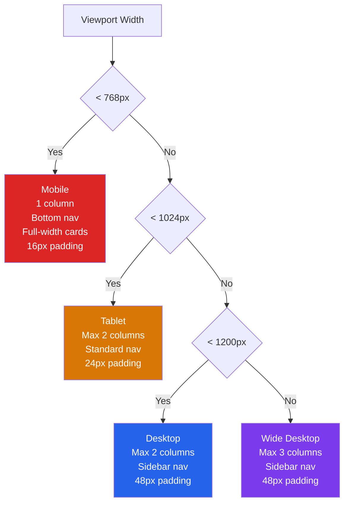
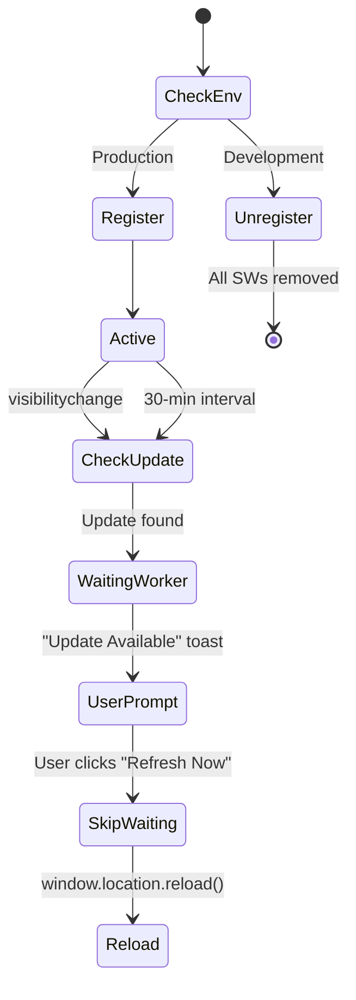
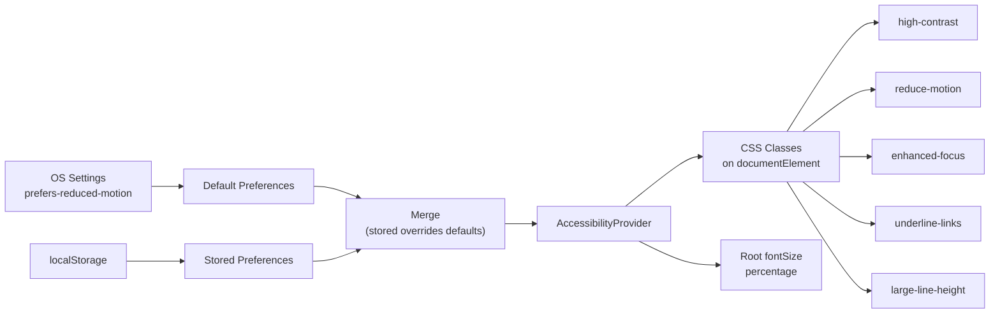

# Chapter 18: Responsive Design, PWA, and Accessibility

Chapter 17 mapped the component architecture: three tiers of complexity, Context API for state, ninety-two hooks, and a toast system that decouples user feedback from business logic. The frontend is structured. But structure is not the same as reach. A collaboration tool that only works on a desktop browser with a mouse and a fast connection is not a collaboration tool -- it is a prototype.

This chapter covers the four capabilities that turn the prototype into something people can actually depend on: responsive layout that adapts from phone to ultrawide, Progressive Web App support for installation and offline awareness, accessibility features for users who navigate differently, and performance patterns that keep the whole thing fast. These are not separate concerns. A user on a phone is likely on a slow connection. A user with a screen reader needs the same real-time updates as everyone else. A user who installs the PWA expects it to tell them when it has no network. The systems interlock.

---

## The Responsive Layout System

Responsive design in Stick My Note is not a CSS media query bolted onto a desktop layout. The application makes structural decisions based on viewport width: different navigation, different grid calculations, different interaction patterns. The breakpoint system has three tiers.



### The Mobile Detection Hook

The `useIsMobile` hook is the decision gate. It wraps a `matchMedia` listener for `(max-width: 767px)` and returns a boolean. Components conditionally render based on this value -- the mobile bottom navigation bar, for instance, returns `null` entirely when the viewport is wider than 768 pixels.

The hook initializes state as `undefined` and resolves on mount via an effect that reads `window.innerWidth`. The double negation at the return (`!!isMobile`) coerces that initial `undefined` to `false`, which means server-rendered HTML always assumes desktop. This is a deliberate choice: the server cannot know the viewport, and the desktop layout is more content-rich, so it is better to flash from desktop to mobile than from an empty mobile shell to a full desktop layout.

The `matchMedia` listener fires on change, not on every resize event. This is a meaningful performance distinction. A `resize` event handler fires dozens of times during a single drag of the browser edge. A `matchMedia` change listener fires exactly once: when the viewport crosses the breakpoint threshold. The hook does not debounce, throttle, or batch -- it does not need to, because the underlying API already provides the right granularity.

One subtlety: the hook uses `window.innerWidth` in the `onChange` callback rather than reading the MediaQueryList's `matches` property. This is because the same hook serves as a width signal for components that want to know "are we mobile?" without also needing the exact pixel value. The MediaQueryList only tells you whether the query matches; the window width is the primitive that other hooks (like `useGridLayout`) will consume.

### Grid Layout Computation

The grid system does not rely on CSS Grid `auto-fill` or `auto-fit`. It computes the column count from viewport width using an explicit formula:

```
columns = max(1, floor((availableWidth + gap) / (itemWidth + gap)))
```

The formula is evaluated in a `useMemo` that depends on `windowWidth`. On mobile, the item width compresses to `min(viewport - 32px, 558px)`. On tablet, padding drops from 48px to 24px. The column count is then capped: one column on mobile, two on tablet, three on wide desktop.

Why compute columns in JavaScript instead of using CSS Grid's intrinsic sizing? Because the application needs the column count as a number, not just as a layout. The virtualization system uses it to calculate visible rows. The note card width feeds into child component layout decisions. CSS Grid is excellent at placing items in a grid; it is not excellent at telling JavaScript how many columns it decided to use.

The grid renders with explicit `gridTemplateColumns` values -- `repeat(2, 558px)` rather than `repeat(auto-fit, minmax(558px, 1fr))`. This eliminates the class of bugs where CSS Grid decides on a layout that disagrees with the JavaScript column count.

### Mobile Navigation

On mobile, the top sidebar collapses entirely and a fixed bottom navigation bar takes its place. The bar has six items -- Home, Notes, Chat, Noted, Projects, Profile -- each with an icon and a label. Active state is determined by path prefix matching, not exact path matching: `/channels/general` highlights "Chat" because it starts with `/channels`.

The bottom bar uses `var(--safe-area-bottom)` for padding on devices with home indicators or notch areas. The root `<main>` element applies `pb-[env(safe-area-inset-bottom)]` so content does not slide behind the bottom navigation. These are small details that are invisible when they work and infuriating when they do not.

---

## Custom Virtualization

The application renders lists of notes, cards, and table rows. None of these lists are enormous -- hundreds of items, not millions. This is a collaboration tool, not a spreadsheet. But even a few hundred rich note cards with editors, reply threads, and action menus can bog down a render cycle if they all mount at once.

Rather than pulling in `react-virtual` or `react-window`, the codebase implements three custom virtualization strategies, each tuned to its use case.

**VirtualizedCardGrid** uses an IntersectionObserver with a 200-pixel `rootMargin` as a sentinel for infinite scroll. When the observer fires, it calls a server-driven pagination callback that fetches the next page. The grid itself renders all fetched items -- it does not unmount items that scroll out of view. For card layouts where each card has variable height and internal state (expanded replies, active editors), unmounting and remounting is more expensive than keeping them in the DOM.

**VirtualizedNoteGrid** adds client-side pagination on top of the same IntersectionObserver pattern. It uses a `usePagination` hook that tracks how many "pages" of twenty items are loaded. When the server provides an `onLoadMore` callback, the grid defers to it. When it does not, the grid windows into the local dataset, loading five additional pages at a time when the user clicks "Load More." This dual mode lets the same component work for both server-paginated feeds and fully-loaded local collections.

**VirtualizedTable** is the only component that does true DOM virtualization. It tracks scroll position, computes a visible range based on a configurable `itemHeight` (default 60 pixels) and `overscan` (default 5 rows), and renders only the rows in that window. A spacer `<tr>` with computed height maintains scroll position above the visible range. The total `<tbody>` height is set to `data.length * itemHeight`, which keeps the scrollbar accurate.

```
visibleStart = max(0, floor(scrollTop / itemHeight) - overscan)
visibleEnd   = min(totalRows, ceil((scrollTop + viewportHeight) / itemHeight) + overscan)
offsetY      = visibleStart * itemHeight
```

Why not use a library? Three reasons. First, the intersection-based approach in the card grids is fundamentally different from the scroll-position approach in the table -- a library that handles both would need to be configured into two modes anyway. Second, the card grids deliberately avoid unmounting cards, which is the opposite of what virtualization libraries do. Third, the total dependency count matters in an enterprise deployment where every package is a supply-chain risk. Three components totaling two hundred lines of code replace a dependency that would itself pull in its own dependency tree.

---

## Progressive Web App

The application ships as a PWA. Not because every user will install it, but because the PWA infrastructure provides three things the browser alone does not: installability (home screen icon, standalone window), update management (service worker lifecycle), and offline awareness.

### Service Worker Lifecycle



The `ServiceWorkerRegister` component runs in the root layout. In production, it registers `/sw.js` on window load and sets up a `visibilitychange` listener that calls `registration.update()` every time the user returns to the tab. In development, it does the opposite: it iterates over all registered service workers and unregisters them. This prevents the maddening development experience where a cached service worker serves stale JavaScript after a code change.

A separate `SWUpdateNotification` component handles the update flow. It polls for updates every thirty minutes via `setInterval`, listens for the `updatefound` event on the registration, and watches the installing worker's `statechange` for the `installed` state. When a new worker is waiting, it shows a toast with "Refresh Now" and "Later" buttons. Clicking "Refresh Now" posts a `SKIP_WAITING` message to the waiting worker and reloads the page.

The deliberate design choice here is no automatic reload. A collaboration tool cannot reload the page while the user is mid-sentence in a chat message or mid-drag on a sticky note. The user decides when to take the update.

### Install Prompt

The `PWAInstallPrompt` component handles two completely different install flows behind one interface. On Android and desktop Chrome, the browser fires a `beforeinstallprompt` event that the component captures and defers. When shown, it offers an "Install" button that calls `prompt()` on the deferred event. On iOS, there is no `beforeinstallprompt`. The component detects iOS via user agent, waits five seconds, and shows manual instructions: "Tap the share button, then Add to Home Screen."

The prompt respects a seven-day dismissal window. When the user clicks "Not now," the component writes `Date.now()` to localStorage. On subsequent loads, it checks whether seven days have passed before showing the prompt again. Already-installed users (detected via `display-mode: standalone` media query) never see the prompt at all.

### Offline Indicator

The `OfflineIndicator` listens to the browser's `online` and `offline` events. When the network drops, it renders a fixed amber bar at the top of the viewport with z-index 9999 -- above everything, including modals. When the network returns, the bar turns green with "Back online" and auto-dismisses after three seconds.

This component is intentionally simple. It does not attempt to cache API responses or queue offline mutations. Stick My Note is a real-time collaboration tool; meaningful offline functionality would require conflict resolution, local persistence, and sync queues -- a project unto itself. What the indicator does provide is honesty: the user knows immediately that their actions are not being saved.

### Manifest

The web app manifest declares `standalone` display mode, which removes the browser chrome when installed. It specifies icon sizes from 72px through 512px, all as SVGs for resolution independence. Maskable icons (the `purpose: "maskable"` variants) ensure Android adaptive icon shapes -- circles, squircles, rounded squares -- clip the icon correctly instead of shrinking it to fit.

The `launch_handler` with `client_mode: "navigate-existing"` prevents duplicate windows. If the user clicks a link to the app while it is already open, the existing window navigates instead of spawning a new one. This small detail is the difference between a web app that behaves like an installed application and one that feels like a browser tab with a home screen shortcut.

---

## Accessibility Architecture

Accessibility in Stick My Note is not an afterthought patched in with `aria-label` attributes. It is a system with five components: a preference provider, a keyboard detector, a skip link, a screen reader announcement channel, and a cookie consent banner that respects opt-in granularity.

### The Preference Provider

The `AccessibilityProvider` wraps the entire application and exposes six user-controlled preferences:

| Preference | Type | Range | Default |
|---|---|---|---|
| fontSize | multiplier | 0.85 -- 1.5 | 1 |
| highContrast | toggle | on/off | off |
| reduceMotion | toggle | on/off | OS default |
| enhancedFocus | toggle | on/off | off |
| underlineLinks | toggle | on/off | off |
| largeLineHeight | toggle | on/off | off |

Preferences persist to localStorage and apply as CSS classes on `document.documentElement`. The font size preference sets both a CSS custom property (`--a11y-font-scale`) and the root `fontSize` as a percentage (`150%` at the maximum). Components that use `rem` units scale automatically. Components that use `px` do not -- this is intentional for elements like icons and borders that should not scale.



The provider respects OS-level `prefers-reduced-motion`. On first load, if the OS media query matches and no stored preferences exist, the provider defaults `reduceMotion` to `true`. This means a user who has set "Reduce motion" in their operating system preferences gets reduced motion in Stick My Note without configuring anything. If they later explicitly toggle the preference in the app's accessibility settings, that explicit choice takes precedence and persists.

### Keyboard Detection

The `KeyboardDetector` component adds a `using-keyboard` class to `<body>` when the user presses Tab and removes it on mouse click. The component renders nothing -- it returns `null`. Its only purpose is to maintain that class.

This solves the focus ring problem. Mouse users do not want focus rings on every button they click. Keyboard users need them desperately. The `:focus-visible` pseudo-class is supposed to handle this, but browser implementations vary. By toggling a class based on actual input events, the application can use `.using-keyboard :focus` selectors that work consistently across browsers.

### Skip Navigation

The root layout includes a skip link as the first focusable element in the DOM:

```html
<a href="#main-content"
   class="sr-only focus:not-sr-only focus:absolute focus:top-4
          focus:left-4 focus:z-50 focus:px-4 focus:py-2
          focus:bg-primary focus:text-primary-foreground
          focus:rounded-md">
  Skip to main content
</a>
```

The `sr-only` class hides it visually. On focus (when a keyboard user presses Tab as their first action), it becomes visible, positioned absolutely in the top-left corner. Clicking it jumps focus to `<main id="main-content">`. Without this, a keyboard user would have to tab through every navigation item, every sidebar link, and every toolbar button before reaching the actual content. On a page with sixty navigation elements, that is sixty Tab presses before doing anything useful.

### Cookie Consent

The cookie consent banner is technically a privacy feature, but its implementation is an accessibility concern. It presents three tiers of consent: necessary (always on, checkbox disabled), analytics (opt-in), and marketing (opt-in). The banner integrates with Google Analytics via the gtag consent API, calling `gtag("consent", "update", { analytics_storage: "granted" })` or `"denied"` based on user choice.

The "Customize" flow expands in place rather than navigating to a separate page. This keeps the user's context intact and avoids a full page reload that could lose unsaved work. Preferences save to localStorage and apply on subsequent loads without re-prompting.

---

## HTML Sanitization as a Performance and Security Boundary

User-generated HTML is the most dangerous content in any collaboration tool. Cross-site scripting via a pasted `<script>` tag, data exfiltration via a crafted `` src, layout destruction via unclosed tags -- the attack surface is broad. The sanitization system addresses this with three named levels:

**STRICT** allows basic formatting: paragraphs, lists, links, headings, code blocks. No images, no tables, no `class` attributes. The `href` attribute is validated against a URI regexp that permits only `http`, `https`, `mailto`, and `tel` protocols. This is the default for user-generated note content.

**RICH_TEXT** extends STRICT with images, tables, and the `class` attribute (for styled editor output from TipTap). The `src` attribute is allowed but still filtered by the same URI regexp -- no `javascript:` URIs, no `data:` URIs.

**MINIMAL** is the nuclear option: bold, italic, emphasis, strong, paragraphs, and line breaks. Nothing else. Used for replies and short-form content where formatting complexity is a liability.

The `sanitizeRequestBody` function applies these levels server-side. API routes declare which fields contain HTML and which sanitization level to apply. The sanitizer runs before any database write, which means dirty HTML never touches the database. This is a performance decision as much as a security one -- sanitizing on read would mean sanitizing the same content on every page load.

---

## Performance Patterns

### Note Card Z-Index Management

Sticky notes in the board view use absolute positioning. When dozens of notes overlap, z-index management becomes a state machine:

| State | Z-Index | Trigger |
|---|---|---|
| Default | auto | Note at rest |
| Dragging | elevated + `rotate(5deg)` | mousedown on note |
| Reply form open | 1001 | Reply button clicked |
| Tab active | 1002 | Tab selected within note |

The drag rotation is a small affordance that provides strong feedback: the note lifts off the surface. The z-index escalation ensures that interactive states always render above passive ones -- a reply form should never be clipped by an adjacent note's body.

### Dynamic Imports

Heavy components load lazily. The TipTap rich text editor, with its extensions for mentions, links, images, and code blocks, is the largest single component in the application. It loads via `next/dynamic` with `ssr: false`, which means the editor bundle does not inflate the initial page load and does not attempt to render on the server (where it would fail, since TipTap depends on browser APIs).

### Safe Area Insets

The root `<main>` element applies `pb-[env(safe-area-inset-bottom)]` to prevent content from rendering behind the home indicator on notched devices. The viewport meta tag specifies `viewport-fit: cover`, which tells the browser to extend the layout into the safe area rather than insetting it. The CSS environment variable then pulls content back from the edges where hardware intrudes.

This two-step dance -- extend into the safe area, then pad where needed -- gives the application full-bleed backgrounds while keeping interactive content accessible. The mobile bottom navigation applies the same safe area padding, ensuring its tap targets are never obscured by a device's home indicator.

---

## Apply This

Five patterns from this chapter transfer to any application:

1. **Compute layout in JavaScript when JavaScript needs the numbers.** CSS Grid is excellent at layout but cannot tell your virtualization system how many columns it chose. If other code depends on the grid dimensions, compute them explicitly and pass them to both CSS and JavaScript.

2. **Match your virtualization to your content.** Variable-height cards with internal state should not be unmounted on scroll -- the remount cost exceeds the DOM cost. Fixed-height table rows with no internal state should be virtualized aggressively. One size does not fit all, and a custom solution for each case is often simpler than configuring a library to handle both.

3. **Never auto-reload for service worker updates.** The user might be mid-action. Show a non-blocking notification. Let them choose when to reload. The thirty seconds of stale code is always less disruptive than the lost draft.

4. **Respect the operating system's accessibility preferences as defaults, not overrides.** If the OS says reduce motion, default to reduced motion. But let the user override it in your application. Their preference for your tool may differ from their global preference.

5. **Sanitize HTML on write, not on read.** Running DOMPurify on every render is wasted work. Running it once before the database write means every read serves clean content with zero sanitization overhead. The database becomes a trusted boundary.

---

The application can now adapt to a phone screen, install to a home screen, announce itself to a screen reader, and tell the user when it has lost network connectivity. These are not features in the traditional sense -- no one opens a collaboration tool because it has good focus ring management. They are prerequisites. They are the difference between software that works for the engineer who built it and software that works for everyone who needs it.

The Epilogue steps back from implementation details and asks the larger question: what does it mean to build a sovereign system, and was the bet worth making?
