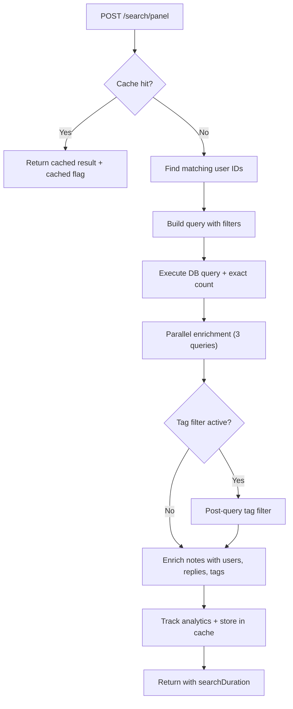
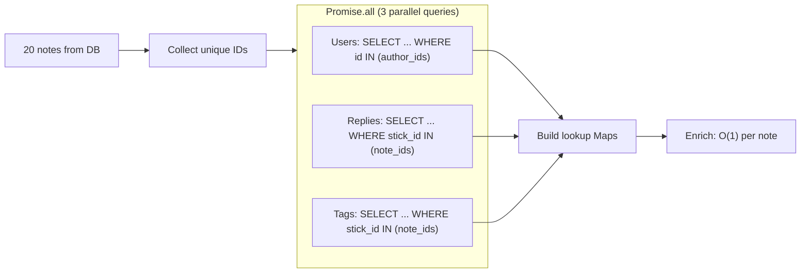
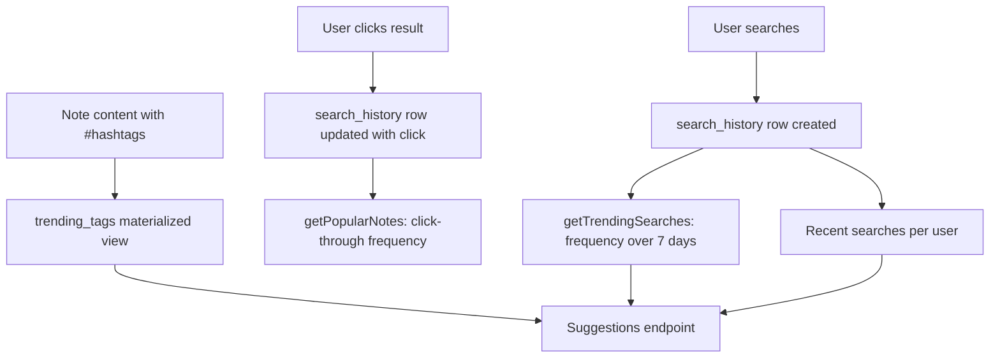

# Chapter 15: Search Across Everything

> Part VI: Discovery and Observability
>
> "You can't manage what you can't find or measure."

Part V ended with inference -- the AI that summarizes, classifies, and generates content from what users have already created. But inference presupposes that the system can locate the right content in the first place. An AI summary of a note you cannot find is useless. A classification label on a stick buried in a pad you forgot about is decoration.

This chapter opens Part VI by tackling the first half of that epigraph: finding things. A collaboration platform is only as good as its search. When an organization accumulates thousands of notes, sticks, and pads across multiple organizations, the ability to locate the right content quickly is what separates a useful tool from a digital graveyard. Chapter 16 will tackle the second half -- measuring things through analytics, audit trails, and health checks.

Search in Stick My Note is pragmatic. PostgreSQL full-text search with ILIKE fallback. Multi-layer caching through Upstash Redis. Parallel enrichment to keep response times low. No Elasticsearch. No Solr. No separate search service at all.

That last point is a deliberate architectural decision, not a limitation. Every additional service in a self-hosted deployment is another server to provision, another backup to verify, another failure mode to monitor at 2 AM. PostgreSQL already has full-text search. It is not as sophisticated as a dedicated search engine -- no BM25 tuning, no per-query field boosting, no distributed indexes across shards. But it lives where the data already lives, it participates in the same transactions, and it fails or succeeds with the same database the rest of the application depends on. One throat to choke.

If you are building a search layer for an internal tool and your data already lives in PostgreSQL, start here. You can always add Elasticsearch later when you hit the ceiling. Most internal tools never hit the ceiling.

---

## Dual-Mode Search: FTS and Fuzzy

The search engine offers two modes, controlled by a single query parameter.

**Full-text search** uses PostgreSQL's `tsvector` and `tsquery` machinery. Topics are weighted as `A` (highest relevance), content as `B`. The database maintains a `search_vector` column updated by a trigger on every insert or update. A GIN index makes lookups fast. Stemming means a search for "running" matches "run," "runs," and "ran." Weight classes mean a topic match outscores a content match in ranking.

The trigger function constructs the vector at write time, not query time:

```
// PostgreSQL trigger (simplified)
on INSERT or UPDATE of topic, content:
    search_vector =
        setweight(to_tsvector('english', topic), 'A') ||
        setweight(to_tsvector('english', content), 'B')
```

This is a critical performance decision. Building a tsvector is not free -- the text must be tokenized, stemmed, and normalized. Doing it once at write time and storing the result means reads pay zero cost for vector construction. The GIN index on `search_vector` then makes the actual lookup sub-millisecond for typical corpus sizes.

**Fuzzy search** uses ILIKE -- case-insensitive substring matching. No stemming, no ranking, no linguistic awareness. A search for "budg" matches "budget," "budgetary," and "fudge-budget." It catches what FTS misses: partial words, abbreviations, proper nouns, content that the English stemmer does not understand.

The default mode combines both via an OR filter. When a user searches for "quarterly review," the query builder constructs:

```
// Dual-mode query construction (simplified)
if fuzzy:
    filter = OR(
        topic.ilike "%quarterly review%",
        content.ilike "%quarterly review%",
        topic.fts(english) "quarterly review",
        content.fts(english) "quarterly review"
    )
else:
    filter = OR(
        topic.fts(english) "quarterly review",
        content.fts(english) "quarterly review"
    )
```

FTS-only mode is available via `?fuzzy=false`. It exists for users who want precise linguistic matching without substring noise. In practice, almost nobody uses it -- the default dual mode is what people expect from a search box.

The dual-mode approach means a search for "meeting" will match:
- "meeting" (exact, both modes)
- "meetings" (FTS stemming matches "meeting" -> "meet")
- "weekly meeting notes" (ILIKE substring)
- "met" will NOT match via FTS (stemmer goes the other direction) but "met" as a substring will match "meeting" via ILIKE

This covers most real-world search behavior without any configuration. The user does not need to know about search modes. They type words. Results appear.

There is also a client-side fuzzy search class that implements Levenshtein distance for in-memory filtering. It calculates edit distance between the query and each candidate string, converts that to a similarity score between 0 and 1, and filters below a configurable threshold (default 0.3). Exact matches score 1.0. Substring containment scores 0.8 plus a length ratio bonus. Anything else gets the Levenshtein treatment, scaled to a 0-0.7 range with a 0.6 floor.

This client-side fuzzy search is used for small collections already loaded in the browser -- filtering a dropdown of tag names, matching pad titles in a selector. It is not used for the primary database search. The right tool for the right scale. Levenshtein on 50 tags is instant. Levenshtein on 50,000 notes would melt the browser tab.

---

## The Panel Search Pipeline

The panel search endpoint is the main entry point for the community notes view. It accepts a POST with a query, filters, pagination, and sorting options, then runs a pipeline that caches, queries, enriches, and tracks.



The cache layer sits at the top. Before touching the database, the handler builds a cache key from the query string, the serialized filters object, and the page number. If Upstash Redis holds a valid result under the 5-minute TTL, the response goes back immediately with a `cached: true` flag. The client knows the data might be slightly stale. For a search results page, five minutes of staleness is acceptable. New notes created in the last five minutes will not appear in cached results, but the next cache miss will pick them up.

The cache is a convenience layer, not a correctness requirement. If Redis is unavailable -- connection failure, missing credentials, REST URL is not HTTPS -- the SearchCache class returns null from every `get()` and silently drops every `set()`. Search degrades to uncached, which is slower but correct. This is the right failure mode for a cache: invisible degradation, not visible failure.

On a cache miss, the handler runs a user search before touching the notes table. If the search term is at least three characters, it queries the users table for usernames and full names matching via ILIKE. The resulting user IDs are folded into the notes query as an OR clause. This means searching for "sarah" finds both notes containing the word "sarah" and all notes authored by a user named Sarah. It is a small optimization that dramatically improves search utility -- users often search by author name.

The base query targets `personal_sticks` filtered to shared notes only. Filters layer on:
- **Timeframe**: day, week, month, or all. Converted to a timestamp and applied as a `>=` on `created_at`.
- **Colors**: an IN clause on the color column. Users can filter to only yellow notes, or only blue and green.
- **Sort order**: newest (default), oldest, or relevance. In practice, "relevance" falls back to newest because the ILIKE/FTS combo does not produce a ranking score through the query builder.

Pagination uses range-based offsets with `{ count: "exact" }` so the total count comes back in the same query. No separate COUNT query needed.

---

## Parallel Enrichment

After the database returns a page of notes -- typically 20 items -- the handler needs three additional pieces of data for each note: the author's profile, the replies (both count and content), and the tags. The naive approach is N+1: loop through each note, fetch its author, fetch its replies, fetch its tags. For 20 notes, that is 60 sequential database round-trips.

The actual approach is three batch queries, all parallel:



The implementation collects all unique user IDs from the page of notes and all note IDs, then fires three queries simultaneously via `Promise.all`. Users come back as an array and get reduced into a `Record<string, UserInfo>` keyed by user ID. Replies come back filtered by note ID, grouped into a `Record<string, ReplyData[]>` with a parallel counts record. Tags follow the same bucketing pattern.

The reply enrichment does extra work: after fetching all replies for the page of notes, it collects the unique user IDs from reply authors and makes an additional query to get their usernames and emails. This means each reply in the results carries its author's display name, not just a raw UUID. The additional query is sequential within the replies fetch but parallel with the other two enrichment queries.

Assembly is O(n) in the number of notes:

```
// Assembly after parallel enrichment (simplified)
for each note in page:
    note.user       = usersMap[note.user_id]       // O(1)
    note.reply_count = replyCounts[note.id] || 0    // O(1)
    note.replies    = repliesMap[note.id] || []     // O(1)
    note.tags       = tagsMap[note.id] || []        // O(1)
    note.view_count = random(10..109)               // more on this shortly
    note.like_count = random(0..49)
```

The trade-off is explicit: three to four extra queries per search request, but all running in parallel. Total wall-clock time is the maximum of the three, not their sum. For a 20-note page, this replaces up to 60+ sequential queries with 3-4 parallel ones.

Tag filtering happens after enrichment, not in the database query. This is a pragmatic concession. Tags live in a junction table, and filtering in SQL would require a JOIN that changes the count semantics and complicates the pagination offset. Instead, the handler fetches all notes matching the text query, enriches them with tags, then filters in application code. The downside is that the returned count may not match the pre-filter total -- the count reflects notes matching the text query, not notes matching the text query AND the tag filter. The upside is simpler queries and correct pagination for the non-tag-filtered case, which is the common case.

---

## The Community Notes Search: A Different Pipeline

The community notes search endpoint takes a different approach from the panel search. Instead of enriching notes with data from junction tables, it enriches from the note tabs system -- the tabbed content structure where each note can have a main tab, a videos tab, an images tab, and a details tab.

After fetching notes and their count in parallel, the handler makes a second parallel batch for replies and note tabs. The tab data is where things get interesting: each tab may contain videos (with platform, embed ID, thumbnail), images (with dimensions, format, captions), and tags. The tags can arrive in at least three formats -- a JSON string array, a native array, or a JSONB object with string values. The handler parses all three defensively.

This polymorphic tag parsing is a consequence of schema evolution. Early versions stored tags as JSON strings. Later versions stored them as native arrays. The JSONB object format crept in from a UI that submitted tags as `{ "0": "tag1", "1": "tag2" }`. Rather than run a migration to normalize the column, the read path handles every format. This is a reasonable trade-off for a system that is actively evolving -- the migration would touch every row, the defensive parsing touches only the read path.

The community search also supports a colon syntax for topic-only search. Typing `budget:Q4` splits on the colon and applies separate ILIKE filters on the topic column for "budget" and "Q4." This is a power-user feature -- no UI exposes it, but anyone who reads the URL parameters can use it.

---

## Related Content: Relevance Scoring Without an Index

The related search endpoint solves a different problem: given a stick, find other sticks that are similar. This is not keyword search -- it is content-based recommendation.

The approach is straightforward scoring. Fetch the current stick, then fetch recent sticks from the same pad. Score each candidate on three axes: same-pad membership (a flat bonus), shared AI-generated tags (points per common tag), and keyword overlap (intersection of significant words, capped to avoid long-content bias). Sort by score, return the top N.

The keyword overlap uses a Set intersection. The current stick's content is tokenized, filtered to words longer than three characters, and loaded into a Set. Each candidate's words are checked against the Set. This is O(n) per candidate, which is fine for a pool of a few dozen sticks from the same pad. It would not scale to corpus-wide recommendations, but that is not the use case.

This scoring runs entirely in application code. There is no relevance index in the database, no vector embedding, no similarity search extension. It is a simple heuristic that works well enough for "you might also be interested in" suggestions within a pad context.

---

## The View Count That Does Not Exist

Here is a piece of code that every panel search result passes through:

```
// Enrichment (actual pattern)
note.view_count = Math.floor(Math.random() * 100) + 10
note.like_count = Math.floor(Math.random() * 50)
```

These are not real numbers. They are random integers generated fresh on every request. A note that shows 47 views right now will show 83 on the next search. The data is not persisted anywhere.

Why? The UI was designed expecting engagement metrics. The cards have slots for view counts and like counts. The frontend components render them. Removing the fields would mean refactoring the card layout. Returning zero for everything would look broken -- an active community where every note has zero views signals "this platform is dead," which is the opposite of what the UI should communicate.

So the backend generates plausible-looking numbers. Mock data. Technical debt with a neon sign on it.

This is a pattern worth acknowledging because everyone encounters it. A feature gets designed end-to-end, the UI ships, and then the backend tracking infrastructure gets deprioritized. The options are:
1. Rip out the UI (wasted frontend work, design regression)
2. Show zeros (looks broken, signals abandonment)
3. Show mocks (looks fake if anyone inspects network traffic)
4. Build the tracking (takes time, needs storage, needs privacy review)

The codebase chose option 3, visibly, with the intent to replace when real view tracking lands.

The analytics endpoint is more honest about this. It returns `totalViews: 0` -- a hard zero, not a random number. The mock data exists only in search results where the numbers are per-note decoration on a card, not in the analytics dashboard where they would be aggregated, charted, and acted upon. That distinction matters. Decorating a card with a plausible number is cosmetic. Decorating a dashboard with a plausible number is lying.

---

## New Count Polling: Lightweight Freshness

The panel has a separate lightweight endpoint for checking whether new content exists since the user last loaded results. It accepts a `since` timestamp and returns a count of shared notes updated after that timestamp, capped at 9 (because the UI shows a badge, and "9+" is the maximum display).

This endpoint has its own Redis cache with a 30-second TTL -- much shorter than the search cache's 5-minute TTL. The reasoning: users expect the "new notes available" badge to be responsive. A 5-minute lag on the badge would mean users stare at stale results without knowing new content exists. Thirty seconds is a good balance between freshness and database load.

The query uses `{ count: "exact", head: true }` -- it asks for the count without returning any rows. This is PostgreSQL's equivalent of `SELECT COUNT(*) ... LIMIT 9`: the database counts matching rows but returns no data payload. Minimal bandwidth, minimal parsing, maximum efficiency for a polling endpoint.

---

## Search Analytics

Every search leaves a trace. The analytics layer records three things: what was searched, what was clicked, and what is trending.

**Search tracking** writes to `search_history` on every query: the user ID, the query string, the applied filters as JSONB, and the result count. This happens after the response is assembled, inside a try/catch that swallows all errors. Analytics must never break search. If the insert fails -- table does not exist, connection dropped, RLS policy blocks the write -- the search still returns its results. The user never sees the failure.

The `search_history` table has RLS policies scoping reads and writes to the owning user. Your search history is private. Not even organization admins can see what other users searched for. This is a deliberate privacy choice.

**Click tracking** records which result a user selected and its position in the list. The click-tracking endpoint receives the user ID, the original query, the clicked note ID, and the position index. It finds the most recent `search_history` row for that query by that user and updates its `clicked_note_id`. This links queries to outcomes -- the closed loop that enables relevance tuning.

Position tracking is the subtle power here. If users consistently click the third result for a given query, that tells you the first two results are poor matches. Over time, this data could drive re-ranking: boost notes that get clicked, demote notes that get skipped. The infrastructure is in place. The re-ranking algorithm is not -- another item on the backlog, but with the data already collecting.

**Trending searches** aggregates query frequency over a 7-day sliding window. The implementation fetches up to 100 recent search history rows within the window, counts occurrences using a reduce in application code, sorts by frequency, and returns the top N. This is not a materialized view -- it recomputes on every call. For the current scale, this is acceptable. At higher query volumes, it would need to move into a database aggregate or a scheduled refresh.

**Trending tags**, by contrast, do use a materialized view. The `trending_tags` view extracts hashtags from note content using regex, groups by tag, filters to tags appearing more than once and longer than two characters, and orders by usage count. A database function refreshes the view concurrently -- readers are never blocked during the refresh. This function should be called periodically from a scheduler.



---

## Saved Searches and the Filter Manager

Users can save search queries for quick re-execution. A saved search stores a name, the query string, and the filter configuration as JSONB -- pad IDs, tags, date ranges, sort preferences. The table uses RLS so users see only their own saved searches. Standard CRUD: create, read, update, delete.

The `SearchFilterManager` is a client-side class that wraps the saved search API. It provides `saveFilter`, `getSavedFilters`, `updateFilter`, and `deleteFilter` methods, each making a fetch call and returning typed results. Every method catches errors and returns a sensible default (null or empty array) rather than throwing. This means the UI never crashes because the saved search API is unreachable -- the feature degrades to unavailable, but the page stays functional.

The suggestions endpoint assembles three lists for the search autocomplete:
1. **Recent searches**: the user's own history, deduplicated, most recent first, capped at five.
2. **Trending tags**: from the materialized view, or computed from shared note tabs if the view is unavailable.
3. **Available tags**: all tags currently in use across shared notes, sorted alphabetically, for the filter dropdown.

The suggestions handler is defensive about tag formats, handling string arrays, JSON arrays, and JSONB objects from the note tabs table. It also handles the case where the `search_history` table does not exist yet (the migration may not have been run) by wrapping the query in a try/catch and returning an empty array on failure.

---

## V1 and V2: Two APIs, Two Auth Models

The search system has two parallel API surfaces that coexist in the same codebase.

**V1** (`/api/search/notes`, `/api/search/panel`, `/api/search/advanced`, `/api/analytics`) is the original implementation. Authentication flows through `getSession()` or `getCachedAuthUser()`, which works with the application's own JWT-based session system. The SearchEngine class provides `searchNotes`, `searchPads`, `searchSticks`, and a `searchAll` that fires all three in parallel. V1 uses the database adapter's query builder -- chainable `.from().select().eq().or()` syntax that generates SQL at runtime.

**V2** (`/api/v2/search`, `/api/v2/search/notes`, `/api/v2/analytics`) requires an Active Directory session via `requireADSession()`. The V2 multi-entity search endpoint accepts an `entity` parameter (`notes`, `pads`, `sticks`, or `all`) and uses raw parameterized SQL through `pg-helpers`. It builds `ILIKE` queries directly, counts with a separate `SELECT COUNT(*)`, and returns results without the enrichment pipeline.

V2 is not a replacement for V1. It serves a different authentication context: AD-only users who authenticate through the organization's directory service rather than through local credentials or SSO. The V2 search is also simpler -- no parallel enrichment, no caching, no analytics tracking. It is a direct query layer for users who need search through the AD-authenticated interface.

Both APIs coexist without a unified interface or shared abstraction. A V1 search and a V2 search against the same data should return the same content, but the response shapes differ and the enrichment levels differ. This is an honest reflection of how the system grew: two auth systems needed search, and each got its own endpoint rather than a shared service with pluggable auth.

The advanced search endpoint goes yet another direction: raw SQL with dynamic WHERE clause construction. It supports date range filters, color filters, shared/personal toggles, and the colon syntax for topic-only searches. It also computes reply counts inline via a correlated subquery (`SELECT COUNT(*) FROM replies WHERE note_id = n.id`). This is the escape hatch for queries that neither the query builder nor the simple ILIKE pattern can express cleanly.

---

## The Universal Search Pattern

The `SearchEngine.searchAll` method demonstrates the most aggressive parallelism in the search layer:

```
// Universal search (simplified)
[notes, pads, sticks] = await Promise.all([
    searchNotes(query, options),
    searchPads(query, options),
    searchSticks(query, options)
])

return { notes, pads, sticks, totalTime }
```

Each sub-search applies the same dual-mode FTS + ILIKE logic. Each applies its own access control: notes check ownership or shared status, pads check ownership or membership, sticks check ownership and scope to the user's org. Each returns its own total count, hasMore flag, and search timing.

The universal search is what powers an omni-search box -- type a query, see categorized results across all entity types. The `totalTime` measures wall-clock duration of the parallel fan-out, which equals the slowest sub-search. In practice, notes dominate because the notes table is the largest and has the most complex filtering.

Each sub-search method also records `performance.now()` timing independently, so the caller can see not just the total time but which entity type was the bottleneck. This diagnostic data is returned in the response and can be logged for performance monitoring.

---

## Apply This

Five patterns from this chapter that transfer to any application with search:

1. **PostgreSQL FTS is enough for most self-hosted systems.** You do not need Elasticsearch until you need cross-field boosting, fuzzy phonetic matching, or index sizes that exceed what a single PostgreSQL instance can handle. For most internal tools, that threshold never arrives. One database, one backup, one failure mode. Add the GIN index, write the trigger, move on.

2. **Parallel enrichment over N+1 queries.** When you have a page of results that each need supplementary data from related tables, collect all the IDs, fire batch queries in parallel with `Promise.all`, and assemble with Maps. Three parallel queries beat sixty sequential ones. The pattern generalizes to any list view with related data: comments, tags, author profiles, reaction counts.

3. **Be honest about mock data.** If a UI expects data that does not exist yet, choose your lie carefully. Random view counts on cards are cosmetic. Random view counts on dashboards are dangerous. Mock the decoration, zero out the metrics, and leave the technical debt visible so the next developer knows what is real and what is theater.

4. **Cache at the application boundary, not the database.** The search cache sits between the API handler and the database, keyed on the exact query + filters + page. This means different users with the same query share cache hits. The cache captures the fully enriched result, not the raw database rows. If the cache were at the database level, enrichment would still run on every request. Cache the final product, not the intermediate step.

5. **Let API versions coexist when they serve different auth models.** V1 and V2 are not a migration path -- they are parallel entry points for different user populations. Forcing AD users through the local auth path would create unnecessary adapter complexity. Sometimes two doors into the same room is the right architecture, especially when each door has its own bouncer.

---

*Chapter 16 turns to the other half of the equation: measuring what users do, auditing what the system did, and monitoring whether it is still healthy. Analytics, audit trails, and health checks -- the observability layer that turns a running application into a manageable one.*
